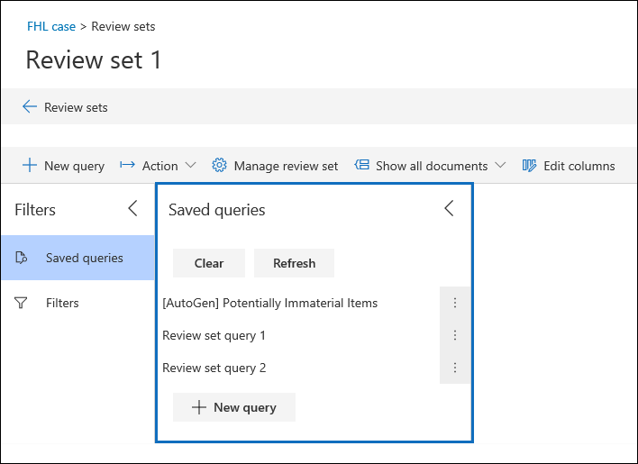

# Query the data in a review set

In most cases, it will be useful to be able to dig deeper into the data in a review set and organize that data to facilitate a more efficient review. Using Queries in a review set helps you focus on a subset of documents that meet the criteria of your review.

## Creating and running a query in a review set

To create and run a query on the documents in a review set, click **New query** in the review set. After you name your query and define the conditions, click **Save** to save and run the query. To run a query that has been previously saved, click a saved query.

## Building a review set query

You can build a query by using a combination of condition cards and query language in the Keywords condition card. You can also group condition cards together as a block (called a *condition group*) to build a more complex query. For a list and description of metadata properties that you can search, see [Document metadata fields in Advanced eDiscovery](document-metadata-fields-in-Advanced-eDiscovery.md).

### Condition cards

Every searchable field in a review set has a corresponding condition card that you can use to build your query.

There are multiple types of condition cards:

- Freetext: A freetext condition card is used for text fields such as subject. You can list multiple search terms by separating them out with a comma.

- Date: A date condition card is used for date fields such as last modified date.

- Search options: A search options condition card will provide a list of possible values for the particular field in your review set. This is used for fields, such as sender, where there is a finite number of possible values in your review set.

- Keyword: A keyword condition card is a specific instance of freetext condition card that you can use to search for terms, or use KQL-like query language in. See below for more detail.

### Query language

In addition to condition cards, you can use a KQL-like query language in the Keywords card to build your query. The query language for review set queries supports standard Boolean operators, such as **AND**, **OR**, **NOT**, and **NEAR**. It also supports a single-character wildcard (?) and a multi-character wildcard (*).

## Using filters

In addition to queries that you can save, you can use review set filters to quickly apply additional conditions to a review set query. This helps you further refine the results displayed by a review set query.

Filters differ from queries in two significant ways:

- Filters are transient. They don't persist beyond the existing session. In other words, you can't save a filter. Queries are saved to the review set, and access them whenever open the review set.

- Filters are always additive. Filters are applied in addition to the current review set query. Applying a different query will replace the results returned by the current query.
