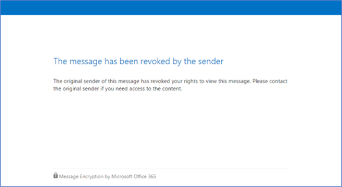

# Revoke email encrypted by Advanced Message Encryption

Email revocation is offered as part of Office 365 Advanced Message Encryption. Office 365 Advanced Message Encryption is included in [Microsoft 365 Enterprise E5](https://www.microsoft.com/microsoft-365/enterprise/home), Office 365 E5, Microsoft 365 E5 (Nonprofit Staff Pricing), Office 365 Enterprise E5 (Nonprofit Staff Pricing), and Office 365 Education A5. If your organization has a subscription that does not include Office 365 Advanced Message Encryption, you can purchase it with the Microsoft 365 E5 Compliance SKU add-on for Microsoft 365 E3, Microsoft 365 E3 (Nonprofit Staff Pricing), or the Office 365 Advanced Compliance SKU add-on for Microsoft 365 E3, Microsoft 365 E3 (Nonprofit Staff Pricing), or Office 365 SKUs.

This article is part of a larger series of articles about [Office 365 Message Encryption](ome.md).

If a message was encrypted using Office 365 Advanced Message Encryption, and you are a Microsoft 365 admin or you are the sender of the message, you can revoke the message under certain conditions. Admins revoke messages using PowerShell. As a sender, you revoke a message that you sent directly from Outlook on the web. This article describes the circumstances under which revocation is possible and how to do it.
  
## Encrypted emails that you can revoke

Admins and message senders can revoke encrypted emails if the recipient received a link-based, branded encrypted email. If the recipient received a native inline experience in a supported Outlook client, then you can't revoke the message.

Whether a recipient receives a link-based experience or an inline experience depends on the recipient identity type: Office 365 and Microsoft account recipients (for example, outlook.com users) get an inline experience in supported Outlook clients. All other recipient types, such as Gmail and Yahoo recipients, get a link-based experience.

Admins and message senders can revoke messages that are encrypted using encryption applied directly from Outlook on the web. For example, messages encrypted with the Encrypt Only option.

:::image type="content" source="../media/adhocencryptionrevoke.png" alt-text="Screenshot showing Encrypt Only option in Outlook on the web.":::

## Recipient experience for revoked encrypted emails

Once an email has been revoked, the recipient receives an error when they access the encrypted email through the Office 365 Message Encryption portal: "The message has been revoked by the sender".



## How to revoke an encrypted message that you sent

You can revoke a mail that you sent to a single recipient that uses a social account such as gmail.com or yahoo.com. In other words, you can revoke an email sent to a single recipient that received the link-based experience.

You cannot revoke a mail that you sent to a recipient that uses a work or school account from Office 365 or Microsoft 365 or a user that uses a Microsoft account, for example, an outlook.com account. 

To revoke an encrypted message that you sent, complete these steps

1. In Outlook on the web, in your **Sent** folder, browse to the message you want to revoke.

   If the mail is revocable, you'll see the "Remove external access" link at the top of the message.

    :::image type="content" source="../media/infoprotect-email-encryption/adhocencryptionrevokesentmsg.png" alt-text="Screenshot showing encrypted mail that you want to revoke in Outlook on the web.":::

2. Click **Remove external access** to revoke the message.

   The message shows that its status is revoked.

   :::image type="content" source="../media/adhocencryptionrevokedmsg.png" alt-text="Screenshot showing revoked encrypted message in Outlook on the web.":::

## How to revoke an encrypted message as an administrator

Microsoft 365 administrators follow these general steps to revoke an eligible encrypted email:

- Get the Message ID of the email.
- Verify that you can revoke the message.
- Revoke the mail.

### Step 1. Obtain the Message ID of the email

Before you can revoke an encrypted mail, gather the Message ID of the mail. The MessageId is usually of the format:

`<xxxxxxxxxxxxxxxxxxxxxxx@xxxxxx.xxxx.prod.outlook.com>`  

There are multiple ways to find the Message ID of the email that you want to revoke. This section describes a couple of options, but you can use any method that provides the ID.

#### To identify the Message ID of the email you want to revoke by using Message Trace in the Security &amp; Compliance Center

1. Search for the email by sender or recipient using [New Message Trace in Security & Compliance Center](https://blogs.technet.microsoft.com/exchange/2018/05/02/new-message-trace-in-office-365-security-compliance-center/).

2. Once you've located the email, select it to bring up the **Message trace details** pane. Expand **More Information** to locate the Message ID.

#### To identify the Message ID of the email you want to revoke by using Office Message Encryption reports in the Security &amp; Compliance Center

1. In the Security &amp; Compliance Center, navigate to the **Message encryption report**. For information on this report, see [View email security reports in the Security &amp; Compliance Center](../security/office-365-security/view-email-security-reports.md).

2. Choose the **View details** table and identify the message that you want to revoke.

3. Double-click the message to view details that include the Message ID.

### Step 2. Verify that the mail is revocable

To verify whether you can revoke a message, check whether the Revocation Status field is visible in the Encryption report, in the **Details** table in the Security &amp; Compliance Center.

To verify whether you can revoke a particular email message by using Windows PowerShell, complete these steps.

1. Using a work or school account that has global administrator permissions in your organization, start a Windows PowerShell session and connect to Exchange Online. For instructions, see [Connect to Exchange Online PowerShell](/powershell/exchange/connect-to-exchange-online-powershell).

2. Run the Get-OMEMessageStatus cmdlet as follows:

     ```powershell
     Get-OMEMessageStatus -MessageId "<message id>" | ft -a  Subject, IsRevocable
     ```

   This command returns the subject of the message and whether the message is revocable. For example,

     ```console
     Subject        IsRevocable
     -------        -----------
     "Test message" True
     ```

### Step 3. Revoke the mail

Once you know the Message ID of the email you want to revoke, and you have verified that the message is revocable, you can revoke the email using the Security &amp; Compliance Center or Windows PowerShell.

To revoke the message using the Security &amp; Compliance Center

1. Using a work or school account that has global administrator permissions in your organization, connect to the Security & Compliance Center.

2. In the **Encryption report**, in the **Details** table for the message, choose **Revoke message**.

To revoke an email by using Windows PowerShell, use the Set-OMEMessageRevocation cmdlet.

1. Using a work or school account that has global administrator permissions in your organization, [Connect to Exchange Online PowerShell](/powershell/exchange/connect-to-exchange-online-powershell).

2. Run the Set-OMEMessageRevocation cmdlet as follows:

    ```powershell
    Set-OMEMessageRevocation -Revoke $true -MessageId "<messageId>"
    ```

3. To check whether the email was revoked, run the Get-OMEMessageStatus cmdlet as follows:

    ```powershell
    Get-OMEMessageStatus -MessageId "<messageId>" | ft -a  Subject, Revoked
    ```

    If revocation was successful, the cmdlet returns the following result:  

     ```console
     Revoked: True
     ```

## More information about Office 365 Advanced Message Encryption

- [Office 365 Advanced Message Encryption](ome-advanced-message-encryption.md)

- [Office 365 Advanced Message Encryption - email expiration](ome-advanced-expiration.md)

- [Message policy and compliance service description](/office365/servicedescriptions/exchange-online-service-description/message-policy-and-compliance)