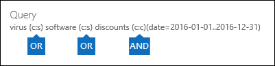

# Run a Content Search in the Security & Compliance Center

You can use the Content Search eDiscovery tool in the Security & Compliance Center to search for items such as email, documents, and instant messaging conversations in your Office 365 organization. Use this tool to search for items in these Office 365 services:
  
- Exchange Online mailboxes and public folders
    
- SharePoint Online and OneDrive for Business sites
    
- Skype for Business conversations
    
- Microsoft Teams 
    
- Office 365 Groups
    
Content Search is a new eDiscovery search tool with new and improved scaling and performance capabilities. Use Content Search to run very large eDiscovery searches. You can search all mailboxes, all Exchange public folders, and all SharePoint Online sites and OneDrive for Business accounts in a single Content Search. There are no limits on the number of content locations that you can search. There are also no limits on the number of searches that can run at the same time. After you run a Content Search, the number of content locations and an estimated number of search results are displayed in the details pane on the **Content search** page. After you run a search you can preview the results, get keyword statistics for one or more searches, bulk-edit content searches, and export the results to a local computer. 
  
 **Contents**
  
[Create a search](run-a-content-search-in-the-security-and-compliance-center.md#create)
  
[Export search results](run-a-content-search-in-the-security-and-compliance-center.md#export)
  
[Preview search results](run-a-content-search-in-the-security-and-compliance-center.md#preview)
  
[Update search results](run-a-content-search-in-the-security-and-compliance-center.md#restart)
  
[Edit a search](run-a-content-search-in-the-security-and-compliance-center.md#edit)
  
[Retry a search](run-a-content-search-in-the-security-and-compliance-center.md#retry)
  

  
## Before you begin

- For information and guidance about building search queries and using Boolean search operators, see [Keyword queries and search conditions for Content Search](keyword-queries-and-search-conditions.md). This article also contains information about searching for sensitive information types and searching for content that's shared with people inside and outside of your organization.
    
- To have access to the **Content search** page to perform searches and preview and export search results, an administrator, compliance officer, or eDiscovery manager must be a member of the eDiscovery Manager role group in the Security & Compliance Center. You don't have to assign additional search permissions in Exchange Online, SharePoint Online, or for OneDrive for Business sites. For more information, see [Assign eDiscovery permissions in the Office‍ 365 Security & Compliance Center](assign-ediscovery-permissions.md).
    
- There are limits applied to Content Search to maintain the health and quality of services provided to Office 365 organizations. In most cases, you can't modify these limits, but you should be aware of them so that you can take these limits into consideration when planning, running, and troubleshooting searches. For more information, see [Limits for Search in the Security & Compliance Center](limits-for-content-search.md).
    
- See the  section for estimated search times based on the number of mailboxes that are searched in a single Content Search. 
    
- As previously stated, you can use Content Search to search for content in Office 365 Groups and Microsoft Teams. This means you can search the group mailbox, shared calendar, and SharePoint sites associated with an Office 365 Group and a Microsoft Team. Additionally, you can search the channel conversations in a Microsoft Team. For information about Office 365 Groups and Microsoft Teams, see:
    
  - [Learn about Office 365 groups](https://support.office.com/article/b565caa1-5c40-40ef-9915-60fdb2d97fa2)
    
  - [Microsoft Teams help](https://support.office.com/article/23156c0c-2c6e-49dd-8b7b-7c564b76508c)
    
    See the  section for tips on searching for content in Office 365 Groups and Microsoft Teams. 
    
[Return to top](run-a-content-search-in-the-security-and-compliance-center.md#top)
  
## Create a search
<a name="create"> </a>

1. Go to [https://protection.office.com](https://protection.office.com).
    
2. Sign in to Office 365 using your work or school account.
    
3. In the left pane of the Security & Compliance Center, click **Search** \> **Content search**.
    
4. Click **New**.
    
5. On the **New search** page, type a name for the Content Search. This name has to be unique in your organization. 
    
6. Choose the content locations that you want to search. You can search mailboxes, sites, and public folders in the same search.
    
    
  
1. **Search everywhere**Select this option to search all content locations in your organization. When you select this option, you can choose to search all mailboxes (including inactive mailboxes and the mailboxes for all Office 365 Groups and Microsoft Teams), all SharePoint and OneDrive for Business sites (which includes the sites for all Office 365 groups and Microsoft Teams), and all public folders.
    
    
  
2. **Custom location selection**Select this option to select the mailboxes and sites that you want to search. If you choose this option, you have flexibility to search all content locations for a specific service (such as searching all Exchange mailboxes) or you can search specific content locations for an Office 365 service.
    
    Keep the following in mind when adding content locations to search:
    
    **Mailboxes**
    
  - When you click **Add** to specify mailboxes to search, the mailbox picker that's displayed is empty. This is by design to enhance performance. To add recipients to this list, type a name (a minimum of 3 characters) in the search box and click **Search**.
    
  - You can add inactive mailboxes and distribution groups to the list of mailboxes to search. For distribution groups, the mailboxes of group members are searched. Note that dynamic distribution groups aren't supported.
    
  - To get a list of the inactive mailboxes in your organization, run the command  `Get-Mailbox -InactiveMailboxOnly` in Exchange Online PowerShell. Alternatively, you can go to **Data governance** \> **Retention** in the Security & Compliance Center, and then click **More** \> **Inactive mailboxes**.
    
  - You can also add the mailbox that's associated with an Office 365 Group or a Microsoft Team. In this case, only the group or team mailbox is searched; the mailboxes of the group or team members aren't searched. To search them, you have to specifically add them to the search.
    
  - If you don't want to include any mailboxes to the search, select **Choose specific mailboxes to search**, but don't add a mailbox to the list.
    
    **Sites**
    
  - Click **Add** to add sites to the search. Type the URL for each site that you want to search. The Content Search tool will validate the URL, and then add it to the list of sites to search. 
    
  - You can add the SharePoint that's associated with an Office 365 Group or a Microsoft Team. See the  section for guidance about how to find the URL for group or team. 
    
  - If you don't want to include any sites in a search, select **Choose specific sites to search**, but don't add a site to the list.
    
    **Public folders**
    
    For public folders, you can choose to search all public folders in your Exchange Online organization or not search any public folders.
    
7. Click **Next**.
    
8. On the **New search** page, you can add keywords and conditions to create the search query. 
    
    
  
1. In the box under **What do you want us to look for?**, type a search query in the box. You can specify keywords, message properties such as sent and received dates, or document properties such as file names or the date that a document was last changed. You can use a more complex queries that use a Boolean operator, such as **AND**, **OR**, **NOT**, **NEAR**, or **ONEAR**. You can also search for sensitive information (such as social security numbers) in documents, or search for documents that have been shared externally. If you leave the keyword box empty, all content located in the specified content locations will be included in the search results. 
    
2. You can click the **Show keyword list** checkbox and the type a keyword in each row. If you do this, the keywords on each row are connected by the **OR** operator in the search query that's created. 
    
    
  
    Why use the keyword list? You can get statistics that show how many items match each keyword. This can help you quickly identify which keywords are the most (and least) effective. You can also use a keyword phrase (surrounded by parentheses) in a row. For more information about search statistics, see [View keyword statistics for Content Search results](view-keyword-statistics-for-content-search.md).
    
    See the  section for guidance on using the keyword list. 
    
3. Click **Check query for typos** to check your query for unsupported characters and for Boolean operators that might not be capitalized. Unsupported characters are often hidden and typically cause a search error or return unintended results. For more information about the unsupported characters that are checked, see [Check your Content Search query for errors](check-your-content-search-query-for-errors.md).
    
4. Under **Conditions**, add conditions to a search query to narrow a search and return a more refined set of results. Each condition adds a clause to the KQL search query that is created and run when you start the search. A condition is logically connected to the keyword query (specified in the keyword box) by the **AND** operator. That means that items have to satisfy both the keyword query and the condition to be included in the results. This is how conditions help to narrow your results. 
    
||
|:-----|
|For more information about creating a search query and using conditions, see [Keyword queries and search conditions for Content Search ](keyword-queries-and-search-conditions.md). |
   
9. Click **Search** to save the search settings and start the search. 
    
    The search is started. When the search is completed, the following information is displayed in the details pane.
    
    
  
1. The date and time that the search was last run.
    
2. The number (and total size) of items that were found that matched the search query. Examples of item types include email messages, calendar items, and documents. If an item contains multiple instances of a keyword that is being searched for, it's only counted once in the total number of items. For example, if you're searching for words "stock" or "tip" and an email message contains three instances of the word "stock", it's only counted once in the **Items** field. 
    
3. The number and total size of unindexed items in the content locations that were searched. The number of unindexed items that don't meet the search criteria will be included in the search statistics displayed in the details pane. If an unindexed item matches the search query (because other message or document properties meet the search criteria), it won't be included in the estimated number of unindexed items. However, if an unindexed item is excluded by the search criteria, it won't be included in the estimate of unindexed items.
    
4. The number of each type of content location that was searched. For mailboxes, note that archive mailboxes are included in the total number of mailboxes that were searched. In the previous example, four user mailboxes were searched and the archive mailbox for each of these users is enabled. That's why eight mailboxes are cited in the search statistics.
    
5. Links to preview the search results or run the search again to update the search statistics.
    
    If necessary, click **Refresh** to update the information in the details pane for the selected search. 
    
[Return to top](run-a-content-search-in-the-security-and-compliance-center.md#top)
  
## Export search results
<a name="export"> </a>

After a search is successfully run, you can export the search results to a local computer. When you export email results, they're downloaded to your computer as PST files. When you export content from SharePoint and OneDrive for Business sites, copies of native Office documents are exported. There are also additional documents and reports that are included with the exported search results. For more information, see [Export search results from the Security & Compliance Center](export-search-results.md).
  
## Preview search results
<a name="preview"> </a>

After a search is successfully completed, you can preview the search results. There are a number of limits related to previewing Content Search results. For more information, see [Limits for Search in the Security & Compliance Center](limits-for-content-search.md). Note that unindexed items aren't available for previewing.
  
1. On the **Content search** page, select a search. 
    
2. In the details pane, under **Results**, click **Preview search results**. The **Preview search results** page opens, and contains a list of the search result items. 
    
    You can click a column header to sort the results based on subject, type, sender, or the date an item was received in the source mailbox.
    
3. Click an item to preview.
    
    The item is opened in the preview pane.
    
4. If a file type isn't supported for preview or to download a copy of a document, you can click **Download original file** to download it to your local computer. For .aspx Web pages, the URL for the page is included though you might not have permissions to access the page. 
    
> [!NOTE]
> If you preview the search results for a search that was last run more than 7 days ago, you will be prompted to update the search results. The search is rerun to get the most current results that meet the search query. 
  
### File types that can be previewed

You can preview supported file types in the preview pane. If a file type isn't supported, you'll have to download a copy of the file to your local computer to view it. The following file types are supported and can be previewed on the **Preview search results** page. 
  
- .txt, .html, .mhtml
    
- .eml
    
- .doc, .docx, .docm
    
- .pptm, .pptx
    
- .pdf
    
Additionally, the following file container types are supported. You can view the list of files in the container in the preview pane.
  
- .zip
    
- .gzip
    
[Return to top](run-a-content-search-in-the-security-and-compliance-center.md#top)
  
## Update search results
<a name="restart"> </a>

When you update the results of an existing Content Search, the search query is rerun on all specified content locations. The obvious reason to update search results is to get the most recent data.
  
1. On the **Content search** page, select the search that you want to update the results for. 
    
2. In the details pane, under **Results**, click **Update search results**.
    
    A status messages is displayed saying that the results are being retrieved. When the search is finished, updated information is displayed under **Results** in the details pane. Note that the date in the **Searched on** field in the details pane is updated to the current date and time. To refresh the information in the list of Content Searches, click **Refresh**.
    
[Return to top](run-a-content-search-in-the-security-and-compliance-center.md#top)
  
## Edit a search
<a name="edit"> </a>

You can change the source mailboxes and the search query for an existing Content Search.
  
1. On the **Content search** page, select a search. 
    
2. In the details pane, under **Query**, click **Edit search**.
    
3. On the **Locations** page, you can change which mailboxes, groups, SharePoint sites, or OneDrive for Business sites to search. You can also select (or un-select) to search all public folders in Exchange. 
    
4. On the **Query** page, you can edit the search query. 
    
5. To start the revised search, click **Search** on either the **Sources** or **Locations** page. 
    
    The revised search is started. When the search is completed, the estimated results for the revised search are displayed in the details pane.
    
## Retry a search
<a name="retry"> </a>

If a search returns any errors, you don't have to re-search all of the content locations. You can rerun the search so that only the content locations that failed are search again. To re-search all content locations, you can update the search results.
  
1. On the **Content search** page, select the search that contains the content locations that you want to re-search. 
    
2. In the details pane, under **Error**, click **Retry search**.
    
    A status messages is displayed saying that the results are being retrieved. When the search is complete, updated information is displayed under **Results** in the details pane. Note that the date in the **Searched on** field in the details pane is updated to the current date and time. To refresh the information in the list of searches, click **Refresh**.
    
[Return to top](run-a-content-search-in-the-security-and-compliance-center.md#top)
  
## More information
<a name="moreinfo"> </a>

Here's more information about Content Searches.
  
[Limits and performance](#limits-and-performance)
  
[Unindexed items](#unindexed-items) 
 
[Microsoft Teams and Office 365 Groups](#microsoft-teams-and-office-365-groups)
  
[OneDrive for Business](#onedrive-for-business)
  
[Search queries](#search-queries)
  
[Searching inactive mailboxes](#searching-inactive-mailboxes)
  
[Miscellaneous](#miscellaneous)
  
[Return to top](#before-you-begin)
  
### Limits and performance
  
- For a description of the limits that are applied to the Content Search feature, see [Limits for Search in the Security & Compliance Center](limits-for-content-search.md).
    
- Microsoft collects performance information for Content Searches run by all Office 365 organizations. While the complexity of the search query can impact search times, the biggest factor that affects how long searches take is the number of mailboxes searched. Although Microsoft doesn't provide a Service Level Agreement for search times, the following table lists average search times for a Content Search based on the number of mailboxes included in the search.
    
|**Number of mailboxes**|**Average search time**|
|:-----|:-----|
|100  <br/> |30 seconds  <br/> |
|1,000  <br/> |45 seconds  <br/> |
|10,000  <br/> |4 minutes  <br/> |
|25,000  <br/> |10 minutes  <br/> |
|50,000  <br/> |20 minutes  <br/> |
|100,000  <br/> |25 minutes  <br/> |
   
  
### Unindexed items
  
- As previously explained, unindexed items in content locations that are searched are included in the estimated search results. If an unindexed item matches the search query (because other message or document properties meet the search criteria), it won't be included in the estimated number of unindexed items. If an unindexed item is excluded by the search criteria, it also won't be included in the estimated number of unindexed items. For more information, see [Unindexed items in Content Search](https://go.microsoft.com/fwlink/p/?LinkId=780739).
    

  
### Microsoft Teams and Office 365 Groups
  
- Microsoft Teams are built on Office 365 Groups. Therefore, searching them is very similar. Keep the following things in mind when searching for content in Microsoft Teams and Office 365 Groups.
    
  - To search for content located in Microsoft Teams and Office 365 Groups, you have to specify the mailbox and SharePoint site that are associated with a team or group.
    
  - Run the **Get-UnifiedGroup** cmdlet in Exchange Online to view properties for a Microsoft Team or an Office 365 Group. This is a good way to get the URL for the site that's associated with a team or a group. For example, the following command displays selected properties for an Office 365 Group named Senior Leadership Team: 
    
  ```
  Get-UnifiedGroup "Senior Leadership Team" | FL DisplayName,Alias,PrimarySmtpAddress,SharePointSiteUrl
  DisplayName            : Senior Leadership Team
  Alias                  : seniorleadershipteam
  PrimarySmtpAddress     : seniorleadershipteam@contoso.onmicrosoft.com
  SharePointSiteUrl      : https://contoso.sharepoint.com/sites/seniorleadershipteam
  
  ```

    > [!NOTE]
    > To run the **Get-UnifiedGroup** cmdlet, you have to be assigned the View-Only Recipients role in Exchange Online or be a member of a role group that's assigned the View-Only Recipients role. 
  
  - When a user's mailbox is searched, any Microsoft Team or Office 365 Group that the user is a member of won't be searched. Similarly, when you search a Microsoft Team or an Office 365 Group, only the group mailbox and group site that you specify is searched; the mailboxes and OneDrive for Business accounts of group members aren't searched unless you explicitly add them to the search.
    
  - To get a list of the members of a Microsoft Team or an Office 365 Group, you can view the properties on the **Home \> Groups** page in the Microsoft 365 admin center. Alternatively, you can run the following command in Exchange Online PowerShell: 
    
  ```
  Get-UnifiedGroupLinks <group or team name> -LinkType Members | FL DisplayName,PrimarySmtpAddress 
  ```

    > [!NOTE]
    > To run the **Get-UnifiedGroupLinks** cmdlet, you have to be assigned the View-Only Recipients role in Exchange Online or be a member of a role group that's assigned the View-Only Recipients role. 
  
  - Conversations that are part of a Microsoft Teams channel are stored in the mailbox that's associated with the Microsoft Team. Similarly, files that team members share in a channel are stored on the team's SharePoint site. Therefore, you have to add the Microsoft Team mailbox and SharePoint site as a content location to search conversations and files in a channel.
    
  - 
    
    Alternatively, conversations that are part of the Chat list in Microsoft Teams are stored in the Exchange Online mailbox of the users who participate in the chat. And files that a user shares in Chat conversations are stored in the OneDrive for Business account of the user who shares the file. Therefore, you have to add the individual user mailboxes and OneDrive for Business accounts as content locations to search conversations and files in the Chat list.
    
    > [!NOTE]
    > Users who participate in conversations that are part of the Chat list in Microsoft Teams must have an Exchange Online (cloud-based) mailbox in order for you to search chat conversations. That's because conversations that are part of the Chat list are stored in the cloud-based mailboxes of the chat participants. If a chat participant doesn't have an Exchange Online mailbox, you won't be able to search chat conversations. For example, in an Exchange hybrid deployment, users with an on-premises mailbox might be able to participate in conversations that are part of the Chat list in Microsoft Teams. However in this case, content from these conversation aren't searchable because the users don't have cloud-based mailboxes. 
  
  - Every Microsoft Team or team channel contains a Wiki for note-taking and collaboration. The Wiki content is automatically saved to a file with a .mht format. This file is stored in the Teams Wiki Data document library on the team's SharePoint site. You can use the Content Search tool to search the Wiki by specifying the team's SharePoint site as the content location to search. 
    
    > [!NOTE]
    > The capability to search the Wiki for a Microsoft Team or Channel (when you search the team's SharePoint site) was released on June 22, 2017. Wiki pages that were saved or updated on that date or after are available to be searched. Wiki pages last saved or updated before that date aren't available for search. 
  
### OneDrive for Business
  
- To collect a list of the URLs for the OneDrive for Business sites in your organization, see [Create a list of all OneDrive locations in your organization](https://support.office.com/article/8e200cb2-c768-49cb-88ec-53493e8ad80a). The script in this article creates a text file that contains a list of all OneDrive for Business sites. To run this script, you'll have to install and use the SharePoint Online Management Shell. Be sure to append the URL for your organization's MySite domain to each OneDrive for Business site that you want to search. This is the domain that contains all your OneDrive for Business; for example,  `https://contoso-my.sharepoint.com`. Here's an example of a URL for a user's OneDrive for Business site:  `https://contoso-my.sharepoint.com/personal/sarad_contoso_onmicrosoft.com`.
    

### Search queries
  
- Keeping the following things in mind when using the keyword list to create a search query.
    
  - You have to select the **Show keyword list** checkbox and then type each keyword in a separate row to create a search query where the keywords (or keyword phrases) in each row are connected by the **OR** operator. If you just paste a list of keywords in the keyword box or press the **Enter** key after typing a keyword, they won't be connected by the **OR** operator. Here are incorrect and correct example of adding a list of keywords. 
    
    **Incorrect**
    
    
  
    **Correct**
    
    
  
  - You can also prepare a list of keywords or keyword phrases in an Excel file or a plain text file, and then copy and paste your list in to the keyword list. To do this, you have to select the **Show keyword list** check box. Then, click the first row in the keyword list and paste your list. Each line from the Excel or text file will be pasted in to separate row in the keyword list. 
    
  - After you create a query using the keyword list, it's a good idea to verify the search query syntax (in the details pane of the selected search) to make the search query is what you intended. In the search query that's displayed under **Query** in the details pane, the keywords are separated by the text **(c:s)**. This indicates that the keywords are connected by the **OR** operator. Similarly, if your search query includes conditions, the keywords and the conditions are separated by the text **(c:c)**. This indicates that the keywords are connected to the conditions by the **AND** operator. Here's an example of the search query (displayed in the Details pane) that results when using the keyword list and a condition. 
    
    
  
  - If you have a search query that contains keywords for non-English characters (such as Chinese characters), you might have to use the **Set-ComplianceSearch** cmdlet to configure the language property for the content search. When you create a content search using the GUI in the Security & Compliance Center, the default language is neutral. 
    
    How can you tell if you need to change the language setting for a content search? If you're certain content locations contain the non-English characters you're searching for, but the search returns no results, the language setting might be the cause.
    
    To change the language setting for an existing content search, run the following command in Security & Compliance Center PowerShell:
    
  ```
  Set-ComplianceSearch <name of content search> -Language <culture code value>
  ```

    For example, to change the language setting to Chinese, you would use  `zh-CN` for the culture code value. After you change the language setting, you'll have to re-run the search. For a list of possible culture code values, see [CultureInfo Class](https://go.microsoft.com/fwlink/p/?LinkID=184859). For content searches, we recommend that you use two-part culture codes for the value of the language setting; for example,  `ja-JP` and not  `ja`.
    

### Searching inactive mailboxes
  
As previously stated, you can search inactive mailboxes in a content search. Here are a few things to keep in mind when searching inactive mailboxes.
  
- If a content search includes a user mailbox and that mailbox is then made inactive, the content search will continue to search the inactive mailbox when you re-run the search after it becomes inactive.
    
- In some cases, a user may have an active mailbox and an inactive mailbox that have the same SMTP address. In this case, only the specific mailbox that you select as a location for a content search will be searched. In other words, if you add a user's mailbox to a search, you can't assume that both their active and inactive mailboxes will be searched; only the mailbox that you explicitly add to the search will be searched.
    
- We strongly recommend that you avoid having an active mailbox and inactive mailbox with the same SMTP address. If you need to reuse the SMTP address that is currently assigned to an inactive mailbox, we recommend that you recover the inactive mailbox or restore the contents of an inactive mailbox to an active mailbox (or the archive of an active mailbox), and then delete the inactive mailbox. For more information, see one of the following topics:
    
  - [Recover an inactive mailbox in Office 365](recover-an-inactive-mailbox.md)
    
  - [Restore an inactive mailbox in Office 365](restore-an-inactive-mailbox.md)
    
  - [Delete an inactive mailbox in Office 365](delete-an-inactive-mailbox.md)
    
### Miscellaneous
  
- Content searches created on the **Content search** page in the Security & Compliance Center aren't displayed on the **In-Place eDiscovery &amp; Hold** page in the Exchange admin center. This is because the Content Search architecture and the search objects created in the Security & Compliance Center are completely different than the In-Place eDiscovery feature in Exchange Online. 
    
    For the same reason, searches created on the **Content search** page aren't displayed on the **Searches** page of an eDiscovery case in the Security & Compliance Center. 
    
- What is the difference between restarting and retrying a search? When you restart a search, all content locations that are specified in the search are searched again in a new preview search. However, when you retry a search, only the content locations that failed when the search was last run are searched again.
   

