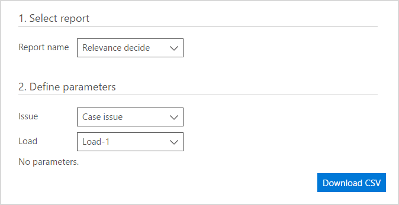

# Run reports in Advanced eDiscovery (classic)

> [!NOTE]
> Advanced eDiscovery requires an Office 365 E3 with the Advanced Compliance add-on or an E5 subscription for your organization. If you don't have that plan and want to try Advanced eDiscovery, you can [sign up for a trial of Office 365 Enterprise E5](https://go.microsoft.com/fwlink/p/?LinkID=698279). 
  
This topic describes how to run reports in Advanced eDiscovery.
  
## Running reports

You can download a .csv file with a report for the selected process.
  
1. In the **Reports** tab, select an option from the **Report name** list. Select from three **Report name** options: **Relevance decide**, **Themes list,** or **Tagged files**.
    
    
  
2. Available parameters, and sort and filter options can be set, depending on the selected report. 
    
3. Click **Download CSV**. The requested report is generated and downloaded.
    
## Related topics

[Advanced eDiscovery (classic)](office-365-advanced-ediscovery.md)
