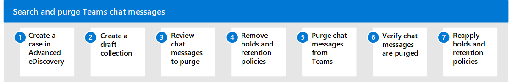

# Search and purge chat messages in Teams (Preview)

You can use eDiscovery (Premium) and the Microsoft Graph Explorer to search for and delete chat messages in Microsoft Teams. This can help you find and remove sensitive information or inappropriate content. This search and purge workflow will also help you respond to a data spillage incident, when content containing confidential or malicious information is released through Teams chat messages.

[!INCLUDE [purview-preview](../includes/purview-preview.md)]

## Before you search and purge chat messages

- To create an eDiscovery (Premium) case and use collections to search for chat messages, you have to be a member of the **eDiscovery Manager** role group in the Microsoft Purview compliance portal. To delete chat messages, you have to be assigned the **Search And Purge** role. This role is assigned to the Data Investigator and Organization Management role groups by default. For more information, see [Assign eDiscovery permissions](assign-ediscovery-permissions.md).
- Search and purge is supported for conversations within your tenant. Support for Teams Connect Chat (External Access or Federation) conversations is enabled in the interface in some cases but is not working as intended.
- A maximum of 10 items per mailbox can be removed at one time. Because the capability to search for and remove chat messages is intended to be an incident-response tool, this limit helps ensure that chat messages are quickly removed.

## Search and purge workflow

Here's the process to search for and purge Teams chat messages:

## Step 1: Create a case in eDiscovery (Premium)

The first step is to create a case in eDiscovery (Premium) to manage the search and purge process. For information about creating a case, see [Use the new case format](advanced-ediscovery-new-case-format.md).

## Step 2: Create a draft collection

After you create a case, the next step is to create a draft collection to search for the Teams chat messages that you want to purge. The purge process you perform is Step 5 will purge all items that are found in the draft collection.

In eDiscovery (Premium), a *collection* is an eDiscovery search of the Teams content locations that contain the chat messages that you want to purge. Create the draft collection in the case that you created in the previous step. For more information, see [Create a draft collection](create-draft-collection.md).

### Data sources for chat messages

Use the following table to determine which data sources to search depending on the type of chat message you need to purge.

| For this type of chat...|Search this data source...|
|:---------|:---------|
|Teams 1:1 chats     |The mailbox of chat participants.|
|Teams group chats     |The mailboxes of chat participants.|
|Teams channels (standard and shared) |The mailbox associated with the parent team.|
|Teams private channels |The mailbox of the private channel members.|

> [!NOTE]
> In Step 4, you also have to identify and remove any holds and retention policies assigned to the mailbox that contains the type of chat messages that you want to delete.

### Tips for searching for chat messages

To help ensure the most comprehensive collection of Teams chat conversations (including 1:1 and group chats, and chats from standard, shared, and private chats) use the **Type** condition and select the **Instant messages** option when you build the search query for the draft collection. We also recommend including a date range or several keywords to narrow the scope of the collection to items relevant to your search a purge investigation.

Here's a screenshot of a sample query using the **Type** and **Date** options:

   

For more information, see [Build search queries for collections](building-search-queries.md).

## Step 3: Review and verify chat messages to purge

As previously mentioned, the purge process in Step 5 will delete the items returned by the collection. So it's important that you review the draft collection results to ensure that the collection only returns the items that you want to purge. To review a sample of items in a draft collection, see the "Next steps after a draft collection is complete" section in [Create a draft collection](create-draft-collection.md#next-steps-after-a-draft-collection-is-complete).

Additionally, you can use the collection statistics (specifically the Top Locations statistics) to generate a list of the data sources that contain items returned by the collection. Use this list in the next step to remove hold and retention policies from the data sources that contain search results. For more information, see [Collection statistics and reports](collection-statistics-reports.md).

## Step 4: Remove holds and retention policies from data sources

Before you can purge chat messages from a mailbox, you have to remove any hold or retention policy that is assigned to a target mailbox. If not, then the chat you're trying to delete will be retained.

Use the list of mailboxes that contain the chat messages that you want to delete and determine if there's a hold or retention policy assigned to those mailboxes, and then remove the hold or retention policy. Be sure to identify the hold or retention policy that you remove so that you can reassign to the mailboxes in Step 7.

For instructions about how to identify and remove holds and retention policies, see "Step 3: Remove all holds from the mailbox" in [Delete items in the Recoverable Items folder of cloud-based mailboxes on hold](delete-items-in-the-recoverable-items-folder-of-mailboxes-on-hold.md#step-3-remove-all-holds-from-the-mailbox).

## Step 5: Purge chat messages from Teams

Now you're ready to actually purge chat messages from Teams. You'll use the Microsoft Graph Explorer to perform the following three tasks:

1. Get the Id of the eDiscovery (Premium) case that you created in Step 1. This is the case that contains the collection created in Step 2.

2. Get the Id of the collection that you created in Step 2 and verified the search results in Step 3. The search query in this collection returns the chat messages that will be purged.

3. Purge the chat messages returned by the collection.

For information about using Graph Explorer, see [Use Graph Explorer to try Microsoft Graph APIs](/graph/graph-explorer/graph-explorer-overview).

> [!IMPORTANT]
> APIs under the /beta version in Microsoft Graph are subject to change. Use of these APIs in production applications is not supported. To determine whether an API is available in v1.0, use the Version selector.

> [!IMPORTANT]
> To perform these three tasks in Graph Explorer, you may have to consent to the eDiscovery.Read.All and eDiscovery.ReadWrite.All permissions. For more information, see the "Consent to permissions" section in [Working with Graph Explorer](/graph/graph-explorer/graph-explorer-features#consent-to-permissions).

### Get the case Id

1. Go to <https://developer.microsoft.com/graph/graph-explorer> and sign in to the Graph Explorer with an account that's assigned the **Search And Purge** role in the Microsoft Purview compliance portal.

2. Run the following GET request to retrieve the Id for the eDiscovery (Premium) case. Use the value `https://graph.microsoft.com/beta/security/ediscovery/cases` in the address bar of the request query. Be sure to select **v1.0** in the API version dropdown list.

   

   This request returns information about all cases in your organization on the **Response preview** tab.

3. Scroll through the response to locate the eDiscovery (Premium) case. Use the **displayName** property to identify the case.

   

4. Copy the corresponding Id (or copy and paste it to a text file). You'll use this Id in the next task to get the collection Id.

> [!TIP]
> Instead of using the previous procedure to obtain the case Id, you can open the case in the Microsoft Purview compliance portal and copy the case Id from the URL.

### Get the collection Id

1. In Graph Explorer, run the following GET request to retrieve the Id for the collection that you created in Step 2, and contains the items you want to purge. Use the value `https://graph.microsoft.com/beta/security/ediscovery/cases('caseId')/sourceCollections` in the address bar of the request query, where CaseId is the Id that you obtained in the previous procedure. Be sure to surround the case Id with parentheses and single quotation marks.

   

   This request returns information about all collections in the case on the **Response preview** tab.

2. Scroll through the response to locate the collection that contains the items that you want to purge. Use the **displayName** property to identify the collection that you created in Step 3.

   

   In the response, the search query from the collection is displayed in the **contentQuery** property. Items returned by this query will be purged in the next task.

3. Copy the corresponding Id (or copy and paste it to a text file). You'll use this Id in the next task to purge the chat messages.

> [!TIP]
> Instead of using the previous procedure to obtain the collection Id, you can open the case in the Microsoft Purview compliance portal. Open the case and navigate to the Jobs tab. Select the relevant collection and under Support information, find the job ID (the job ID displayed here is the same as the collection ID).

### Purge the chat messages

1. In Graph Explorer, run the following POST request to purge the items returned by the collection that you created in Step 2. Use the value `https://graph.microsoft.com/beta/security/ediscovery/cases('caseId')/sourceCollections('collectionId')/purgeData` in the address bar of the request query, where caseId and collectionId are the Ids that you obtained in the previous procedures. Be sure to surround the Id values with parentheses and single quotation marks.

      

   If the POST request is successful, an HTTP response code is displayed in a green banner stating that the request was accepted.

   

  For more information on purgeData, see [sourceCollection: purgeData](/graph/api/ediscovery-sourcecollection-purgedata).

> [!NOTE]
> Because Microsoft Graph Explorer is not available in the US Government cloud (GCC, GCC High, and DOD), you must use PowerShell to accomplish these tasks.

You can also purge chat messages using PowerShell. For example, to purge messages in the US Government cloud you could use a command similar to:

``
Connect-MgGraph -Scopes "ediscovery.ReadWrite.All" -Environment USGov
``

``Invoke-MgGraphRequest  -Method POST -Uri '/beta/security/cases/ediscoveryCases/<case ID>/searches/<collection ID>/purgeData'
``

For more information on using PowerShell to purge chat messages, see [ediscoverySearch: purgeData](/graph/api/security-ediscoverysearch-purgedata).

## Step 6: Verify chat messages are purged

After you run the POST request to purge chat messages, these messages are removed from the Teams client and replaced with an automatically generated stating that an admin has removed the message. For an example of this message, see the [End-user experience](#end-user-experience) section in this article.

Purged chat messages are moved to the SubstrateHolds folder, which is a hidden mailbox folder. Purged chat messages are stored there for at least 1 day, and then are permanently deleted the next time the timer job runs (typically between 1-7 days). For more information, see [Learn about retention for Microsoft Teams](retention-policies-teams.md).

> [!NOTE]
> Because Microsoft Graph Explorer is not available in the US Government cloud (GCC, GCC High, and DOD), you must use PowerShell to accomplish these tasks.

## Step 7: Reapply holds and retention policies to data sources

After you verify that chat messages are purged and removed from the Teams client, you can reapply the holds and retention policies that you removed in Step 4.

<!--
## Deleting chat messages in federated environments

Admins can use the procedures in this article to search and delete Teams chat messages in federated environments. However, you must adhere to the following guidelines. These guidelines are based on the organizational ownership of the conversation thread that contains the messages you want to delete. An organization is the owner of a conversation thread that is started by a user in that organization. In other words, when a user starts a chat, the user's organization becomes the owner of the conversation thread.

- Admins can delete the compliance copy in conversation threads owned by their organization. That means compliance copies are purged when the admin who purges the chat messages in Step 5 is in the same organization as the user who initiated the conversation thread that contains the purged messages. If a conversation thread has users in two organizations, compliance copies for the other organization will be retained.

- If a conversation thread has users in two organizations, purged chat messages are removed from the Teams client in both organizations.

- The only way to purge chat messages from user mailboxes in your organization for chat messages in conversation threads owned by another organization is to use retention policies for Teams. For more information, see [Learn about retention for Microsoft Teams](retention-policies-teams.md).
-->

## End-user experience

For deleted chat messages, users will see an automatically generated message stating "This message was deleted by an admin".

The message in the previous screenshot replaces the chat message that was deleted.

> [!NOTE]
> If you're an end-user and a chat message was deleted, contact your admin for more information.
