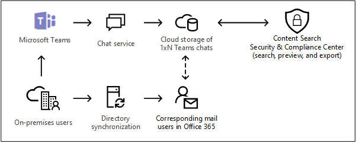

# Searching cloud-based mailboxes for on-premises users in Office 365

If your organization has an Exchange hybrid deployment (or synchronizes your on-premises Exchange organization with Office 365) and has enabled Microsoft Teams, users can use the Teams chat application for instant messaging. For a cloud-based user, the Teams chat data (also called *1xN chats*) is saved to their primary cloud-based mailbox. When an on-premises user uses the Team chat application, their primary mailbox is located on-premises. To get around this limitation, Microsoft has released a new feature where a cloud-based storage area (called a cloud-based mailbox for on-premises users) is created to store Teams chat data for on-premises users. This lets you use the Content Search tool in the Security & Compliance Center to search and export Teams chat data for on-premises users. 
  
Here are the requirements and limitations for setting up cloud-based mailboxes for on-premises users:
  
- The user accounts in your on-premises directory service (such as Active Directory) must be synchronized with Azure Active Directory, the directory service in Office 365. This means that a mail user account is created in Office 365 and is associated with a user whose primary mailbox is located in the on-premises organization.

- The user whose primary mailbox is located in the on-premises organization must be assigned a Microsoft Teams license and a minimum of an Exchange Online Plan 1 license.

- The cloud-based mailbox for on-premises users is used only store Teams chat data. An on-premises user can't sign in to the cloud-based mailbox or access in any way. It can't be used to send or receive email messages. 

- You have to submit a request to Microsoft Support to enable your organization to search for Teams chat data in the cloud-based mailboxes for on-premises users. See [Filing a request with Microsoft Support to enable this feature](#filing-a-request-with-microsoft-support-to-enable-this-feature) in this article. 

> [!NOTE]
> Teams channel conversations are always stored in the cloud-based mailbox that's associated with the Team. That means you can use Content Search to search channel conversations without have to file a support request. For more information about searching Teams channel conversations, see [Searching Microsoft Teams and Office 365 Groups](content-search.md#searching-microsoft-teams-and-office-365-groups).
  
## How it works

If a Microsoft Teams-enabled user has an on-premises mailbox and their user account/identity has been synched to the cloud, Microsoft creates a cloud-based mailbox to store 1xN Teams chat data. After the Teams chat data is stored in the cloud-based mailbox, it's indexed for search. This lets you Use Content Search (and searches associated with eDiscovery cases) to search, preview, and export Teams chat data for on-premises users. You can also use **\*ComplianceSearch** cmdlets in the Security & Compliance Center PowerShell to search for Teams chat data for on-premises users. 
  
The following graphic shows the workflow of how Teams chat data for on-premises users is available to search, preview, and export.
  

  
In addition to this new capability, you can still use Content Search to search, preview, and export Teams content in the cloud-based SharePoint site and Exchange mailbox associated with each Microsoft Team and 1xN Teams chat data in the Exchange Online mailbox for cloud-based users.

## Filing a request with Microsoft Support to enable this feature

You must file a request with Microsoft Support to enable your organization to use the graphical user interface in the Security & Compliance Center to search for Teams chat data in the cloud-based mailboxes for on-premises users. This feature is available in Security & Compliance Center PowerShell. You don't have to submit a support request to use PowerShell to search for Teams chat data for on-premises users.
  
Include the following information when you submit the request to Microsoft Support:
  
- The default domain name of your Office 365 organization.

- The tenant name and tenant ID of your Office 365 organization. You can find these in the Azure Active Directory portal (under **Manage** \> **Properties**). See [Find your Office 365 tenant ID](https://support.office.com/article/6891b561-a52d-4ade-9f39-b492285e2c9b).

- The following title or description of the purpose of the support request: "Enable Application Content Search for On-premises Users". This helps route the request to the Office 365 eDiscovery engineering team who will implement the request.

After the engineering change is made, Microsoft Support will send you an estimated deployment date. The deployment process usually takes 2–3 weeks after you submit the support request.
  
### What happens after this feature is enabled?

After this feature is deployed in your Office 365 organization, the following changes are made in Content Search and in searches associated with an eDiscovery case in the Security & Compliance Center:
  
- The **Add Office app content for on-premises users** checkbox is added under the **Locations** in Content Search.

    
  
- On-premises users are displayed in the content locations picker that you use to select user mailboxes to search.

## Searching for Teams chat content in cloud-based mailboxes for on-premises users

After the feature has been enabled, you can use Content Search in the Security & Compliance Center to search for Teams chat data in the cloud-based mailboxes for on-premises users.
  
1. In the Security & Compliance Center, go to **Search** \> **Content search**

2. On the **Search** page, click  **New search**.

    As previously explained, the **Add Office app content for on-premises users** checkbox is displayed under **Locations**. It's selected by default.

3. Create the keyword query and add conditions to the search query if necessary. To only search for Team chats data, you can add the following query in the **Keywords** box:

    ```text
    kind:im
    ```

4. At this point, you can choose one of the following options under **Locations**:

    - **All locations:** Select this option to search the mailboxes of all users in your organization. When the checkbox is selected, all cloud-based mailboxes for on-premises users will also be searched.

    - **Specific locations:** Select this option and then click **Modify** \> Choose user, groups, or teams to search specific mailboxes. As previously explained, the locations picker lets you search for on-premises users.

5. Save and run the search. Any search results from the cloud-based mailboxes for on-premises users can be previewed like any other search results. You can also export the search results (including any Teams chat data) to a PST file. For more information, see: 

    - [Create a search](content-search.md#create-a-search)

    - [Preview search results](content-search.md#preview-search-results)

    - [Export Content Search results](export-search-results.md)

## Using PowerShell to search for Teams chat data in cloud-based mailboxes for on-premises users

You can use the **New-ComplianceSearch** and **Set-ComplianceSearch** cmdlets in the Security & Compliance Center PowerShell to search the cloud-based mailbox for on-premises users. As previously explained, you don't have to submit a support request to use PowerShell to search for Teams chat data for on-premises users. 
  
1. [Connect to Security & Compliance Center PowerShell](https://docs.microsoft.com/powershell/exchange/office-365-scc/connect-to-scc-powershell/connect-to-scc-powershell).

2. Run the following PowerShell command to create a content search that searches the cloud-based mailboxes of on-premises users.

    ```powershell
    New-ComplianceSearch <name of new search> -ContentMatchQuery <search query> -ExchangeLocation <on-premises user> -IncludeUserAppContent $true -AllowNotFoundExchangeLocationsEnabled $true  
    ```

    The *IncludeUserAppContent*  parameter is used to specify the cloud-based mailbox for the user or users who are specified by the  *ExchangeLocation*  parameter. The  *AllowNotFoundExchangeLocationsEnabled*  allows cloud-based mailboxes for on-premises users. When you use the `$true` value for this parameter, the search doesn't try to validate the existence of the mailbox before it runs. This is required to search the cloud-based mailboxes for on-premises users because these types of mailboxes don't resolve as regular mailboxes.

    The following example searches for Teams chats (which are instant messages) that contain keyword "redstone" in the cloud-based mailbox of Sara Davis, who is an on-premises user in the Contoso organization.
  
    ```powershell
    New-ComplianceSearch "Redstone_Search" -ContentMatchQuery "redstone AND kind:im" -ExchangeLocation sarad@contoso.com -IncludeUserAppContent $true -AllowNotFoundExchangeLocationsEnabled $true  
    ```

   After you create a search, be sure to use the **Start-ComplianceSearch** cmdlet to run the search. 
  
For more information using these cmdlets, see:
  
- [New-ComplianceSearch](https://docs.microsoft.com/powershell/module/exchange/policy-and-compliance-content-search/new-compliancesearch)

- [Set-ComplianceSearch](https://docs.microsoft.com/powershell/module/exchange/policy-and-compliance-content-search/set-compliancesearch)

- [Start-ComplianceSearch](https://docs.microsoft.com/powershell/module/exchange/policy-and-compliance-content-search/start-compliancesearch)

## Known issues

- Currently, you can search, preview, and export content in cloud-based mailboxes for on-premises users. You can also place a cloud-based mailbox for an on-premises user on a hold associated with an eDiscovery case, and apply a retention policy for Teams chats or channel messages to cloud-based mailboxes for on-premises users. However at this time, you can't apply a retention policy for other content locations (such as Exchange mailboxes and SharePoint sites) to cloud-based mailboxes for on-premises users.

## Frequently asked questions

 **Where are cloud-based mailboxes for on-premises users located?**
  
Cloud-based mailboxes are created and stored in the same datacenter as your Office 365 organization.
  
 **Are there any other requirements other than submitting a support request?**
  
 As previously explained, the identities of users with on-prem mailboxes must be synchronized to your cloud-based organization so that a corresponding mail user account is created for each on-premises user account in Office 365. Your organization must also have an Office 365 enterprise subscription, such as an Office 365 Enterprise E1, E3, or E5 subscription.
  
 **Is there a risk of losing the Teams chat data if the user's on-premises mailbox is migrated to the cloud?**
  
No. When you migrate the primary mailbox of an on-premises user to the cloud, the Teams chat data for that user will be migrated to their new cloud-based primary mailbox.
  
 **Can I apply an eDiscovery hold or Office 365 retention policies to on-premises users?**
  
Yes. You can apply eDiscovery holds or retention policies for Teams chats and channel messages to cloud-based mailboxes for on-premises users.
  
 **Can Content Search find older Teams chats for on-premises users before the time my organization submitted the request to enable this feature?**
  
Microsoft started storing the Teams chat data for on-premises users on January 31, 2018. So, if the identity of an on-premises Teams user has been synched between Active Directory and Azure Active Directory since this date, then their Teams chat data is stored in a cloud-based mailbox and is searchable using Content Search. Microsoft is also working on storing Teams chat data from prior to January 31, 2018 in the cloud-based mailboxes for on-premises users. More information about this will be available soon.

 **Do on-premises users need a license to store Teams chat data in a cloud-based mailbox?**
  
Yes. To store Teams chat data for an on-premises user in a cloud-based mailbox, the user must be assigned a Microsoft Teams license and an Exchange Online Plan license in Office 365 (or Microsoft 365).
