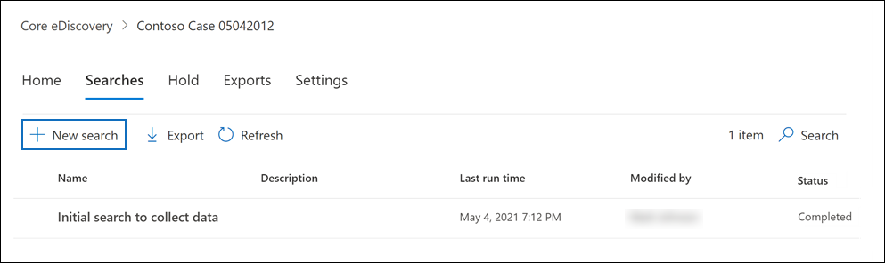

# Search for content in a Core eDiscovery case

After a Core eDiscovery case is created and people of interest in the case are placed on hold, you can create and run one or more searches for content relevant to the case. Searches associated with a Core eDiscovery case aren't listed on the **Content search** page in the Microsoft 365 compliance center. These searches are listed on the **Searches** page of the Core eDiscover case the searches are associated with. This also means that searches associated with a case can only be accessed by case members.

To create a Core eDiscovery search:
  
1. Go to <https://compliance.microsoft.com> and sign in using the credentials for user account that has been assigned the appropriate eDiscovery permissions and is a member of the case.

2. In the left navigation pane of the Microsoft 365 compliance center, click **Show all**, and then click **eDiscovery > Core**.

3. On the **Core eDiscovery** page, select the case that you want to create an associated search, and then click **Open case**.

4. On the **Home** page for the case, click the **Searches** tab, and then click **New search**.

   

   > [!NOTE]
   > The **Search by ID list** option lets you search for specific email messages and other mailbox items using a list of Exchange IDs. To create an ID list search, you submit a comma-separated value (CSV) file that identifies the specific mailbox items to search for. For instructions, see [Prepare a CSV file for an ID list search](csv-file-for-an-id-list-content-search.md).

5. In the **New search** wizard, type a name for the search, and an optional description that helps identify the search. The name of the search must be unique in your organization.

6. On the **Locations** page, choose the content locations that you want to search. You can search mailboxes, sites, and public folders.

    
  
   1. **Exchange mailboxes**: Set the toggle to **On** and then click **Choose users, groups, or teams** to specify the mailboxes to place on hold. Use the search box to find user mailboxes and distribution groups (to place a hold on the mailboxes of group members) to place on hold. You can also search the mailbox associated with a Microsoft Team (for channel messages), Office 365 Group, and Yammer Group. For more information about the application data stored in mailboxes, see [Content stored in mailboxes for eDiscovery](what-is-stored-in-exo-mailbox.md).

   2. **SharePoint sites**: Set the toggle to **On** and then click **Choose sites** to specify SharePoint sites and OneDrive accounts to place on hold. Type the URL for each site that you want to place on hold. You can also add the URL for the SharePoint site for a Microsoft Team, Office 365 Group, or Yammer Group.
  
   3. **Exchange public folders**: Set the toggle to **On** to put all public folders in your Exchange Online organization on hold. You can't choose specific public folders to put on hold. Leave the toggle switch off if you don't want to put a hold on public folders.
  
   4. Keep this checkbox selected to search for Teams content for on-premises users. For example, if you search all Exchange mailboxes in the organization and this checkbox is selected, the cloud-based storage used to store Teams chat data for on-premises users will be included in the scope of the search. For more information, see [Search for Teams chat data for on-premises users](search-cloud-based-mailboxes-for-on-premises-users.md).

7. On the **Define your search conditions** page, type a keyword query and add conditions to the search query if necessary.

   

   1. Specify keywords, message properties such as sent and received dates, or document properties such as file names or the date that a document was last changed. You can use more complex queries that use a Boolean operator, such as **AND**, **OR**, **NOT**, and **NEAR**. If you leave the keyword box empty, all content located in the specified content locations is included in the search results. For more information, see [Keyword queries and search conditions for eDiscovery](keyword-queries-and-search-conditions.md).

   2. Alternatively, you can click the **Show keyword list** checkbox and the type a keyword in each row. If you do this, the keywords on each row are connected by a logical operator (**c:s**) that is similar in functionality to the **OR** operator in the search query that's created.

      Why use the keyword list? You can get statistics that show how many items match each keyword. This can help you quickly identify which keywords are the most (and least) effective. You can also use a keyword phrase (surrounded by parentheses) in a row. For more information about the keyword list and search statistics, see [Get keyword statistics for searches](view-keyword-statistics-for-content-search.md#get-keyword-statistics-for-searches).

      > [!NOTE]
      > To help reduce issues caused by large keyword lists, you're limited to a maximum of 20 rows in the keyword list.

   3. You can add search conditions to narrow a search and return a more refined set of results. Each condition adds a clause to the search query that is created and run when you start the search. A condition is logically connected to the keyword query (specified in the keyword box) by a logical operator (**c:c**) that is similar in functionality to the **AND** operator. That means that items have to satisfy both the keyword query and one or more conditions to be included in the results. This is how conditions help to narrow your results. For a list and description of conditions that you can use in a search query, see [Search conditions](keyword-queries-and-search-conditions.md#search-conditions).

8. Review the search settings (and edit if necessary), and then submit the search to start it.

After the search is completed, you can preview the search results. If necessary, click **Refresh** on the **Searches** page to display the search you created.

## More information about searching content locations

- When you click **Choose users, groups, or teams** to specify mailboxes to search, the mailbox picker that's displayed is empty. This is by design to enhance performance. To add recipients to this list, click **Choose users, groups, or teams**, type a name (a minimum of three characters) in the search box, select the check box next to the name, and then click **Choose**.

- You can add inactive mailboxes, Microsoft Teams, Yammer Groups, Office 365 Groups, and distribution groups to the list of mailboxes to search. Dynamic distribution groups aren't supported. If you add Microsoft Teams, Yammer Groups, or Office 365 Groups, the group or team mailbox is searched; the mailboxes of the group members aren't searched.

- To add sites to the search, turn on the toggle and then click **Choose sites**. Type the URL for each site that you want to search. You can also add the URL for the SharePoint site for a Microsoft Team, a Yammer Group, or an Office 365 Group.
