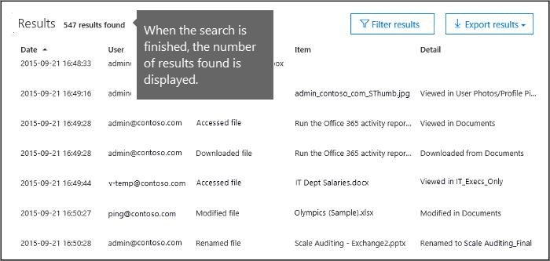
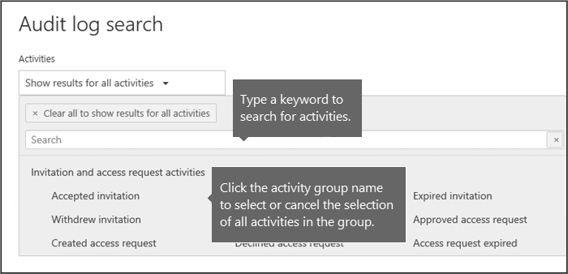
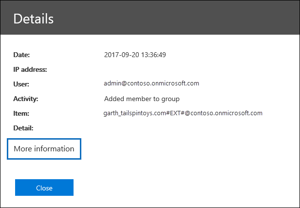
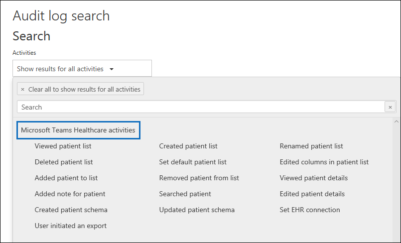

# Search the audit log in the compliance center

Need to find if a user viewed a specific document or purged an item from their mailbox? If so, you can use the Microsoft 365 compliance center to search the unified audit log to view user and administrator activity in your organization. Why a unified audit log? Because you can search for the following types of [user and admin activity](#audited-activities) in Microsoft 365:

- User activity in SharePoint Online and OneDrive for Business

- User activity in Exchange Online (Exchange mailbox audit logging)

- Admin activity in SharePoint Online

- Admin activity in Azure Active Directory (the directory service for Microsoft 365)

- Admin activity in Exchange Online (Exchange admin audit logging)

- eDiscovery activities in the security and compliance center

- User and admin activity in Power BI

- User and admin activity in Microsoft Teams

- User and admin activity in Dynamics 365

- User and admin activity in Yammer

- User and admin activity in Microsoft Power Automate

- User and admin activity in Microsoft Stream

- Analyst and admin activity in Microsoft Workplace Analytics

- User and admin activity in Microsoft Power Apps

- User and admin activity in Microsoft Forms

- User and admin activity for sensitivity labels for sites that use SharePoint Online or Microsoft Teams

- Admin activity in Briefing email and MyAnalytics

## Requirements to search the audit log

Be sure to read the following items before you start searching the audit log.

- Audit log search is turned on by default for Microsoft 365 and Office 365 enterprise organizations. This includes organizations with E3/G3 or E5/G5 subscriptions. To verify that audit log search is turned on, you can run the following command in Exchange Online PowerShell:

  ```powershell
  Get-AdminAuditLogConfig | FL UnifiedAuditLogIngestionEnabled
  ```
  The value of `True` for the *UnifiedAuditLogIngestionEnabled* property indicates that audit log search is turned on. For more information, see [Turn audit log search on or off](turn-audit-log-search-on-or-off.md).

- You have to be assigned the View-Only Audit Logs or Audit Logs role in Exchange Online to search the audit log. By default, these roles are assigned to the Compliance Management and Organization Management role groups on the **Permissions** page in the Exchange admin center. Note global administrators in Office 365 and Microsoft 365 are automatically added as members of the Organization Management role group in Exchange Online. To give a user the ability to search the audit log with the minimum level of privileges, you can create a custom role group in Exchange Online, add the View-Only Audit Logs or Audit Logs role, and then add the user as a member of the new role group. For more information, see [Manage role groups in Exchange Online](/Exchange/permissions-exo/role-groups).

  > [!IMPORTANT]
  > If you assign a user the View-Only Audit Logs or Audit Logs role on the **Permissions** page in the Security & Compliance Center, they won't be able to search the audit log. You have to assign the permissions in Exchange Online. This is because the underlying cmdlet used to search the audit log is an Exchange Online cmdlet.

- When an audited activity is performed by a user or admin, an audit record is generated and stored in the audit log for your organization. The length of time that an audit record is retained (and searchable in the audit log) depends on your Office 365 or Microsoft 365 Enterprise subscription, and specifically the type of the license that is assigned to specific users.

  - For users assigned an Office 365 E5 or Microsoft 365 E5 license (or users with a Microsoft 365 E5 Compliance or Microsoft 365 E5 eDiscovery and Audit add-on license), audit records for Azure Active Directory, Exchange, and SharePoint activity are retained for one year by default. Organizations can also create audit log retention policies to retain audit records for activities in other services for up to one year. For more information, see [Manage audit log retention policies](audit-log-retention-policies.md).

    > [!NOTE]
    > If your organization participated in the private preview program for the one-year retention of audit records, the retention duration for audit records that were generated before the general availability rollout date will not be reset.

  - For users assigned any other (non-E5) Office 365 or Microsoft 365 license, audit records are retained for 90 days. For a list of Office 365 and Microsoft 365 subscriptions that support unified audit logging, see [the security and compliance center service description](/office365/servicedescriptions/office-365-platform-service-description/office-365-securitycompliance-center).

    > [!NOTE]
    > Even when mailbox auditing on by default is turned on, you might notice that mailbox audit events for some users aren't found in audit log searches in the Security & Compliance Center or via the Office 365 Management Activity API. For more information, see [More information about mailbox audit logging](enable-mailbox-auditing.md#more-information).

- If you want to turn off audit log search for your organization, you can run the following command in remote PowerShell connected to your Exchange Online organization:

  ```powershell
  Set-AdminAuditLogConfig -UnifiedAuditLogIngestionEnabled $false
  ```

    To turn on audit search again, you can run the following command in Exchange Online PowerShell:

  ```powershell
  Set-AdminAuditLogConfig -UnifiedAuditLogIngestionEnabled $true
  ```

  For more information, see [Turn off audit log search](turn-audit-log-search-on-or-off.md).

- As previously stated, the underlying cmdlet used to search the audit log is an Exchange Online cmdlet, which is **Search-UnifiedAuditLog**. That means you can use this cmdlet to search the audit log instead of using the **Audit log search** page in the Security & Compliance Center. You have to run this cmdlet in remote PowerShell connected to your Exchange Online organization. For more information, see [Search-UnifiedAuditLog](/powershell/module/exchange/search-unifiedauditlog).

  For information about exporting the search results returned by the **Search-UnifiedAuditLog** cmdlet to a CSV file, see the "Tips for exporting and viewing the audit log" section in [Export, configure, and view audit log records](export-view-audit-log-records.md#tips-for-exporting-and-viewing-the-audit-log).

- If you want to programmatically download data from the audit log, we recommend that you use the Office 365 Management Activity API instead of using a PowerShell script. The Office 365 Management Activity API is a REST web service that you can use to develop operations, security, and compliance monitoring solutions for your organization. For more information, see [Office 365 Management Activity API reference](/office/office-365-management-api/office-365-management-activity-api-reference).

- It can take up to 30 minutes or up to 24 hours after an event occurs for the corresponding audit log record to be returned in the results of an audit log search. The following table shows the time it takes for the different services in Office 365.

  |Microsoft 365 service or feature|30 minutes|24 hours|
  |:-----|:-----:|:-----:|
  |Defender for Office 365 and Threat Intelligence|||
  |Azure Active Directory (user login events)|||
  |Azure Active Directory (admin events)|||
  |Data Loss Prevention|||
  |Dynamics 365 CRM|||
  |eDiscovery|||
  |Exchange Online|||
  |Microsoft Power Automate|||
  |Microsoft Project|||
  |Microsoft Stream|||
  |Microsoft Teams|||
  |Power Apps|||
  |Power BI|||
  |Security & Compliance Center|||
  |Sensitivity labels|||
  |SharePoint Online and OneDrive for Business|||
  |Workplace Analytics|||
  |Yammer||||
  |Microsoft Forms||
  ||||

- Azure Active Directory (Azure AD) is the directory service for Office 365. The unified audit log contains user, group, application, domain, and directory activities performed in the Microsoft 365 admin center or in the Azure management portal. For a complete list of Azure AD events, see [Azure Active Directory Audit Report Events](/azure/active-directory/reports-monitoring/concept-audit-logs).

- Audit logging for Power BI isn't enabled by default. To search for Power BI activities in the audit log, you have to enable auditing in the Power BI admin portal. For instructions, see the "Audit logs" section in [Power BI admin portal](/power-bi/service-admin-portal#audit-logs).

## Search the audit log

Here's the process for searching the audit log in Office 365.

[Step 1: Run an audit log search](#step-1-run-an-audit-log-search)

[Step 2: View the search results](#step-2-view-the-search-results)

[Step 3: Filter the search results](#step-3-filter-the-search-results)

[Step 4: Export the search results to a file](#step-4-export-the-search-results-to-a-file)

### Step 1: Run an audit log search

1. Go to [https://protection.office.com](https://protection.office.com).

    > [!TIP]
    > Use a private browsing session (not a regular session) to access the Security & Compliance Center because this will prevent the credential that you are currently logged on with from being used. To open an InPrivate Browsing session in Internet Explorer or Microsoft Edge, just press CTRL+SHIFT+P. To open a private browsing session in Google Chrome (called an incognito window), press CTRL+SHIFT+N.

2. Sign in using your work or school account.

3. In the left pane of the Security & Compliance Center, click **Search**, and then click **Audit log search**.

    The **Audit log search** page is displayed.

    

    > [!NOTE]
    > You have to first turn on audit logging before you can run an audit log search. If the **Start recording user and admin activity** link is displayed, click it to turn on auditing. If you don't see this link, auditing has already been turned on for your organization.

4. Configure the following search criteria:

   1. **Activities**: Click the drop-down list to display the activities that you can search for. User and admin activities are organized into groups of related activities. You can select specific activities or you can click the activity group name to select all activities in the group. You can also click a selected activity to clear the selection. After you run the search, only the audit log entries for the selected activities are displayed. Selecting **Show results for all activities** displays results for all activities performed by the selected user or group of users.

      Over 100 user and admin activities are logged in the audit log. Click the **Audited activities** tab at the topic of this article to see the descriptions of every activity in each of the different services.

   1. **Start date** and **End date**: The last seven days are selected by default. Select a date and time range to display the events that occurred within that period. The date and time are presented in local time. The maximum date range that you can specify is 90 days. An error is displayed if the selected date range is greater than 90 days.

      > [!TIP]
      > If you're using the maximum date range of 90 days, select the current time for the **Start date**. Otherwise, you'll receive an error saying that the start date is earlier than the end date. If you've turned on auditing within the last 90 days, the maximum date range can't start before the date that auditing was turned on.

   1. **Users**: Click in this box and then select one or more users to display search results for. The audit log entries for the selected activity performed by the users you select in this box are displayed in the list of results. Leave this box blank to return entries for all users (and service accounts) in your organization.

   1. **File, folder, or site**: Type some or all of a file or folder name to search for activity related to the file of folder that contains the specified keyword. You can also specify a URL of a file or folder. If you use a URL, be sure the type the full URL path or if you type a portion of the URL, don't include any special characters or spaces.

      Leave this box blank to return entries for all files and folders in your organization.

      > [!TIP]
      >
      > - If you're looking for all activities related to a **site**, add the wildcard symbol (\*) after the URL to return all entries for that site; for example, `"https://contoso-my.sharepoint.com/personal*"`.
      >
      > - If you're looking for all activities related to a **file**, add the wildcard symbol (\*) before the file name to return all entries for that file; for example, `"*Customer_Profitability_Sample.csv"`.

5. Click **Search** to run the search using your search criteria.

   The search results are loaded, and after a few moments they are displayed under **Results**. When the search is finished, the number of results found is displayed. A maximum of 5,000 events will be displayed in the **Results** pane in increments of 150 events. If more than 5,000 events meet the search criteria, the most recent 5,000 events are displayed.

   

#### Tips for searching the audit log

- You can select specific activities to search for by clicking the activity name. Or you can search for all activities in a group (such as **File and folder activities**) by clicking the group name. If an activity is selected, you can click it to cancel the selection. You can also use the search box to display the activities that contain the keyword that you type.

  

- You have to select **Show results for all activities** in the **Activities** list to display events from the Exchange admin audit log. Events from this audit log display a cmdlet name (for example, **Set-Mailbox**) in the **Activity** column in the results. For more information, click the **Audited activities** tab in this topic and then click **Exchange admin activities**.

  Similarly, there are some auditing activities that don't have a corresponding item in the **Activities** list. If you know the name of the operation for these activities, you can search for all activities, then filter the results by typing the name of the operation in the box for the **Activity** column. See [Step 3: Filter the search results](#step-3-filter-the-search-results) for more information about filtering the results.

- Click **Clear** to clear the current search criteria. The date range returns to the default of the last seven days. You can also click **Clear all to show results for all activities** to cancel all selected activities.

- If 5,000 results are found, you can probably assume that there are more than 5,000 events that met the search criteria. You can either refine the search criteria and rerun the search to return fewer results, or you can export all of the search results by selecting **Export results** \> **Download all results**.

### Step 2: View the search results

The results of an audit log search are displayed under **Results** on the **Audit log search** page. As previously stated a maximum of 5,000 (newest) events are displayed in increments of 150 events. To display more events you can use the scroll bar in the **Results** pane or you can press **Shift + End** to display the next 150 events.

The results contain the following information about each event returned by the search:

- **Date**: The date and time (in your local time) when the event occurred.

- **IP address**: The IP address of the device that was used when the activity was logged. The IP address is displayed in either an IPv4 or IPv6 address format.

   > [!NOTE]
  > For some services, the value displayed in this field might be the IP address for a trusted application (for example, Office on the web apps) calling into the service on behalf of a user and not the IP address of the device used by person who performed the activity. Also, for admin activity (or activity performed by a system account) for Azure Active Directory-related events, the IP address isn't logged and the value displayed in this field is `null`.

- **User**: The user (or service account) who performed the action that triggered the event.

- **Activity**: The activity performed by the user. This value corresponds to the activities that you selected in the **Activities** drop down list. For an event from the Exchange admin audit log, the value in this column is an Exchange cmdlet.

- **Item**: The object that was created or modified as a result of the corresponding activity. For example, the file that was viewed or modified or the user account that was updated. Not all activities have a value in this column.

- **Detail**: Additional information about an activity. Again, not all activities have a value.

> [!TIP]
> Click a column header under **Results** to sort the results. You can sort the results from A to Z or Z to A. Click the **Date** header to sort the results from oldest to newest or newest to oldest.

#### View the details for a specific event

You can view more details about an event by clicking the event record in the list of search results. A **Details** page is displayed that contains the detailed properties from the event record. The properties that are displayed depend on the service in which the event occurs. To display these details, click **More information**. For descriptions, see [Detailed properties in the audit log](detailed-properties-in-the-office-365-audit-log.md).



### Step 3: Filter the search results

In addition to sorting, you can also filter the results of an audit log search. This is a great feature that can help you quickly filter the results for a specific user or activity. You can initially create a wide search and then quickly filter the results to see specific events. Then you can narrow the search criteria and rerun the search to return a smaller, more concise set of results.

To filter the results:

1. Run an audit log search.

2. When the results are displayed, click **Filter results**.

   Keyword boxes are displayed under each column header.

3. Click one of the boxes under a column header and type a word or phrase, depending on the column you're filtering on. The results will dynamically readjust to display the events that match your filter.

   

4. To clear a filter, click the **X** in the filter box or click **Hide filtering**.

> [!TIP]
> To display events from the Exchange admin audit log, type a **-** (dash) in the **Activity** filter box. This will display cmdlet names, which are displayed in the **Activity** column for Exchange admin events. Then you can sort the cmdlet names in alphabetical order.

### Step 4: Export the search results to a file

You can export the results of an audit log search to a comma-separated value (CSV) file on your local computer. You can open this file in Microsoft Excel and use features such as search, sorting, filtering, and splitting a single column (that contains multiple properties) into multiple columns.

1. Run an audit log search, and then revise the search criteria until you have the desired results.

2. Click **Export results** and select one of the following options:

   - **Save loaded results**: Choose this option to export only the entries that are displayed under **Results** on the **Audit log search** page. The CSV file that is downloaded contains the same columns (and data) displayed on the page (Date, User, Activity, Item, and Details). An extra column (named **More**) is included in the CSV file that contains more information from the audit log entry. Because you're exporting the same results that are loaded (and viewable) on the **Audit log search** page, a maximum of 5,000 entries are exported.

   - **Download all results**: Choose this option to export all entries from the audit log that meet the search criteria. For a large set of search results, choose this option to download all entries from the audit log in addition to the 5,000 audit records that can be displayed on the **Audit log search** page. This option downloads the raw data from the audit log to a CSV file, and contains additional information from the audit log entry in a column named **AuditData**. It may take longer to download the file if you choose this export option because the file may be much larger than the one that's downloaded if you choose the other option.

     > [!IMPORTANT]
     > You can download a maximum of 50,000 entries to a CSV file from a single audit log search. If 50,000 entries are downloaded to the CSV file, you can probably assume there are more than 50,000 events that met the search criteria. To export more than this limit, try using a date range to reduce the number of audit log entries. You might have to run multiple searches with smaller date ranges to export more than 50,000 entries.

3. After you select an export option, a message is displayed at the bottom of the window that prompts you to open the CSV file, save it to the Downloads folder, or save it to a specific folder.

#### More information about exporting and viewing audit log search results

- If you download all search results, the CSV file contains a column named **AuditData**, which contains additional information about each event. The data in this column consists of a JSON object that contains multiple properties from the audit log record. Each *property:value* pair in the JSON object is separated by a comma. You can use the JSON transform tool in the Power Query Editor in Excel to split **AuditData** column into multiple columns so that each property in the JSON object has its own column. This lets you sort and filter on one or more of these properties. For step-by-step instructions using the Power Query Editor to transform the JSON object, see [Export, configure, and view audit log records](export-view-audit-log-records.md).

  After you split the **AuditData** column, you can filter on the **Operations** column to display the detailed properties for a specific type of activity.

- The **Download all results** option downloads the raw data from the audit log to a CSV file. This file contains different column names (CreationDate, UserIds, Operation, AuditData) than the file that's downloaded if you select the **Save loaded results** option. The values in the two different CSV files for the same activity may also be different. For example, the activity in the **Action** column in the CSV file and may have a different value than the "user-friendly" name that's displayed in the **Activity** column on the **Audit log search** page. For example, MailboxLogin vs. User signed in to mailbox.

- When you download all results from a search query that contains events from different services, the **AuditData** column in the CSV file contains different properties depending on which service the action was performed in. For example, entries from Exchange and Azure AD audit logs include a property named **ResultStatus** that indicates if the action was successful or not. This property isn't included for events in SharePoint. Similarly, SharePoint events have a property that identifies the site URL for file and folder-related activities. To mitigate this behavior, consider using different searches to export the results for activities from a single service.

  For a description of many of the properties that are listed in the **AuditData** column in the CSV file when you download all results, and the service each one applies to, see [Detailed properties in the audit log](detailed-properties-in-the-office-365-audit-log.md).

## Audited activities

The tables in this section describe the activities that are audited in Office 365. You can search for these events by searching the audit log in the security and compliance center.

These tables group related activities or the activities from a specific service. The tables include the friendly name that's displayed in the **Activities** drop-down list and the name of the corresponding operation that appears in the detailed information of an audit record and in the CSV file when you export the search results. For descriptions of the detailed information, see [Detailed properties in the audit log](detailed-properties-in-the-office-365-audit-log.md).

Click one of the following links to go to a specific table.

:::row:::
    :::column:::
        [File and page activities](#file-and-page-activities)
    :::column-end:::
    :::column:::
        [Folder activities](#folder-activities)
    :::column-end:::
    :::column:::
        [SharePoint list activities](#sharepoint-list-activities)
    :::column-end:::
:::row-end:::

:::row:::
    :::column:::
        [Sharing and access request activities](#sharing-and-access-request-activities)
    :::column-end:::
    :::column:::
        [Synchronization activities](#synchronization-activities)
    :::column-end:::
    :::column:::
        [Site permissions activities](#site-permissions-activities)
    :::column-end:::
:::row-end:::

:::row:::
    :::column:::
        [Site administration activities](#site-administration-activities)
    :::column-end:::
    :::column:::
        [Exchange mailbox activities](#exchange-mailbox-activities)
    :::column-end:::
    :::column:::
        [User administration activities](#user-administration-activities)
    :::column-end:::
:::row-end:::

:::row:::
    :::column:::
        [Azure AD group administration activities](#azure-ad-group-administration-activities)
    :::column-end:::
    :::column:::
        [Application administration activities](#application-administration-activities)
    :::column-end:::
    :::column:::
        [Role administration activities](#role-administration-activities)
    :::column-end:::
:::row-end:::

:::row:::
    :::column:::
        [Directory administration activities](#directory-administration-activities)
    :::column-end:::
    :::column:::
        [eDiscovery activities](#ediscovery-activities)
    :::column-end:::
    :::column:::
        [Advanced eDiscovery activities](#advanced-ediscovery-activities)
    :::column-end:::
:::row-end:::

:::row:::
    :::column:::
        [Power BI activities](#power-bi-activities)
    :::column-end:::
    :::column:::
        [Microsoft Workplace Analytics](#workplace-analytics-activities)
    :::column-end:::
    :::column:::
        [Microsoft Teams activities](#microsoft-teams-activities)
    :::column-end:::
:::row-end:::

:::row:::
    :::column:::
        [Microsoft Teams Healthcare activities](#microsoft-teams-healthcare-activities)
    :::column-end:::
    :::column:::
        [Microsoft Teams Shifts activities](#microsoft-teams-shifts-activities)
    :::column-end:::
    :::column:::
        [Yammer activities](#yammer-activities)
    :::column-end:::
:::row-end:::

:::row:::
    :::column:::
        [Microsoft Power Automate activities](#microsoft-power-automate-activities)
    :::column-end:::
    :::column:::
        [Microsoft Power Apps activities](#microsoft-power-apps-activities)
    :::column-end:::
    :::column:::
        [Microsoft Stream activities](#microsoft-stream-activities)
    :::column-end:::
:::row-end:::

:::row:::
    :::column:::
        [Content explorer activities](#content-explorer-activities)
    :::column-end:::
    :::column:::
        [Quarantine activities](#quarantine-activities)
    :::column-end:::
    :::column:::
        [Microsoft Forms activities](#microsoft-forms-activities)
    :::column-end:::
:::row-end:::

:::row:::
    :::column:::
        [Sensitivity label activities](#sensitivity-label-activities)
    :::column-end:::
    :::column:::
        [Retention policy and retention label activities](#retention-policy-and-retention-label-activities)
    :::column-end:::
    :::column:::
        [Briefing email activities](#briefing-email-activities)
    :::column-end:::
:::row-end:::

:::row:::
    :::column:::
        [MyAnalytics activities](#myanalytics-activities)
    :::column-end:::
    :::column:::
        [Information barriers activities](#information-barriers-activities)
    :::column-end:::
    :::column:::
        [Exchange admin activities](#exchange-admin-audit-log)
    :::column-end:::
:::row-end:::

### File and page activities

The following table describes the file and page activities in SharePoint Online and OneDrive for Business.

|Friendly name|Operation|Description|
|:-----|:-----|:-----|
|Accessed file|FileAccessed|User or system account accesses a file.|
|(none)|FileAccessedExtended|This is related to the "Accessed file" (FileAccessed) activity. A FileAccessedExtended event is logged when the same person continually accesses a file for an extended period (up to 3 hours). <br/><br/> The purpose of logging FileAccessedExtended events is to reduce the number of FileAccessed events that are logged when a file is continually accessed. This helps reduce the noise of multiple FileAccessed records for what is essentially the same user activity, and lets you focus on the initial (and more important) FileAccessed event.|
|Changed retention label for a file|ComplianceSettingChanged|A retention label was applied to or removed from a document. This event is triggered when a retention label is manually or automatically applied to a message.|
|Changed record status to locked|LockRecord|The record status of a retention label that classifies a document as a record was locked. This means the document can't be modified or deleted. Only users assigned at least the contributor permission for a site can change the record status of a document.|
|Changed record status to unlocked|UnlockRecord|The record status of a retention label that classifies a document as a record was unlocked. This means that the document can be modified or deleted. Only users assigned at least the contributor permission for a site can change the record status of a document.|
|Checked in file|FileCheckedIn|User checks in a document that they checked out from a document library.|
|Checked out file|FileCheckedOut|User checks out a document located in a document library. Users can check out and make changes to documents that have been shared with them.|
|Copied file|FileCopied|User copies a document from a site. The copied file can be saved to another folder on the site.|
|Deleted file|FileDeleted|User deletes a document from a site.|
|Deleted file from recycle bin|FileDeletedFirstStageRecycleBin|User deletes a file from the recycle bin of a site.|
|Deleted file from second-stage recycle bin|FileDeletedSecondStageRecycleBin|User deletes a file from the second-stage recycle bin of a site.|
|Deleted file marked as a record|RecordDelete|A document or email that was marked as a record was deleted. An item is considered a record when a retention label that marks items as a record is applied to content.|
|Detected document sensitivity mismatch|DocumentSensitivityMismatchDetected|User uploads a document to a site that's protected with a sensitivity label and the document has a higher priority sensitivity label than the sensitivity label applied to the site. For example, a document labeled Confidential is uploaded to a site labeled General. <br/><br/> This event isn't triggered if the document has a lower priority sensitivity label than the sensitivity label applied to the site. For example, a document labeled General is uploaded to a site labeled Confidential. For more information about sensitivity label priority, see [Label priority (order matters)](sensitivity-labels.md#label-priority-order-matters).|
|Detected malware in file|FileMalwareDetected|SharePoint anti-virus engine detects malware in a file.|
|Discarded file checkout|FileCheckOutDiscarded|User discards (or undoes) a checked out file. That means any changes they made to the file when it was checked out are discarded, and not saved to the version of the document in the document library.|
|Downloaded file|FileDownloaded|User downloads a document from a site.|
|Modified file|FileModified|User or system account modifies the content or the properties of a document on a site.|
|(none)|FileModifiedExtended|This is related to the "Modified file" (FileModified) activity. A FileModifiedExtended event is logged when the same person continually modifies a file for an extended period (up to 3 hours). <br/><br/> The purpose of logging FileModifiedExtended events is to reduce the number of FileModified events that are logged when a file is continually modified. This helps reduce the noise of multiple FileModified records for what is essentially the same user activity, and lets you focus on the initial (and more important) FileModified event.|
|Moved file|FileMoved|User moves a document from its current location on a site to a new location.|
|(none)|FilePreviewed|User previews files on a SharePoint or OneDrive for Business site. These events typically occur in high volumes based on a single activity, such as viewing an image gallery.|
|Performed search query|SearchQueryPerformed|User or system account performs a search in SharePoint or OneDrive for Business. Some common scenarios where a service account performs a search query include applying an eDiscovery holds and retention policy to sites and OneDrive accounts, and auto-applying retention or sensitivity labels to site content.|
|Recycled all minor versions of file|FileVersionsAllMinorsRecycled|User deletes all minor versions from the version history of a file. The deleted versions are moved to the site's recycle bin.|
|Recycled all versions of file|FileVersionsAllRecycled|User deletes all versions from the version history of a file. The deleted versions are moved to the site's recycle bin.|
|Recycled version of file|FileVersionRecycled|User deletes a version from the version history of a file. The deleted version is moved to the site's recycle bin.|
|Renamed file|FileRenamed|User renames a document on a site.|
|Restored file|FileRestored|User restores a document from the recycle bin of a site.|
|Uploaded file|FileUploaded|User uploads a document to a folder on a site.|
|Viewed page|PageViewed|User views a page on a site. This doesn't include using a Web browser to view files located in a document library.|
|(none)|PageViewedExtended|This is related to the "Viewed page" (PageViewed) activity. A PageViewedExtended event is logged when the same person continually views a web page for an extended period (up to 3 hours). <br/><br/> The purpose of logging PageViewedExtended events is to reduce the number of PageViewed events that are logged when a page is continually viewed. This helps reduce the noise of multiple PageViewed records for what is essentially the same user activity, and lets you focus on the initial (and more important) PageViewed event.|
|View signaled by client|ClientViewSignaled|A user's client (such as website or mobile app) has signaled that the indicated page has been viewed by the user. This activity is often logged following a PagePrefetched event for a page. <br/><br/>**NOTE**: Because ClientViewSignaled events are signaled by the client, rather than the server, it's possible the event may not be logged by the server and therefore may not appear in the audit log. It's also possible that information in the audit record may not be trustworthy. However, because the user's identity is validated by the token used to create the signal, the user's identity listed in the corresponding audit record is accurate. |
|(none)|PagePrefetched|A user's client (such as website or mobile app) has requested the indicated page to help improve performance if the user browses to it. This event is logged to indicate that the page content has been served to the user's client. This event isn't a definitive indication that the user navigated to the page. <br/><br/> When the page content is rendered by the client (as per the user's request) a ClientViewSignaled event should be generated. Not all clients support indicating a pre-fetch, and therefore some pre-fetched activities might instead be logged as PageViewed events.|
||||

#### Frequently asked questions about FileAccessed and FilePreviewed events

**Could any non-user activities trigger FilePreviewed audit records that contain a user agent like "OneDriveMpc-Transform_Thumbnail"?**

We aren't aware of scenarios where non-user actions generate events like these. User actions like opening a user profile card (by clicking their name or email address in a message in Outlook on the web) would generate similar events.

**Are calls to the OneDriveMpc-Transform_Thumbnail always intentionally being triggered by the user?**

No. But similar events can be logged as a result of browser pre-fetch.

**If we see a FilePreviewed event coming from a Microsoft-registered IP address, does that mean that the preview was displayed on the screen of the user's device?**

No. The event might have been logged as a result of browser pre-fetch.

**Are there scenarios where a user previewing a document generates FileAccessed events?**

Both the FilePreviewed and FileAccessed events indicate that a user's call led to a read of the file (or a read of a thumbnail rendering of the file). While these events are intended to align with preview vs. access intention, the event distinction isn't a guarantee of the user's intent.

#### The app\@sharepoint user in audit records

In audit records for some file activities (and other SharePoint-related activities), you may notice the user who performed the activity (identified in the User and UserId fields) is app@sharepoint. This indicates that the "user" who performed the activity was an application. In this case, the application was granted permissions in SharePoint to perform organization-wide actions (such as search a SharePoint site or OneDrive account) on behalf of a user, admin, or service. This process of giving permissions to an application is called *SharePoint App-Only* access. This indicates that the authentication presented to SharePoint to perform an action was made by an application, instead of a user. This is why the app@sharepoint user is identified in certain audit records. For more information, see [Grant access using SharePoint App-Only](/sharepoint/dev/solution-guidance/security-apponly-azureacs).

For example, app@sharepoint is often identified as the user for "Performed search query" and "Accessed file" events. That's because an application with SharePoint App-Only access in your organization performs search queries and accesses files when applying retention policies to sites and OneDrive accounts.

Here are a few other scenarios where app@sharepoint may be identified in an audit record as the user who performed an activity:

- Microsoft 365 Groups. When a user or admin creates a new group, audit records are generated for creating a site collection, updating lists, and adding members to a SharePoint group. These tasks are performed an application on behalf of the user who created the group.

- Microsoft Teams. Similar to Microsoft 365 Groups, audit records are generated for creating a site collection, updating lists, and adding members to a SharePoint group when a team is created.

- Compliance features. When an admin implements compliance features, such as retention policies, eDiscovery holds, and auto-applying sensitivity labels.

In these and other scenarios, you'll also notice that multiple audit records with app@sharepoint as the specified user were created within a short time frame, often within a few seconds of each other. This also indicates they were probably triggered by the same user-initiated task. Also, the ApplicationDisplayName and EventData fields in the audit record may help you identify the scenario or application that triggered the event.

### Folder activities

The following table describes the folder activities in SharePoint Online and OneDrive for Business. As previously explained, audit records for some SharePoint activities will indicate the app@sharepoint user performed the activity of behalf of the user or admin who initiated the action. For more information, see [The app\@sharepoint user in audit records](#the-appsharepoint-user-in-audit-records).

|Friendly name|Operation|Description|
|:-----|:-----|:-----|
|Copied folder|FolderCopied|User copies a folder from a site to another location in SharePoint or OneDrive for Business.|
|Created folder|FolderCreated|User creates a folder on a site.|
|Deleted folder|FolderDeleted|User deletes a folder from a site.|
|Deleted folder from recycle bin|FolderDeletedFirstStageRecycleBin|User deletes a folder from the recycle bin on a site.|
|Deleted folder from second-stage recycle bin|FolderDeletedSecondStageRecycleBin|User deletes a folder from the second-stage recycle bin on a site.|
|Modified folder|FolderModified|User modifies a folder on a site. This includes changing the folder metadata, such as changing tags and properties.|
|Moved folder|FolderMoved|User moves a folder to a different location on a site.|
|Renamed folder|FolderRenamed|User renames a folder on a site.|
|Restored folder|FolderRestored|User restores a deleted folder from the recycle bin on a site.|
||||

### SharePoint list activities

The following table describes activities related to when users interact with lists and list items in SharePoint Online. As previously explained, audit records for some SharePoint activities will indicate the app@sharepoint user performed the activity of behalf of the user or admin who initiated the action. For more information, see [The app\@sharepoint user in audit records](#the-appsharepoint-user-in-audit-records).

|Friendly name|Operation|Description|
|:-----|:-----|:-----|
|Created list|ListCreated|A user created a SharePoint list.|
|Created list column|ListColumnCreated|A user created a SharePoint list column. A list column is a column that's attached to one or more SharePoint lists.|
|Created list content type|ListContentTypeCreated|A user created a list content type. A list content type is a content type that's attached to one or more SharePoint lists.|
|Created list item|ListItemCreated|A user created an item in an existing SharePoint list.|
|Created site column|SiteColumnCreated|A user created a SharePoint site column. A site column is a column that isn't attached to a list. A site column is also a metadata structure that can be used by any list in a given web.|
|Created site content type|Site ContentType Created|A user created a site content type. A site content type is a content type that's attached to the parent site.|
|Deleted list|ListDeleted|A user deleted a SharePoint list.|
|Deleted list column|List Column Deleted|A user deleted a SharePoint list column.|
|Deleted list content type|ListContentTypeDeleted|A user deleted a list content type.|
|Deleted list item|List Item Deleted|A user deleted a SharePoint list item.|
|Deleted site column|SiteColumnDeleted|A user deleted a SharePoint site column.|
|Deleted site content type|SiteContentTypeDeleted|A user deleted a site content type.|
|Recycled list item|ListItemRecycled|A user moved a SharePoint list item to the Recycle Bin.|
|Restored list|ListRestored|A user restored a SharePoint list from the Recycle Bin.|
|Restored list item|ListItemRestored|A user restored a SharePoint list item from the Recycle Bin.|
|Updated list|ListUpdated|A user updated a SharePoint list by modifying one or more properties.|
|Updated list column|ListColumnUpdated|A user updated a SharePoint list column by modifying one or more properties.|
|Updated list content type|ListContentTypeUpdated|A user updated a list content type by modifying one or more properties.|
|Updated list item|ListItemUpdated|A user updated a SharePoint list item by modifying one or more properties.|
|Updated site column|SiteColumnUpdated|A user updated a SharePoint site column by modifying one or more properties.|
|Updated site content type|SiteContentTypeUpdated|A user updated a site content type by modifying one or more properties.|
||||

### Sharing and access request activities

The following table describes the user sharing and access request activities in SharePoint Online and OneDrive for Business. For sharing events, the **Detail** column under **Results** identifies the name of the user or group the item was shared with and whether that user or group is a member or guest in your organization. For more information, see [Use sharing auditing in the audit log](use-sharing-auditing.md).

> [!NOTE]
> Users can be either  *members*  or  *guests*  based on the UserType property of the user object. A member is usually an employee, and a guest is usually a collaborator outside of your organization. When a user accepts a sharing invitation (and isn't already part of your organization), a guest account is created for them in your organization's directory. Once the guest user has an account in your directory, resources may be shared directly with them (without requiring an invitation).

|Friendly name|Operation|Description|
|:-----|:-----|:-----|
|Added permission level to site collection|PermissionLevelAdded|A permission level was added to a site collection.|
|Accepted access request|AccessRequestAccepted|An access request to a site, folder, or document was accepted and the requesting user has been granted access.|
|Accepted sharing invitation|SharingInvitationAccepted|User (member or guest) accepted a sharing invitation and was granted access to a resource. This event includes information about the user who was invited and the email address that was used to accept the invitation (they could be different). This activity is often accompanied by a second event that describes how the user was granted access to the resource, for example, adding the user to a group that has access to the resource.|
|Blocked sharing invitation|SharingInvitationBlocked|A sharing invitation sent by a user in your organization is blocked because of an external sharing policy that either allows or denies external sharing based on the domain of the target user. In this case, the sharing invitation was blocked because: <br/> The target user's domain isn't included in the list of allowed domains. <br/> Or <br/> The target user's domain is included in the list of blocked domains. <br/> For more information about allowing or blocking external sharing based on domains, see [Restricted domains sharing in SharePoint Online and OneDrive for Business](/sharepoint/restricted-domains-sharing).|
|Created access request|AccessRequestCreated|User requests access to a site, folder, or document they don't have permissions to access.|
|Created a company shareable link|CompanyLinkCreated|User created a company-wide link to a resource. company-wide links can only be used by members in your organization. They can't be used by guests.|
|Created an anonymous link|AnonymousLinkCreated|User created an anonymous link to a resource. Anyone with this link can access the resource without having to be authenticated.|
|Created secure link|SecureLinkCreated|A secure sharing link was created to this item.|
|Created sharing invitation|SharingInvitationCreated|User shared a resource in SharePoint Online or OneDrive for Business with a user who isn't in your organization's directory.|
|Deleted secure link|SecureLinkDeleted|A secure sharing link was deleted.|
|Denied access request|AccessRequestDenied|An access request to a site, folder, or document was denied.|
|Removed a company shareable link|CompanyLinkRemoved|User removed a company-wide link to a resource. The link can no longer be used to access the resource.|
|Removed an anonymous link|AnonymousLinkRemoved|User removed an anonymous link to a resource. The link can no longer be used to access the resource.|
|Shared file, folder, or site|SharingSet|User (member or guest) shared a file, folder, or site in SharePoint or OneDrive for Business with a user in your organization's directory. The value in the **Detail** column for this activity identifies the name of the user the resource was shared with and whether this user is a member or a guest. <br/><br/> This activity is often accompanied by a second event that describes how the user was granted access to the resource. For example, adding the user to a group that has access to the resource.|
|Updated access request|AccessRequestUpdated|An access request to an item was updated.|
|Updated an anonymous link|AnonymousLinkUpdated|User updated an anonymous link to a resource. The updated field is included in the EventData property when you export the search results.|
|Updated sharing invitation|SharingInvitationUpdated|An external sharing invitation was updated.|
|Used an anonymous link|AnonymousLinkUsed|An anonymous user accessed a resource by using an anonymous link. The user's identity might be unknown, but you can get other details such as the user's IP address.|
|Unshared file, folder, or site|SharingRevoked|User (member or guest) unshared a file, folder, or site that was previously shared with another user.|
|Used a company shareable link|CompanyLinkUsed|User accessed a resource by using a company-wide link.|
|Used secure link|SecureLinkUsed|A user used a secure link.|
|User added to secure link|AddedToSecureLink|A user was added to the list of entities who can use a secure sharing link.|
|User removed from secure link|RemovedFromSecureLink|A user was removed from the list of entities who can use a secure sharing link.|
|Withdrew sharing invitation|SharingInvitationRevoked|User withdrew a sharing invitation to a resource.|
||||

### Synchronization activities

The following table lists file synchronization activities in SharePoint Online and OneDrive for Business.

|Friendly name|Operation|Description|
|:-----|:-----|:-----|
|Allowed computer to sync files|ManagedSyncClientAllowed|User successfully establishes a sync relationship with a site. The sync relationship is successful because the user's computer is a member of a domain that's been added to the list of domains (called the *safe recipients list*) that can access document libraries in your organization. <br/><br/> For more information about this feature, see [Use Windows PowerShell cmdlets to enable OneDrive sync for domains that are on the safe recipients list](/powershell/module/sharepoint-online/).|
|Blocked computer from syncing files|UnmanagedSyncClientBlocked|User tries to establish a sync relationship with a site from a computer that isn't a member of your organization's domain or is a member of a domain that hasn't been added to the list of domains (called the  *safe recipients list)*  that can access document libraries in your organization. The sync relationship is not allowed, and the user's computer is blocked from syncing, downloading, or uploading files on a document library. <br/><br/> For information about this feature, see [Use Windows PowerShell cmdlets to enable OneDrive sync for domains that are on the safe recipients list](/powershell/module/sharepoint-online/).|
|Downloaded files to computer|FileSyncDownloadedFull|User establishes a sync relationship and successfully downloads files for the first time to their computer from a document library.|
|Downloaded file changes to computer|FileSyncDownloadedPartial|User successfully downloads any changes to files from a document library. This activity indicates that any changes that were made to files in the document library were downloaded to the user's computer. Only changes were downloaded because the document library was previously downloaded by the user (as indicated by the **Downloaded files to computer** activity).|
|Uploaded files to document library|FileSyncUploadedFull|User establishes a sync relationship and successfully uploads files for the first time from their computer to a document library.|
|Uploaded file changes to document library|FileSyncUploadedPartial|User successfully uploads changes to files on a document library. This event indicates that any changes made to the local version of a file from a document library are successfully uploaded to the document library. Only changes are uploaded because those files were previously uploaded by the user (as indicated by the **Uploaded files to document library** activity).|
||||

### Site permissions activities

The following table lists events related to assigning permissions in SharePoint and using groups to give (and revoke) access to sites. As previously explained, audit records for some SharePoint activities will indicate the app@sharepoint user performed the activity of behalf of the user or admin who initiated the action. For more information, see [The app\@sharepoint user in audit records](#the-appsharepoint-user-in-audit-records).

|Friendly name|Operation|Description|
|:-----|:-----|:-----|
|Added site collection admin|SiteCollectionAdminAdded|Site collection administrator or owner adds a person as a site collection administrator for a site. Site collection administrators have full control permissions for the site collection and all subsites. This activity is also logged when an admin gives themselves access to a user's OneDrive account (by editing the user profile in the SharePoint admin center or by [using the Microsoft 365 admin center](/office365/admin/add-users/get-access-to-and-back-up-a-former-user-s-data)).|
|Added user or group to SharePoint group|AddedToGroup|User added a member or guest to a SharePoint group. This might have been an intentional action or the result of another activity, such as a sharing event.|
|Broke permission level inheritance|PermissionLevelsInheritanceBroken|An item was changed so that it no longer inherits permission levels from its parent.|
|Broke sharing inheritance|SharingInheritanceBroken|An item was changed so that it no longer inherits sharing permissions from its parent.|
|Created group|GroupAdded|Site administrator or owner creates a group for a site, or performs a task that results in a group being created. For example, the first time a user creates a link to share a file, a system group is added to the user's OneDrive for Business site. This event can also be a result of a user creating a link with edit permissions to a shared file.|
|Deleted group|GroupRemoved|User deletes a group from a site.|
|Modified access request setting|WebRequestAccessModified|The access request settings were modified on a site.|
|Modified 'Members Can Share' setting|WebMembersCanShareModified|The **Members Can Share** setting was modified on a site.|
|Modified permission level on a site collection|PermissionLevelModified|A permission level was changed on a site collection.|
|Modified site permissions|SitePermissionsModified|Site administrator or owner (or system account) changes the permission level that is assigned to a group on a site. This activity is also logged if all permissions are removed from a group. <br/><br/> **NOTE**: This operation has been deprecated in SharePoint Online. To find related events, you can search for other permission-related activities such as **Added site collection admin**, **Added user or group to SharePoint group**, **Allowed user to create groups**, **Created group**, and **Deleted group.**|
|Removed permission level from site collection|PermissionLevelRemoved|A permission level was removed from a site collection.|
|Removed site collection admin|SiteCollectionAdminRemoved|Site collection administrator or owner removes a person as a site collection administrator for a site. This activity is also logged when an admin removes themselves from the list of site collection administrators for a user's OneDrive account (by editing the user profile in the SharePoint admin center).  To return this activity in the audit log search results, you have to search for all activities.|
|Removed user or group from SharePoint group|RemovedFromGroup|User removed a member or guest from a SharePoint group. This might have been an intentional action or the result of another activity, such as an unsharing event.|
|Requested site admin permissions|SiteAdminChangeRequest|User requests to be added as a site collection administrator for a site collection. Site collection administrators have full control permissions for the site collection and all subsites.|
|Restored sharing inheritance|SharingInheritanceReset|A change was made so that an item inherits sharing permissions from its parent.|
|Updated group|GroupUpdated|Site administrator or owner changes the settings of a group for a site. This can include changing the group's name, who can view or edit the group membership, and how membership requests are handled.|
||||

### Site administration activities

The following table lists events that result from site administration tasks in SharePoint Online. As previously explained, audit records for some SharePoint activities will indicate the app@sharepoint user performed the activity of behalf of the user or admin who initiated the action. For more information, see [The app\@sharepoint user in audit records](#the-appsharepoint-user-in-audit-records).

|Friendly name|Operation|Description|
|:-----|:-----|:-----|
|Added allowed data location|AllowedDataLocationAdded|A SharePoint or global administrator added an allowed data location in a multi-geo environment.|
|Added exempt user agent|ExemptUserAgentSet|A SharePoint or global administrator added a user agent to the list of exempt user agents in the SharePoint admin center.|
|Added geo location admin|GeoAdminAdded|A SharePoint or global administrator added a user as a geo admin of a location.|
|Allowed user to create groups|AllowGroupCreationSet|Site administrator or owner adds a permission level to a site that allows a user assigned that permission to create a group for that site.|
|Canceled site geo move|SiteGeoMoveCancelled|A SharePoint or global administrator successfully cancels a SharePoint or OneDrive site geo move. The Multi-Geo capability lets an organization span multiple Microsoft datacenter geographies, which are called geos. For more information, see [Multi-Geo Capabilities in OneDrive and SharePoint Online](../enterprise/multi-geo-capabilities-in-onedrive-and-sharepoint-online-in-microsoft-365.md).|
|Changed a sharing policy|SharingPolicyChanged|A SharePoint or global administrator changed a SharePoint sharing policy by using the Microsoft 365 admin portal, SharePoint admin portal, or SharePoint Online Management Shell. Any change to the settings in the sharing policy in your organization will be logged. The policy that was changed is identified in the **ModifiedProperties** field in the detailed properties of the event record.|
|Changed device access policy|DeviceAccessPolicyChanged|A SharePoint or global administrator changed the unmanaged devices policy for your organization. This policy controls access to SharePoint, OneDrive, and Microsoft 365 from devices that aren't joined to your organization. Configuring this policy requires an Enterprise Mobility + Security subscription. For more information, see [Control access from unmanaged devices](/sharepoint/control-access-from-unmanaged-devices).|
|Changed exempt user agents|CustomizeExemptUsers|A SharePoint or global administrator customized the list of exempt user agents in the SharePoint admin center. You can specify which user agents to exempt from receiving an entire web page to index. This means when a user agent you've specified as exempt encounters an InfoPath form, the form will be returned as an XML file, instead of an entire web page. This makes indexing InfoPath forms faster.|
|Changed network access policy|NetworkAccessPolicyChanged|A SharePoint or global administrator changed the location-based access policy (also called a trusted network boundary) in the SharePoint admin center or by using SharePoint Online PowerShell. This type of policy controls who can access SharePoint and OneDrive resources in your organization based on authorized IP address ranges that you specify. For more information, see [Control access to SharePoint Online and OneDrive data based on network location](/sharepoint/control-access-based-on-network-location).|
|Completed site geo move|SiteGeoMoveCompleted|A site geo move that was scheduled by a global administrator in your organization was successfully completed. The Multi-Geo capability lets an organization span multiple Microsoft datacenter geographies, which are called geos. For more information, see [Multi-Geo Capabilities in OneDrive and SharePoint Online in Office 365](../enterprise/multi-geo-capabilities-in-onedrive-and-sharepoint-online-in-microsoft-365.md).|
|Created Sent To connection|SendToConnectionAdded|A SharePoint or global administrator creates a new Send To connection on the Records management page in the SharePoint admin center. A Send To connection specifies settings for a document repository or a records center. When you create a Send To connection, a Content Organizer can submit documents to the specified location.|
|Created site collection|SiteCollectionCreated|A SharePoint or global administrator creates a site collection in your SharePoint Online organization or a user provisions their OneDrive for Business site.|
|Deleted orphaned hub site|HubSiteOrphanHubDeleted|A SharePoint or global administrator deleted an orphan hub site, which is a hub site that doesn't have any sites associated with it. An orphaned hub is likely caused by the deletion of the original hub site.|
|Deleted Sent To connection|SendToConnectionRemoved|A SharePoint or global administrator deletes a Send To connection on the Records management page in the SharePoint admin center.|
|Deleted site|SiteDeleted|Site administrator deletes a site.|
|Enabled document preview|PreviewModeEnabledSet|Site administrator enables document preview for a site.|
|Enabled legacy workflow|LegacyWorkflowEnabledSet|Site administrator or owner adds the SharePoint 2013 Workflow Task content type to the site. Global administrators can also enable work flows for the entire organization in the SharePoint admin center.|
|Enabled Office on Demand|OfficeOnDemandSet|Site administrator enables Office on Demand, which lets users access the latest version of Office desktop applications. Office on Demand is enabled in the SharePoint admin center and requires a Microsoft 365 subscription that includes full, installed Office applications.|
|Enabled result source for People Searches|PeopleResultsScopeSet|Site administrator creates the result source for People Searches for a site.|
|Enabled RSS feeds|NewsFeedEnabledSet|Site administrator or owner enables RSS feeds for a site. Global administrators can enable RSS feeds for the entire organization in the SharePoint admin center.|
|Joined site to hub site|HubSiteJoined|A site owner associates their site with a hub site.|
|Registered hub site|HubSiteRegistered|A SharePoint or global administrator creates a hub site. The results are that the site is registered to be a hub site.|
|Removed allowed data location|AllowedDataLocationDeleted|A SharePoint or global administrator removed an allowed data location in a multi-geo environment.|
|Removed geo location admin|GeoAdminDeleted|A SharePoint or global administrator removed a user as a geo admin of a location.|
|Renamed site|SiteRenamed|Site administrator or owner renames a site|
|Scheduled site geo move|SiteGeoMoveScheduled|A SharePoint or global administrator successfully schedules a SharePoint or OneDrive site geo move. The Multi-Geo capability lets an organization span multiple Microsoft datacenter geographies, which are called geos. For more information, see [Multi-Geo Capabilities in OneDrive and SharePoint Online in Office 365](../enterprise/multi-geo-capabilities-in-onedrive-and-sharepoint-online-in-microsoft-365.md).|
|Set host site|HostSiteSet|A SharePoint or global administrator changes the designated site to host personal or OneDrive for Business sites.|
|Set storage quota for geo location|GeoQuotaAllocated|A SharePoint or global administrator configured the storage quota for a geo location in a multi-geo environment.|
|Unjoined site from hub site|HubSiteUnjoined|A site owner disassociates their site from a hub site.|
|Unregistered hub site|HubSiteUnregistered|A SharePoint or global administrator unregisters a site as a hub site. When a hub site is unregistered, it no longer functions as a hub site.|
||||

### Exchange mailbox activities

The following table lists the activities that can be logged by mailbox audit logging. Mailbox activities performed by the mailbox owner, a delegated user, or an administrator are automatically logged in the audit log for up to 90 days. It's possible for an admin to turn off mailbox audit logging for all users in your organization. In this case, no mailbox actions for any user are logged. For more information, see [Manage mailbox auditing](enable-mailbox-auditing.md).

 You can also search for mailbox activities by using the [Search-MailboxAuditLog](/powershell/module/exchange/search-mailboxauditlog) cmdlet in Exchange Online PowerShell.

|Friendly name|Operation|Description|
|:-----|:-----|:-----|
|Accessed mailbox items|MailItemsAccessed|Messages were read or accessed in mailbox. Audit records for this activity are triggered in one of two ways: when a mail client (such as Outlook) performs a bind operation on messages or when mail protocols (such as Exchange ActiveSync or IMAP) sync items in a mail folder. This activity is only logged for users with an Office 365 or Microsoft 365 E5 license. Analyzing audit records for this activity is useful when investigating compromised email account. For more information, see the "Access to crucial events for investigations" section in [Advanced Audit](advanced-audit.md#access-to-crucial-events-for-investigations). |
|Added delegate mailbox permissions|Add-MailboxPermission|An administrator assigned the FullAccess mailbox permission to a user (known as a delegate) to another person's mailbox. The FullAccess permission allows the delegate to open the other person's mailbox, and read and manage the contents of the mailbox.|
|Added or removed user with delegate access to calendar folder|UpdateCalendarDelegation|A user was added or removed as a delegate to the calendar of another user's mailbox. Calendar delegation gives someone else in the same organization permissions to manage the mailbox owner's calendar.|
|Added permissions to folder|AddFolderPermissions|A folder permission was added. Folder permissions control which users in your organization can access folders in a mailbox and the messages located in those folders.|
|Copied messages to another folder|Copy|A message was copied to another folder.|
|Created mailbox item|Create|An item is created in the Calendar, Contacts, Notes, or Tasks folder in the mailbox. For example, a new meeting request is created. Creating, sending, or receiving a message isn't audited. Also, creating a mailbox folder is not audited.|
|Created new inbox rule in Outlook web app|New-InboxRule|A mailbox owner or other user with access to the mailbox created an inbox rule in the Outlook web app.|
|Deleted messages from Deleted Items folder|SoftDelete|A message was permanently deleted or deleted from the Deleted Items folder. These items are moved to the Recoverable Items folder. Messages are also moved to the Recoverable Items folder when a user selects it and presses **Shift+Delete**.|
|Labeled message as a record|ApplyRecordLabel|A message was classified as a record. This occurs when a retention label that classifies content as a record is manually or automatically applied to a message.|
|Moved messages to another folder|Move|A message was moved to another folder.|
|Moved messages to Deleted Items folder|MoveToDeletedItems|A message was deleted and moved to the Deleted Items folder.|
|Modified folder permission|UpdateFolderPermissions|A folder permission was changed. Folder permissions control which users in your organization can access mailbox folders and the messages in the folder.|
|Modified inbox rule from Outlook web app|Set-InboxRule|A mailbox owner or other user with access to the mailbox modified an inbox rule using the Outlook web app.|
|Purged messages from the mailbox|HardDelete|A message was purged from the Recoverable Items folder (permanently deleted from the mailbox).|
|Removed delegate mailbox permissions|Remove-MailboxPermission|An administrator removed the FullAccess permission (that was assigned to a delegate) from a person's mailbox. After the FullAccess permission is removed, the delegate can't open the other person's mailbox or access any content in it.|
|Removed permissions from folder|RemoveFolderPermissions|A folder permission was removed. Folder permissions control which users in your organization can access folders in a mailbox and the messages located in those folders.|
|Sent message|Send|A message was sent, replied to or forwarded. This activity is only logged for users with an Office 365 or Microsoft 365 E5 license. For more information, see the "Access to crucial events for investigations" section in [Advanced Audit](advanced-audit.md#access-to-crucial-events-for-investigations).|
|Sent message using Send As permissions|SendAs|A message was sent using the SendAs permission. This means that another user sent the message as though it came from the mailbox owner.|
|Sent message using Send On Behalf permissions|SendOnBehalf|A message was sent using the SendOnBehalf permission. This means that another user sent the message on behalf of the mailbox owner. The message indicates to the recipient whom the message was sent on behalf of and who actually sent the message.|
|Updated inbox rules from Outlook client|UpdateInboxRules|A mailbox owner or other user with access to the mailbox modified an inbox rule in the Outlook client.|
|Updated message|Update|A message or its properties was changed.|
|User signed in to mailbox|MailboxLogin|The user signed in to their mailbox.|
|Label message as a record||A user applied a retention label to an email message and that label is configured to mark the item as a record. |
||||

### User administration activities

The following table lists user administration activities that are logged when an admin adds or changes a user account by using the Microsoft 365 admin center or the Azure management portal.

> [!NOTE]
> The operation names listed in the the **Operation** column in the following table contain a period ( `.` ). You must include the period in the operation name if you specify the operation in a PowerShell command when searching the audit log, creating audit retention policies, creating alert policies, or creating activity alerts. Also be sure to use double quotation marks (`" "`) to contain the operation name.

|Activity|Operation|Description|
|:-----|:-----|:-----|
|Added user|Add user.|A user account was created.|
|Changed user license|Change user license.|The license assigned to a user what changed. To see what licenses were changes, see the corresponding **Updated user** activity.|
|Changed user password|Change user password.|A user changes their password. Self-service password reset has to be enabled (for all or selected users) in your organization to allow users to reset their password. You can also track self-service password reset activity in Azure Active Directory. For more information, see [Reporting options for Azure AD password management](/azure/active-directory/authentication/howto-sspr-reporting).
|Deleted user|Delete user.|A user account was deleted.|
|Reset user password|Reset user password.|Administrator resets the password for a user.|
|Set property that forces user to change password|Set force change user password.|Administrator set the property that forces a user to change their password the next time the user signs in to Office 365.|
|Set license properties|Set license properties.|Administrator modifies the properties of a licensed assigned to a user.|
|Updated user|Update user.|Administrator changes one or more properties of a user account. For a list of the user properties that can be updated, see the "Update user attributes" section in [Azure Active Directory Audit Report Events](/azure/active-directory/reports-monitoring/concept-audit-logs).|
||||

### Azure AD group administration activities

The following table lists group administration activities that are logged when an admin or a user creates or changes a Microsoft 365 group or when an admin creates a security group by using the Microsoft 365 admin center or the Azure management portal. For more information about groups in Office 365, see [View, create, and delete Groups in the Microsoft 365 admin center](../admin/create-groups/create-groups.md).

> [!NOTE]
> The operation names listed in the the **Operation** column in the following table contain a period ( `.` ). You must include the period in the operation name if you specify the operation in a PowerShell command when searching the audit log, creating audit retention policies, creating alert policies, or creating activity alerts. Also be sure to use double quotation marks (`" "`) to contain the operation name.

|Friendly name|Operation|Description|
|:-----|:-----|:-----|
|Added group|Add group.|A group was created.|
|Added member to group|Add member to group.|A member was added to a group.|
|Deleted group|Delete group.|A group was deleted.|
|Removed member from group|Remove member from group.|A member was removed from a group.|
|Updated group|Update group.|A property of a group was changed.|
||||

### Application administration activities

The following table lists application admin activities that are logged when an admin adds or changes an application that's registered in Azure AD. Any application that relies on Azure AD for authentication must be registered in the directory.

> [!NOTE]
> The operation names listed in the the **Operation** column in the following table contain a period ( `.` ). You must include the period in the operation name if you specify the operation in a PowerShell command when searching the audit log, creating audit retention policies, creating alert policies, or creating activity alerts. Also be sure to use double quotation marks (`" "`) to contain the operation name.

|Friendly name|Operation|Description|
|:-----|:-----|:-----|
|Added delegation entry|Add delegation entry.|An authentication permission was created/granted to an application in Azure AD.|
|Added service principal|Add service principal.|An application was registered in Azure AD. An application is represented by a service principal in the directory.|
|Added credentials to a service principal|Add service principal credentials.|Credentials were added to a service principal in Azure AD. A service principle represents an application in the directory.|
|Removed delegation entry|Remove delegation entry.|An authentication permission was removed from an application in Azure AD.|
|Removed a service principal from the directory|Remove service principal.|An application was deleted/unregistered from Azure AD. An application is represented by a service principal in the directory.|
|Removed credentials from a service principal|Remove service principal credentials.|Credentials were removed from a service principal in Azure AD. A service principle represents an application in the directory.|
|Set delegation entry|Set delegation entry.|An authentication permission was updated for an application in Azure AD.|
||||

### Role administration activities

The following table lists Azure AD role administration activities that are logged when an admin manages admin roles in the Microsoft 365 admin center or in the Azure management portal.

> [!NOTE]
> The operation names listed in the the **Operation** column in the following table contain a period ( `.` ). You must include the period in the operation name if you specify the operation in a PowerShell command when searching the audit log, creating audit retention policies, creating alert policies, or creating activity alerts. Also be sure to use double quotation marks (`" "`) to contain the operation name.

|Friendly name|Operation|Description|
|:-----|:-----|:-----|
|Add member to Role|Add member to role.|Added a user to an admin role in Microsoft 365.|
|Removed a user from a directory role|Remove member from role.|Removed a user to from an admin role in Microsoft 365.|
|Set company contact information|Set company contact information.|Updated the company-level contact preferences for your organization. This includes email addresses for subscription-related email sent by Microsoft 365, and technical notifications about services.|
||||

### Directory administration activities

The following table lists Azure AD directory and domain-related activities that are logged when an administrator manages their organization in the Microsoft 365 admin center or in the Azure management portal.

> [!NOTE]
> The operation names listed in the the **Operation** column in the following table contain a period ( `.` ). You must include the period in the operation name if you specify the operation in a PowerShell command when searching the audit log, creating audit retention policies, creating alert policies, or creating activity alerts. Also be sure to use double quotation marks (`" "`) to contain the operation name.

|Friendly name|Operation|Description|
|:-----|:-----|:-----|
|Added domain to company|Add domain to company.|Added a domain to your organization.|
|Added a partner to the directory|Add partner to company.|Added a partner (delegated administrator) to your organization.|
|Removed domain from company|Remove domain from company.|Removed a domain from your organization.|
|Removed a partner from the directory|Remove partner from company.|Removed a partner (delegated administrator) from your organization.|
|Set company information|Set company information.|Updated the company information for your organization. This includes email addresses for subscription-related email sent by Microsoft 365, and technical notifications about Microsoft 365 services.|
|Set domain authentication|Set domain authentication.|Changed the domain authentication setting for your organization.|
|Updated the federation settings for a domain|Set federation settings on domain.|Changed the federation (external sharing) settings for your organization.|
|Set password policy|Set password policy.|Changed the length and character constraints for user passwords in your organization.|
|Turned on Azure AD sync|Set DirSyncEnabled flag.|Set the property that enables a directory for Azure AD Sync.|
|Updated domain|Update domain.|Updated the settings of a domain in your organization.|
|Verified domain|Verify domain.|Verified that your organization is the owner of a domain.|
|Verified email verified domain|Verify email verified domain.|Used email verification to verify that your organization is the owner of a domain.|
||||

### eDiscovery activities

Content Search and eDiscovery-related activities that are performed in the security and compliance center or by running the corresponding PowerShell cmdlets are logged in the audit log. This includes the following activities:

- Creating and managing eDiscovery cases

- Creating, starting, and editing Content Searches

- Performing Content Search actions, such as previewing, exporting, and deleting search results

- Configuring permissions filtering for Content Search

- Managing the eDiscovery Administrator role

For a list and detailed description of the eDiscovery activities that are logged, see [Search for eDiscovery activities in the audit log](search-for-ediscovery-activities-in-the-audit-log.md).

> [!NOTE]
> It takes up to 30 minutes for events that result from the activities listed under **eDiscovery activities** and **Advanced eDiscovery activities** in the **Activities** drop-down list to be displayed in the search results. Conversely, it takes up to 24 hours for the corresponding events from eDiscovery cmdlet activities to appear in the search results.

### Advanced eDiscovery activities

You can also search the audit log for activities in Advanced eDiscovery. For a description of these activities, see the "Advanced eDiscovery activities" section in [Search for eDiscovery activities in the audit log](search-for-ediscovery-activities-in-the-audit-log.md#advanced-ediscovery-activities).

### Power BI activities

You can search the audit log for activities in Power BI. For information about Power BI activities, see the "Activities audited by Power BI" section in [Using auditing within your organization](/power-bi/service-admin-auditing#activities-audited-by-power-bi).

Audit logging for Power BI isn't enabled by default. To search for Power BI activities in the audit log, you have to enable auditing in the Power BI admin portal. For instructions, see the "Audit logs" section in [Power BI admin portal](/power-bi/service-admin-portal#audit-logs).

### Workplace Analytics activities

Workplace Analytics provides insight into how groups collaborate across your organization. The following table lists activities performed by users that are assigned the Administrator role or the Analyst roles in Workplace Analytics. Users assigned the Analyst role have full access to all service features and use the product to do analysis. Users assigned the Administrator role can configure privacy settings and system defaults, and can prepare, upload, and verify organizational data in Workplace Analytics. For more information, see [Workplace Analytics](/workplace-analytics/index-orig).

|Friendly name|Operation|Description|
|:-----|:-----|:-----|
|Accessed OData link|AccessedOdataLink|Analyst accessed the OData link for a query.|
|Canceled query|CanceledQuery|Analyst canceled a running query.|
|Created meeting exclusion|MeetingExclusionCreated|Analyst created a meeting exclusion rule.|
|Deleted result|DeletedResult|Analyst deleted a query result.|
|Downloaded report|DownloadedReport|Analyst downloaded a query result file.|
|Executed query|ExecutedQuery|Analyst ran a query.|
|Updated data access setting|UpdatedDataAccessSetting|Admin updated data access settings.|
|Updated privacy setting|UpdatedPrivacySetting|Admin updated privacy settings; for example,  minimum group size.|
|Uploaded organization data|UploadedOrgData|Admin uploaded organizational data file.|
|Viewed Explore|ViewedExplore|Analyst viewed visualizations in one or more Explore page tabs.|
||||

### Microsoft Teams activities

You can search the audit log for user and admin activities in Microsoft Teams. Teams is a chat-centered workspace in Office 365. It brings a team's conversations, meetings, files, and notes together into a single place. For descriptions of the Teams activities that are audited, see [Search the audit log for events in Microsoft Teams](/microsoftteams/audit-log-events#teams-activities).

### Microsoft Teams Healthcare activities

If your organization is using the [Patients application](/MicrosoftTeams/expand-teams-across-your-org/healthcare/patients-app-overview) in Microsoft Teams, you can search the audit log for activities related to the using the Patients app. If your environment is configured to support Patients app, an additional activity group for these activities is available in the **Activities** picker list.



For a description of the Patients app activities, see [Audit logs for Patients app](/MicrosoftTeams/expand-teams-across-your-org/healthcare/patients-audit).

### Microsoft Teams Shifts activities

If your organization is using the Shifts app in Microsoft Teams, you can search the audit log for activities related to the using the Shifts app. If your environment is configured to support Shifts apps, an additional activity group for these activities is available in the **Activities** picker list.

For a description of Shifts app activities, see [Search the audit log for events in Microsoft Teams](/microsoftteams/audit-log-events#shifts-in-teams-activities).

### Yammer activities

The following table lists the user and admin activities in Yammer that are logged in the audit log. To return Yammer-related activities from the audit log, you have to select **Show results for all activities** in the **Activities** list. Use the date range boxes and the **Users** list to narrow the search results.

|Friendly name|Operation|Description|
|:-----|:-----|:-----|
|Changed data retention policy|SoftDeleteSettingsUpdated|Verified admin updates the setting for the network data retention policy to either Hard Delete or Soft Delete. Only verified admins can perform this operation.|
|Changed network configuration|NetworkConfigurationUpdated|Network or verified admin changes the Yammer network's configuration. This includes setting the interval for exporting data and enabling chat.|
|Changed network profile settings|ProcessProfileFields|Network or verified admin changes the information that appears on member profiles for network users network.|
|Changed private content mode|SupervisorAdminToggled|Verified admin turns  *Private Content Mode*  on or off. This mode lets an admin view the posts in private groups and view private messages between individual users (or groups of users). Only verified admins only can perform this operation.|
|Changed security configuration|NetworkSecurityConfigurationUpdated|Verified admin updates the Yammer network's security configuration. This includes setting password expiration policies and restrictions on IP addresses. Only verified admins can perform this operation.|
|Created file|FileCreated|User uploads a file.|
|Created group|GroupCreation|User creates a group.|
|Deleted group|GroupDeletion|A group is deleted from Yammer.|
|Deleted message|MessageDeleted|User deletes a message.|
|Downloaded file|FileDownloaded|User downloads a file.|
|Exported data|DataExport|Verified admin exports Yammer network data. Only verified admins can perform this operation.|
|Shared file|FileShared|User shares a file with another user.|
|Suspended network user|NetworkUserSuspended|Network or verified admin suspends (deactivates) a user from Yammer.|
|Suspended user|UserSuspension|User account is suspended (deactivated).|
|Updated file description|FileUpdateDescription|User changes the description of a file.|
|Updated file name|FileUpdateName|User changes the name of a file.|
|Viewed file|FileVisited|User views a file.|
||||

### Microsoft Power Automate activities

You can search the audit log for activities in Power Automate (formerly called Microsoft Flow). These activities include creating, editing, and deleting flows, and changing flow permissions. For information about auditing for Power Automate activities, see the blog  [Microsoft Flow audit events now available in Security & Compliance Center](https://flow.microsoft.com/blog/security-and-compliance-center).

### Microsoft Power Apps activities

You can search the audit log for app-related activities in Power Apps. These activities include creating, launching, and publishing an app. Assigning permissions to apps is also audited. For a description of all Power Apps activities, see [Activity logging for Power Apps](/power-platform/admin/logging-powerapps#what-events-are-audited).

### Microsoft Stream activities

You can search the audit log for activities in Microsoft Stream. These activities include video activities performed by users, group channel activities, and admin activities such as managing users, managing organization settings, and exporting reports. For a description of these activities, see the "Actions logged in Stream" section in [Audit Logs in Microsoft Stream](/stream/audit-logs#actions-logged-in-stream).

### Content explorer activities

The following table lists the activities in content explorer that are logged in the audit log. Content explorer, which is accessed on the Data classifications tool in the Microsoft 365 compliance center. For more information, see [Using data classification content explorer](data-classification-content-explorer.md).

|Friendly name|Operation|Description|
|:-----|:-----|:-----|
|Accessed item|LabelContentExplorerAccessedItem|An admin (or a user who's a member of the Content Explorer Content Viewer role group) uses content explorer to view an email message or SharePoint/OneDrive document.|
||||

### Quarantine activities

The following table lists the quarantine activities that you can search for in the audit log. For more information about quarantine, see [Quarantine email messages in Office 365](../security/office-365-security/quarantine-email-messages.md).

|Friendly name|Operation|Description|
|:-----|:-----|:-----|
|Deleted quarantine message|QuarantineDelete|A user deleted an email message that was deemed to be harmful.|
|Exported quarantine message|QuarantineExport|A user exported an email message that was deemed to be harmful.|
|Previewed quarantine message|QuarantinePreview|A user previewed an email message that was deemed to be harmful.|
|Released quarantine message|QuarantineRelease|A user released an email message from quarantine that was deemed to be harmful.|
|Viewed quarantine message's header|QuarantineViewHeader|A user viewed the header an email message that was deemed to be harmful.|
||||

### Microsoft Forms activities

The following table lists the user and admin activities in Microsoft Forms that are logged in the audit log. Microsoft Forms is a forms/quiz/survey tool used to collect data for analysis. 

Where noted below in the descriptions, some operations contain additional activity parameters.

> [!NOTE]
> If a Forms activity is performed by a co-author or an anonymous responder, it will be logged slightly differently. For more information, see the [Forms activities performed by co-authors and anonymous responders](#forms-activities-performed-by-coauthors-and-anonymous-responders) section.

|Friendly name|Operation|Description|
|:-----|:-----|:-----|
|Created comment|CreateComment|Form owner adds comment or score to a quiz.|
|Created form|CreateForm|Form owner creates a new form.|
|Edited form|EditForm|Form owner edits a form such, as creating, removing, or editing a question. The property *EditOperation:string* indicates the edit operation name. The possible operations are:<br/>- CreateQuestion<br/>- CreateQuestionChoice <br/>- DeleteQuestion <br/>- DeleteQuestionChoice <br/>- DeleteFormImage <br/>- DeleteQuestionImage <br/>- UpdateQuestion <br/>- UpdateQuestionChoice <br/>- UploadFormImage/Bing/Onedrive <br/>- UploadQuestionImage <br/>- ChangeTheme <br><br>FormImage includes any place within Forms that user can upload an image, such as in a query or as a background theme.|
|Moved form|MoveForm|Form owner moves a form. <br><br>Property DestinationUserId:string indicates the user ID of the person who moved the form. Property NewFormId:string is the new ID for the newly copied form.|
|Deleted form|DeleteForm|Form owner deletes a form. This includes SoftDelete (delete option used and form moved to recycle bin) and HardDelete (Recycle bin is emptied).|
|Viewed form (design time)|ViewForm|Form owner opens an existing form for editing.|
|Previewed form|PreviewForm|Form owner previews a form using the Preview function.|
|Exported form|ExportForm|Form owner exports results to Excel. <br><br>Property ExportFormat:string indicates if the Excel file is Download or Online.|
|Allowed share form for copy|AllowShareFormForCopy|Form owner creates a template link to share the form with other users. This event is logged when the form owner clicks to generate template URL.|
|Disallowed share form for copy|DisallowShareFormForCopy|Form owner deletes template link.|
|Added form coauthor|AddFormCoauthor|A user uses a collaboration link to help design for/view responses. This event is logged when a user uses a collab URL (not when collab URL is first generated).|
|Removed form coauthor|RemoveFormCoauthor|Form owner deletes a collaboration link.|
|Viewed response page|ViewRuntimeForm|User has opened a response page to view. This event is logged regardless of whether the user submits a response or not.|
|Created response|CreateResponse|Similar to receiving a new response.  A user has submitted a response to a form. <br><br>Property ResponseId:string and Property ResponderId:string indicates which result is being viewed. <br><br>For an anonymous responder, the ResponderId property will be null.|
|Updated response|UpdateResponse|Form owner has updated a comment or score on a quiz. <br><br>Property ResponseId:string and Property ResponderId:string indicates which result is being viewed. <br><br>For an anonymous responder, the ResponderId property will be null.|
|Deleted all responses|DeleteAllResponses|Form owner deletes all response data.|
|Deleted Response|DeleteResponse|Form owner deletes one response. <br><br>Property ResponseId:string indicates the response being deleted.|
|Viewed responses|ViewResponses|Form owner views the aggregated list of responses. <br><br>Property ViewType:string indicates whether form owner is viewing Detail or Aggregate|
|Viewed response|ViewResponse|Form owner views a particular response. <br><br>Property ResponseId:string and Property ResponderId:string indicates which result is being viewed. <br><br>For an anonymous responder, the ResponderId property will be null.|
|Created summary link|GetSummaryLink|Form owner creates summary results link to share results.|
|Deleted summary link|DeleteSummaryLink|Form owner deletes summary results link.|
|Updated form phishing status|UpdatePhishingStatus|This event is logged whenever the detailed value for the internal security status was changed, regardless of whether this changed the final security state (for example, form is now Closed or Opened). This means you may see duplicate events without a final security state change. The possible status values for this event are:<br/>- Take Down <br/>- Take Down by Admin <br/>- Admin Unblocked <br/>- Auto Blocked <br/>- Auto Unblocked <br/>- Customer Reported <br/>- Reset Customer Reported|
|Updated user phishing status|UpdateUserPhishingStatus|This event is logged whenever the value for the user security status was changed. The value of the user status in the audit record is **Confirmed as Phisher** when the user created a phishing form that was taken down by the Microsoft Online safety team. If an admin unblocks the user, the value of the user's status is set to **Reset as Normal User**.|
|Sent Forms Pro invitation|ProInvitation|User clicks to activate a Pro trial.|
|Updated form setting|UpdateFormSetting|Form owner updates a form setting. <br><br>Property FormSettingName:string indicates the setting's name and new value.|
|Updated user setting|UpdateUserSetting|Form owner updates a user setting. <br><br>Property UserSettingName:string indicates the setting's name and new value|
|Listed forms|ListForms|Form owner is viewing a list of forms. <br><br>Property ViewType:string indicates which view the form owner is looking at: All Forms, Shared with Me, or Group Forms|
|Submitted response|SubmitResponse|A user submits a response to a form. <br><br>Property IsInternalForm:boolean indicates if the responder is within the same organization as the form owner.|
||||

#### Forms activities performed by coauthors and anonymous responders

Forms supports collaboration when forms are designed and when analyzing responses. A form collaborator is known as a *coauthor*. Coauthors can do everything a form owner can do, except delete or move a form. Forms also allows you to create a form that can be responded to anonymously. This means the responder doesn't have to be signed into your organization to respond to a form.

The following table describes the auditing activities and information in the audit record for activities performed by coauthors and anonymous responders.

|Activity type|Internal or external user|User ID that's logged|Organization logged in to|Forms user type|
|:-----|:-----|:-----|:-----|:-----|
|Coauthoring activities|Internal|UPN|Form owner's org|Coauthor|
|Coauthoring activities|External|UPN<br>|Coauthor's org<br>|Coauthor|
|Coauthoring activities|External|`urn:forms:coauthor#a0b1c2d3@forms.office.com`<br>(The second part of the ID is a hash, which will differ for different users)|Form owner's org<br>|Coauthor|
|Response activities|External|UPN<br>|Responder's org<br>|Responder|
|Response activities|External|`urn:forms:external#a0b1c2d3@forms.office.com`<br>(The second part of the User ID is a hash, which will differ for different users)|Form owner's org|Responder|
|Response activities|Anonymous|`urn:forms:anonymous#a0b1c2d3@forms.office.com`<br>(The second part of the User ID is a hash, which will differ for different users)|Form owner's org|Responder|
||||

### Sensitivity label activities

The following table lists events that result from labeling activities for SharePoint Online and Teams sites.

|Friendly name|Operation|Description|
|:-----|:-----|:-----|
|Applied sensitivity label to site|SensitivityLabelApplied|A sensitivity label was applied to a SharePoint or Teams site.|
|Removed sensitivity label from site|SensitivityLabelRemoved|A sensitivity label was removed from a SharePoint or Teams site.|
|Applied sensitivity label to file|FileSensitivityLabelApplied|A sensitivity label was applied to a document by using Office on the web or an auto-labeling policy.|
|Changed sensitivity label applied to file|FileSensitivityLabelChanged|A different sensitivity label was applied to a document by using Office on the web or an auto-labeling policy.|
|Removed sensitivity label from file|FileSensitivityLabelRemoved|A sensitivity label was removed from a document by using Office on the web, an auto-labeling policy, or by using the [Unlock-SPOSensitivityLabelEncryptedFile](/powershell/module/sharepoint-online/unlock-sposensitivitylabelencryptedFile) cmdlet.|
||||

### Retention policy and retention label activities

|Friendly name|Operation|Description|
|:-----|:-----|:-----|
| Configured settings for a retention policy |NewRetentionComplianceRule |Administrator configured the retention settings for a new retention policy. Retention settings include how long items are retained, and what happens to items when the retention period expires (such as deleting items, retaining items, or retaining and then deleting them). This activity also corresponds to running the [New-RetentionComplianceRule](/powershell/module/exchange/new-retentioncompliancerule) cmdlet.|
| Created retention label |NewComplianceTag |Administrator created a new retention label.|
| Created retention policy |NewRetentionCompliancePolicy|Administrator created a new retention policy.|
| Deleted settings from a retention policy| RemoveRetentionComplianceRule<br/>| Administrator deleted the configuration settings of a retention policy. Most likely, this activity is logged when an administrator deletes a retention policy or runs the [Remove-RetentionComplianceRule](/powershell/module/exchange/Remove-RetentionComplianceRule) cmdlet.|
| Deleted retention label |RemoveComplianceTag | Administrator deleted a retention label.|
| Deleted retention policy |RemoveRetentionCompliancePolicy<br/> |Administrator deleted a retention policy. |
| Enabled regulatory record option for retention labels<br/> |SetRestrictiveRetentionUI |Administrator ran the [Set-RegulatoryComplianceUI](/powershell/module/exchange/set-regulatorycomplianceui) cmdlet so that an administrator can then select the UI configuration option for a retention label to mark content as a regulatory record.|
| Updated settings for a retention policy | SetRetentionComplianceRule | Administrator changed the retention settings for an existing retention policy. Retention settings include how long items are retained, and what happens to items when the retention period expires (such as deleting items, retaining items, or retaining and then deleting them). This activity also corresponds to running the [Set-RetentionComplianceRule](/powershell/module/exchange/set-retentioncompliancerule) cmdlet. |
| Updated retention label |SetComplianceTag  | Administrator updated an existing retention label.|
| Updated retention policy |SetRetentionCompliancePolicy |Administrator updated an existing a retention policy. Updates that trigger this event include adding or excluding content locations that the retention policy is applied to.|
||||

### Briefing email activities

The following table lists the activities in Briefing email that are logged in the Office 365 audit log. For more information about Briefing email, see:

- [Overview of Briefing email](/Briefing/be-overview)

- [Configure Briefing email](/Briefing/be-admin)

|**Friendly name**|**Operation**|**Description**|
|:-----|:-----|:-----|
|Updated organization privacy settings|UpdatedOrganizationBriefingSettings|Admin updates the organization privacy settings for Briefing email. |
|Updated user privacy settings|UpdatedUserBriefingSettings|Admin updates the user privacy settings for Briefing email.
||||

### MyAnalytics activities

The following table lists the activities in MyAnalytics that are logged in the Office 365 audit log. For more information about MyAnalytics, see [MyAnalytics for admins](/workplace-analytics/myanalytics/overview/mya-for-admins).

|**Friendly name**|**Operation**|**Description**|
|:-----|:-----|:-----|
|Updated organization MyAnalytics settings|UpdatedOrganizationMyAnalyticsSettings|Admin updates organization-level settings for MyAnalytics. |
|Updated user MyAnalytics settings|UpdatedUserMyAnalyticsSettings|Admin updates user settings for MyAnalytics.|
||||

### Information barriers activities

The following table lists the activities in information barriers that are logged in the Office 365 audit log. For more information about information barriers, see [Learn about information barriers in Microsoft 365](information-barriers.md).

|**Friendly name**|**Operation**|**Description**|
|:----------------|:------------|:--------------|
| Added segments to a site | SegmentsAdded | A SharePoint, global administrator, or site owner added one or more information barriers segments to a site. |
| Changed segments of a site | SegmentsChanged | A SharePoint or global administrator changed one or more information barriers segments for a site. |
| Removed segments from a site | SegmentsRemoved | A SharePoint or global administrator removed one or more information barriers segments from a site. |
||||

### Exchange admin audit log

Exchange administrator audit logging (which is enabled by default in Office 365) logs an event in the audit log when an administrator (or a user who has been assigned administrative permissions) makes a change in your Exchange Online organization. Changes made by using the Exchange admin center or by running a cmdlet in Exchange Online PowerShell are logged in the Exchange admin audit log. Cmdlets that begin with the verbs **Get-**, **Search-**, or **Test-** are not logged in the audit log. For more detailed information about admin audit logging in Exchange, see [Administrator audit logging](/exchange/administrator-audit-logging-exchange-2013-help).

> [!IMPORTANT]
> Some Exchange Online cmdlets that aren't logged in the Exchange admin audit log (or in the audit log). Many of these cmdlets are related to maintaining the Exchange Online service and are run by Microsoft datacenter personnel or service accounts. These cmdlets aren't logged because they would result in a large number of "noisy" auditing events. If there's an Exchange Online cmdlet that isn't being audited, please submit a suggestion to the [Security & Compliance User Voice forum](https://office365.uservoice.com/forums/289138-office-365-security-compliance) and request that it is enabled for auditing. You can also submit a design change request (DCR) to Microsoft Support.

Here are some tips for searching for Exchange admin activities when searching the audit log:

- To return entries from the Exchange admin audit log, you have to select **Show results for all activities** in the **Activities** list. Use the date range boxes and the **Users** list to narrow the search results for cmdlets run by a specific Exchange administrator within a specific date range.

- To display events from the Exchange admin audit log, filter the search results and type a **-** (dash) in the **Activity** filter box. This displays cmdlet names, which are displayed in the **Activity** column for Exchange admin events. Then you can sort the cmdlet names in alphabetical order.

  

- To get information about what cmdlet was run, which parameters and parameter values were used, and what objects were affected, you can export the search results by selecting the **Download all results** option. For more information, see [Export, configure, and view audit log records](export-view-audit-log-records.md).

- You can also use the `Search-UnifiedAuditLog -RecordType ExchangeAdmin` command in Exchange Online PowerShell to return only audit records from the Exchange admin audit log. It may take up to 30 minutes after an Exchange cmdlet is run for the corresponding audit log entry to be returned in the search results. For more information, see [Search-UnifiedAuditLog](/powershell/module/exchange/search-unifiedauditlog). For information about exporting the search results returned by the **Search-UnifiedAuditLog** cmdlet to a CSV file, see the "Tips for exporting and viewing the audit log" section in [Export, configure, and view audit log records](export-view-audit-log-records.md#tips-for-exporting-and-viewing-the-audit-log).

- You can also view events in the Exchange admin audit log by using the Exchange admin center or running the **Search-AdminAuditLog** in Exchange Online PowerShell. This is a good way to specifically search for activity performed by Exchange Online administrators. For instructions, see:

  - [View the administrator audit log](/exchange/security-and-compliance/exchange-auditing-reports/view-administrator-audit-log)

  - [Search-AdminAuditLog](/powershell/module/exchange/search-adminauditlog)

   Keep in mind that the same Exchange admin activities are logged in both the Exchange admin audit log and audit log.

## Frequently asked questions

**What are different Microsoft 365 services that are currently audited?**

The most used services like Exchange Online, SharePoint Online, OneDrive for Business, Azure Active Directory, Microsoft Teams, Dynamics 365, Defender for Office 365, and Power BI are audited. See the [beginning of this article](search-the-audit-log-in-security-and-compliance.md) for a list of services that are audited.

**What activities are audited by auditing service in Office 365?**

See the [Audited activities](#audited-activities) section in this article for a list and description of the activities that are audited.

**How long does it take for an auditing record to be available after an event has occurred?**

Most auditing data is available within 30 minutes but it may take up to 24 hours after an event occurs for the corresponding audit log entry to be displayed in the search results. See the table in the [Requirements to search the audit log](#requirements-to-search-the-audit-log) section of this article that shows the time it takes for events in the different services to be available.

**How long are the audit records retained for?**

As previously explained, audit records for activities performed by users assigned an Office 365 E5 or Microsoft E5 license (or users with a Microsoft 365 E5 add-on license) are retained for one year. For all other subscriptions that support unified audit logging, audit records are retained for 90 days.

**Can I access the auditing data programmatically?**

Yes. The Office 365 Management Activity API is used to fetch the audit logs programmatically.  To get started, see [Get started with Office 365 Management APIs](/office/office-365-management-api/get-started-with-office-365-management-apis).

**Are there other ways to get auditing logs other than using the security and compliance center or the Office 365 Management Activity API?**

No. These are the only two ways to get data from the auditing service.

**Do I need to individually enable auditing in each service that I want to capture audit logs for?**

In most services, auditing is enabled by default after you initially turn on auditing for your organization (as described in the [Requirements to search the audit log](#requirements-to-search-the-audit-log) section in this article).

**Does the auditing service support de-duplication of records?**

No. The auditing service pipeline is near real time, and therefore can't support de-duplication.

**Does auditing data flow across geographies?**

No. We currently have auditing pipeline deployments in the NA (North America), EMEA (Europe, Middle East, and Africa) and APAC (Asia Pacific) regions. However, we may flow the data across these regions for load-balancing and only during live-site issues. When we do perform these activities, the data in transit is encrypted.

**Is auditing data encrypted?**

Auditing data is stored in Exchange mailboxes (data at rest) in the same region where the unified auditing pipeline is deployed. Mailbox data at rest is not encrypted by Exchange. However, service-level encryption encrypts all mailbox data because Exchange servers in Microsoft datacenters are encrypted via BitLocker. For more information, see [Office 365 Encryption for Skype for Business, OneDrive for Business, SharePoint Online, and Exchange Online](/compliance/assurance/assurance-encryption-for-microsoft-365-services).

Mail data in transit is always encrypted.