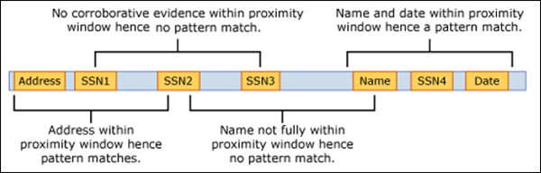

# Learn about sensitive information types

Know your data, in other words, identifying and classifying sensitive items that are under your organizations control is the first step in the [Information Protection discipline](protect-information.md).  Microsoft 365 provides three ways of identifying items so that they can be classified:

- manually by users
- automated pattern recognition, like sensitive information types
- [machine learning](classifier-learn-about.md)

Sensitive information types are pattern based classifiers which detect sensitive information like social security, credit card or bank account numbers to identify sensitive items, see [Sensitive information types entity definitions](sensitive-information-type-entity-definitions.md)

## Sensitive information types are used in

- [Data loss prevention policies](data-loss-prevention-policies.md) 
- [Sensitivity labels](sensitivity-labels.md)
- [Retention labels](retention.md)
- [Communication compliance](communication-compliance.md)
- [Auto-labelling policies](apply-sensitivity-label-automatically.md#how-to-configure-auto-labeling-for-office-apps)

## Fundamental parts of a sensitive information type

Every sensitive information type entity is defined by these fields:

- name: how the sensitive information type is referred to
- description: describes what the sensitive information type is looking for
- pattern: A pattern defines what a sensitive information type detects. It consists of the following components
    - Primary element – the main element which the sensitive information type is looking for. It can be a **regular expression** with or without a checksum validation, a **keyword list**, a **keyword dictionary**, or a **function**.
    - Supporting element – elements that act as supporting evidence that help in increasing the confidence of the match. For example, keyword “SSN” in proximity of an SSN number. It can be a regular expression with or without a checksum validation, keyword list, keyword dictionary.
    - Confidence Level - Confidence levels (high, medium, low) reflect how much supporting evidence was detected along with the primary element. The more supporting evidence an item contains, the higher the confidence that a matched item contains the sensitive info you're looking for.
    - Proximity – Number of characters between primary and supporting element



Learn more about confidence levels in this video


 > [!VIDEO https://www.microsoft.com/videoplayer/embed/RE4Hx60]  

### Example sensitive information type


## Argentina national identity (DNI) number

### Format

Eight digits separated by periods

### Pattern

Eight digits:
- two digits
- a period
- three digits
- a period
- three digits

### Checksum

No

### Definition

A DLP policy has medium confidence that it's detected this type of sensitive information if, within a proximity of 300 characters:
- The regular expression Regex_argentina_national_id finds content that matches the pattern.
- A keyword from Keyword_argentina_national_id is found.

```xml
<!-- Argentina National Identity (DNI) Number -->
<Entity id="eefbb00e-8282-433c-8620-8f1da3bffdb2" recommendedConfidence="75" patternsProximity="300">
   <Pattern confidenceLevel="75">
      <IdMatch idRef="Regex_argentina_national_id"/>
      <Match idRef="Keyword_argentina_national_id"/>
  </Pattern>
</Entity>
```

### Keywords

#### Keyword_argentina_national_id

- Argentina National Identity number 
- Identity 
- Identification National Identity Card 
- DNI 
- NIC National Registry of Persons 
- Documento Nacional de Identidad 
- Registro Nacional de las Personas 
- Identidad 
- Identificación 

### More on confidence levels

In a sensitive information type entity definition, **confidence level** reflects how much supporting evidence is detected in addition to the primary element. The more supporting evidence an item contains, the higher the confidence that a matched item contains the sensitive info you're looking for. For example, matches with a high confidence level will contain more supporting evidence in close proximity of the primary element, whereas matches with a low confidence level would contain little to no supporting evidence in close proximity. 

A high confidence level returns the fewest false positives but might result in more false negatives. Low or medium confidence levels returns more false positives but few to zero false negatives.

- **low confidence**: value of 65, matched items will contain the fewest false negatives but the most false positives.  
- **medium confidence**: value of 75, matched items will contain an average amount of false positives and false negatives.  
- **high confidence**: value of 85, matched items will contain the fewest false positives but the most false negatives.  

You should use high confidence level patterns with low counts, say five to ten, and low confidence patterns with higher counts, say 20 or more.

## Creating custom sensitive information types

To create custom sensitive information types in the Security & Compliance Center, you can choose from several options:

- **Use the UI** You can set up a custom sensitive information type using the Security & Compliance Center UI. With this method, you can use regular expressions, keywords, and keyword dictionaries. To learn more, see [Create a custom sensitive information type](create-a-custom-sensitive-information-type.md).

- **Use EDM** You can set up custom sensitive information types using Exact Data Match (EDM)-based classification. This method enables you to create a dynamic sensitive information type using a secure database that you can refresh periodically. See [Create a custom sensitive information type with Exact Data Match based classification](create-custom-sensitive-information-types-with-exact-data-match-based-classification.md).

- **Use PowerShell** You can set up custom sensitive information types using PowerShell. Although this method is more complex than using the UI, you have more configuration options. See [Create a custom sensitive information type in Security & Compliance Center PowerShell](create-a-custom-sensitive-information-type-in-scc-powershell.md).


> [!NOTE]
> Microsoft 365 Information Protection now  supports in preview double byte character set languages for:
> - Chinese (simplified)
> - Chinese (traditional)
> - Korean
> - Japanese

>This support is available for sensitive information types. See, [Information protection support for double byte character sets release notes (preview)](mip-dbcs-relnotes.md) for more information.

## For further information
- [Sensitive information type entity definitions](sensitive-information-type-entity-definitions.md)
- [Create a custom sensitive information type](create-a-custom-sensitive-information-type.md)
- [Create a custom sensitive information type in PowerShell](create-a-custom-sensitive-information-type-in-scc-powershell.md)

<!-- fwlink for this topic https://go.microsoft.com/fwlink/?linkid=2135644-->