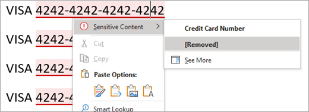
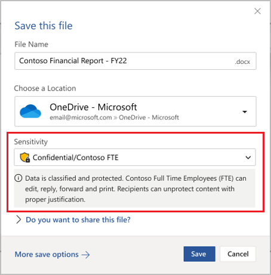

# Why choose built-in labeling over the AIP add-in for Office apps

>*[Microsoft 365 licensing guidance for security & compliance](/office365/servicedescriptions/microsoft-365-service-descriptions/microsoft-365-tenantlevel-services-licensing-guidance/microsoft-365-security-compliance-licensing-guidance).*

When you use [sensitivity labels](sensitivity-labels.md) in Microsoft 365 Apps on Windows computers, you have a choice of using labeling that's built into Office apps, or an add-in from the [Azure Information Protection (AIP) unified labeling client](/azure/information-protection/rms-client/aip-clientv2). 

Built-in labeling forms the cornerstone of a [Microsoft Purview information protection deployment](information-protection-solution.md) because this labeling technology extends across platforms (Windows, macOS, iOS, Android, and web), as well as across Microsoft apps and services, and beyond. Built-in labeling is also designed to work with other Microsoft Purview capabilities, such as data classification and Microsoft Purview data loss prevention (DLP).

Because built-in labels don't use an Office Add-in, they benefit from more stability and better performance. They also support the latest Microsoft Purview features, such as advanced classifiers.

By default, built-in labeling is turned off in Office for Windows apps when the AIP client is installed. You can change this default behavior by using the instructions in the following section, [How to disable the AIP add-in to use built-in labeling for Office apps](#how-to-disable-the-aip-add-in-to-use-built-in-labeling-for-office-apps).

When you keep the AIP client installed but disabled in Office apps, the other capabilities of the AIP client remain supported:

- Right-click options in File Explorer for users to apply labels to all file types.

- A viewer to display encrypted files for text, images, or PDF documents.

- A PowerShell module to discover sensitive information in files on premises, and apply or remove labels and encryption from these files.

- A scanner to discover sensitive information that's stored in on-premises data stores, and then optionally, label that content.

For more information about these capabilities that extend labeling beyond Office apps, see the [Azure Information Protection unified labeling client administrator guide](/azure/information-protection/rms-client/clientv2-admin-guide) from the AIP documentation.

Independently from labeling, you can continue to use the [AIPService](/powershell/module/aipservice) PowerShell module for tenant-level management of the encryption service. For example, configure super user access when you need to remove encryption for data recovery, track and revoke documents that have been opened by the AIP client, and configure the use license validity period for offline access. For more information, see [Administering protection from Azure Information Protection by using PowerShell](/azure/information-protection/administer-powershell).

## Decide whether to use built-in labeling for Office apps or the AIP add-in

Now that the AIP client is in [maintenance mode](https://techcommunity.microsoft.com/t5/security-compliance-and-identity/announcing-aip-unified-labeling-client-maintenance-mode-and/ba-p/3043613), we don't recommend you use the AIP add-in for Office apps for the following reasons:

- No new labeling features will be supported.
- Add-ins are less stable because they can conflict with other add-ins that can result in Office apps hanging, crashing, or automatically disabling the add-in.
- As an add-in, it runs more slowly, and can be disabled by users to bypass labeling requirements.
- Any bug fixes will require reinstalling the Azure Information Protection client.
- The labeling experience for users is slightly different from built-in labels that users have on their other devices (macOS, iOS, Android), and when they use Office for the web. This difference can increase costs for training and support.
- There are already new Office labeling features released that are [only supported by built-in labeling](#features-supported-only-by-built-in-labeling-for-office-apps), and the list is growing all the time.

Use the AIP add-in for your Windows Office apps only if you've already deployed it to users and you need time to migrate them to built-in labeling. Or, users need a feature that isn't supported by built-in labeling. Use the [feature parity information](#feature-parity-for-built-in-labeling-and-the-aip-add-in-for-office-apps) on this page to help you identify these features.

## Features supported only by built-in labeling for Office apps

> [!NOTE]
> Many new labeling features are in planning or development, so expect the list in this section to grow over time.

Some features are only supported by built-in labeling for Office apps, and won't be supported by the AIP add-in. These include:

- For automatic and recommended labeling:
    - Access to intelligent classification services that include [trainable classifiers](classifier-learn-about.md), [exact data match (EDM)](sit-learn-about-exact-data-match-based-sits.md), and [named entities](named-entities-learn.md)
    - Detection of sensitive information as users type
    - In Word, users can review and remove the identified sensitive content
- [Sensitivity bar](sensitivity-labels-office-apps.md#sensitivity-bar) is integrated into existing user workflows
- [PDF support](sensitivity-labels-office-apps.md#pdf-support)
- For labels that let users assign permissions, different permissions (Read or Change) can be granted to users or groups
- Encrypt-Only for emails
- Visibility of labels on the status bar (Will be replaced with the sensitivity bar on the window title.)
- Support for account switching
- Users can't disable labeling

Example showing how users can review and optionally remove identified sensitive content in Word:

Example showing how sensitivity labels are integrated into user workflows:

To keep informed when new labeling capabilities become available for built-in labeling, see [What's new in Microsoft Purview](whats-new.md) and the **Sensitivity labels** sections.

## How to disable the AIP add-in to use built-in labeling for Office apps

When you've installed the AIP client to extend labeling beyond Office apps but want to prevent the client's add-in from loading in Office apps, use the Group Policy setting **List of managed add-ins** as documented in [No Add-ins loaded due to group policy settings for Office 2013 and Office 2016 programs](https://support.microsoft.com/help/2733070/no-add-ins-loaded-due-to-group-policy-settings-for-office-2013-and-off).

For your Windows Office apps that support built-in labeling, use the configuration for Microsoft Word 2016, Excel 2016, PowerPoint 2016, and Outlook 2016, specify the following programmatic identifiers (ProgID) for the AIP client, and set the option to **0: The add-in is always disabled (blocked)**

|Application  |ProgID  |
|---------|---------|
|Word     |     `MSIP.WordAddin`    |
|Excel     |  `MSIP.ExcelAddin`       |
|PowerPoint     |   `MSIP.PowerPointAddin`      |
|Outlook | `MSIP.OutlookAddin` |
| | | 

Deploy this setting by using Group Policy, or by using the [Office cloud policy service](/DeployOffice/overview-office-cloud-policy-service).

> [!IMPORTANT]
> If you use the Group Policy setting **Use the Sensitivity feature in Office to apply and view sensitivity labels** and set this to **1**, there are some situations where the AIP add-in might still load in Office apps. Blocking the add-in from loading in each app prevents this happening.

Alternatively, you can interactively disable or remove the **Microsoft Azure Information Protection** Office Add-in from Word, Excel, PowerPoint, and Outlook. This method is suitable for a single computer, and ad-hoc testing. For instructions, see [View, manage, and install add-ins in Office programs](https://support.office.com/article/16278816-1948-4028-91e5-76dca5380f8d).

Whichever method you choose, the changes take effect when Office apps restart.

If after making these changes the **Sensitivity** button doesn't display on the Office ribbon, check whether sensitivity labeling has been [turned off](sensitivity-labels-office-apps.md#if-you-need-to-turn-off-built-in-labeling-in-office-apps-on-windows). Although this isn't the default configuration, an administrator might have explicitly set this configuration by using Group Policy or by directly editing the registry.

> [!NOTE]
> Built-in labels require a subscription edition of Office apps. If you have standalone editions of Office, sometimes called "Office Perpetual", we recommend you upgrade to Microsoft 365 Apps for Enterprise to benefit from the [latest labeling capabilities](sensitivity-labels-office-apps.md#support-for-sensitivity-label-capabilities-in-apps).

Remember, when you use this method to disable the AIP add-in, you can still use the AIP client to extend labeling beyond Office apps.

## Feature parity for built-in labeling and the AIP add-in for Office apps

Many of the labeling features supported by the AIP add-in are now supported by built-in labeling. For a more detailed list of capabilities, minimum versions that might be needed, and configuration information, see [Manage sensitivity labels in Office apps](sensitivity-labels-office-apps.md).

More features are planned and in development. If there's a specific feature that you're interested in, check the [Microsoft 365 roadmap](https://www.microsoft.com/microsoft-365/roadmap?filters=Microsoft%20Information%20Protection&searchterms=label) and consider joining the [Microsoft Information Protection in Office Private Preview](https://aka.ms/MIP/PreviewRing).

Use the following information to help you identify if you're using a feature from the AIP add-in that isn't yet supported by built-in labeling:

|AIP add-in feature or capability|Built-in labeling |
|:-------------------------------|:----------------:|
|**Category: General** ||
|Central reporting and auditing|  [Learn more](sensitivity-labels-office-apps.md#auditing-labeling-activities) |
|Government Cloud||
|Admin can disable labeling   - All apps|    [Learn more](sensitivity-labels-office-apps.md#if-you-need-to-turn-off-built-in-labeling-in-office-apps-on-windows)|
|Admin can disable labeling   - Per app|  In planning or development|
|**Category: User Experience** ||
|Labeling button on the ribbon||
|Multilanguage support for label names and tooltips|   [Learn more](create-sensitivity-labels.md#example-configuration-to-configure-a-sensitivity-label-for-different-languages) |
|Visibility of labels on a toolbar|   [Learn more](sensitivity-labels-office-apps.md#sensitivity-bar) |
|Label colors|   [Learn more](sensitivity-labels-office-apps.md#label-colors) |
|**Category: Labeling actions** ||
|Manual labeling |    [Learn more](https://support.microsoft.com/office/apply-sensitivity-labels-to-your-files-and-email-in-office-2f96e7cd-d5a4-403b-8bd7-4cc636bae0f9) |
|Mandatory labeling |   [Learn more](sensitivity-labels.md#what-label-policies-can-do)|
|Default labeling   - New and existing items   - Separate settings for email|    [Learn more](sensitivity-labels.md#what-label-policies-can-do) |
|Recommended or automatic |  [Learn more](apply-sensitivity-label-automatically.md#how-to-configure-auto-labeling-for-office-apps) |
|Downgrade justification |    [Learn more](sensitivity-labels.md#what-label-policies-can-do)|
| **Category: Visual markings** | |
|Headers, footers, watermark|   [Learn more](sensitivity-labels.md#what-label-policies-can-do)|
|Dynamic markings|   [Learn more](sensitivity-labels-office-apps.md#dynamic-markings-with-variables)|
|Per app visual marking|   [Learn more](sensitivity-labels-office-apps.md#setting-different-visual-markings-for-word-excel-powerpoint-and-outlook)|
| **Category: Encryption** | |
|Admin-defined permissions |   [Learn more](encryption-sensitivity-labels.md#assign-permissions-now) |
|User-defined permissions   - Do Not Forward for Outlook   - User and group custom permissions for Word, Excel, PowerPoint|   [Learn more](encryption-sensitivity-labels.md#let-users-assign-permissions)|
|User-defined permissions   - Organization-wide custom permissions by specifying domains for Word, Excel, PowerPoint | [In preview](encryption-sensitivity-labels.md#support-for-organization-wide-custom-permissions) |
|Co-authoring and AutoSave |   [Learn more](sensitivity-labels-coauthoring.md) |
|Double key encryption | In planning or development |
|Document revocation for users | Under review |
| | |

### Support for PowerShell advanced settings

The AIP client supports many customizations by using [PowerShell advanced settings](/azure/information-protection/rms-client/clientv2-admin-guide-customizations#configuring-advanced-settings-for-the-client-via-powershell). Some of these advanced settings are now supported by built-in labeling, as documented in [New-Label](/powershell/module/exchange/new-label) or [Set-Label](/powershell/module/exchange/set-label), and [New-LabelPolicy](/powershell/module/exchange/new-labelpolicy) or [Set-LabelPolicy](/powershell/module/exchange/set-labelpolicy).

However, you might find you don't need to use PowerShell to configure the supported settings because they're included in the standard configuration from the Microsoft Purview compliance portal. For example, the ability to turn off mandatory labeling for Outlook and set a different default label.

The following configurations from the AIP add-in aren't yet supported by built-in labeling include:

- [Label inheritance from email attachments](/azure/information-protection/rms-client/clientv2-admin-guide-customizations#for-email-messages-with-attachments-apply-a-label-that-matches-the-highest-classification-of-those-attachments)
- [S/MIME for Outlook](/azure/information-protection/rms-client/clientv2-admin-guide-customizations#configure-a-label-to-apply-smime-protection-in-outlook)
    - This setting is starting to [roll out in preview for built-in labeling across all platforms](sensitivity-labels-office-apps.md#configure-a-label-to-apply-smime-protection-in-outlook)
- [Oversharing popup messages for Outlook](/azure/information-protection/rms-client/clientv2-admin-guide-customizations#implement-pop-up-messages-in-outlook-that-warn-justify-or-block-emails-being-sent)
- [Default sublabel for a parent label](/azure/information-protection/rms-client/clientv2-admin-guide-customizations#specify-a-default-sublabel-for-a-parent-label)
- [Remove external content markings](/azure/information-protection/rms-client/clientv2-admin-guide-customizations#remove-headers-and-footers-from-other-labeling-solution )

## Features not planned to be supported by built-in labeling for Office apps

Although new capabilities for built-in labeling are being added all the time, the AIP Office Add-in supports the following capabilities that aren't planned to be available in future releases for built-in labeling:

- Application of labels to Microsoft Office 97-2003 formats, such as .doc files
- Local usage logging to the Windows event log
- Permanently disconnected computers
- Standalone editions of Office (sometimes called "Office Perpetual") rather than subscription-based

## Next steps

For instructions to create and configure these labeling capabilities, see [Create and configure sensitivity labels and their policies](create-sensitivity-labels.md).

> [!TIP]
> If you already have sensitivity labels in the Microsoft Purview compliance portal, you won't be eligible for the automatic creation of default labels. However, you might still find it useful to reference their configuration: [Default sensitivity labels](mip-easy-trials.md#default-sensitivity-labels). 
