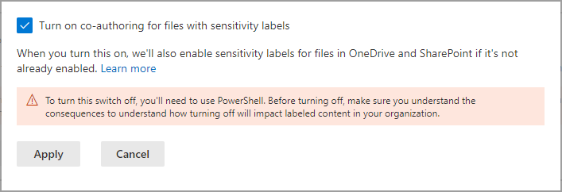
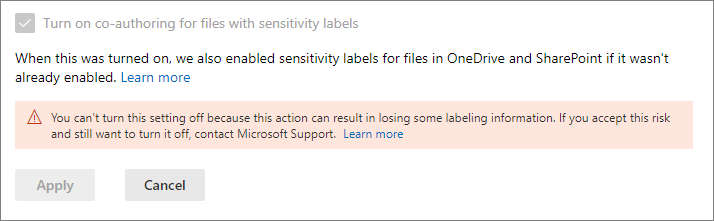

# Enable co-authoring for files encrypted with sensitivity labels

>*[Microsoft 365 licensing guidance for security & compliance](/office365/servicedescriptions/microsoft-365-service-descriptions/microsoft-365-tenantlevel-services-licensing-guidance/microsoft-365-security-compliance-licensing-guidance).*

> [!NOTE]
> This feature is in preview and subject to change. 
>
> Enable this feature in a test tenant rather than a production tenant because:
> - This feature makes changes to labeling metadata and not all apps on all platforms currently support this change
> - You cannot disable this feature yourself after it is enabled

Enable the setting to support [co-authoring](https://support.office.com/article/ee1509b4-1f6e-401e-b04a-782d26f564a4) for Office desktop apps so that when documents are labeled and encrypted by [sensitivity labels](sensitivity-labels.md), multiple users can edit these documents at the same time.

Without this setting enabled for your tenant, users must check out an encrypted document stored in SharePoint or OneDrive when they use Office desktop apps. As a result, they can't collaborate in real time. Or, they must use Office on the web when [sensitivity labels are enabled for Office files in SharePoint and OneDrive](sensitivity-labels-sharepoint-onedrive-files.md).

In addition, enabling this functionality results in the [AutoSave](https://support.office.com/article/what-is-autosave-6d6bd723-ebfd-4e40-b5f6-ae6e8088f7a5) functionality being supported for these labeled and encrypted files.

To read the release announcement, see the blog post [Announcing co-authoring on Microsoft Information Protection-encrypted documents and labeling updates](https://techcommunity.microsoft.com/t5/microsoft-security-and/announcing-co-authoring-on-microsoft-information-protection/ba-p/2164162).

## Metadata changes for sensitivity labels

> [!IMPORTANT]
> After you enable the setting for co-authoring, labeling information for unencrypted files is no longer saved in custom properties.
> 
> Do not enable this setting if you use any apps, services, scripts, or tools that reads or writes labeling metadata to the old location.

Before you enable the setting to support co-authoring for Office desktop apps, it's important to understand that this action makes changes to the labeling metadata that is saved to and read from Office files.

The labeling metadata includes information that identifies your tenant and applied sensitivity label. The change that this setting makes is the metadata format and location for unencrypted files for Word, Excel, and PowerPoint. There are no labeling metadata changes for encrypted files or emails.

This change affects both files that are newly labeled and files that are already labeled. When you use apps and services that support the co-authoring setting:
- For files that are newly labeled, only the new format and location is used for the labeling metadata.
- For files that are already labeled, the next time the file is opened and saved, if the file has metadata in the old format and location, it is copied to the new format and location.

You can read more about this metadata change from the following resources:

- Blog post: [Upcoming Changes to Microsoft Information Protection Metadata Storage](https://techcommunity.microsoft.com/t5/microsoft-security-and/upcoming-changes-to-microsoft-information-protection-metadata/ba-p/1904418)

- Open Specifications: [2.6.3 LabelInfo versus Custom Document Properties](/openspecs/office_file_formats/ms-offcrypto/13939de6-c833-44ab-b213-e0088bf02341)

Because of these changes, do not enable this setting if you have any apps, services, scripts, or tools in your organization that reads or writes labeling metadata to the old location. If you do, some example consequences:

- A document that is labeled appears to users to be unlabeled

- A document displays an out-of-date label to users

- Co-authoring and AutoSave won't work for a labeled and encrypted document if another user has it open in an Office desktop app that doesn't support the new labeling metadata

- An Exchange Online mail flow rule that [identifies labels as custom properties in Office attachments](/azure/information-protection/configure-exo-rules#example-2-rule-that-applies-the-encrypt-only-option-to-emails-when-they-have-attachments-that-are-labeled-confidential--partners-and-these-emails-are-sent-outside-the-organization) fails to encrypt the email and attachment, or incorrectly encrypts them

Check the following section for a list of apps and services that support this setting and the changes to the labeling metadata.

## Prerequisites

Make sure you understand the following prerequisites before you turn on this feature.

- You must use a test tenant for this preview.

- You must be a global admin to turn on this feature.

- Sensitivity labels must be [enabled for Office files in SharePoint and OneDrive](sensitivity-labels-sharepoint-onedrive-files.md) for the tenant. If this feature isn't already enabled, it will be automatically enabled when you select the setting to turn on co-authoring for files with sensitivity labels.

- Microsoft 365 Apps for enterprise:
    - **Windows**: Preview: [Current Channel (Preview)](https://office.com/insider)
    - **macOS**: Preview: [Beta Channel](https://office.com/insider)
    - **iOS**: Not yet supported
    - **Android**: Not yet supported

- All apps, services, and operational tools in your tenant must support the new [labeling metadata](#metadata-changes-for-sensitivity-labels). If you use any of the following, check the minimum versions required:
    
    - **Azure Information Protection unified labeling client and scanner:**
        - A public preview version (installation name of AzInfoProtection_2.10.46_CoAuthoring_PublicPreview.exe) that you can install from the [Microsoft Download Center](https://www.microsoft.com/en-us/download/details.aspx?id=53018)
    
    - **OneDrive sync app for Windows or macOS:**
        - Minimum version of 19.002.0121.0008
    
    - **Endpoint data loss prevention (Endpoint DLP):**
        - Windows 10 1809 with KB 4601383
        - Windows 10 1903 and 1909 with KB 4601380
        - Windows 10 2004 with KB 4601382
    
    - **Apps and services that use the Microsoft Information Protection SDK:** 
        - Minimum version of 1.7 

Microsoft 365 services automatically support the new labeling metadata when you turn on this feature. For example:

- [Auto-labeling policies](apply-sensitivity-label-automatically.md#how-to-configure-auto-labeling-policies-for-sharepoint-onedrive-and-exchange)
- [DLP policies that use sensitivity labels as conditions](dlp-sensitivity-label-as-condition.md)
- [Microsoft Cloud App Security configured to apply sensitivity labels](/cloud-app-security/best-practices#discover-classify-label-and-protect-regulated-and-sensitive-data-stored-in-the-cloud)

## Limitations

Before you enable the tenant setting for co-authoring for files encrypted with sensitivity labels, make sure you understand the following limitations of this feature.

- Because of the [labeling metadata changes](#metadata-changes-for-sensitivity-labels), all apps, services, and operational tools in your tenant must support the new labeling metadata for a consistent and reliable labeling experience.
    
    Specific to Excel: Metadata for a sensitivity label that doesn't apply encryption can be deleted from a file if somebody edits and saves that file by using a version of Excel that doesn't support the metadata changes for sensitivity labels.

- Co-authoring and AutoSave aren't supported and don't work for labeled and encrypted Office documents that use any of the following [configurations for encryption](encryption-sensitivity-labels.md#configure-encryption-settings):
    - **Let users assign permissions when they apply the label** and the checkbox **In Word, PowerPoint, and Excel, prompt users to specify permissions** is selected. This configuration is sometimes referred to as "user-defined permissions".
    - **User access to content expires** is set to a value other than **Never**.
    - **Double Key Encryption** is selected.
    
    For labels with any of these encryption configurations, the labels display in Office apps. However, when users select these labels and nobody else is editing the document, they are warned that co-authoring and AutoSave won't be available. If somebody else is editing the document, users see a message that the labels can't be applied.

- If you use the Azure Information Protection unified labeling client: Check the documentation for this labeling client for [more requirements or limitations](/azure/information-protection/known-issues#known-issues-for-co-authoring-public-preview).

## Known issues for this preview

This preview version of co-authoring for files encrypted with sensitivity labels has the following known issues:

- Users won't be able to apply any labels in Office for the web for Word, Excel, and PowerPoint files that are bigger than 300 MB. For these files, you can use the Office desktop apps to apply a label but you must be the only person who has the file open.

- When you use [DLP policies that use sensitivity labels as conditions](dlp-sensitivity-label-as-condition.md), unencrypted attachments for emails are not supported.

- Some documents are incompatible with sensitivity labels because of features such as [password-protection](https://support.microsoft.com/office/require-a-password-to-open-or-modify-a-workbook-10579f0e-b2d9-4c05-b9f8-4109a6bce643), [shared workbooks](https://support.microsoft.com/office/about-the-shared-workbook-feature-49b833c0-873b-48d8-8bf2-c1c59a628534), or content that includes ActiveX controls. Other reasons are documented in [Troubleshoot co-authoring in Office](https://support.microsoft.com/office/troubleshoot-co-authoring-in-office-bd481512-3f3a-4b6d-b7eb-ebf9d3626ae7). For these documents, you see a message **UPLOAD FAILED** and should select the **Discard Changes** option. Until this issue is addressed, do not label these documents that are identified with this failure message.

- Office apps for iOS and Android are not supported.

## How to enable co-authoring for files with sensitivity labels

> [!CAUTION]
> Turning on this setting is a one-way action. While the feature is in preview, test it only in a non-production environment and only after you have read and understood the metadata changes, prerequisites, limitations, and any known issues documented on this page.

During the preview, you must use a specific URL to access this setting in the Microsoft 365 compliance center.

1. Sign in to the Microsoft 365 compliance center as a global admin for your test tenant, using the following link:
    
    ```http
    https://compliance.microsoft.com/co-authoring_for_files_with_sensitivity_labels
    ```
    This link takes you directly to the tenant setting, **Co-authoring for files with sensitivity labels**.

    > [!IMPORTANT]
    > Before you continue, check you're signed in to a test tenant that won't affect your users: 
    >
    > Select the circle with your account initials in the top right of the compliance center, and confirm that the tenant name does display your intended test tenant.
    
2. Read the summary description, prerequisites, what to expect, and the warning that you can't turn off this setting after you've turned it on. Then select **Turn on co-authoring for files with sensitivity labels**, and **Apply**:
    
    

3. Wait 24 hours for this setting to replicate across your environment before you test this new feature for co-authoring.

## Contact Support if you need to disable this feature

> [!IMPORTANT]
> If you do need to disable this feature, be aware that labeling information can be lost.

After you've enabled co-authoring for files with sensitivity labels for your tenant, you can't disable this setting yourself. That's why it's so important that you check and understand the prerequisites, consequences, and limitations before you enable this setting. It's also why we recommend that you test this feature with a test tenant rather than a production tenant.



As you see from the screenshot when this setting has been turned on, you can contact [Microsoft Support](../business-video/get-help-support.md) and request to turn off this setting. This request might take several days and you will need to prove that you are a global administrator for your tenant. Expect usual support charges to apply. 

If a support engineer disables this setting for your tenant:

- For apps and services that support the new labeling metadata, they now revert to the original metadata format and location when labels are read or saved.

- The new metadata format and location for Office documents that were used while the setting was enabled will not be copied to the original format and location. As a result, this labeling information for unencrypted Word, Excel, and PowerPoint files will be lost.

- Co-authoring and AutoSave no longer work in your tenant for labeled and encrypted documents.

- Sensitivity labels remain enabled for Office files in OneDrive and SharePoint.