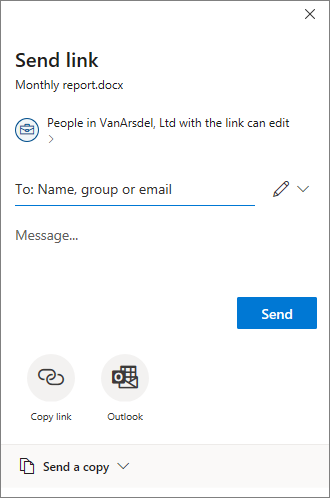

# Use sensitivity labels to configure the default sharing link type for sites and documents in SharePoint and OneDrive

>*[Microsoft 365 licensing guidance for security & compliance](/office365/servicedescriptions/microsoft-365-service-descriptions/microsoft-365-tenantlevel-services-licensing-guidance/microsoft-365-security-compliance-licensing-guidance).*

As an additional configuration to the settings you see in the Microsoft Purview compliance portal for [sensitivity labels](sensitivity-labels.md), you can use these labels to configure settings for the default sharing link type for a SharePoint site or OneDrive account, and for individual documents. These settings are automatically selected, but not highly visible to users when they select the **Share** button in their Office apps. As an example:



The default sharing link type sets the scope (who) and permissions (view or edit) that are automatically selected when users share files and folders. Although users can always override these default settings before sending the sharing link, the settings you choose provide a safe baseline. Typically, users don't change the settings before sharing.

At the site level (SharePoint site or OneDrive account), sensitivity labels provide a convenient alternative for setting the default sharing link type that can be configured for a site in the SharePoint admin center. For more information, see [Change the default link type for a site](/sharepoint/change-default-sharing-link) from the SharePoint documentation.

This site-level configuration works well for SharePoint sites that have documents all with the same level of sensitivity. But if sites contain some documents that have a higher level of sensitivity that require more restrictive settings, you can configure a sensitivity label with different settings for the default sharing link type, and then apply this label to documents.

In this scenario where the site has default sharing link type settings, and a document in that site has different default link type settings, the more restrictive scope settings will be applied at the time the user selects the sharing option for the document. For example:

- The default sharing link type for the site is scoped to anybody in your organization. A document in that site is labeled with the default sharing link type set to specific people. When a user shares that document, the default sharing link type selected will be scoped to specific people.

- The default sharing link type for the site is scoped to specific people, with edit permissions. A document in that site is labeled with the default sharing link type set to anybody in the organization, with view permissions. When a user shares that document, the default sharing link type selected will be scoped to specific people with edit permissions.

Configuring the default link type for documents might also be appropriate without the site-level setting. For example, although SharePoint sites are typically organized to host the same type of documents, that isn't the case for OneDrive accounts. Users typically save a wide range of files to OneDrive, often including a mix of personal and business documents. Setting a default link type for all documents for a user's OneDrive account is probably not practical, but individual documents can still benefit from these settings. For example:

- Documents labeled **Highly Confidential** have a default sharing link type that restricts sharing to specific people rather than anybody in the organization.
- Documents labeled **General** have a default sharing link type that restricts sharing to people in your organization.
- Documents labeled **Personal** have a default sharing link type that allows sharing to anyone with the link.

## Prerequisites

To apply the default sharing link type for sites, sensitivity labels must be enabled for containers. If this capability isn't yet enabled for your tenant, see [How to enable sensitivity labels for containers and synchronize labels](sensitivity-labels-teams-groups-sites.md#how-to-enable-sensitivity-labels-for-containers-and-synchronize-labels).

To apply the default sharing link type for documents in SharePoint and OneDrive, sensitivity labels must be enabled for these services. If this capability isn't yet enabled for your tenant, see [How to enable sensitivity labels for SharePoint and OneDrive (opt-in)](sensitivity-labels-sharepoint-onedrive-files.md#how-to-enable-sensitivity-labels-for-sharepoint-and-onedrive-opt-in).

In a PowerShell session, you must [connect to Security & Compliance PowerShell](/powershell/exchange/office-365-scc/connect-to-scc-powershell/connect-to-scc-powershell) to configure the settings for the default sharing link type.

> [!NOTE]
> Although not required, it's easiest to first [create and configure sensitivity labels in the Microsoft Purview compliance portal](create-sensitivity-labels.md), and then modify these labels with the settings that configure the default sharing link type.

## How to configure settings for the default sharing link type

The configuration settings for the default sharing link type use the PowerShell *AdvancedSettings* parameter with the [Set-Label](/powershell/module/exchange/set-label) and [New-Label](/powershell/module/exchange/new-labelpolicy) cmdlets from [Security & Compliance PowerShell](/powershell/exchange/scc-powershell):

- **DefaultSharingScope**: The available values are:
    - **SpecificPeople**: Sets the default sharing link to specific people (only the people the user specifies)
    - **Organization**: Sets the default sharing link for only people in your organization
    - **Anyone**: Sets the default sharing link to anyone with the link, which is equivalent to anonymous access

- **DefaultShareLinkPermission**:  The available values are:
    - **View**: Sets the default link permission to view permissions
    - **Edit**: Sets the default link permission to edit permissions

These two settings and values are the equivalent of the parameters *DefaultSharingScope* and *DefaultShareLinkPermission* from the [Set-SPOSite](/powershell/module/sharepoint-online/set-sposite) cmdlet.

Another configuration for the default sharing link type is to use the **DefaultShareLinkToExistingAccess** advanced setting, which is the equivalent of the parameter *DefaultLinkToExistingAccess* from the [Set-SPOSite](/powershell/module/sharepoint-online/set-sposite) cmdlet. When you set this value to **True**, it overrides the other two advanced settings and their values.

PowerShell examples, where the sensitivity label GUID is **8faca7b8-8d20-48a3-8ea2-0f96310a848e**:

- To set the default sharing link type to SpecificPeople:
    
    ````powershell
    Set-Label -Identity 8faca7b8-8d20-48a3-8ea2-0f96310a848e -AdvancedSettings @{DefaultSharingScope="SpecificPeople"}
    ````

- To set the default sharing link type permissions to Edit:
    
    ````powershell
    Set-Label -Identity 8faca7b8-8d20-48a3-8ea2-0f96310a848e -AdvancedSettings @{DefaultShareLinkPermission="Edit"}
    ````

- To set the default sharing link type to people with existing access:
    
    ````powershell
    Set-Label -Identity 8faca7b8-8d20-48a3-8ea2-0f96310a848e -AdvancedSettings @{DefaultShareLinkToExistingAccess="True"}
    ````

For more help to specify PowerShell advanced settings, see [PowerShell tips for specifying the advanced settings](create-sensitivity-labels.md#powershell-tips-for-specifying-the-advanced-settings).

To configure the settings for the default sharing link type for a site, the [scope of the sensitivity label](sensitivity-labels.md#label-scopes) must include **Groups & sites** when you create the sensitivity label in the Microsoft Purview compliance portal. After it's created, you see this displayed as **Site, UnifiedGroup** in the **Scope** column on the **Labels** page, and the PowerShell *ContentType* setting also displays this same value. For documents, the scope must include **Items**, which displays as **File, Email**. Then:

- When the scope includes **Groups & sites**, you can apply the label to a site, which sets the default sharing link type for that site. For information how to apply a sensitivity label to a site, see [How to apply sensitivity labels to containers](sensitivity-labels-teams-groups-sites.md#how-to-apply-sensitivity-labels-to-containers).

- When the scope of the sensitivity label includes **Items**, you can apply the label to documents, which sets the default sharing link type for that document. The label can be applied [manually](https://support.microsoft.com/office/apply-sensitivity-labels-to-your-files-and-email-in-office-2f96e7cd-d5a4-403b-8bd7-4cc636bae0f9) or [automatically](apply-sensitivity-label-automatically.md).

> [!TIP]
> You can also specify that the label is the default sensitivity label to be applied for new sites or new documents, as a [label policy setting](sensitivity-labels.md#what-label-policies-can-do).
