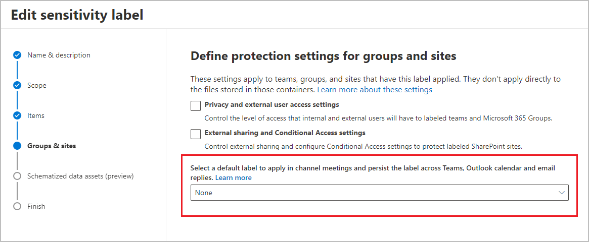

# Use sensitivity labels to protect calendar items, Teams meetings, and chat

>*[Microsoft 365 licensing guidance for security & compliance](/office365/servicedescriptions/microsoft-365-service-descriptions/microsoft-365-tenantlevel-services-licensing-guidance/microsoft-365-security-compliance-licensing-guidance).*

> [!NOTE]
> You won't be able to configure all the options referenced on this page if a [Teams Premium license](/MicrosoftTeams/enhanced-teams-experience) isn't found for your tenant. For those settings, you'll see an information bar in the Microsoft Purview compliance portal that your organization doesn't have this license.

In addition to using [sensitivity labels](sensitivity-labels.md) to protect documents and emails, you can extend sensitivity labels to protect meeting invites and responses that use Outlook and Teams, and to protect Teams meetings and chat:

- Meeting organizers apply a sensitivity label to meeting invites from Outlook or Teams. Recipients in your organization see the sensitivity label and all recipients see any headers or footers as configured content markings. Optionally, the meeting invite can be encrypted so only authorized people can see it and access the meeting link. Usage rights can further restrict access, for example, preventing the invite from being forwarded.
    
    The encryption works similarly to how you can apply a label with encryption to an email. As with [email encryption](ome.md), if recipients aren't using an email client that can decrypt this meeting invite, they're directed to Outlook on the web or the encryption portal where they can read the invite and access the meeting link.

- When the meeting starts, any meeting options configured in the label are enforced. For example, who can bypass the lobby, present, and prevent copying from the chat.

- Participants from your organization see the label during the Teams meetings. Any meeting settings applied by the label can't be changed directly in Teams. When a label enforces these settings, users see a lock and message that explains the settings are applied by a sensitivity label.

Meeting settings that you can apply with a sensitivity label

- Who can bypass the lobby
- Who can present
- Who can record
- Encryption for meeting video and audio
- Automatically record
- Video watermark for screen sharing and camera streams
- Prevent copy of meeting chat
- Prevent or allow copying chat contents to the clipboard

Users can apply sensitivity labels to meeting invites when they use Outlook or Teams:

- For Outlook, applying, changing, and viewing sensitivity labels for meeting invites and appointments are supported with Outlook on the web, and with minimum versions of Windows and  macOS. For other versions, platforms, and email clients, encrypted meeting invites can be opened in the same way as encrypted email.

- For Teams, applying, changing, and viewing sensitivity labels for meeting invites are supported with Teams on the web, and with minimum versions of Windows and  macOS.

For more information about those minimum versions, see the [Requirements](#requirements) section.

Example showing a Teams meeting invite that has the label **Highly confidential**, and the label applies encryption settings that prevent the invite from being forwarded:

[!INCLUDE [purview-preview](../includes/purview-preview.md)]

## Requirements

To apply a sensitivity label to meeting invites and appointments using Outlook, users must use Outlook on the web from a desktop computer, or use built-in labeling from Microsoft 365 Apps for enterprise:

- **Outlook for Windows**: Current Channel, version 2302+
- **Outlook for Mac**: Version 16.70+

The AIP add-in for Outlook doesn't support applying labels to meeting invites.

To apply a sensitivity label to meeting invites using Teams, enforce meeting options and chat, and display and change sensitivity labels in Teams non-channel meetings, users must use Teams on the web with Edge or Chrome, or one of the following Teams desktop clients:

- **Teams client for Windows**: 1.5.00.32158+
- **Teams client for macOS**: 1.5.00.32154+

> [!IMPORTANT]
> If meeting participants or organizers don't use a Teams client that meets these requirements, the configured label meeting options can't be enforced for these users.

Sensitivity labels that apply [S/MIME protection](sensitivity-labels-office-apps.md#configure-a-label-to-apply-smime-protection-in-outlook) or [Double Key Encryption (DKE)](encryption-sensitivity-labels.md#double-key-encryption) can't be used to protect calendar items, Teams meetings, and chat.

## Limitations

- Preventing copying chat has some limitations that are listed in the [Prevent copying chat to the clipboard label setting](#prevent-copying-chat-to-the-clipboard-label-setting) section on this page.

- Calendar items don't support label encryption that uses S/MIME or Double Key Encryption. You must use the default encryption that uses the Azure Rights Management service from Azure Information Protection, with either admin-defined permissions (the option **Assign permissions now**) or user-defined permissions (the option **Let users assign permissions**).

- Automatic and recommended labeling isn't supported.

- iOS and Android mobile devices don't support labeling calendar items and Teams meetings.

**Specific to Outlook:**

- No support for mailboxes on-premises; user mailboxes must be in Exchange Online.

- No support for group calendar meeting invites; participants must be specific users.

- As with labeled and encrypted email, if somebody forwards a meeting invite from an email client other than Outlook, any applied encryption persists but information about the sensitivity label is removed from the email headers.

- When a mobile email client receives a labeled and encrypted meeting invite, the invite message is decrypted inline if the client supports encrypted email. However, in the calendar, the invite can't be decrypted inline and displays a link to view it in the encryption portal.

- Shared calendars:
    
    - When a user shares their calendar with others, only the calendar owner can create and change sensitivity labels for meetings in that calendar.
    - A shared mailbox calendar doesn't support applying and changing sensitivity labels for meetings.

- For a meeting series:
    
    - The organizer can apply a sensitivity label for the meeting series but not to individual occurrences.
    - Exceptions for a meeting series will be labeled (and encrypted if applicable) only if they're created after the label is applied to the meeting series. Existing exceptions, including those in the future, won't be labeled.
    - If the organizer changes the meeting body or attachments for a meeting series after it's encrypted by a sensitivity label, existing exceptions won't be updated with those changes.
    - If the organizer changes any meeting attributes (such as start date, end date, location, the meeting body, or attachments) for a specific occurrence in a series after it's encrypted by a sensitivity label, this action automatically creates an exception for the series with the same label for the meeting series.

**Specific to Teams**:

- Labels configured for [other languages](create-sensitivity-labels.md#additional-label-settings-with-security--compliance-powershell) aren't supported for the [classic Teams client](https://support.microsoft.com/office/try-the-new-microsoft-teams-2d4a0c96-fa52-43f8-a006-4bfbc62cf6c5), and display the original language only. This limitation doesn't apply for the new Teams client.

- For iOS and Android, the label isn't displayed in the calendar but is displayed when the user joins the meeting.

- While a meeting is in session, a sensitivity label can't prevent participants from inviting people to join  by copying the meeting link, or by sharing via default email or the Outlook calendar. These choices are from the Teams meeting  **Share invite** option.

- If there's a label change made in Teams while the meeting is progress, any changes to the following meeting options won't take effect for the current meeting unless the organizer ends and restarts the meeting:
    - Who can record
    - Encryption for meeting video and audio
    - Automatically record
    - Video watermark for screen sharing and camera streams

- The following meeting options won't take effect for a Meet Now meeting:
    - Who can record
    - Encryption for meeting video and audio
    - Automatically record
    - Video watermark for screen sharing and camera streams

- Sensitivity labels can't be applied to live events and webinars.

- Labeling meeting invites with Graph APIs isn't supported.

## How to configure a sensitivity label to protect calendar items, Teams meetings, and chat

1. Follow the general instructions to [create or edit a sensitivity label](create-sensitivity-labels.md#create-and-configure-sensitivity-labels) and make sure **Items** is selected for the [label's scope](sensitivity-labels.md#label-scopes), and also the options for **Files**, **Emails**, and **Meetings**: 
    
    :::image type="content" source="../media/itemswithmeetings-scope-options-sensitivity-label.png" alt-text="Sensitivity label scope options for Items that include Files, Emails, and Meetings.":::

2. On the **Choose protection settings for labeled items** page:
    - Select **Apply or remove encryption** if you want to encrypt meeting invites and responses, and any Office attachment in that calendar item
    - Select **Apply content marking** if you want to add headers or footers to meeting invites and responses
    - Select **Protect Teams meetings and chat** to display the label in Teams meetings and enforce Teams-specific settings for the Teams meeting itself and chat messages

3. On the subsequent pages, configure settings for the options you've selected.
    
    For more information about configuring encryption for meeting invites, see [Restrict access to content by using sensitivity labels to apply encryption](encryption-sensitivity-labels.md).
    
    For more information about the headers and footers that you can apply to meeting invites, see the **Mark the content** information from [What sensitivity labels can do](sensitivity-labels.md#what-sensitivity-labels-can-do).
    
    For more information about the settings that you can configure for Teams meetings and chat:
    
    - Use the Teams documentation for an explanation of each setting. For information about how the settings interact with other configuration methods for Teams, see [Use Teams meeting templates, sensitivity labels, and admin policies together for sensitive meetings](/microsoftteams/meeting-templates-sensitivity-labels-policies).
    
    - Specific to the option to prevent copy in chat, see the next section on this page, [Prevent copying chat to the clipboard label setting](#prevent-copying-chat-to-the-clipboard-label-setting).

4. Complete the label configuration and then create or configure other sensitivity labels if you need different settings for other labels.

Make sure the [label is published](create-sensitivity-labels.md#publish-sensitivity-labels-by-creating-a-label-policy) to meeting organizers and participants.

Other label policy settings that are specific just to calendar items, Teams meetings, and chat

- **Apply a default label to meetings and calendar events**
    - For Outlook: The default label is applied to new calendar events and to existing unlabeled calendar events when they are updated.
    - For Teams: The default label is applied to new calendar events but won't be automatically applied when an existing unlabeled meeting is updated.

- **Require users to apply a label to their meetings and calendar events**

> [!NOTE]
> These settings are independent from, rather than override, the similar policy settings for emails. For example, if you don't select the setting to apply a default label to meetings and calendar events, but do select the setting to apply a default label for emails, no default label is applied to calendar events.

#### Prevent copying chat to the clipboard label setting

The label setting to prevent copying chat to the clipboard is enforced for all channel chats, even outside channel meetings. For non-channel meetings, it's enforced only for meetings.

The methods supported to prevent copying chat: 
- Select the text and then right-click \> **Copy** or Ctrl+C 
- Forward messages
- Share to Outlook
- Copy link

Copying using developer tools, third-party apps, or using screen captures won't be prevented.

## How to configure and apply a label for channel meetings

To apply your label meeting options to channel meetings, the sensitivity label must be associated with a container label for the channel. Then, all channel meetings and [chats](sensitivity-labels-meetings.md#prevent-copying-chat-to-the-clipboard-label-setting) inherit the associated label, which can't be changed by users.

This association is a setting that's available only when you edit an existing label for [groups and sites](sensitivity-labels-teams-groups-sites.md). Then, you can select a sensitivity label that you've configured in the previous procedure:

> [!NOTE]
> The option to select this default sensitivity label to protect channel meetings and chat is available only when both of the following conditions apply:
> - You're editing an existing sensitivity label, rather than creating a new label.
> - The label's scope includes items and meetings.

However, if you select a label that applies encryption, it must be a label with admin-defined permissions (**Assign permissions now**) rather than user-defined permissions (**Do Not Forward** and **Encrypt-Only**).

## End-user documentation

To help end users understand how to apply and change sensitivity labels in Teams, see [Sensitivity labels for Teams meetings](https://support.microsoft.com/office/sensitivity-labels-for-teams-meetings-2b244d1d-72d0-471e-8e58-c41079e190fb). For calendar items in Outlook, the labeling experience is very similar to labeling emails. For Outlook, probably the only additional information users need is [which Outlook clients](#requirements) currently support this labeling feature.

Remember to provide your own guidance which named label to apply for different types of meetings. Then, users can focus on the label name instead of the individual settings applied by the label.
