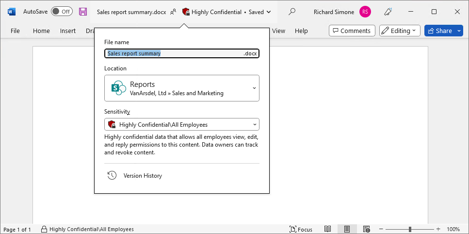

# Manage sensitivity labels in Office apps

>*[Microsoft 365 licensing guidance for security & compliance](/office365/servicedescriptions/microsoft-365-service-descriptions/microsoft-365-tenantlevel-services-licensing-guidance/microsoft-365-security-compliance-licensing-guidance).*

When you have [published](create-sensitivity-labels.md#publish-sensitivity-labels-by-creating-a-label-policy) sensitivity labels from the Microsoft Purview compliance portal, they start to appear in Office apps for users to classify and protect data as it's created or edited.

Use the information in this article to help you successfully manage sensitivity labels in Office apps. For example, identify the minimum versions of apps you need for features that are specific to built-in labeling, any additional configuration information for these features, and understand interactions with the Azure Information Protection unified labeling client and other apps and services.

[!INCLUDE [purview-preview](../includes/purview-preview.md)]

## Labeling client for desktop apps

To use sensitivity labels that are built into Office desktop apps for Windows and Mac, you must use a subscription edition of Office. This labeling client doesn't support standalone editions of Office, sometimes called "Office Perpetual".

The Azure Information Protection (AIP) add-in component from the [Azure Information Protection unified labeling client](/azure/information-protection/rms-client/aip-clientv2) is now in [maintenance mode](https://techcommunity.microsoft.com/t5/security-compliance-and-identity/azure-information-protection-and-the-information-protection/ba-p/3671070) and will be [retired April 2024](https://techcommunity.microsoft.com/t5/security-compliance-and-identity/retirement-notification-for-the-azure-information-protection/ba-p/3791908). If you currently use this add-in for labeling in Office apps, we recommend you move to built-in labeling. For more information, see [Migrate the Azure Information Protection (AIP) add-in to built-in labeling for Office apps](sensitivity-labels-aip.md).

## Support for sensitivity label capabilities in apps

Use the tables in [Minimum versions for sensitivity labels in Office apps](sensitivity-labels-versions.md) to identify the minimum Office version that introduced specific capabilities for sensitivity labels built in to Office apps. Or, if the label capability is in public preview or under review for a future release.

In addition to listing the minimum versions for Windows, macOS, iOS, and Android, the tables also include whether the capability is supported for Office on the web:

- [Capabilities table for Word, Excel, and PowerPoint](sensitivity-labels-versions.md#sensitivity-label-capabilities-in-word-excel-and-powerpoint)
- [Capabilities table for Outlook](sensitivity-labels-versions.md#sensitivity-label-capabilities-in-outlook)

Office for iOS and Office for Android: Sensitivity labels are built into the [Office app](https://www.microsoft.com/microsoft-365/blog/2020/02/19/new-office-app-android-ios-available/).

## Office built-in labeling client and the Azure Information Protection client

If users have the [Azure Information Protection (AIP) client](/azure/information-protection/rms-client/aip-clientv2) installed on their Windows computers, built-in labels are the new default for the latest Windows Office apps that [support labeling](#labeling-client-for-desktop-apps). Because built-in labels don't use an Office add-in, as used by the AIP client, they have the benefit of more stability and better performance. They also support the latest features, such as advanced classifiers.

> [!NOTE]
> If you're not seeing the labeling features you expect on Windows computers, despite confirming the minimum supported versions for your Office update channel, it might be because you need to [disable the AIP add-in](sensitivity-labels-aip.md#how-to-disable-the-aip-add-in-to-use-built-in-labeling-for-office-apps) for older versions of Office.

To learn more about labeling support with the AIP client, and how to disable this client just in Office apps, see [Migrate the Azure Information Protection (AIP) add-in to built-in labeling for Office apps](sensitivity-labels-aip.md).

## If you need to turn off built-in labeling in Office apps on Windows

The Office built-in labeling client downloads sensitivity labels and sensitivity label policy settings from the Microsoft Purview compliance portal.

To use the Office built-in labeling client, you must have one or more [label policies published](create-sensitivity-labels.md#publish-sensitivity-labels-by-creating-a-label-policy) to users from the Microsoft Purview compliance portal, and a [supported version of Office](#support-for-sensitivity-label-capabilities-in-apps).

If both of these conditions are met but you need to turn off the built-in labels in Windows Office apps, use the Office policy setting **Use the Sensitivity feature in Office to apply and view sensitivity labels**. Set the value to 0 by selecting **Disabled**.

For Group Policy and [Microsoft 365 Apps for enterprise administrative templates](https://www.microsoft.com/download/details.aspx?id=49030), navigate to this setting from **User Configuration/Administrative Templates/Microsoft Office 2016/Security Settings**. If you're using the [Cloud Policy service for Microsoft 365](/DeployOffice/overview-office-cloud-policy-service), search for this setting by name. The setting takes effect when these Office apps restart.

If you later need to revert this configuration, change the value to 1 by selecting **Enabled**. You might also need to enable this setting if the **Sensitivity** button isn't displayed on the ribbon as expected. For example, a previous administrator turned this labeling setting off.

Because this setting is specific to Windows Office apps, it has no impact on other apps on Windows that support sensitivity labels (such as Power BI) or other platforms (such as macOS, mobile devices, and Office for the web). If you don't want some or all users to see and use sensitivity labels across all apps and all platforms, don't assign a sensitivity label policy to those users.

> [!TIP]
> If you want to stop displaying built-in labels for Word, Excel, and PowerPoint, and display them just for Outlook, or the other way around, you can achieve this outcome with a per-label setting. For more information, see [Scope labels to just files or emails](#scope-labels-to-just-files-or-emails).

## Office file types supported

Generally, Office apps that have built-in labeling for Word, Excel, and PowerPoint files support the Open XML format (such as .docx and .xlsx) but not the Microsoft Office 97-2003 format (such as .doc and .xls), Open Document Format (such as .odt and .ods), or other formats. When a file type is not supported for built-in labeling, the **Sensitivity** button is not available in the Office app.

For specific file types supported for SharePoint and OneDrive when these services are enabled for sensitivity labels, see [Enable sensitivity labels for Office files in SharePoint and OneDrive](sensitivity-labels-sharepoint-onedrive-files.md#supported-file-types).

The Azure Information Protection unified labeling client supports both the Open XML format and the Microsoft Office 97-2003 format. For more information, see [File types supported by the Azure Information Protection unified labeling client](/azure/information-protection/rms-client/clientv2-admin-guide-file-types) from that client's admin guide.

For other labeling solutions, check their documentation for file types supported.

## Protection templates and sensitivity labels

Administrator-defined [protection templates](/azure/information-protection/configure-policy-templates), such as those you define for Microsoft Purview Message Encryption, aren't visible in Office apps when you're using built-in labeling. This simplified experience reflects that there's no need to select a protection template, because the same settings are included with sensitivity labels that have encryption enabled.

You can convert an existing template into a sensitivity label when you use the [New-Label](/powershell/module/exchange/new-label) cmdlet with the *EncryptionTemplateId* parameter.

## Information Rights Management (IRM) options and sensitivity labels

Sensitivity labels that you configure to apply encryption remove the complexity from users to specify their own encryption settings. In many Office apps, these individual encryption settings can still be manually configured by users by using Information Rights Management (IRM) options. For example, for Windows apps:

- For a document:  **File** > **Info** > **Protect Document** > **Restrict Access**
- for an email: From the **Options** tab > **Encrypt** 
  
When users initially label a document or email, they can override your label configuration settings with their own encryption settings. For example:

- A user applies the **Confidential \ All Employees** label to a document and this label is configured to apply encryption settings for all users in the organization. This user then manually configures the IRM settings to restrict access to a user outside your organization. The end result is a document that's labeled **Confidential \ All Employees** and encrypted, but users in your organization can't open it as expected.

- A user applies the **Confidential \ Recipients Only** label to an email and this email is configured to apply the encryption setting of **Do Not Forward**. In the Outlook app, this user then manually selects the IRM setting for Encrypt-Only. The end result is that while the email does remain encrypted, it can be forwarded by recipients, despite having the **Confidential \ Recipients Only** label.
    
    As an exception, for Outlook on the web, the options from the **Encrypt** menu aren't available for a user to select when the currently selected label applies encryption.

- A user applies the **General** label to a document, and this label isn't configured to apply encryption. This user then manually configures the IRM settings to restrict access to the document. The end result is a document that's labeled **General** but that also applies encryption so that some users can't open it as expected.

If the document or email is already labeled, a user can do any of these actions if the content isn't already encrypted, or they have the [usage right](/azure/information-protection/configure-usage-rights#usage-rights-and-descriptions) Export or Full Control. 

For a more consistent label experience with meaningful reporting, provide appropriate labels and guidance for users to apply only labels to protect documents and emails. For example:

- For exception cases where users must assign their own permissions, provide labels that [let users assign their own permissions](encryption-sensitivity-labels.md#let-users-assign-permissions). 

- Instead of users manually removing encryption after selecting a label that applies encryption, provide a sublabel alternative when users need a label with the same classification, but no encryption. Such as:
    - **Confidential \ All Employees**
    - **Confidential \ Anyone (no encryption)**

- Consider disabling IRM settings to prevent users from selecting them:
    - Outlook for Windows: 
        - Registry keys `DWORD:00000001` *DisableDNF* and *DisableEO* from `HKEY_CURRENT_USER\Software\Microsoft\Office\16.0\Common\DRM`
        - Make sure that the Group Policy setting **Configure default encryption option for the Encrypt button** isn't configured
    - Outlook for Mac: 
        - Keys *DisableEncryptOnly* and *DisableDoNotForward* security settings documented in [Set preferences for Outlook for Mac](/DeployOffice/mac/preferences-outlook)
    - Outlook on the web: 
        - Parameters *SimplifiedClientAccessDoNotForwardDisabled* and *SimplifiedClientAccessEncryptOnlyDisabled* documented for [Set-IRMConfiguration](/powershell/module/exchange/set-irmconfiguration)
    - Outlook for iOS and Android: These apps don't support users applying encryption without labels, so nothing to disable.

> [!NOTE]
> If users manually remove encryption from a labeled document that's stored in SharePoint or OneDrive and you've [enabled sensitivity labels for Office files in SharePoint and OneDrive](sensitivity-labels-sharepoint-onedrive-files.md), the label encryption will be automatically restored the next time the document is accessed or downloaded. 

## Encryption-based label matching for documents

When a document has been encrypted with administrator-defined permissions, the encryption policy is embedded in the document. This happens independently from labeling. For example, when an Office attachment inherits encryption from an email message, or a user has applied a protection template by using Information Rights Management (IRM) in their Office app. If a sensitivity label in the tenant matches that same encryption policy, Office apps will automatically assign that matching label to the document.

In this scenario, the matching sensitivity label can label an unlabeled document, and replace an existing label that doesn't apply encryption. For example, the **General** label is replaced with **Confidential / All Employees**. Content markings from the matching label aren't automatically applied, unless the document was previously unlabeled and you're using the AIP Add-in.

This scenario helps to move older encryption solutions from protection templates to sensitivity labels that apply encryption.

However, you will also see this behavior with a labeling scenario for email and meetings attachments when they are opened by the recipient. For example:

1. A user creates an email and attaches an unencrypted Office document, and then applies a label to the email.
    
    The label applies encryption with permissions that are set by the administrator, rather than the Do Not Forward or Encrypt-Only options. For example, for the label configuration, the admin selects **Assign permissions now**, and specifies all employees have read access.

2. When the email is sent, the [attachment automatically inherits the encryption, but not the label](encryption-sensitivity-labels.md#email-attachments-for-encrypted-email-messages-and-meeting-invites).

3. When a recipient in the same tenant opens the encrypted document, a matching label for the admin-defined permissions is automatically displayed for the document, and persists if the document is saved.
    
    As an auditing event that's displayed in Activity Explorer, this user applied the label, not the email sender.

Encryption-based label matching works only within the tenant, for admin-defined permissions, and the matching sensitivity label must be published to the user who opens the document. The matching label persists if the document is saved.

## Sensitivity label compatibility

**With RMS-enlightened apps**: If you open a labeled and encrypted document or email in an [RMS-enlightened application](/azure/information-protection/requirements-applications#rms-enlightened-applications) that doesn't support sensitivity labels, the app still enforces encryption and rights management.

**With the Azure Information Protection client**: You can view and change sensitivity labels that you apply to documents and emails with the Office built-in labeling client by using the Azure Information Protection client, and the other way around.

**With other versions of Office**: Any authorized user can open labeled documents and emails in other versions of Office. However, you can only view or change the label in supported Office versions or by using the Azure Information Protection client. Supported Office app versions are listed in the [previous section](#support-for-sensitivity-label-capabilities-in-apps).

## Support for SharePoint and OneDrive files protected by sensitivity labels

To use the Office built-in labeling client with Office on the web for documents in SharePoint or OneDrive, make sure you've [enabled sensitivity labels for Office files in SharePoint and OneDrive](sensitivity-labels-sharepoint-onedrive-files.md).

## Support for external users and labeled content

When you label a document or email, the label is stored as metadata that includes your tenant and a label GUID. When a labeled document or email is opened by an Office app that supports sensitivity labels, this metadata is read and only if the user belongs to the same tenant, the label displays in their app. For example, for built-in labeling for Word, PowerPoint, and Excel, the label name displays on the status bar. 

This implementation means that if you share documents with another organization that uses different label names, each organization can apply and see their own label applied to the document.

> [!NOTE]
> Two exceptions where another organization can't apply their own sensitivity labels:
> - Using Office for the web, external users connect to your SharePoint sites or OneDrive locations. In this scenario, they won't see their sensitivity labels because the site is owned by another organization.
> - Using co-authoring from desktop or mobile apps, external users [won't be able to apply their own sensitivity labels that are configured to apply encryption](https://support.microsoft.com/topic/you-can-t-apply-your-own-protected-sensitivity-label-to-this-file-3e592e7f-5498-481a-b930-c1259924e9ab).

The same is true for email (and labeled calendar events) sent by Outlook. However, email clients other than Outlook might not retain the label metadata in the email headers. For example, users replying or forwarding from another organization that doesn't use Outlook will likely result in the original email label no longer visible to the original organization because the label metadata hasn't been retained. If that label applied encryption, the encryption persists to protect the contents.

The following elements from an applied label are visible to users outside your organization:

- Content markings. When a label applies a header, footer, or watermark, these are added directly to the content and remain visible until somebody modifies or deletes them.

- The name and description of the underlying protection template from a label that applied encryption. This information displays in a message bar at the top of the content, to provide information about who is authorized to view the content, and their usage rights for that content.

### Sharing encrypted documents with external users

Although you can restrict access to users in your own organization, you can also extend access to any other user who has an account in Azure Active Directory (Azure AD). By default, these external users will be authenticated without any additional configuration. However, there might be additional configuration required for Azure AD [External Identities cross-tenant access settings](/azure/active-directory/external-identities/cross-tenant-access-overview) and [Conditional Access](/azure/active-directory/conditional-access/overview). 

If external users don't have an account in Azure AD, they can authenticate by using guest accounts in your tenant. These guest accounts can also be used to access shared documents in SharePoint or OneDrive when you have [enabled sensitivity labels for Office files in SharePoint and OneDrive](sensitivity-labels-sharepoint-onedrive-files.md).

For more information about the optional Azure AD features and using guest accounts for authentication requirements, see [Azure AD configuration for encryption content](encryption-azure-ad-configuration.md).

All Office apps and other [RMS-enlightened application](/azure/information-protection/requirements-applications#rms-enlightened-applications) can open encrypted documents after the user has successfully authenticated. 

## When Office apps apply content marking and encryption

Office apps apply content marking and encryption with a sensitivity label differently, depending on the app you use.

| App | Content marking | Encryption |
| --- | --- | --- |
| Word, Excel, PowerPoint on all platforms | Immediately | Immediately |
| Outlook for PC and Mac | After Exchange Online sends the email or meeting invite | Immediately |
| Outlook on the web, iOS, and Android | After Exchange Online sends the email or meeting invite | After Exchange Online sends the email or meeting invite |

Solutions that apply sensitivity labels to files outside Office apps do so by applying labeling metadata to the file. In this scenario, content marking from the label's configuration isn't inserted into the file but encryption is applied. 

When those files are opened in an Office desktop app, the content markings are automatically applied by the Azure Information Protection unified labeling client when the file is first saved. The content markings are not automatically applied when you use built-in labeling for desktop, mobile, or web apps.

Scenarios that include applying a sensitivity label outside Office apps include:

- The scanner, File Explorer, and PowerShell from the Azure Information Protection unified labeling client 

- Auto-labeling policies for SharePoint and OneDrive

- Exported labeled and encrypted data from Power BI

- Microsoft Defender for Cloud Apps

For these scenarios, using their Office apps, a user with built-in labeling can apply the label's content markings by temporarily removing or replacing the current label and then reapplying the original label.

### Dynamic markings with variables

> [!IMPORTANT]
> If your Office apps don't support this capability, they apply the markings as the original text specified in the label configuration, rather than resolving the variables.
> 
> The Azure Information Protection unified labeling client supports dynamic markings. For labeling built in to Office, see the tables in [Minimum versions for sensitivity labels in Office apps](sensitivity-labels-versions.md).

When you configure a sensitivity label for content markings, you can use the following variables in the text string for your header, footer, or watermark:

| Variable | Description | Example when label applied |
| -------- | ----------- | ------- |
| `${Item.Label}` | Label display name of the label applied | **General**|
| `${Item.Name}` | File name or email subject of the content being labeled | **Sales.docx** |
| `${Item.Location}` | Path and file name of the document being labeled, or the email subject for an email being labeled | **\\\Sales\2020\Q3\Report.docx**|
| `${User.Name}` | Display name of the user applying the label | **Richard Simone** |
| `${User.PrincipalName}` | Azure AD user principal name (UPN) of the user applying the label | **rsimone\@contoso.com** |
| `${Event.DateTime}` | Date and time when the content is labeled, in the local time zone of the user applying the label in Microsoft 365 apps, or UTC (Coordinated Universal Time) for Office Online and auto-labeling policies | **8/10/2020 1:30 PM** |

> [!NOTE]
> The syntax for these variables is case-sensitive.

#### Setting different visual markings for Word, Excel, PowerPoint, and Outlook

As an additional variable, you can configure visual markings per Office application type by using an "If.App" variable statement in the text string, and identify the application type by using the values **Word**, **Excel**, **PowerPoint**, or **Outlook**. You can also abbreviate these values, which is necessary if you want to specify more than one in the same If.App statement.

Use the following syntax:

```
${If.App.<application type>}<your visual markings text> ${If.End}
```

As with the other dynamic visual markings, the syntax is case-sensitive, which includes the abbreviations for each application type (WEPO).

Examples:

- **Set header text for Word documents only:**

    `${If.App.Word}This Word document is sensitive ${If.End}`

    In Word document headers only, the label applies the header text "This Word document is sensitive". No header text is applied to other Office applications.

- **Set footer text for Word, Excel, and Outlook, and different footer text for PowerPoint:**

    `${If.App.WXO}This content is confidential. ${If.End}${If.App.PowerPoint}This presentation is confidential. ${If.End}`

    In Word, Excel, and Outlook, the label applies the footer text "This content is confidential." In PowerPoint, the label applies the footer text "This presentation is confidential."

- **Set specific watermark text for Word and PowerPoint, and then watermark text for Word, Excel, and PowerPoint:**

    `${If.App.WP}This content is ${If.End}Confidential`

    In Word and PowerPoint, the label applies the watermark text "This content is Confidential". In Excel, the label applies the watermark text "Confidential". In Outlook, the label doesn't apply any watermark text because watermarks as visual markings are not supported for Outlook.

## Require users to apply a label to their email and documents

> [!IMPORTANT]
> 
> The [Azure Information Protection unified labeling client](/azure/information-protection/rms-client/install-unifiedlabelingclient-app) supports this configuration that's also known as mandatory labeling. For labeling built in to Office apps, see the tables in [Minimum versions for sensitivity labels in Office apps](sensitivity-labels-versions.md).
>
> To use mandatory labeling for documents but not emails, see the instructions in the next section that explains how to configure Outlook-specific options.
> 
> To use mandatory labeling for Power BI, see [Mandatory label policy for Power BI](/power-bi/admin/service-security-sensitivity-label-mandatory-label-policy).

When the policy setting **Require users to apply a label to their email and documents** is selected, users assigned the policy must select and apply a sensitivity label under the following scenarios:

- For the Azure Information Protection unified labeling client:
    - For documents (Word, Excel, PowerPoint): When an unlabeled document is saved or users close the document.
    - For emails (Outlook): At the time users send an unlabeled message.

- For labeling built in to Office apps:
    - For documents (Word, Excel, PowerPoint): When an unlabeled document is opened or saved.
    - For emails (Outlook): At the time users send an unlabeled email message. For Outlook Mobile, this can be changed to [when the email message is first composed](#for-outlook-mobile-change-when-users-are-prompted-for-a-label).

Additional information for built-in labeling:

- When users are prompted to add a sensitivity label because they open an unlabeled document, they can add a label or choose to open the document in read-only mode.

- When mandatory labeling is in effect, users can't remove sensitivity labels from documents, but can change an existing label.

- When mandatory labeling is in effect, the print to PDF option will be unavailable when a document is labeled or encrypted. For more information, see the [PDF support](#pdf-support) section on this page.

For guidance about when to use this setting, see the information about [policy settings](sensitivity-labels.md#what-label-policies-can-do).

> [!NOTE]
> If you use the default label policy setting for documents and emails in addition to mandatory labeling: 
>
> The default label always takes priority over mandatory labeling. However, if you use a version of built-in labeling that doesn't yet support a default label for existing documents, users will be prompted to apply a sensitivity label for each new document.
>
> Identify the minimum versions of Word, Excel, and PowerPoint that support a default label for existing documents by using the [capabilities table](sensitivity-labels-versions.md#sensitivity-label-capabilities-in-word-excel-and-powerpoint) and the row **Apply a default label to existing documents**.

### For Outlook Mobile, change when users are prompted for a label

Currently rolling out, this setting requires a minimum version of 4.2316.0 for Outlook for Android and Outlook for iOS.

You can use a Microsoft Intune [Managed apps app configuration policy](/mem/intune/apps/app-configuration-policies-managed-app#add-a-managed-apps-app-configuration-policy) to configure a setting from the Intune App Software Development Kit (SDK) that changes when users are prompted to select a sensitivity label for Outlook Mobile.

Instead of prompting for a label on send when mandatory labeling is configuring for emails, this configuration results in prompting for a label when a user first composes a message.

This configuration requires you to specify the following key/value pair as a general configuration setting in the policy:

|Key|Value|
|--- |--- |
|com.microsoft.outlook.Mail.LouderMandatoryLabelEnabled|true|

## Outlook-specific options for default label and mandatory labeling

For built-in labeling, identify the minimum versions of Outlook that support these features by using the [capabilities table for Outlook](sensitivity-labels-versions.md#sensitivity-label-capabilities-in-outlook) and the row **Different settings for default label and mandatory labeling**. All versions of the Azure Information Protection unified labeling client support these Outlook-specific options.

When the Outlook app supports a default label setting that's different from the default label setting for documents:

- In the label policy configuration from the Microsoft Purview compliance portal, on the **Apply a default label to emails** page: You can specify your choice of sensitivity label that will be applied to all unlabeled emails, or no default label. This setting is independent from the **Apply this label by default to documents** setting on the previous **Policy settings for documents** page of the configuration.

When the Outlook app doesn't support a default label setting that's different from the default label setting for documents: Outlook will always use the value you specify for **Apply this label by default to documents** on the **Policy settings for documents** page of the label policy configuration.

When the Outlook app supports turning off mandatory labeling:

- In the label policy configuration from the Microsoft Purview compliance portal, on the **Policy settings** page: Select **Require users to apply a label to their email or documents**. Then select **Next** > **Next** and clear the checkbox **Require users to apply a label to their emails**. Keep the checkbox selected if you want mandatory labeling to apply to emails as well as to documents.

When the Outlook app doesn't support turning off mandatory labeling: If you select **Require users to apply a label to their email or documents** as a policy setting, Outlook will always prompt users to select a label for unlabeled emails.

## Scope labels to just files or emails

> [!NOTE]
> This capability is currently rolling out for built-in labeling, and in various stages of release across the platforms. Identify the minimum versions that support this feature by using the [capabilities tables](sensitivity-labels-versions.md), and the row **Scope labels to files or emails**.
> 
> Until this capability is supported on all the platforms used by your users, they will have an inconsistent labeling experience. For example, Word on one platform doesn't display a label that they see on a different platform.

This configuration is an extension to the **Items** scope, when you [create or edit a sensitivity label](create-sensitivity-labels.md#create-and-configure-sensitivity-labels) in the Microsoft Purview compliance portal. When you define the scope for the label for items, you can further refine the scope to just files or emails, and to [meetings](sensitivity-labels-meetings.md):

- To scope labels to just Word, Excel, and PowerPoint: Make sure the option for **Files** is selected, and not the option for **Emails**.  
- To scope labels to just Outlook, make sure the option for **Emails** is selected, and not the option for **Files**.

> [!WARNING]
> Although you can edit an existing label and remove the **Files** scope, we don't recommend you do this because existing configurations might no longer work as expected. For example, a SharePoint site admin wouldn't understand why a sensitivity label that they selected as a default label for a document library no longer applies the label.
> 
> If you want a sensitivity label just for emails, create a new label with just the **Emails** scope rather than edit an existing label.

Make sure both options are selected if you don't need to scope the labels to just Word, Excel, and PowerPoint, or to just Outlook.

Remember that other label configurations can also influence whether sensitivity labels are visible in apps. Check the documentation for the label configurations that you use.

> [!NOTE]
> The **Files** option can include other items that support this scoping option, such as Power BI files. Check the application's documentation to verify, and remember to test all labeling apps and services used by your organization.

Be aware that this configuration affects both client apps and services, manual labeling and automatic labeling. For example:

- Default labels:
    - If the scope doesn't include email, a configured default label for email won't be applied.
    - If the scope doesn't include files, a configured default label for files won't be applied and can't be selected as a default sensitivity label for a SharePoint document library.

- Auto-labeling policies:
    - If the scope doesn't include email, you can't select the label for an auto-labeling policy that includes the Exchange location.
    - If the scope doesn't include files, you can't select the label for an auto-labeling policy that includes the SharePoint and OneDrive locations.

- [Encryption that lets users assign permissions](encryption-sensitivity-labels.md#let-users-assign-permissions): 
    - If the scope doesn't include email, you won't be able to select the encryption options of **Do Not Forward** or **Encrypt-Only**.
    - If the scope doesn't include files, you won't be able to select the encryption option **In Word, PowerPoint, and Excel, prompt users to specify permissions**.

- [Label inheritance from email attachments](#configure-label-inheritance-from-email-attachments):
    - For this configuration, the label must be scoped to both files and emails.

In addition, if a label has been previously applied but then removed from one of the scopes, users will no longer see that label applied for the scope in the apps that support this feature.

Because of the impact of scoping labels to just files or emails, some existing labeling configurations will prevent you from removing the scope options for **Files** and **Emails**:
- Default label in label policies
- Default label to apply in channel meetings
- Label selected for auto-labeling policies

Before you can scope a label to just files or emails, you must first remove it if it's configured as one of these default labels, and remove it from any auto-labeling policies.

**Limitations:**

- Currently, if you use any label policy settings with a sensitivity label that's scoped to just **Files** or scoped to just **Emails**, the same policy must also include at least one label with both scope options.

- If the label is configured as the default label in one or more label policies, and Outlook isn't configured with its own default label in the same policy, you can't remove the scope for **Email**. As a workaround, first remove this label as the default label. You'll then be able to remove the email scope. Finally, reselect the now modified label as the default label for documents.

## Configure a label to apply S/MIME protection in Outlook

> [!NOTE]
> Identify the minimum versions of Outlook that support this feature by using the [capabilities table for Outlook](sensitivity-labels-versions.md#sensitivity-label-capabilities-in-outlook) and the row **Apply S/MIME protection**.
> 
> If you configure a label to apply S/MIME protection but your version of Outlook for Windows doesn't yet support it, the label is still displayed and can be applied, but the S/MIME settings are ignored. You won't be able to select this label for Exchange auto-labeling policies or configure it to [protect calendar items, Teams meetings, and chat](sensitivity-labels-meetings.md).

This configuration is not available in the Microsoft Purview compliance portal. You must use PowerShell advanced settings with the [Set-Label](/powershell/module/exchange/set-label) or [New-Label](/powershell/module/exchange/new-label) cmd after you've [connected to Security & Compliance PowerShell](/powershell/exchange/office-365-scc/connect-to-scc-powershell/connect-to-scc-powershell).

Use these settings only when you have a working [S/MIME deployment](/exchange/security-and-compliance/smime-exo/smime-exo) and want a label to automatically apply this protection method for emails rather than the [default protection that uses Rights Management encryption from Azure Information Protection](encryption-sensitivity-labels.md). The resulting protection will be the same as when a user manually selects S/MIME options from Outlook.

|Configuration  |Advanced setting key/value |
|---------|---------|
|**S/MIME digital signature** | SMimeSign="True" |
|**S/MIME encryption** | SMimeEncrypt="True"|

The label you configure for these settings doesn't have to be configured for encryption in the compliance portal. But if it is, S/MIME protection replaces the Rights Management encryption only in Outlook. For other apps, the label applies the encryption settings specified in the Microsoft Purview compliance portal.

Example PowerShell commands, where the sensitivity label GUID is **8faca7b8-8d20-48a3-8ea2-0f96310a848e**:

```PowerShell
Set-Label -Identity "8faca7b8-8d20-48a3-8ea2-0f96310a848e" -AdvancedSettings @{SMimeSign="True"}

Set-Label -Identity "8faca7b8-8d20-48a3-8ea2-0f96310a848e" -AdvancedSettings @{SMimeEncrypt="True"}
```

For more help in specifying PowerShell advanced settings, see [PowerShell tips for specifying the advanced settings](create-sensitivity-labels.md#powershell-tips-for-specifying-the-advanced-settings).

## Configure label inheritance from email attachments

> [!NOTE]
> Identify the minimum versions of Outlook that support this feature by using the [capabilities table for Outlook](sensitivity-labels-versions.md#sensitivity-label-capabilities-in-outlook), and the row **Label inheritance from email attachments**.

Turn on email inheritance for when users attach labeled documents to an email message that isn't manually labeled. With this configuration, a sensitivity label is dynamically selected for the email message, based on the sensitivity labels that are applied to the attachments and published to the user. The [highest priority label](sensitivity-labels.md#label-priority-order-matters) is dynamically selected when it's supported by Outlook.

Whether this label inheritance will override an existing label on the email message:

- When an email message has been manually labeled, that label won't be replaced by label inheritance from email attachments.

- Label inheritance from email attachments will replace a lower priority sensitivity label that is automatically applied or applied as a default label, but won't override a higher priority label.

You configure this setting in the sensitivity label policy, on the **Default settings for emails** page. For the section **Inherit label from attachments**, select the checkbox **Email inherits highest priority label from attachments**. The attachment must be a physical file, and can't be a link to a file (for example, a link to a file on Microsoft SharePoint or OneDrive).

When you select this checkbox, you can then further select the following option: **Recommend users apply the attachments label instead of automatically applying it.** Without this selection, the label is automatically applied but users can still remove the label or select a different label before sending the email.

> [!NOTE]
> If you've configured the PowerShell advanced setting **AttachmentAction** for the Azure Information Protection (AIP) unified labeling client to be Automatic or Recommended, these options are automatically reflected in the compliance portal. However, the **AttachmentActionTip** advanced setting for a customized recommendation message doesn't have a corresponding entry in the compliance portal and isn't supported by built-in labeling.

By default, if the automatically selected label applies encryption, the same encryption is applied to the email. For example, if the highest priority label applies encryption with Full Control to the Marketing group, the email will be protected with Full Control to the Marketing group. If the highest priority label applies the encryption option of Do Not Forward, the email message is also labeled and encrypted with Do Not Forward.

However, take into consideration the outcome when an email client doesn't support a specific protection action that's been applied to an attachment:

- For built-in labeling:
    
    - **Double Key Encryption**: Behavior depends on whether Outlook supports this encryption method. Use the [capabilities tables](sensitivity-labels-versions.md) and the row **Double Key Encryption (DKE)** to confirm support for your version.
    
        - When Outlook supports DKE: If the highest priority label applies the encryption setting for Double Key Encryption and **Assign permissions now**, Outlook for Windows applies that label and protection to the email message. The label and protection isn't applied if the label is configured for **Let users assign permissions when they apply the label**.
        
        - When Outlook doesn't support DKE: If the highest priority label applies Double Key Encryption, no label or encryption is selected for the email message in Outlook for Windows.

    - **Custom permissions for Word, PowerPoint, and Excel**: If the highest priority label applies just user-defined permissions for Word, PowerPoint, and Excel (the option **Let users assign permissions when they apply the label** and **In Word, PowerPoint, and Excel, prompt users to specify permissions**), no label or protection is selected for the email message because Outlook doesn't support this label configuration.

- For the Azure Information Protection (AIP) unified labeling client:
    
    - **S/MIME**: If the highest priority label applies S/MIME signing and encryption, and the label is also configured for encryption from the Azure Rights Management service, that label is applied to the email message with the same S/MIME signing and encryption but also the label's configured encryption settings for the Azure Rights Management service.
    
    - **Double Key Encryption**: If the highest priority label applies the encryption setting for Double Key Encryption, no label or encryption is selected for the email message if the label is configured for **Let users assign permissions when they apply the label**. The label and protection is applied if the label is configured for **Assign permissions now**. 

    - **Custom permissions for Word, PowerPoint, and Excel**: If the highest priority label applies just user-defined permissions for Word, PowerPoint, and Excel (the option **Let users assign permissions when they apply the label** and **In Word, PowerPoint, and Excel, prompt users to specify permissions**), no label or protection is selected for the email message because Outlook doesn't support this label configuration.

    - **Encrypt-Only**: If the highest priority label applies the encryption setting for Encrypt-Only, no label or protection is selected for the email message because the AIP unified labeling client doesn't support this setting.

## PDF support

For built-in labeling, use the tables in [Minimum versions for sensitivity labels in Office apps](sensitivity-labels-versions.md) to identify supported versions. The Azure Information Protection unified labeling client doesn't support PDF in Office apps.

Office for Windows: Word, Excel, and PowerPoint support the following methods to convert an Office document into a PDF document:

- File > Save As > PDF 
- File > Export > PDF
- Share > Send a Copy > PDF

This action is logged with the **Renamed file** audit event from the [File and page activities](audit-log-activities.md#file-and-page-activities) auditing group. In the auditing search results in the compliance portal, you'll see the details of this auditing event display **SensitivityLabeledFileRenamed** for the **Activity** field.

Office for the web: You must download the file from the browser. The following methods are supported to convert an Office online document into a PDF document:

- Word and PowerPoint on the web:
    - Save as > Download as PDF > Download
- Excel on the web:
    - Export > Download as PDF > Download
    - Print > Print > Download as PDF > Download

When the PDF is created, it inherits the label with any content markings. For Windows, if the label applied encryption, that encryption is also inherited. Encrypted PDFs can be opened with Microsoft Edge on Windows or Mac. For more information, and alternative readers, see [Which PDF readers are supported for protected PDFs?](/azure/information-protection/rms-client/protected-pdf-readers#viewing-protected-pdfs-in-microsoft-edge-on-windows-or-mac)

SharePoint and OneDrive support the following PDF scenarios:

- When you've [enabled SharePoint and OneDrive for sensitivity labels](sensitivity-labels-sharepoint-onedrive-files.md) and [added PDF support](sensitivity-labels-sharepoint-onedrive-files.md#adding-support-for-pdf). Then, PDFs are supported when you upload a labeled PDF document with or without encryption applied, these services can process the file such that search, eDiscovery, and data loss prevention can inspect the contents, and the sensitivity label name is displayed for users.

- [Auto-labeling policies](apply-sensitivity-label-automatically.md#how-to-configure-auto-labeling-policies-for-sharepoint-onedrive-and-exchange) can apply a sensitivity label and encryption (if configured) to PDF documents when [PDF support is added](sensitivity-labels-sharepoint-onedrive-files.md#adding-support-for-pdf).

Outlook doesn't currently support PDF attachments inheriting encryption from a labeled message. However, Outlook now does support warning or blocking users from printing to PDF, as described next.

PDF scenarios not supported:

- Print to PDF
    
    If users select this option, they are warned that the document or email will lose the protection of the label, and encryption (if applied), and must confirm to continue. If your sensitivity label policy requires justification to remove a label or lower its classification, they see this prompt.
    
    Because this option removes the sensitivity label, this option won't be available to users if you're using mandatory labeling. This configuration refers to the sensitivity label policy setting that requires users to apply a label to their emails and documents.

- PDF/A format and encryption
    
     This PDF format designed for long-term archiving isn't supported when the label applies encryption and will prevent users from converting Office documents to PDF. For configuration information, see the Group Policy documentation for [Enforce PDF compliance with ISO 19005-1 (PDF/A)](https://admx.help/?Category=Office2016&Policy=office16.Office.Microsoft.Policies.Windows::L_EnforcePDFcompliancewithISO190051PDFA).
    
- Password protection and encryption
    
    The option **File** > **Info** > **Protect Document** > **Encrypt with Password** isn't supported when the document's label applies encryption. In this scenario, the encrypt with password option becomes unavailable for users.

For more information about exporting to PDF, see the announcement [Apply sensitivity labels to PDFs created with Office apps](https://insider.office.com/blog/apply-sensitivity-labels-to-pdfs-created-with-office-apps).

For end user documentation, see [Create protected PDFs from Office files](https://support.microsoft.com/topic/aba7e367-e482-49e7-b746-a385e48d01e4) and [Which PDF readers are supported for protected PDFs?](/azure/information-protection/rms-client/protected-pdf-readers).

### Disabling PDF support

If you need to disable the PDF support in Office apps for Word, Excel, and PowerPoint, you can do so by using a Group Policy Office setting under **User Configuration/Administrative Templates/Microsoft Office 2016/Microsoft Save As PDF and Save As XPS add-ins**:

- **Use the Sensitivity feature in Office to apply sensitivity labels to PDFs**

Configure this setting to be **Disabled**.

Deploy this setting by using Group Policy, or by using the [Cloud Policy service for Microsoft 365](/DeployOffice/overview-office-cloud-policy-service).

## Sensitivity bar

Use the tables in [Minimum versions for sensitivity labels in Office apps](sensitivity-labels-versions.md) to identify which Office versions support the sensitivity bar.

When Word, Excel, and PowerPoint support this feature, sensitivity labels are displayed in a sensitivity bar next to the file name on the top window bar. For example:



When Outlook supports this feature, the sensitivity bar is displayed on the **Subject** line of the email. For example:


Information about the labels and the ability to select or change a label are also integrated into user workflows that includes save and rename, export, share, print, and [convert to PDF](#pdf-support). For more information and example screenshots, see the blog post announcement, [New sensitivity bar in Office for Windows](https://insider.office.com/blog/sensitivity-bar-in-office-for-windows).

As part of this high visibility, these labels also support colors. For more information, see the next section.

### Label colors

> [!IMPORTANT]
> If your labeling apps don't support this capability, they don't display the configured label colors.
> 
> The Azure Information Protection unified labeling client supports label colors. For labeling built in to Office apps, see the tables in [Minimum versions for sensitivity labels in Office apps](sensitivity-labels-versions.md).

Newly created labels don't have a color by default. If your labels were [migrated from Azure Information Protection](/azure/information-protection/configure-policy-migrate-labels) or you configured label colors for the Azure Information Protection unified labeling client, these label colors are now displayed in apps that support them.

Use the Microsoft Purview compliance portal to select one of 10 standard colors for sensitivity labels. The **Label color** configuration is on the first page of the label configuration after the label name and description.

You can't select colors for sublabels because they automatically inherit the label color from their parent label.

If a label is configured for a different color from one of the 10 default colors, you see a **Use previously assigned custom color** check box selected, and the standard color options aren't available. You can change the custom color to one of the standard colors by first clearing the checkbox, and then you can select one of the standard colors. 

You can't use the compliance portal to configure a different custom color. Instead, use PowerShell, as described in the next section.

#### Configuring custom colors by using PowerShell 

You can use the [Security & Compliance PowerShell](/powershell/exchange/scc-powershell) advanced setting **color** to set a color for a sensitivity label. This configuration supports colors that you can't configure in the Microsoft Purview compliance portal.

To specify your choice of color, use a hex triplet code for the red, green, and blue (RGB) components of the color. For example, #40e0d0 is the RGB hex value for turquoise.

For more information about these codes, see the [\<color>](https://developer.mozilla.org/docs/Web/CSS/color_value) page from the MSDN web docs, and you might also find [RapidTables](https://www.rapidtables.com/web/color/RGB_Color.html) helpful. You can identify these codes in many applications that let you edit pictures. For example, Microsoft Paint lets you choose a custom color from a palette and the RGB values are automatically displayed, which you can then copy.

Example PowerShell command, where the sensitivity label GUID is **8faca7b8-8d20-48a3-8ea2-0f96310a848e**

```PowerShell
Set-Label -Identity 8faca7b8-8d20-48a3-8ea2-0f96310a848e -AdvancedSettings @{color="#40e0d0"}
```

For more information to help you specify PowerShell advanced settings for sensitivity labels, see [PowerShell tips for specifying the advanced settings](create-sensitivity-labels.md#powershell-tips-for-specifying-the-advanced-settings).

## Specify a default sublabel for a parent label

> [!NOTE]
> For built-in labeling, identify the minimum versions that support this setting by using the [capabilities tables](sensitivity-labels-versions.md) and the row **Default sublabel for parent label**. All versions of the Azure Information Protection unified labeling client support this setting.

This configuration is not available in the Microsoft Purview compliance portal. You must use the PowerShell advanced setting *DefaultSubLabelId* with the [Set-Label](/powershell/module/exchange/set-label) or [New-Label](/powershell/module/exchange/new-label) cmd after you've [connected to Security & Compliance PowerShell](/powershell/exchange/office-365-scc/connect-to-scc-powershell/connect-to-scc-powershell).

When you add a sublabel to a label, users can no longer apply the parent label to an item. By default, users select the parent label to see the sublabels that they can apply, and then select one of those sublabels. If you specify a default sublabel for a parent label, when users select the parent label, a sublabel is automatically selected and applied for them.

As an example, the parent label **Confidential** is configured with a default sublabel, **All Employees**. The next parent label, **Highly Confidential**, doesn't have a default sublabel configured. You can tell the difference with the end of label bar for **Confidential** that isn't visible for **Highly Confidential**:


When users select to the left of that vertical bar, they are selecting **Confidential**\\**All Employees** automatically with a single selection. If they need a different sublabel, they must select to the right of the vertical bar to select the label expansion that then displays all the sublabels for selection. In comparison, if they select **Highly Confidential**, the sublabels for that label are always displayed for selection.

After you configure this label setting, remember to update your end-user documentation accordingly.

Example PowerShell command, where the parent sensitivity label GUID is **8faca7b8-8d20-48a3-8ea2-0f96310a848e** and its sublabel that you want to specify as the default is **1ace2cc3-14bc-4142-9125-bf946a70542c**:

```PowerShell
Set-Label -Identity "8faca7b8-8d20-48a3-8ea2-0f96310a848e" -AdvancedSettings @{DefaultSubLabelId="1ace2cc3-14bc-4142-9125-bf946a70542c"}
```

For more help in specifying PowerShell advanced settings, see [PowerShell tips for specifying the advanced settings](create-sensitivity-labels.md#powershell-tips-for-specifying-the-advanced-settings).

## Auditing labeling activities

For information about the auditing events that are generated by sensitivity label activities, see the [Sensitivity label activities](audit-log-activities.md#sensitivity-label-activities) section from [Search the audit log in the Microsoft Purview compliance portal](audit-log-search.md).

This auditing information is visually represented in [content explorer](data-classification-content-explorer.md) and [activity explorer](data-classification-activity-explorer.md) to help you understand how your sensitivity labels are being used and where this labeled content is located.

You can also create custom reports with your choice of security information and event management (SIEM) software when you [export and configure the audit log records](audit-log-export-records.md). For larger-scale reporting solutions, see the [Office 365 Management Activity API reference](/office/office-365-management-api/office-365-management-activity-api-reference).

> [!TIP]
> To help create custom reports, see the following blog posts:
> - [Microsoft Purview audit log activities via O365 Management API - Part 1](https://techcommunity.microsoft.com/t5/security-compliance-and-identity/microsoft-365-compliance-audit-log-activities-via-o365/ba-p/2957171)
> - [Microsoft Purview audit log activities via O365 Management API - Part 2](https://techcommunity.microsoft.com/t5/security-compliance-and-identity/microsoft-365-compliance-audit-log-activities-via-o365/ba-p/2957297) 

## End-user documentation

- [Apply sensitivity labels to your files and email in Office](https://support.microsoft.com/office/apply-sensitivity-labels-to-your-files-and-email-in-office-2f96e7cd-d5a4-403b-8bd7-4cc636bae0f9)
    - [Known issues with sensitivity labels in Office](https://support.microsoft.com/office/known-issues-with-sensitivity-labels-in-office-b169d687-2bbd-4e21-a440-7da1b2743edc)

- [Automatically apply or recommend sensitivity labels to your files and emails in Office](https://support.office.com/article/automatically-apply-or-recommend-sensitivity-labels-to-your-files-and-emails-in-office-622e0d9c-f38c-470a-bcdb-9e90b24d71a1)
    - [Known issues with automatically applying or recommending sensitivity labels](https://support.office.com/article/known-issues-with-automatically-applying-or-recommending-sensitivity-labels-451698ae-311b-4d28-83aa-a839a66f6efc)

- [Create protected PDFs from Office files](https://support.microsoft.com/topic/aba7e367-e482)
