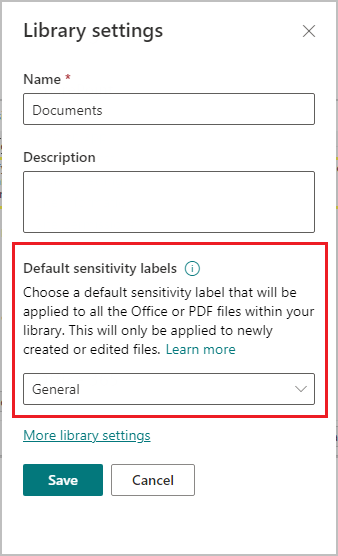

# Configure a default sensitivity label for a SharePoint document library

>*[Microsoft 365 licensing guidance for security & compliance](/office365/servicedescriptions/microsoft-365-service-descriptions/microsoft-365-tenantlevel-services-licensing-guidance/microsoft-365-security-compliance-licensing-guidance).*

> [!NOTE]
> This feature is in preview and subject to change. It is also a premium feature with licensing details to be provided when the feature becomes generally available (GA).
> 
> To read the preview announcement, see the [blog post](https://techcommunity.microsoft.com/t5/security-compliance-and-identity/public-preview-default-label-for-a-document-library-in/ba-p/3585136).

When SharePoint is [enabled for sensitivity labels](sensitivity-labels-sharepoint-onedrive-files.md), you can configure a default label for document libraries. Then, any new files uploaded to that library, or existing files edited in the library will have that label applied if they don't already have a sensitivity label, or they have a sensitivity label but with [lower priority](sensitivity-labels.md#label-priority-order-matters).

For example, you configure the **Confidential** label as the default sensitivity label for a document library. A user who has **General** as their policy default label saves a new file in that library. SharePoint will label this file as **Confidential** because of that label's higher priority. For a quick summary of the possible outcomes, see [Will an existing label be overridden](#will-an-existing-label-be-overridden) on this page.

A default label offers a baseline level of protection and a form of automatic labeling without content inspection. To help you distinguish between this feature's default label with the default label in label policies:

- **Default sensitivity label for a document library**: Location-based labeling, applicable only for SharePoint. Overrides a lower-priority label unless manually applied.
- **Default sensitivity label from a policy**: Always applicable for all locations. Never overrides an existing label.

When you use Office on the web to create or edit a file, the default sensitivity label for a document library can be applied without delays. However, labeling is not immediate if you upload a file or create it using Microsoft 365 Apps on Windows, macOS, iOS or Android, and then save to SharePoint:

- File upload: it can take a few minutes for the label to be applied.
- Microsoft 365 Apps: the label is applied after the app is closed.

## Will an existing label be overridden?

Summary of outcomes:

|Existing label |Override with library default label |
|:-----|:-----|:-----|
|Manually applied, any priority| No |
|Automatically applied, lower priority | Yes |
|Automatically applied, higher priority | No |
|Default label from policy, lower priority | Yes |
|Default label from policy, higher priority | No |

## Requirements

- You've [created and published](create-sensitivity-labels.md) sensitivity labels, and they're published to the users who will select a default sensitivity label for a SharePoint document library.

- You've [enabled sensitivity labels for Office files in SharePoint and OneDrive](sensitivity-labels-sharepoint-onedrive-files.md). To check this status, you can run `Get-SPOTenant -EnableAIPIntegration` from the [SharePoint Online Management Shell](/powershell/sharepoint/sharepoint-online/connect-sharepoint-online) to confirm the value is set to true.

- [SharePoint Information Rights Management (IRM) is not enabled for the library](set-up-irm-in-sp-admin-center.md#irm-enable-sharepoint-document-libraries-and-lists). This older technology isn't compatible with using a default sensitivity label for a SharePoint document library. If a library is enabled for IRM, you won't be able to select a default sensitivity label.

## Limitations

- Doesn't apply to existing files at rest in SharePoint.

- Unless you've [enabled co-authoring for files encrypted with sensitivity labels](sensitivity-labels-coauthoring.md), you'll see a delay in applying the default sensitivity label for a document library when users select the **File** \> **Save as** option.

- As with sensitivity labels for Office for the web, some [label configurations that apply encryption](encryption-sensitivity-labels.md#configure-encryption-settings) aren't suitable for SharePoint, and so don't support a default sensitivity label for a SharePoint document library:
    - **Let users assign permissions when they apply the label** and the checkbox **In Word, PowerPoint, and Excel, prompt users to specify permissions** is selected. This setting is sometimes referred to as "user-defined permissions".
    - **User access to content expires** is set to a value other than **Never**.
    - **Double Key Encryption** is selected.

## How to configure a default sensitivity label for a SharePoint document library

For an existing document library:

1. In SharePoint, navigate to the document library \> **Settings** \> **Library settings**.

2. From the **Library settings** flyout pane, select **Default sensitivity labels**, and then select a label from the drop-down box. For example:
    
    
    
    Although you see the setting mentions support for PDF files, this file type isn't currently supported for this scenario.

If you're creating a new document library, you can configure the same **Default sensitivity labels** setting from the **Create document library** flyout pane.

The permissions required to set and change a default sensitivity label for a SharePoint library are inherited. As with the ability to change the library name and description, any SharePoint site member has this permission.

## Monitoring application of library default sensitivity labels

Use the SharePoint **Sensitivity** column to see the names of sensitivity labels applied to files. When the label has been applied by this features, the tooltip for the label name displays **This file has been automatically labeled**. However, this tooltip isn't exclusive to the default sensitivity label for a document library. It also displays when sensitivity labels are applied by using auto-labeling policies or as a result of a user's default label from sensitivity label policies.

To specifically identify when the label was applied because of the library's default sensitivity label, use the [audit log in the compliance portal](search-the-audit-log-in-security-and-compliance.md) and the **Applied sensitivity label file** auditing event from the **Sensitivity label activities** group. Then:
1. Select an entry to view the details in a flyout pane.

2. From the details pane, scroll to the **SensitivityLabelEventData section**, and identify the value for **ActionScourceDetails**.

3. A value of **6** is used for when the label was applied because of the default sensitivity label for the document library.

To audit the configuration setting for this feature, use the **Updated list** auditing event from the **SharePoint list activities** group. In the details flyout pane for the document library, scroll to the **SensitivityLabelEventData** section where **OldSensitivityLabeld** and **SensitivityLabelId** can reflect three changes of states:

- Sensitivity label applied
- Sensitivity label changed from one label to another
- Sensitivity label removed

To map sensitivity label GUIDs to label names, use the [Get-Label](/powershell/module/exchange/get-label) cmdlet:

1. First, [connect to Office 365 Security & Compliance Center PowerShell](/powershell/exchange/office-365-scc/connect-to-scc-powershell/connect-to-scc-powershell).

2. Then run the following command, where you specify the GUID:

    ```powershell
    Get-Label -Identity "<GUID>" | Name

## Next steps

Default labeling ensures a minimum level of protection but doesn't take into account the file contents that might require a higher level of protection. Consider supplementing this labeling method with [automatic labeling](apply-sensitivity-label-automatically.md) that uses content inspection, and encourage [manual labeling](https://support.microsoft.com/office/apply-sensitivity-labels-to-your-files-and-email-in-office-2f96e7cd-d5a4-403b-8bd7-4cc636bae0f9) for users to replace the default label when needed.