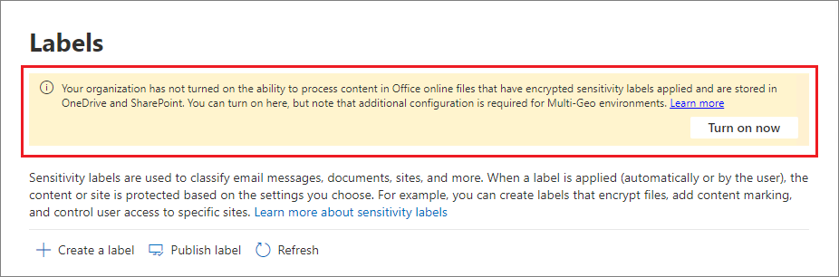

# Enable sensitivity labels for Office files in SharePoint and OneDrive

>*[Microsoft 365 licensing guidance for security & compliance](/office365/servicedescriptions/microsoft-365-service-descriptions/microsoft-365-tenantlevel-services-licensing-guidance/microsoft-365-security-compliance-licensing-guidance).*

Enable built-in labeling for [supported Office files](sensitivity-labels-office-apps.md#office-file-types-supported) in SharePoint and OneDrive so that users can apply your [sensitivity labels](sensitivity-labels.md) in Office for the web. When this feature is enabled, users will see the **Sensitivity** button on the ribbon so they can apply labels, and see any applied label name on the status bar.

Enabling this feature also results in SharePoint and OneDrive being able to process the contents of Office files that have been encrypted by using a sensitivity label. The label can be applied in Office for the web, or in Office desktop apps and uploaded or saved in SharePoint and OneDrive. Until you enable this feature, these services can't process encrypted files, which means that coauthoring, eDiscovery, Data Loss Prevention, search, and other collaborative features won't work for these files.

After you enable sensitivity labels for Office files in SharePoint and OneDrive, for new and changed files that have a sensitivity label that applies encryption with a cloud-based key (and doesn't use [Double Key Encryption](double-key-encryption.md)):

- For Word, Excel, and PowerPoint files, SharePoint and OneDrive recognize the label and can now process the contents of the encrypted file.

- When users download or access these files from SharePoint or OneDrive, the sensitivity label and any encryption settings from the label are enforced and remain with the file, wherever it is stored. Ensure you provide user guidance to use only labels to protect documents. For more information, see [Information Rights Management (IRM) options and sensitivity labels](sensitivity-labels-office-apps.md#information-rights-management-irm-options-and-sensitivity-labels).

- When users upload labeled and encrypted files to SharePoint or OneDrive, they must have at least view rights to those files. For example, they can open the files outside SharePoint. If they don't have this minimum usage right, the upload is successful but the service doesn't recognize the label and can't process the file contents.

- Use Office for the web (Word, Excel, PowerPoint) to open and edit Office files that have sensitivity labels that apply encryption. The permissions that were assigned with the encryption are enforced. You can also use [auto-labeling](apply-sensitivity-label-automatically.md) for these documents.

- External users can access documents that are labeled with encryption by using guest accounts. For more information, see [Support for external users and labeled content](sensitivity-labels-office-apps.md#support-for-external-users-and-labeled-content). 

- Office 365 eDiscovery supports full-text search for these files and Data Loss Prevention (DLP) policies support content in these files.

> [!NOTE]
> If encryption has been applied with an on-premises key (a key management topology often referred to as "hold your own key" or HYOK), or by using [Double Key Encryption](double-key-encryption.md), the service behavior for processing the file contents doesn't change. So for these files, coauthoring, eDiscovery, Data Loss Prevention, search, and other collaborative features won't work.
>
> The SharePoint and OneDrive behavior also doesn't change for existing files in these locations that are labeled with encryption using a single Azure-based key. For these files to benefit from the new capabilities after you enable sensitivity labels for Office files in SharePoint and OneDrive, the files must be either downloaded and uploaded again, or edited.

After you enable sensitivity labels for Office files in SharePoint and OneDrive, three new [audit events](search-the-audit-log-in-security-and-compliance.md#sensitivity-label-activities) are available for monitoring sensitivity labels that are applied to documents in SharePoint and OneDrive:
- **Applied sensitivity label to file**
- **Changed sensitivity label applied to file**
- **Removed sensitivity label from file**

Watch the following video (no audio) to see the new capabilities in action:

> [!VIDEO https://www.microsoft.com/videoplayer/embed//RE4ornZ]

You always have the choice to disable sensitivity labels for Office files in SharePoint and OneDrive ([opt-out](#how-to-disable-sensitivity-labels-for-sharepoint-and-onedrive-opt-out)) at any time.

If you are currently protecting documents in SharePoint by using SharePoint Information Rights Management (IRM), be sure to check the [SharePoint Information Rights Management (IRM) and sensitivity labels](#sharepoint-information-rights-management-irm-and-sensitivity-labels) section on this page. 

## Requirements

These new capabilities work with [sensitivity labels](sensitivity-labels.md) only. If you currently have Azure Information Protection labels, first migrate them to sensitivity labels so that you can enable these features for new files that you upload. For instructions, see [How to migrate Azure Information Protection labels to unified sensitivity labels](/azure/information-protection/configure-policy-migrate-labels).

Use the OneDrive sync app version 19.002.0121.0008 or later on Windows, and version 19.002.0107.0008 or later on Mac. Both these versions were released January 28, 2019, and are currently released to all rings. For more information, see the [OneDrive release notes](https://support.office.com/article/845dcf18-f921-435e-bf28-4e24b95e5fc0). After you enable sensitivity labels for Office files in SharePoint and OneDrive, users who run an older version of the sync app are prompted to update it.

## Limitations

- SharePoint and OneDrive can't process some files that are labeled and encrypted from Office desktop apps when these files contain PowerQuery data, data stored by custom add-ins, or custom XML parts such as Cover Page Properties, content type schemas, custom Document Information Panel, and Custom XSN. This limitation also applies to files that have a [Document ID](https://support.microsoft.com/office/enable-and-configure-unique-document-ids-ea7fee86-bd6f-4cc8-9365-8086e794c984) added when they are uploaded.
    
    For these files, either apply a label without encryption so that they can later be opened in Office on the web, or instruct users to open the files in their desktop apps. Files that are labeled and encrypted only in Office on the web aren't affected.

- SharePoint and OneDrive don't automatically apply sensitivity labels to existing files that you've already encrypted using Azure Information Protection labels. Instead, for the features to work after you enable sensitivity labels for Office files in SharePoint and OneDrive, complete these tasks:
    
    1. Make sure you have [migrated the Azure Information Protection labels](/azure/information-protection/configure-policy-migrate-labels) to sensitivity labels and [published them](create-sensitivity-labels.md#publish-sensitivity-labels-by-creating-a-label-policy) from the Microsoft 365 compliance center.
    2. Download the labeled files and then upload them to their original location in SharePoint or OneDrive.

- SharePoint and OneDrive can't process encrypted files when the label that applied the encryption has any of the following [configurations for encryption](encryption-sensitivity-labels.md#configure-encryption-settings):
    - **Let users assign permissions when they apply the label** and the checkbox **In Word, PowerPoint, and Excel, prompt users to specify permissions** is selected. This setting is sometimes referred to as "user-defined permissions".
    - **User access to content expires** is set to a value other than **Never**.
    - **Double Key Encryption** is selected.
    
    For labels with any of these encryption configurations, the labels aren't displayed to users in Office for the web. Additionally, the new capabilities can't be used with labeled documents that already have these encryption settings. For example, these documents won't be returned in search results, even if they are updated.

- For performance reasons, when you upload or save a document to SharePoint and the file's label doesn't apply encryption, the **Sensitivity** column in the document library can take a while to display the label name. Factor in this delay if you use scripts or automation that depend on the label name in this column.

- Users might experience delays in being able to open encrypted documents in the following Save As scenario: Using a desktop version of Office, a user chooses Save As for a document that has a sensitivity label that applies encryption. The user selects SharePoint or OneDrive for the location, and then immediately tries to open that document in Office for the web. If the service is still processing the encryption, the user sees a message that the document must be opened in their desktop app. If they try again in a couple of minutes, the document successfully opens in Office for the web. 

- For encrypted documents, printing is not supported.

- For an encrypted document that grants edit permissions to a user, copying can't be blocked in the web versions of the Office apps.

- By default, Office desktop apps and mobile apps don't support co-authoring for files that are labeled with encryption. These apps continue to open labeled and encrypted files in exclusive editing mode.
    
    > [!NOTE]
    > Co-authoring is now supported in preview. For more information, see [Enable co-authoring for files encrypted with sensitivity labels](sensitivity-labels-coauthoring.md).

- If an admin changes settings for a published label that's already applied to files downloaded to users' sync client, users might be unable to save changes they make to the file in their OneDrive Sync folder. This scenario applies to files that are labeled with encryption, and also when the label change is from a label that didn't apply encryption to a label that does apply encryption. Users see a [red circle with a white cross icon error](https://support.office.com/article/what-do-the-onedrive-icons-mean-11143026-8000-44f8-aaa9-67c985aa49b3), and they are asked to save new changes as a separate copy. Instead, they can close and reopen the file, or use Office for the web.

- If a labeled document is uploaded to SharePoint or OneDrive and the label applied encryption by using an account from a service principal name, the document can't be opened in Office for the web. Example scenarios include Microsoft Cloud App Security and a file sent to Teams by email.

- Users can experience save problems after going offline or into a sleep mode when instead of using Office for the web, they use the desktop and mobile apps for Word, Excel, or PowerPoint. For these users, when they resume their Office app session and try to save changes, they see an upload failure message with an option to save a copy instead of saving the original file. 

- Documents that have been encrypted in the following ways can't be opened in Office for the web:
    - Encryption that uses an on-premises key ("hold your own key" or HYOK)
    - Encryption that was applied by using [Double Key Encryption](double-key-encryption.md)
    - Encryption that was applied independently from a label, for example, by directly applying a Rights Management protection template.

- Labels configured for [other languages](create-sensitivity-labels.md#additional-label-settings-with-security--compliance-center-powershell) are not supported and display the original language only.

- Screen captures can't be prevented for encrypted documents. For more information, see [Can Rights Management prevent screen captures?](/azure/information-protection/faqs-rms#can-rights-management-prevent-screen-captures)

- If you delete a label that's been applied to a document in SharePoint or OneDrive, rather than remove the label from the applicable label policy, the document when downloaded won't be labeled or encrypted. In comparison, if the labeled document is stored outside SharePoint or OneDrive, the document remains encrypted if the label is deleted. Note that although you might delete labels during a testing phase, it's very rare to delete a label in a production environment.

## How to enable sensitivity labels for SharePoint and OneDrive (opt-in)

You can enable the new capabilities by using the Microsoft 365 compliance center, or by using PowerShell. As with all tenant-level configuration changes for SharePoint and OneDrive, it takes about 15 minutes for the change to take effect.

### Use the compliance center to enable support for sensitivity labels

This option is the easiest way to enable sensitivity labels for SharePoint and OneDrive, but you must sign in as a global administrator for your tenant.

1. Sign in to the [Microsoft 365 compliance center](https://compliance.microsoft.com/) as a global administrator, and navigate to **Solutions** > **Information protection**
    
    If you don't immediately see this option, first select **Show all**. 

2. If you see a message to turn on the ability to process content in Office online files, select **Turn on now**:
    
    
    
    The command runs immediately and when the page is next refreshed, you no longer see the message or button.

> [!NOTE]
> If you have Microsoft 365 Multi-Geo, you must use PowerShell to enable these capabilities for all your geo-locations. See the next section for details.

### Use PowerShell to enable support for sensitivity labels

As an alternative to using the compliance center, you can enable support for sensitivity labels by using the [Set-SPOTenant](/powershell/module/sharepoint-online/set-spotenant) cmdlet from SharePoint Online PowerShell. 

If you have Microsoft 365 Multi-Geo, you must use PowerShell to enable this support for all your geo-locations.

#### Prepare the SharePoint Online Management Shell

Before you run the PowerShell command to enable sensitivity labels for Office files in SharePoint and OneDrive, ensure that you're running SharePoint Online Management Shell version 16.0.19418.12000 or later. If you already have the latest version, you can skip to [next procedure](#run-the-powershell-command-to-enable-support-for-sensitivity-labels) to run the PowerShell command.

1. If you have installed a previous version of the SharePoint Online Management Shell from PowerShell gallery, you can update the module by running the following cmdlet.

    ```PowerShell
    Update-Module -Name Microsoft.Online.SharePoint.PowerShell
    ```

2. Alternatively, if you have installed a previous version of the SharePoint Online Management Shell from the Microsoft Download Center, you can also go to **Add or remove programs** and uninstall the SharePoint Online Management Shell.

3. In a web browser, go to the Download Center page and [Download the latest SharePoint Online Management Shell](https://go.microsoft.com/fwlink/p/?LinkId=255251).

4. Select your language and then click **Download**.

5. Choose between the x64 and x86 .msi file. Download the x64 file if you run the 64-bit version of Windows or the x86 file if you run the 32-bit version. If you don’t know, see [Which version of Windows operating system am I running?](https://support.microsoft.com/help/13443/windows-which-operating-system)

6. After you have downloaded the file, run the file and follow the steps in the Setup Wizard.

#### Run the PowerShell command to enable support for sensitivity labels

To enable the new capabilities, use the [Set-SPOTenant](/powershell/module/sharepoint-online/set-spotenant) cmdlet with the *EnableAIPIntegration* parameter:

1. Using a work or school account that has global administrator or SharePoint admin privileges in Microsoft 365, connect to SharePoint. To learn how, see [Getting started with SharePoint Online Management Shell](/powershell/sharepoint/sharepoint-online/connect-sharepoint-online).
    
    > [!NOTE]
    > If you have Microsoft 365 Multi-Geo, use the -Url parameter with [Connect-SPOService](/powershell/module/sharepoint-online/connect-sposervice), and specify the SharePoint Online Administration Center site URL for one of your geo-locations.

2. Run the following command and press **Y** to confirm:

    ```PowerShell
    Set-SPOTenant -EnableAIPIntegration $true
    ```
3. For Microsoft 365 Multi-Geo: Repeat steps 1 and 2 for each of your remaining geo-locations.

## Publishing and changing sensitivity labels

When you use sensitivity labels with SharePoint and OneDrive, keep in mind that you need to allow for replication time when you publish new sensitivity labels or update existing sensitivity labels. This is especially important for new labels that apply encryption.

For example: You create and publish a new sensitivity label that applies encryption and it very quickly appears in a user's desktop app. The user applies this label to a document and then uploads it to SharePoint or OneDrive. If the label replication hasn't completed for the service, the new capabilities won't be applied to that document on upload. As a result, the document won't be returned in search or for eDiscovery and the document can't be opened in Office for the web.	

The following changes replicate within one hour: New and deleted sensitivity labels, and sensitivity label policy settings that include which labels are in the policy.

The following changes replicate within 24 hours: Changes to sensitivity label settings for existing labels.

Because the replication delay is only one hour for new sensitivity labels, you are unlikely to run into the scenario in the example. But as a safeguard, we recommend publishing new labels to just a few test users first, wait for an hour, and then verify the label behavior on SharePoint and OneDrive. As the final step, make the label available to more users by either adding more users to the existing label policy, or add the label to an existing label policy for your standard users. At the time your standard users see the label, it has already synchronized to SharePoint and OneDrive.

## SharePoint Information Rights Management (IRM) and sensitivity labels

[SharePoint Information Rights Management (IRM)](set-up-irm-in-sp-admin-center.md) is an older technology to protect files at the list and library level by applying encryption and restrictions when files are downloaded. This older protection technology is designed to prevent unauthorized users from opening the file while it's outside SharePoint.

In comparison, sensitivity labels provide the protection settings of visual markings (headers, footers, watermarks) in addition to encryption. The encryption settings support the full range of [usage rights](/azure/information-protection/configure-usage-rights) to restrict what users can do with the content, and the same sensitivity labels are supported for [many scenarios](get-started-with-sensitivity-labels.md#common-scenarios-for-sensitivity-labels). Using the same protection method with consistent settings across workloads and apps results in a consistent protection strategy.

However, you can use both protection solutions together and the behavior is as follows: 

- If you upload a file with a sensitivity label that applies encryption, SharePoint can't process the content of these files so coauthoring, eDiscovery, DLP, and search are not supported for these files.

- If you label a file using Office for the web, any encryption settings from the label are enforced. For these files, coauthoring, eDiscovery, DLP, and search are supported.

- If you download a file that's labeled by using Office for the web, the label is retained and any encryption settings from the label are enforced rather than the IRM restriction settings.

- If you download an Office or PDF file that isn't encrypted with a sensitivity label, IRM settings are applied.

- If you have enabled any of the additional IRM library settings, which include preventing users from uploading documents that don't support IRM, these settings are enforced.

With this behavior, you can be assured that all Office and PDF files are protected from unauthorized access if they are downloaded, even if they aren't labeled. However, labeled files that are uploaded won't benefit from the new capabilities.


## Search for documents by sensitivity label

Use the managed property **InformationProtectionLabelId** to find all documents in SharePoint or OneDrive that have a specific sensitivity label. Use the following syntax: `InformationProtectionLabelId:<GUID>`

For example, to search for all documents that have been labeled as "Confidential", and that label has a GUID of "8faca7b8-8d20-48a3-8ea2-0f96310a848e", in the search box, type:

```
InformationProtectionLabelId:8faca7b8-8d20-48a3-8ea2-0f96310a848e
```

Search won't find labeled documents in a compressed file, such as a .zip file.

To get the GUIDs for your sensitivity labels, use the [Get-Label](/powershell/module/exchange/get-label) cmdlet:	

1. First, [connect to Office 365 Security & Compliance Center PowerShell](/powershell/exchange/office-365-scc/connect-to-scc-powershell/connect-to-scc-powershell).	
   
    For example, in a PowerShell session that you run as administrator, sign in with a global administrator account.	

2. Then run the following command:	

    ```powershell	
    Get-Label |ft Name, Guid	
    ```	

For more information about using managed properties, see [Manage the search schema in SharePoint](/sharepoint/manage-search-schema).

## Remove encryption for a labeled document

There might be rare occasions when a SharePoint administrator needs to remove encryption from a document stored in SharePoint. Any user who has the [Rights Management usage right](/azure/information-protection/configure-usage-rights#usage-rights-and-descriptions) of Export or Full Control assigned to them for that document can remove encryption that was applied by the Azure Rights Management service from Azure Information Protection. For example, users with either of these usage rights can replace a label that applies encryption with a label without encryption. Alternatively, a [super user](/azure/information-protection/configure-super-users) could download the file and save a local copy without the encryption.

As an alternative, a global admin or [SharePoint admin](/sharepoint/sharepoint-admin-role) can run the [Unlock-SPOSensitivityLabelEncryptedFile](/powershell/module/sharepoint-online/unlock-sposensitivitylabelencryptedFile) cmdlet, which removes both the sensitivity label and the encryption. This cmdlet runs even if the admin doesn't have access permissions to the site or file, or if the Azure Rights Management service is unavailable. 

For example:

```powershell
Unlock-SPOSensitivityLabelEncryptedFile -FileUrl "https://contoso.com/sites/Marketing/Shared Documents/Doc1.docx" -JustificationText "Need to decrypt this file"
```

Requirements:

- SharePoint Online Management Shell version 16.0.20616.12000 or later.

- The encryption has been applied by a sensitivity label with admin-defined encryption settings (the [Assign permissions now](encryption-sensitivity-labels.md#assign-permissions-now) label settings). [Double Key Encryption](encryption-sensitivity-labels.md#double-key-encryption) is not supported for this cmdlet.

The justification text is added to the [audit event](search-the-audit-log-in-security-and-compliance.md#sensitivity-label-activities) of **Removed sensitivity label from file**, and the decryption action is also recorded in the [protection usage logging for Azure Information Protection](/azure/information-protection/log-analyze-usage).

## How to disable sensitivity labels for SharePoint and OneDrive (opt-out)

If you disable these new capabilities, files that you uploaded after you enabled sensitivity labels for SharePoint and OneDrive continue to be protected by the label because the label settings continue to be enforced. When you apply sensitivity labels to new files after you disable these new capabilities, full-text search, eDiscovery, and coauthoring will no longer work.

To disable these new capabilities, you must use PowerShell. Using the SharePoint Online Management Shell and the [Set-SPOTenant](/powershell/module/sharepoint-online/set-spotenant) cmdlet, specify the same *EnableAIPIntegration* parameter as described in the [Use PowerShell to enable support for sensitivity labels](#use-powershell-to-enable-support-for-sensitivity-labels) section. But this time, set the parameter value to false and press **Y** to confirm:

```PowerShell
Set-SPOTenant -EnableAIPIntegration $false
```

If you have Microsoft 365 Multi-Geo, you must run this command for each of your geo-locations.

## Next steps

After you've enabled sensitivity labels for Office files in SharePoint and OneDrive, consider automatically labeling these files by using auto-labeling policies. For more information, see [Apply a sensitivity label to content automatically](apply-sensitivity-label-automatically.md).

Need to share your labeled and encrypted documents with people outside your organization?  See [Sharing encrypted documents with external users](sensitivity-labels-office-apps.md#sharing-encrypted-documents-with-external-users).
