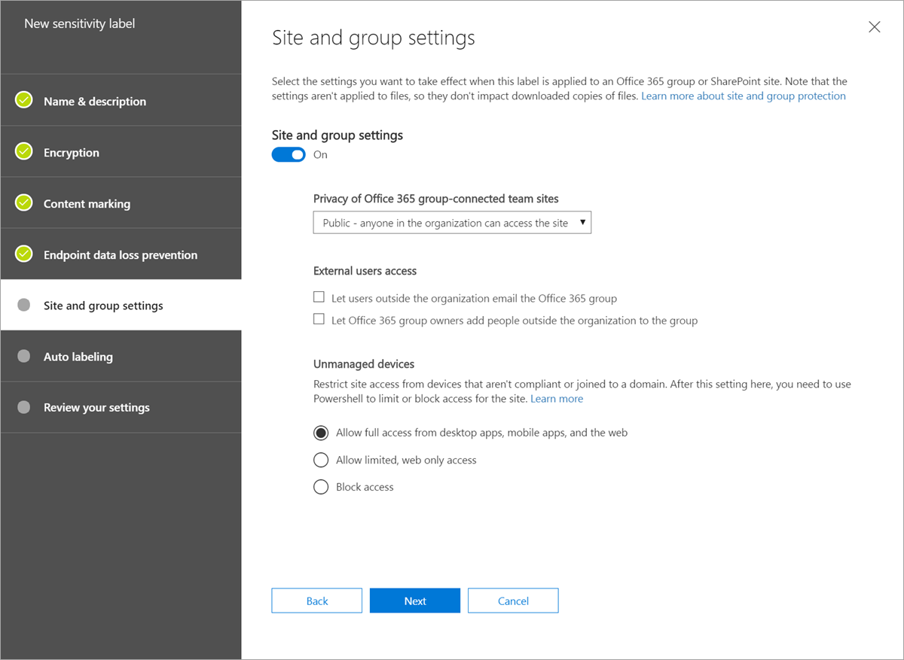

# Use sensitivity labels with teams, groups, and sites (preview)

When you create sensitivity labels in the [Microsoft 365 compliance center](https://protection.office.com/), you can now apply them to Microsoft Teams, Office 365 groups, and SharePoint sites. You can associate policies with the labels to control:

- Public/private settings
- Guest access
- Access from unmanaged devices

> [!NOTE]
> When a label is applied to a team or group, the label is automatically applied to the connected SharePoint team site and vice versa. 

[Learn about enabling sensitivity labels for Office files in SharePoint and OneDrive](sensitivity-labels-sharepoint-onedrive-files.md).

## Overview

When you publish sensitivity labels to users, the same labels are available for those users across Office 365. 

The following images show how the same labels appear to a user in Word and when creating a new team site from SharePoint. 


## Enable this preview by using Azure PowerShell

1. Sign in to Azure as a global admin by using Azure PowerShell. For instructions, see [Sign in with Azure PowerShell](/powershell/azure/authenticate-azureps).

2. Run the following command.

```powershell
  Connect-AzureAD
  $setting=(Get-AzureADDirectorySetting | where -Property DisplayName -Value "Group.Unified" -EQ)
  if ($setting -eq $null)
  {
    $template = Get-AzureADDirectorySettingTemplate -Id 62375ab9-6b52-47ed-826b-58e47e0e304b
    $setting = $template.CreateDirectorySetting()
    $setting["EnableMIPLabels"] = "True"
    New-AzureADDirectorySetting -DirectorySetting $setting
  }
  else
  {
    $setting["EnableMIPLabels"] = "True"
    Set-AzureADDirectorySetting -Id $setting.Id -DirectorySetting $setting
  }
```

If you've been using [Azure AD site classification](/sharepoint/dev/solution-guidance/modern-experience-site-classification) ($setting["ClassificationList"]), Office 365 will no longer use the old classifications for new groups and SharePoint sites when you enable this preview. Existing groups and sites will still display the old classification tags unless you convert them. [Learn how](#if-you-used-azure-ad-site-classifications).  

## Set site and group settings when creating sensitivity labels

After you enable the preview, follow these steps:

1. In the Microsoft 365 compliance center, select **Classification** > **Sensitivity labels**.

2. Select **Create a label**.

3. Select the options you want, and then on the **Site and group settings** tab, choose:

    - Privacy (Public/Private): Private means only approved members in your organization can see what's inside the group. Anyone else in your organization can't see what's in the group. [Learn more](https://support.office.com/article/36236e39-26d3-420b-b0ac-8072d2d2bedc)
    - Guest access: You can control if guests can be added to a group. [Learn about managing guest access in Office 365 Groups](/office365/admin/create-groups/manage-guest-access-in-groups)
    - Unmanaged devices: This setting lets you block or limit access to SharePoint content from devices that aren't hybrid AD joined or compliant in Intune. 
    > [!IMPORTANT]
    > If you select to Unmanaged devices, you need to go to Azure AD to finish setting up the policy. For info, see [Control access from unmanaged devices](/sharepoint/control-access-from-unmanaged-devices).



> [!IMPORTANT]
> Only the site and group settings take effect when a label is applied to a team, group, or site. Other settings, such as encryption and content marking, aren't applied to all content within the team, group, or site. Similarly, if you create a label and don't turn on site and group settings, the label will still be available when users create teams, groups, and sites, but it won't do anything when users apply it. 

[Learn how to publish a sensitivity label](/microsoft-365/compliance/sensitivity-labels#what-label-policies-can-do) 

## Apply a sensitivity label to a new team

Users can select sensitivity labels when they create new teams in Microsoft Teams. When they select the sensitivity level, the privacy setting will change accordingly. Depending on the guest access setting you selected for the label, users will or won't be able to add people outside the organization to the team. 


After the team is created, the sensitivity label appears in the upper-right corner of the channel.


The same label is automatically applied to the Office 365 group and the connected SharePoint team site.

## Apply a sensitivity label to a new site

Admins and end users can select sensitivity labels when they create modern team sites and communication sites. 

[Learn how to create a site in the new SharePoint admin center](/sharepoint/create-site-collection)

When users create modern team and communication sites, a sensitivity label is already selected by default. Users can select the help icon to learn more about the labels.


When users browse to the site, they can see the name of the label and applied policies. 


## Apply a sensitivity label to a new group

When users create Office 365 groups from Outlook on the web, they’ll notice the new “Sensitivity” box that contains published labels. If users want more info, they can click the help icon to read details about the available labels and associated policies. 

 

The same labels appear when users create groups from Yammer, Planner, and other Office 365 services. They’re also available when users create teams in Microsoft Teams.  

## Manage sensitivity labels in the SharePoint admin center  

Global and SharePoint admins can go to the Active sites page in the new SharePoint admin center to view and edit the labels applied to teams, groups, and sites.


[Learn more about managing sites in the new SharePoint admin center](/sharepoint/manage-sites-in-new-admin-center).

## Change a label's site and group settings

After you create and publish a sensitivity label, and users apply it to several teams, groups, or sites, we recommend not changing the site and group settings. If you need to change it, and all existing teams, sites, and groups must enforce the new setting, you'll need to use an Azure AD PowerShell script to manually apply updates. 

## Support for the new sensitivity labels 
 
The following apps and services support the sensitivity labels in this preview:

- SharePoint
- Outlook Web App
- Teams
- SharePoint admin center
- Azure AD admin center
- Microsoft 365 compliance center

The following apps and services can’t be used to create Office 365 groups with the new sensitivity labels:

- Outlook for the Mac
- Outlook mobile  
- Outlook desktop for Windows
- Forms  
- Dynamics 365  
- Yammer  
- Stream  
- Planner  
- Project  
- PowerBI  
- Teams admin center  
- Microsoft 365 admin center  
- Exchange admin center

We’re working to make all these apps compatible with new sensitivity labels.  

## If you used classic Azure AD site classification

### If you never used sensitivity labels (unified Microsoft Information Protection labels) for files and email

We recommend that you:

1. Create new sensitivity labels in the Microsoft 365 compliance center with same names as your existing classifications.
2. Use PowerShell to apply the new labels to existing Office 365 groups and SharePoint sites using name mapping.
3. Delete the old classifications.

Apps and services that support the new sensitivity labels will show them, and new teams, groups, and sites will be created with the new labels. Users will still be able to create groups from apps and services that don't support the new labels, but no label will be applied to these groups. You can use PowerShell to apply the new sensitivity labels to these groups.

If you want to keep your classifications:

Apps and services that support the new sensitivity labels will get created with the new labels. When users create groups from apps and services that don't support the new labels, they can select a classification. We highly recommend using PowerShell to apply the new sensitivity labels to these groups. 

### If you used sensitivity labels (unified Microsoft Information Protection labels) for files and email

As soon as you enable this preview, users will start seeing your existing labels available for sites and groups. We recommend that you go to each label in the Microsoft 365 compliance center and apply the policies you want for sites and groups.  

### Convert Azure AD site classification to sensitivity labels 

1. [Download the latest SharePoint Online Management Shell](https://go.microsoft.com/fwlink/p/?LinkId=255251).

    > [!NOTE]
    > If you installed a previous version of the SharePoint Online Management Shell, go to Add or remove programs and uninstall “SharePoint Online Management Shell.” <br>On the Download Center page, select your language and then click the Download button. You’ll be asked to choose between downloading a x64 and x86 .msi file. Download the x64 file if you’re running the 64-bit version of Windows or the x86 file if you’re running the 32-bit version. If you don’t know, see https://support.microsoft.com/help/13443/windows-which-operating-system. After the file downloads, run it and follow the steps in the Setup Wizard. 
    
2. Connect to SharePoint Online as a global admin or SharePoint admin in Office 365. To learn how, see [Getting started with SharePoint Online Management Shell](/powershell/sharepoint/sharepoint-online/connect-sharepoint-online).

3. Run the following command to get the list of sensitivity labels and their GUIDs.

    ```PowerShell
    Set-ExecutionPolicy RemoteSigned
    $O365Cred = Get-Credential
    $Session = New-PSSession -ConfigurationName Microsoft.Exchange -ConnectionUri https://ps.compliance.protection.outlook.com/powershell-liveid -Authentication Basic -AllowRedirection -Credential $O365Cred
    Import-PSSession $Session
    Get-Label |ft Name, Guid  
    ```
 
4. Note the GUID for the "General" label, for example.
 
5. Get list of groups that have the “General” classification.

    ```PowerShell
    $groups = Get-UnifiedGroup | where {$_.Classification -eq "General"}  
    ```

6. For each group, add the new sensitivity label GUID.

    ```PowerShell
    foreach ($g in $groups) 
    { Set-UnifiedGroup -Identity $g.DisplayName -SensitivityLabelId "457fa763-7c59-461c-b402-ad1ac6b703cc"} 
    ```

