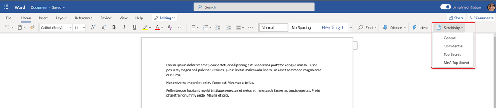
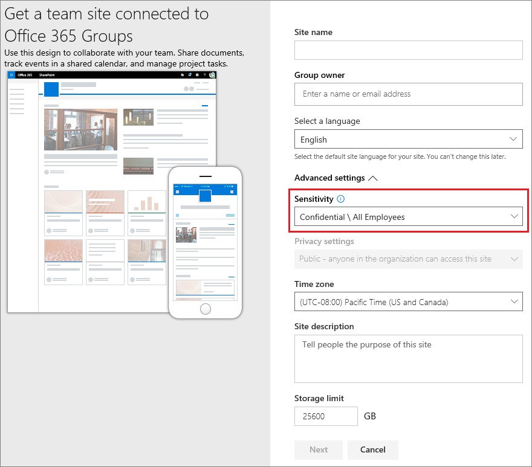
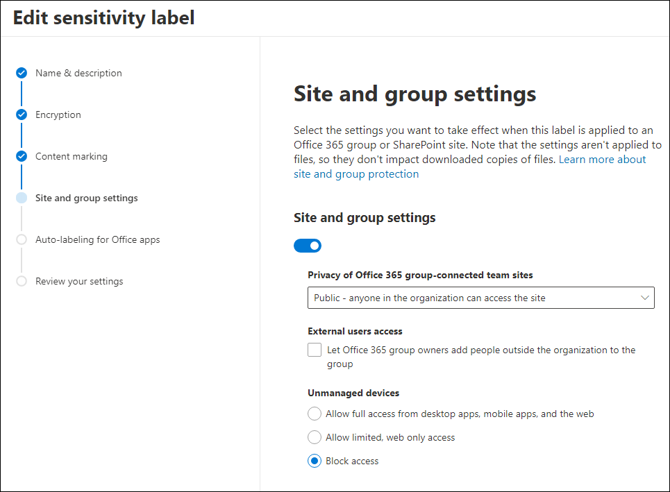
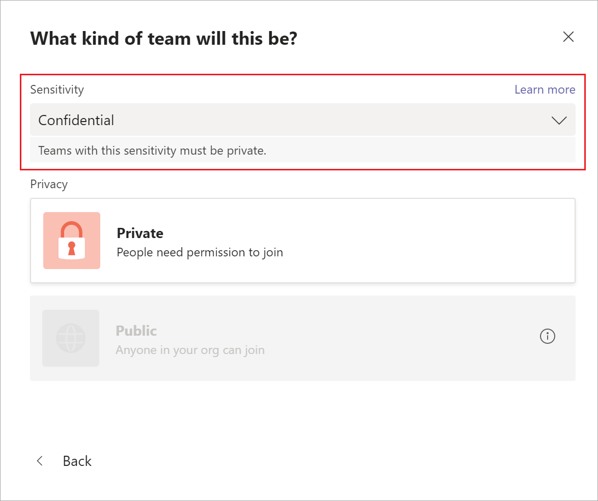
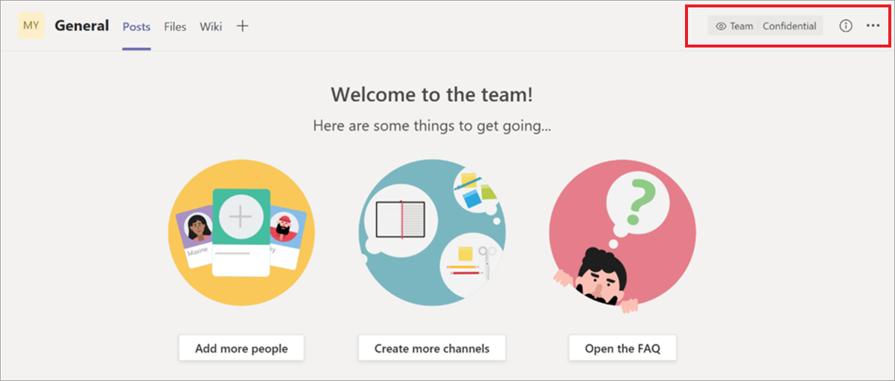
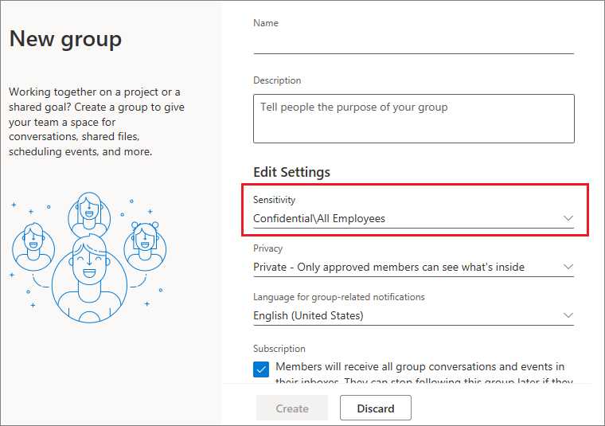
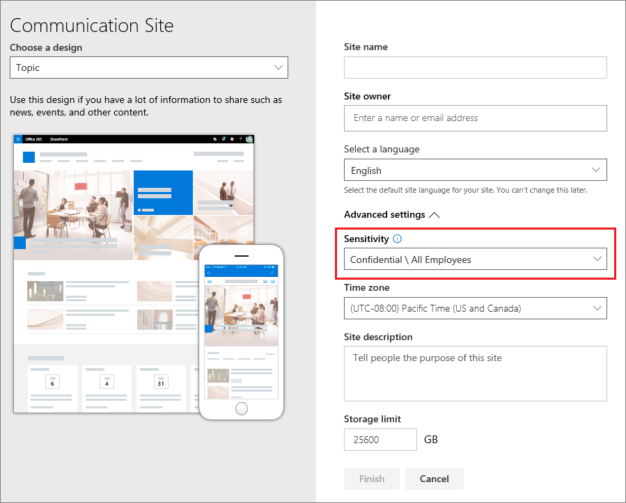
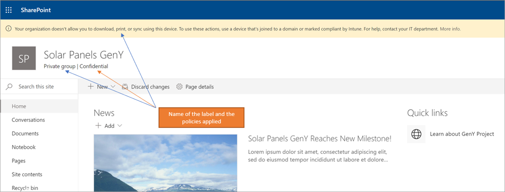
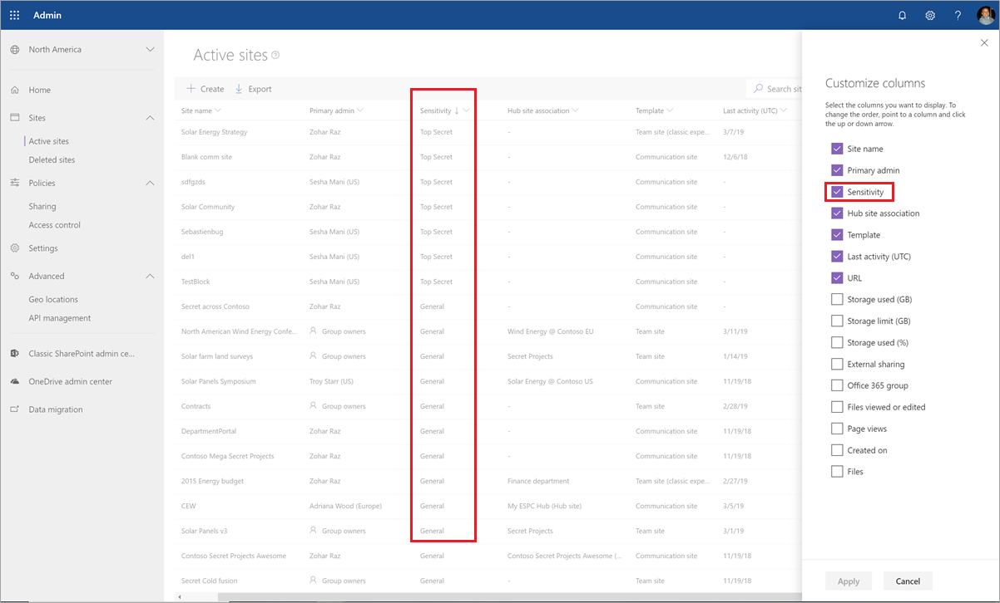

# Use sensitivity labels to protect content in Microsoft Teams, Office 365 groups, and SharePoint sites (public preview)

>*[Microsoft 365 licensing guidance for security & compliance](https://aka.ms/ComplianceSD).*

When you create sensitivity labels in the [Microsoft 365 compliance center](https://protection.office.com/), you can now apply them to the following containers: Microsoft Teams sites, Office 365 groups, and SharePoint sites. Use the following label settings to help protect the content in those containers:

- Privacy (public or private) of Office 365 group-connected teams sites
- External users access
- Access from unmanaged devices 

When you apply this label to a supported container, the label automatically applies the configured options to the connected site or group. 

Content in those containers however, do not inherit the labels for settings such as the label name, visual markings, or encryption. So that users can label their documents in SharePoint sites or team sites, [enable sensitivity labels for Office files in SharePoint and OneDrive](sensitivity-labels-sharepoint-onedrive-files.md).

## About the public preview for Microsoft Teams, Office 365 Groups, and SharePoint sites

Sensitivity labels for Microsoft Teams, Office 365 Groups, and SharePoint sites are in gradual rollout to tenants and might change before final release. This public preview doesn't work with Office 365 Content Delivery Networks (CDNs).

Before you enable this preview and configure sensitivity labels for the new settings, users can see and apply sensitivity labels in their apps. For example, from Word:



After you enable and configure this preview, users can additionally see and apply sensitivity labels to Microsoft Teams, Office 365 Groups, and SharePoint sites. For example, when you create a new team site from SharePoint:



## Enable this preview and synchronize labels

1. Because this feature uses Azure AD functionality, follow the instructions in the Azure AD documentation to enable the preview: [Assign sensitivity labels to Office 365 groups in Azure Active Directory (preview)](https://docs.microsoft.com/azure/active-directory/users-groups-roles/groups-assign-sensitivity-labels).

2. Open a PowerShell session with the **Run as Administrator** option, and connect to the Security & Compliance Center by using a work or school account that has global admin privileges. For example:
    
    ```powershell
    Set-ExecutionPolicy RemoteSigned
    $UserCredential = Get-Credential
    $Session = New-PSSession -ConfigurationName Microsoft.Exchange -ConnectionUri https://ps.compliance.protection.outlook.com/powershell-liveid/ -Credential $UserCredential -Authentication Basic -AllowRedirection
    Import-PSSession $Session -DisableNameChecking
    ```
    
    For full instructions, see [Connect to Security & Compliance Center PowerShell](/powershell/exchange/office-365-scc/connect-to-scc-powershell/connect-to-scc-powershell).

3. Run the following command to synchronize your sensitivity labels to Azure AD, so that they can be used with Office 365 Groups:
    
    ```powershell
    Execute-AzureAdLabelSync
    ```

## How to configure site and group settings when you create or edit sensitivity labels

You're now ready to create or edit sensitivity labels that you want to be available for sites and groups. Enabling the preview makes a new page visible in the sensitivity labeling wizards: **Site and group settings**

If you need help with creating or editing a sensitivity label, see the instructions from [Create and configure sensitivity labels](create-sensitivity-labels.md#create-and-configure-sensitivity-labels).

On this new **Site and group settings** page, configure the settings:

- **Privacy of Office 365 group-connected teams sites**: The default setting of **None - let user chose who can access the site** is currently rolling out to tenants. Keep this default setting when you want to protect content in the container by using the sensitivity label, but still let users configure the privacy setting themselves.
    
    Select **Public** or**Private** to set and lock the privacy setting when you apply this label to the container. Choose **Public** if you want anyone in your organization to access the team site or group where this label is applied, or **Private** if you want access to be restricted to only approved members in your organization. 
    
    The **Public** or **Private** setting replaces any previous privacy setting that might be configured for the team or group, and locks the privacy value so it can be changed only by first removing the sensitivity label from the container. After you remove the sensitivity label, the privacy setting from the label remains and users can now change it again.

- **External users access**: Control whether the group owner can [add guests to the group](/office365/admin/create-groups/manage-guest-access-in-groups).

- **Unmanaged devices**: For [unmanaged devices](/sharepoint/control-access-from-unmanaged-devices), allow full access, web only access, or block access completely. 



> [!IMPORTANT]
> Only these site and group settings take effect when you apply a label to a team, group, or site. Other label settings, such as encryption and content marking, aren't applied to the content within the team, group, or site.
> 
> Gradually rolling out to tenants: Only labels with the site and group settings will be available to select when users create teams, groups, and sites. If you can currently apply a label to a container when the label doesn't have the site and group settings enabled, only the label name is applied to the container.

If your sensitivity label isn't already published, now publish it by [adding it to a sensitivity label policy](create-sensitivity-labels.md#publish-sensitivity-labels-by-creating-a-label-policy). The users who are assigned a sensitivity label policy that includes this label will be able to select it for sites and groups.

From the label policy, only the policy setting **Apply this label by default to documents and email** is applicable when you apply this label to containers. Other policy settings are not applied, which include mandatory labeling, requiring user justification, and a link to the custom help page.

## Sensitivity label management

> [!WARNING]
> Creating, modifying, and deleting sensitivity labels that you use for Microsoft Teams, Office 365 Groups, and SharePoint sites requires careful coordination with publishing label policies to users. 

Avoid creation errors for sites and groups that can affect all users by using the following guidance.

**Creating and publishing labels:**

After a sensitivity label is created and published, it can take up to 24 hours for the label to become visible for users in teams, groups, and sites. Use the following steps to publish a label for all users in the tenant:

1. Create the sensitivity label and publish it for just a few user accounts in the tenant.

2. Wait for 24 hours.

3. After this 24 hours wait, use one of the user accounts you specified in step 1 to create a team, Office 365 group, or SharePoint site with the label that you created in step 1.

4. If there are no errors during the creation operation for step 3, publish the label for all users in your tenant. If there are errors, contact [Microsoft Support](https://docs.microsoft.com/office365/admin/contact-support-for-business-products).

**Modifying and deleting published labels:**

If you modify or delete a sensitivity label with the site and group settings enabled, and that label is included in one or more label policies, these actions can result in creation failures for all teams, groups, and sites. To avoid this situation, use the following guidance:

1. Remove the sensitivity label from all label policies that include the label.

2. Wait for 48 hours.

3. After the 48 hours wait, try creating a team, group, or site and confirm that the label is no longer visible.

4. If the sensitivity label isn't visible, you can now safely modify or delete the label. If the label is still visible, contact [Microsoft Support](https://docs.microsoft.com/office365/admin/contact-support-for-business-products).

## Assign sensitivity labels to Office 365 Groups

You're now ready to apply the sensitivity label or labels to Office 365 groups. Return to the Azure AD documentation for instructions:

- [Assign a label to a new group in Azure portal](https://docs.microsoft.com/azure/active-directory/users-groups-roles/groups-assign-sensitivity-labels#assign-a-label-to-a-new-group-in-azure-portal)

-  [Assign a label to an existing group in Azure portal](https://docs.microsoft.com/azure/active-directory/users-groups-roles/groups-assign-sensitivity-labels#assign-a-label-to-an-existing-group-in-azure-portal)

-  [Remove a label from an existing group in Azure portal](https://docs.microsoft.com/azure/active-directory/users-groups-roles/groups-assign-sensitivity-labels#remove-a-label-from-an-existing-group-in-azure-portal).

## Apply a sensitivity label to a new team

Users can select sensitivity labels when they create new teams in Microsoft Teams. When they select the label from the **Sensitivity** dropdown, the privacy setting might change to reflect the label configuration. Depending on the external users access setting you selected for the label, users can or can't add people outside the organization to the team.

[Learn more about sensitivity labels for Teams](https://docs.microsoft.com/microsoftteams/sensitivity-labels)



After you create the team, the sensitivity label appears in the upper-right corner of all channels.



The service automatically applies the same sensitivity label to the Office 365 group and the connected SharePoint team site.

## Apply a sensitivity label to a new group in Outlook on the web

In Outlook on the web, when you create a new group, you can select or change the **Sensitivity** option for published labels:



## Apply a sensitivity label to a new site

Admins and end users can select sensitivity labels when they [create modern team sites and communication sites](/sharepoint/create-site-collection), and expand **Advanced settings**:



The dropdown box displays the label names for the selection, and the help icon displays all the label names with their tooltip, which can help users determine the correct label to apply.

When the label is applied, and users browse to the site, they see the name of the label and applied policies. For example, this site has been labeled as **Confidential**, and the privacy setting is set to **Private**:



## View sensitivity labels in the SharePoint admin center

To view the applied sensitivity labels, use the **Active sites** page in the new SharePoint admin center. You might need to first add the **Sensitivity** column:



[Learn more about managing sites in the new SharePoint admin center](/sharepoint/manage-sites-in-new-admin-center).

## Change site and group settings for a label

Whenever you make a change to site and group settings for a label, you must run the following PowerShell commands so that your teams, sites, and groups can use the new settings. As a best practice, don't the change site and group settings for a label after you've applied the label to several teams, groups, or sites.

1. In a PowerShell session that you open with the **Run as Administrator** option, run the following commands to connect to Security & Compliance Center PowerShell and get the list of sensitivity labels and their GUIDs.
    
    ```powershell
    Set-ExecutionPolicy RemoteSigned
    $UserCredential = Get-Credential
    $Session = New-PSSession -ConfigurationName Microsoft.Exchange -ConnectionUri https://ps.compliance.protection.outlook.com/powershell-liveid -Authentication Basic -AllowRedirection -Credential $UserCredential
    Import-PSSession $Session
    Get-Label |ft Name, Guid
    ```

2. Make a note of the GUID for the label or labels you have changed.

3. Now connect to Exchange Online PowerShell and run the Get-UnifiedGroup cmdlet, specifying your label GUID in place of the example GUID of "e48058ea-98e8-4940-8db0-ba1310fd955e": 
    
    ```powershell
    $UserCredential = Get-Credential
    $Session = New-PSSession -ConfigurationName Microsoft.Exchange -ConnectionUri https://outlook.office365.com/powershell-liveid/ -Credential $UserCredential -Authentication Basic -AllowRedirection
    Import-PSSession $Session
    $Groups= Get-UnifiedGroup | Where {$_.SensitivityLabel  -eq "e48058ea-98e8-4940-8db0-ba1310fd955e"}
    ```

4. For each group, reapply the sensitivity label, specifying your label GUID in place of the example GUID of "e48058ea-98e8-4940-8db0-ba1310fd955e":
    
    ```powershell
    foreach ($g in $groups)
    {Set-UnifiedGroup -Identity $g.Identity -SensitivityLabelId "e48058ea-98e8-4940-8db0-ba1310fd955e"}
    ```

## Support for the sensitivity labels

You can use the sensitivity labels that you've configured for site and group settings with the following apps and services:

- SharePoint Online
- Teams
- Outlook on the web
- SharePoint admin center
- Azure AD admin center

Other apps and services that you can't currently use the sensitivity labels that you've configured for site and group settings include:

- Outlook for the Mac
- Outlook mobile
- Outlook desktop for Windows
- Forms
- Dynamics 365
- Yammer
- Stream
- Planner
- Project
- PowerBI
- Teams admin center
- Microsoft 365 admin center
- Exchange admin center


## Classic Azure AD site classification

Office 365 no longer supports the old classifications for new groups and SharePoint sites when you enable this preview. However, existing groups and sites still display the old classifications unless you convert them to use sensitivity labels. Old classifications include the "modern" sites classification you set up, possibly through Azure AD PowerShell or the PnP Core library, that defined values for the `ClassificationList` setting.

For example, in PowerShell:

```powershell
   ($setting["ClassificationList"])
```

For more information about the old classification method, see [SharePoint "modern" sites classification](https://docs.microsoft.com/sharepoint/dev/solution-guidance/modern-experience-site-classification).

To convert your old classifications to sensitivity labels, do one of the following:

- Use existing labels: Specify the label settings you want for sites and groups by editing existing sensitivity labels that are already published.

- Create new labels: Specify the label settings you want for sites and groups by creating and publishing new sensitivity labels that have the same names as your existing classifications.

Then: 

1. Use PowerShell to apply the sensitivity labels to existing Office 365 groups and SharePoint sites by using name mapping. See the next section for instructions.

2. Remove the old classifications from the existing groups and sites.

Although you can't prevent users from creating new groups in apps and services that don't yet support sensitivity labels, you can run a recurring PowerShell script to look for new groups that users have created with the old classifications, and convert these to use sensitivity labels. 

#### Use PowerShell to convert classifications for Office 365 groups to sensitivity labels

1. Ensure that you're running SharePoint Online Management Shell version 16.0.19418.12000 or above. If you already have the latest version, skip to step 4.

2. If you have installed a previous version of the SharePoint Online Management Shell from PowerShell gallery, you can update the module by running the following cmdlet.
    
    ```PowerShell
    Update-Module -Name Microsoft.Online.SharePoint.PowerShell
    ```

3. If you have installed a previous version of the SharePoint Online Management Shell from the Microsoft Download Center, go to **Add or remove programs** and uninstall the SharePoint Online Management Shell. Then, install the latest SharePoint Online Management Shell from the [Download Center](https://go.microsoft.com/fwlink/p/?LinkId=255251).

4. Using a work or school account that has global administrator or SharePoint admin privileges in Office 365, connect to SharePoint Online Management Shell. To learn how, see [Getting started with SharePoint Online Management Shell](/powershell/sharepoint/sharepoint-online/connect-sharepoint-online).

5. Run the following commands to get the list of sensitivity labels and their GUIDs.

    ```PowerShell
    Set-ExecutionPolicy RemoteSigned
    $UserCredential = Get-Credential
    $Session = New-PSSession -ConfigurationName Microsoft.Exchange -ConnectionUri https://ps.compliance.protection.outlook.com/powershell-liveid -Authentication Basic -AllowRedirection -Credential $UserCredential
    Import-PSSession $Session
    Get-Label |ft Name, Guid  
    ```

6. Make a note of the GUIDs for the sensitivity labels you want to apply to your Office 365 groups.

7. Use the following command as an example to get the list of groups that currently have the classification of "General":

   ```PowerShell
   $Groups= Get-UnifiedGroup | Where {$_.classification -eq "General"}
   ```

6. For each group, add the new sensitivity label GUID. For example:

    ```PowerShell
    foreach ($g in $groups)
    {Set-UnifiedGroup -Identity $g.Identity -SensitivityLabelId "457fa763-7c59-461c-b402-ad1ac6b703cc"}
    ```

## Auditing sensitivity label activities

If somebody uploads a document to a site that's protected with a sensitivity label and their document has a [higher priority](sensitivity-labels.md#label-priority-order-matters) sensitivity label than the sensitivity label applied to the site, this action isn't blocked. For example, you've applied the **General** label to a SharePoint site, and somebody uploads to this site a document labeled **Confidential**. Because a sensitivity label with a higher priority identifies content that is more sensitivity than content that has a lower priority order, this situation could be a security concern.

Although the action isn't blocked, it is audited, so you can identify documents that have this misalignment of label priority and take action if needed. For example, delete or move the uploaded document from the site. 

It wouldn't be a security concern if the document has a lower priority sensitivity label than the sensitivity label applied to the site. For example, a document labeled **General** is uploaded to a site labeled **Confidential**. In this scenario, an auditing event isn't generated.

To search the audit log for this event, look for **Detected document sensitivity mismatch** from the **File and page activities** category. 

When somebody adds or removes a sensitivity label to or from a site or group, these activities are also audited. These events can be found in the [Sensitivity label activities](search-the-audit-log-in-security-and-compliance.md#sensitivity-label-activities) category. 

For instructions to search the audit log, see [Search the audit log in the Security & Compliance Center](search-the-audit-log-in-security-and-compliance.md).

## Troubleshoot sensitivity label deployment

Having problems with sensitivity labels for Microsoft Teams, Office 365 groups, and SharePoint sites? Check the following:

### Labels not visible after publishing
If you experience issues when you create a site or Office 365 group after you enable these settings or modify a sensitivity label's name or tooltip, wait a few hours after saving the label changes, and then try to create the team or group again. For information, see [Schedule roll-out after you create or change a sensitivity label](sensitivity-labels-sharepoint-onedrive-files.md#schedule-roll-out-after-you-create-or-change-a-sensitivity-label).

If you still can't see the new sensitivity label from SharePoint Online, contact [Microsoft Support](https://docs.microsoft.com/office365/admin/contact-support-for-business-products).

### Team, group, or SharePoint site creation errors
If you experience creation errors during the public preview, you can turn off sensitivity labels for Microsoft Teams, Office 365 groups, and SharePoint sites by using the same instructions from [Enable sensitivity label support in PowerShell](https://docs.microsoft.com/azure/active-directory/users-groups-roles/groups-assign-sensitivity-labels#enable-sensitivity-label-support-in-powershell). However, to disable the preview, in step 5, disable the feature by using `$setting["EnableMIPLabels"] = "False"`.

## Additional resources

See the webinar recording and answered questions for [Using Sensitivity labels with Microsoft Teams, O365 Groups and SharePoint Online sites](https://techcommunity.microsoft.com/t5/security-privacy-and-compliance/using-sensitivity-labels-with-microsoft-teams-o365-groups-and/ba-p/1221885#M1380).

