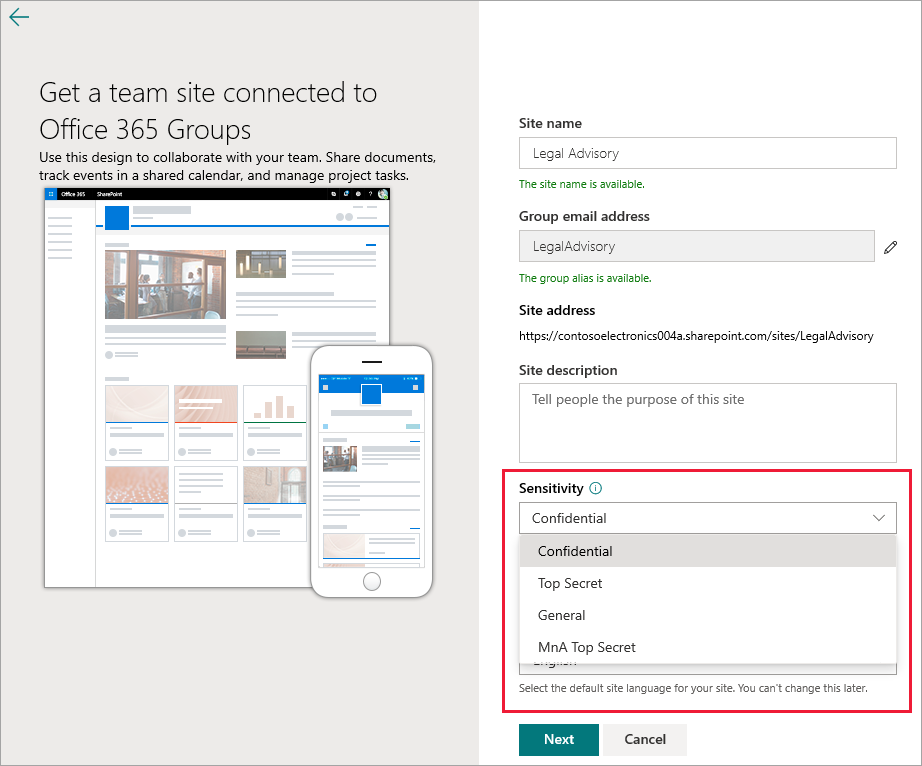
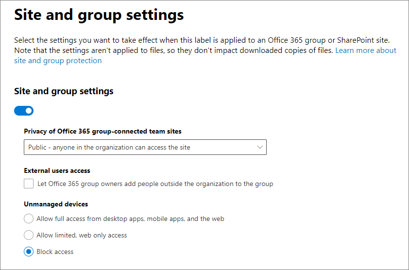
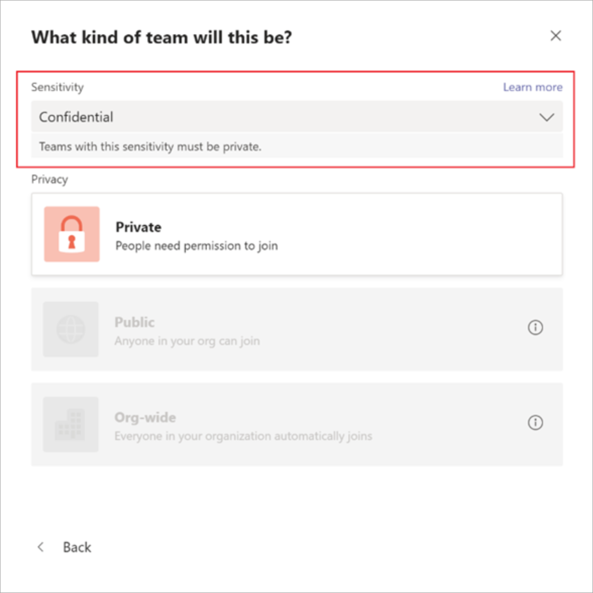
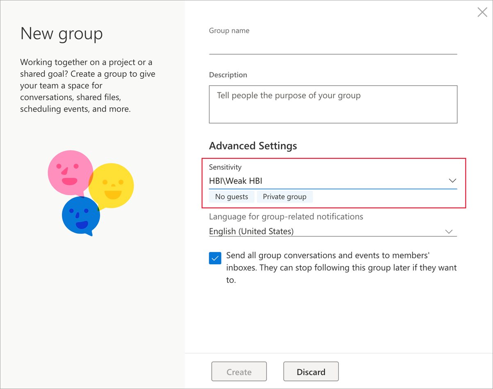
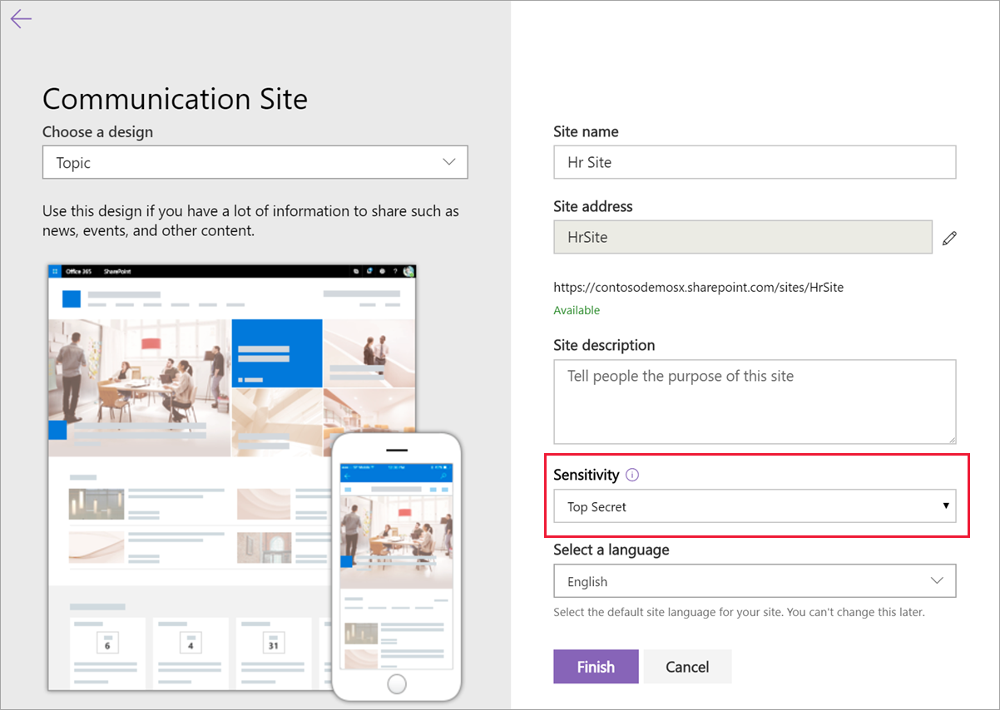

# Use sensitivity labels with Microsoft Teams, Office 365 groups, and SharePoint sites (public preview)

When you create sensitivity labels in the [Microsoft 365 compliance center](https://protection.office.com/), you can now apply them to containers that include Microsoft Teams, Office 365 groups, and SharePoint sites. Use label settings to control the following options:

- Privacy of Office 365 group-connected teams sites (public or private)
- External users access
- Access from unmanaged devices 

When you apply this label to a team or group, the label automatically applies the configured options to the connected SharePoint site or team site. 

Content in those sites however, do not inherit the labels for settings such as the label name, visual markings, or encryption. For this functionality, [enable sensitivity labels for Office files in SharePoint and OneDrive](sensitivity-labels-sharepoint-onedrive-files.md).

## About the public preview for Microsoft Teams, Office 365 groups, and SharePoint sites

Sensitivity labels for Microsoft Teams, Office 365 groups, and SharePoint sites are gradually rolling out to tenants and might change before final release. This public preview doesn't work with Office 365 Content Delivery Networks (CDNs).

Before you enable this preview and configure sensitivity labels for the new settings, users can see and apply sensitivity labels in their apps. For example, from Word:


After you enable and configure this preview, users can additionally see and apply sensitivity labels to Microsoft Teams, Office 365 groups, and SharePoint sites. For example, when you create a new team site from SharePoint:




## Enable this preview and synchronize labels

This feature uses Azure AD functionality to enable the preview. Follow the instructions in the Azure AD documentation: [Enable sensitivity label support in PowerShell](https://docs.microsoft.com/azure/active-directory/users-groups-roles/groups-assign-sensitivity-labels#enable-sensitivity-label-support-in-powershell).

Then, in a PowerShell session, connect to the Security & Compliance Center by using a work or school account that has global admin privileges. For instructions, see [Connect to Office 365 Security & Compliance Center PowerShell](/powershell/exchange/office-365-scc/connect-to-scc-powershell/connect-to-scc-powershell).

Run the following commands to synchronize your labels to Azure AD, so that they can used with Office 365 groups:

```powershell
Set-ExecutionPolicy RemoteSigned
$UserCredential = Get-Credential
$Session = New-PSSession -ConfigurationName Microsoft.Exchange -ConnectionUri https://ps.compliance.protection.outlook.com/powershell-liveid/ -Credential $UserCredential -Authentication Basic -AllowRedirection
Import-PSSession $Session -DisableNameChecking
Execute-AzureAdLabelSync
```

## Set site and group settings when you create or edit sensitivity labels

You're now ready to create or edit sensitivity labels that you want to be available for sites and groups. Enabling the preview makes a new page visible in the sensitivity labeling wizards: **Site and group settings**

If you need help creating or editing a sensitivity label, see the instructions from [Create and configure sensitivity labels](create-sensitivity-labels.md#create-and-configure-sensitivity-labels).

On this new **Site and group settings** page, configure the settings:

- **Privacy of Office 365 group-connected teams sites**: Choose **Private** when you want only approved members in your organization to access the site, and **Public** when anyone in your organization can access the site.

- **External users access**: Control whether the group owner can [add guests to the group](/office365/admin/create-groups/manage-guest-access-in-groups).

- **Unmanaged devices**: For [unmanaged devices](/sharepoint/control-access-from-unmanaged-devices), allow full access, web only access, or block access completely. 



> [!IMPORTANT]
> Only these site and group settings take effect when you apply a label to a team, group, or site. Other label settings, such as encryption and content marking, aren't applied to the content within the team, group, or site.
> 
> Similarly, if you create a label and don't turn on these site and group settings, the label will still be available when users create teams, groups, and sites, but it will classify without applying any settings.

If your label isn't already published, now publish it by [adding it to a label policy](create-sensitivity-labels.md#publish-sensitivity-labels-by-creating-a-label-policy).

## Assign sensitivity labels to Office 365 groups

You're now ready to apply the sensitivity label or labels to Office 365 groups. Return to the Azure AD documentation for instructions:

- [Assign a label to a new group in Azure portal](https://docs.microsoft.com/azure/active-directory/users-groups-roles/groups-assign-sensitivity-labels#assign-a-label-to-a-new-group-in-azure-portal)

-  [Assign a label to an existing group in Azure portal](https://docs.microsoft.com/azure/active-directory/users-groups-roles/groups-assign-sensitivity-labels#assign-a-label-to-an-existing-group-in-azure-portal)

-  [Remove a label from an existing group in Azure portal](https://docs.microsoft.com/azure/active-directory/users-groups-roles/groups-assign-sensitivity-labels#remove-a-label-from-an-existing-group-in-azure-portal).

## Sensitivity label management

> [!WARNING]
> Creating, modifying, and deleting sensitivity labels that you use for Microsoft Teams, Office 365 groups, and SharePoint sites requires careful coordination with publishing label policies to users. 

Avoid creation errors for sites and groups that can affect all users by using the following guidance.

**Creating and publishing labels:**

After a sensitivity label is created and published, it can take up to 24 hours for the label to become visible for users in teams, groups, and sites. Use the following steps to publish a label for all users in the tenant:

1. Create the sensitivity label and publish it for just a few user accounts in the tenant.

2. Wait for 24 hours.

3. After this 24 hours wait, use one of the user accounts you specified in step 1 to create a team, Office 365 group, or SharePoint site with the label that you created in step 1.

4. If there are no errors during the creation operation for step 3, publish the label for all users in your tenant. If there are errors, contact [Microsoft Support](https://docs.microsoft.com/office365/admin/contact-support-for-business-products).

**Modifying and deleting published labels:**

If you modify or delete a sensitivity label that is included in one or more label policies, these actions can result in creation failures for all teams, groups, and sites. To avoid this situation, use the following guidance:

1. Remove the sensitivity label from all label policies that include the label.

2. Wait for 48 hours.

3. After the 48 hours wait, try creating a team, group, or site and confirm that the label is no longer visible.

4. If the sensitivity label isn't visible, you can now safely modify or delete the label. If the label is still visible, contact [Microsoft Support](https://docs.microsoft.com/office365/admin/contact-support-for-business-products).

## Troubleshoot sensitivity label deployment

### Labels not visible after publishing
If you experience issues when you create a team or Office 365 group after you enable these settings or modify a sensitivity label's description, save the label, wait a few hours, and then try to create the team or group again. For information, see [Schedule roll-out after you create or change a sensitivity label](sensitivity-labels-sharepoint-onedrive-files.md#schedule-roll-out-after-you-create-or-change-a-sensitivity-label).

If you are still not able to see the new sensitivity label from SharePoint Online, contact [Microsoft Support](https://docs.microsoft.com/office365/admin/contact-support-for-business-products).

### Team, group, or SharePoint site creation errors
If you experience creation errors during the public preview, you have two options:

- Ensure that sensitivity labels are not mandatory for any user.

- You can turn off sensitivity labels for Microsoft Teams, Office 365 groups, and SharePoint sites by using the same instructions from the [Enable this preview](#enable-this-preview-and-synchronize-labels) section on this page. However, to disable the preview, search for the line `$setting["EnableMIPLabels"] = "True"`, and change the **True** value to **False**.

## Apply a sensitivity label to a new team

Users can select sensitivity labels when they create new teams in Microsoft Teams. When they select the sensitivity level, the privacy setting changes as necessary. Depending on the external users access setting you selected for the label, users can or can't add people outside the organization to the team.

[Learn more about sensitivity labels for Teams](https://docs.microsoft.com/microsoftteams/sensitivity-labels)



After you create the team, the sensitivity label appears in the upper-right corner of all channels.


The service automatically applies the same sensitivity label to the Office 365 group and the connected SharePoint team site.

## Apply a sensitivity label to a new group in Outlook on the web

In Outlook on the web, when you create a new group, you can select or change the **Sensitivity** option for published labels:



## Apply a sensitivity label to a new site

Admins and end users can select sensitivity labels when they [create modern team sites and communication sites](/sharepoint/create-site-collection).

When users create modern team and communication sites, a sensitivity label is already selected by default. Users can select the help icon to learn more about the labels.



When users browse to the site, they can see the name of the label and applied policies.


## View sensitivity labels in the SharePoint admin center

To view the applied sensitivity labels, use the **Active sites** page in the new SharePoint admin center. You might need to first add the **Sensitivity** column:


[Learn more about managing sites in the new SharePoint admin center](/sharepoint/manage-sites-in-new-admin-center).

## Change site and group settings for a label

Whenever you make a change to site and group settings for a label, you must run the following PowerShell commands so that your teams, sites, and groups can use the new settings. As a best practice, don't the change site and group settings for a label after you've applied the label to several teams, groups, or sites.

1. Run the following commands to connect to Office 365 Security & Compliance Center PowerShell and get the list of sensitivity labels and their GUIDs.
    
    ```powershell
    Set-ExecutionPolicy RemoteSigned
    $UserCredential = Get-Credential
    $Session = New-PSSession -ConfigurationName Microsoft.Exchange -ConnectionUri https://ps.compliance.protection.outlook.com/powershell-liveid -Authentication Basic -AllowRedirection -Credential $UserCredential
    Import-PSSession $Session
    Get-Label |ft Name, Guid
    ```

2. Make a note of the GUID for the label or labels you have changed.

3. Now connect to Exchange Online PowerShell and run the Get-UnifiedGroup cmdlet, specifying your label GUID in place of the example GUID of "e48058ea-98e8-4940-8db0-ba1310fd955e": 
    
    ```powershell
    Set-ExecutionPolicy RemoteSigned
    $UserCredential = Get-Credential
    $Session = New-PSSession -ConfigurationName Microsoft.Exchange -ConnectionUri https://outlook.office365.com/powershell-liveid/ -Credential $UserCredential -Authentication Basic -AllowRedirection
    Import-PSSession $Session
    $Groups= Get-UnifiedGroup | Where {$_.SensitivityLabel  -eq "e48058ea-98e8-4940-8db0-ba1310fd955e"}
    ```

4. For each group, reapply the sensitivity label, specifying your label GUID in place of the example GUID of "e48058ea-98e8-4940-8db0-ba1310fd955e":
    
    ```powershell
    foreach ($g in $groups)
    {Set-UnifiedGroup -Identity $g.Identity -SensitivityLabelId "e48058ea-98e8-4940-8db0-ba1310fd955e"}
    ```

## Support for the sensitivity labels

You can use the sensitivity labels that you've configured for site and group settings with the following apps and services:

- SharePoint Online
- Teams
- Outlook on the web
- SharePoint admin center
- Azure AD admin center

Other apps and services that you can't currently use the sensitivity labels that you've configured for site and group settings include:

- Outlook for the Mac
- Outlook mobile
- Outlook desktop for Windows
- Forms
- Dynamics 365
- Yammer
- Stream
- Planner
- Project
- PowerBI
- Teams admin center
- Microsoft 365 admin center
- Exchange admin center

## Classic Azure AD site classification

Office 365 no longer supports the old classifications for new groups and SharePoint sites when you enable this preview. However, existing groups and sites still display the old classifications unless you convert them to use sensitivity labels. Old classifications include the "modern" sites classification you set up, possibly through Azure AD PowerShell or the PnP Core library, that defined values for the `ClassificationList` setting.

For example, in PowerShell:

```powershell
   ($setting["ClassificationList"])
```

For more information about the old classification method, see [SharePoint "modern" sites classification](https://docs.microsoft.com/sharepoint/dev/solution-guidance/modern-experience-site-classification).

To convert your old classifications to sensitivity labels, do one of the following:

- Use existing labels: Specify the label settings you want for sites and groups by editing existing sensitivity labels that are already published.

- Create new labels: Specify the label settings you want for sites and groups by creating and publishing new sensitivity labels that have the same names as your existing classifications.

Then: 

1. Use PowerShell to apply the sensitivity labels to existing Office 365 groups and SharePoint sites by using name mapping. See the next section for instructions.

2. Remove the old classifications from the existing groups and sites.

Although you can't prevent users from creating new groups in apps and services that don't yet support sensitivity labels, you can run a recurring PowerShell script to look for new groups that users have created with the old classifications, and convert these to use sensitivity labels. 

#### Use PowerShell to convert classifications for Office 365 groups to sensitivity labels

1. Ensure that you're running SharePoint Online Management Shell version 16.0.19418.12000 or above. If you already have the latest version, skip to step 4.

2. If you have installed a previous version of the SharePoint Online Management Shell from PowerShell gallery, you can update the module by running the following cmdlet.
    
    ```PowerShell
    Update-Module -Name Microsoft.Online.SharePoint.PowerShell
    ```

3. If you have installed a previous version of the SharePoint Online Management Shell from the Microsoft Download Center, go to **Add or remove programs** and uninstall the SharePoint Online Management Shell. Then, install the latest SharePoint Online Management Shell from the [Download Center](https://go.microsoft.com/fwlink/p/?LinkId=255251).

4. Using a work or school account that has global administrator or SharePoint admin privileges in Office 365, connect to SharePoint Online Management Shell. To learn how, see [Getting started with SharePoint Online Management Shell](/powershell/sharepoint/sharepoint-online/connect-sharepoint-online).

5. Run the following commands to get the list of sensitivity labels and their GUIDs.

    ```PowerShell
    Set-ExecutionPolicy RemoteSigned
    $UserCredential = Get-Credential
    $Session = New-PSSession -ConfigurationName Microsoft.Exchange -ConnectionUri https://ps.compliance.protection.outlook.com/powershell-liveid -Authentication Basic -AllowRedirection -Credential $UserCredential
    Import-PSSession $Session
    Get-Label |ft Name, Guid  
    ```

6. Make a note of the GUIDs for the sensitivity labels you want to apply to your Office 365 groups.

7. Use the following command as an example to get the list of groups that currently have the classification of "General":

   ```PowerShell
   $Groups= Get-UnifiedGroup | Where {$_.classification -eq "General"}
   ```

6. For each group, add the new sensitivity label GUID. For example:

    ```PowerShell
    foreach ($g in $groups)
    {Set-UnifiedGroup -Identity $g.Identity -SensitivityLabelId "457fa763-7c59-461c-b402-ad1ac6b703cc"}
    ```
