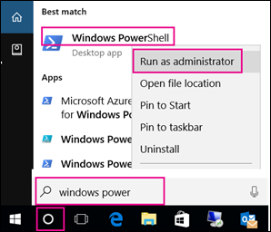

# Use sensitivity labels with Microsoft Teams, Office 365 groups, and SharePoint sites (public preview)

When you create sensitivity labels in the [Microsoft 365 compliance center](https://protection.office.com/), you can now apply them to Microsoft Teams, Office 365 groups, and SharePoint sites. You can associate policies with the labels to control:

- Public/private settings
- Guest access
- Access from unmanaged devices

When you apply a label to a team or group, the label automatically applies to the connected SharePoint team site and the other way around.

Now, You can also enable sensitivity labels for Office files in SharePoint and OneDrive. [Learn more](sensitivity-labels-sharepoint-onedrive-files.md).

## About the public preview for Microsoft Teams, Office 365 groups, and SharePoint sites

Sensitivity labels for Microsoft Teams, Office 365 groups, and SharePoint sites is gradually rolling out to tenants and might change before final release.

## Overview

When you publish sensitivity labels, users across Office 365 have access to the same list of labels.

These images show:

- How the list appears when you create a new team site from SharePoint

- When you view the list in Word


## Install the preview version of the Azure Active Directory PowerShell for Graph

These procedures require the preview version of the Azure Active Directory PowerShell for Graph. The GA version will not work.


> [!IMPORTANT]
> You cannot install both the preview and GA versions on the same computer at the same time. You can install the module on Windows 10 and Windows Server 2016.

  
As a best practice, we recommend  *always*  staying current: uninstall the old AzureADPreview or old AzureAD version and get the latest one. 
  
1. In your search bar, type Windows PowerShell.
    
2. Right-click on **Windows PowerShell** and select **Run as Administrator**.
    
    
  
2. Check installed module:
    
    ```
    Get-InstalledModule -Name "AzureAD*"
    ```

3. To uninstall a previous version of AzureADPreview or AzureAD, run the following command:
  
    ```
    Uninstall-Module AzureADPreview
    ```

    or
  
    ```
    Uninstall-Module AzureAD
    ```

4. To install the latest version of AzureADPreview, run the following command:
  
    ```
    Install-Module AzureADPreview
    ```

    At the message about an untrusted repository, type **Y**. It will take approximately one minute for the new module to install.


## Enable this preview by using Azure PowerShell

1. Sign in to Azure as a global admin by using Azure PowerShell. For instructions, see [Sign in with Azure PowerShell](/powershell/azure/authenticate-azureps).

2. Run the following command:

```powershell
  Connect-AzureAD
  $setting=(Get-AzureADDirectorySetting | where -Property DisplayName -Value "Group.Unified" -EQ)
  if ($setting -eq $null)
  {
    $template = Get-AzureADDirectorySettingTemplate -Id 62375ab9-6b52-47ed-826b-58e47e0e304b
    $setting = $template.CreateDirectorySetting()
    $setting["EnableMIPLabels"] = "True"
    New-AzureADDirectorySetting -DirectorySetting $setting
  }
  else
  {
    $setting["EnableMIPLabels"] = "True"
    Set-AzureADDirectorySetting -Id $setting.Id -DirectorySetting $setting
  }
```


Office 365 no longer uses the old classifications for new groups and SharePoint sites when you enable this preview. If you used [Azure AD site classification](/sharepoint/dev/solution-guidance/modern-experience-site-classification) ($setting["ClassificationList"]), existing groups and sites still display the old classifications. To display the new classifications, convert them. For information about how to convert them, see [If you used classic Azure AD site classification](#if-you-used-classic-azure-ad-site-classification).

## Set site and group settings when you create sensitivity labels

After you enable the preview, follow these steps:

1. In the Microsoft 365 compliance center, select **Classification** > **Sensitivity labels**.

2. Select **Create a label**.

3. Select the options you want, and then on the **Site and group settings** tab, choose:

    - Privacy (Public/Private): Private means only approved members in your organization can see what's inside the group. Anyone else in your organization can't see what's in the group. [Learn more](https://support.office.com/article/36236e39-26d3-420b-b0ac-8072d2d2bedc)
    - Guest access: You can control if guests can be added to a group. [Learn about managing guest access in Office 365 Groups](/office365/admin/create-groups/manage-guest-access-in-groups)
    - Unmanaged devices: This setting lets you block or limit access to SharePoint content from devices that aren't hybrid AD joined or compliant in Intune. If you select Unmanaged devices, you need to go to Azure AD to finish setting up the policy. For info, see [Control access from unmanaged devices](/sharepoint/control-access-from-unmanaged-devices).


> [!IMPORTANT]
> Only the site and group settings take effect when you apply a label to a team, group, or site. Other settings, such as encryption and content marking, aren't applied to all content within the team, group, or site. Similarly, if you create a label and don't turn on site and group settings, the label will still be available when users create teams, groups, and sites, but it won't do anything when users apply it.

[Learn how to publish a sensitivity label](/microsoft-365/compliance/sensitivity-labels#what-label-policies-can-do)

## Apply a sensitivity label to a new team

Users can select sensitivity labels when they create new teams in Microsoft Teams. When they select the sensitivity level, the privacy setting changes as necessary. Depending on the guest access setting you selected for the label, users can or can't add people outside the organization to the team.


After you create the team, the sensitivity label appears in the upper-right corner of all channels.


The service automatically applies the same sensitivity label to the Office 365 group and the connected SharePoint team site.

## Apply a sensitivity label to a new group

In Outlook on the web, the new **Sensitivity** box contains published labels. If users want more info, they can click the help icon to read details about the available labels and associated policies.


## Apply a sensitivity label to a new site

Admins and end users can select sensitivity labels when they create modern team sites and communication sites.

[Learn how to create a site in the new SharePoint admin center](/sharepoint/create-site-collection)

When users create modern team and communication sites, a sensitivity label is already selected by default. Users can select the help icon to learn more about the labels.


When users browse to the site, they can see the name of the label and applied policies.


## Manage sensitivity labels in the SharePoint admin center

To view and edit the labels, use the Active sites page in the new SharePoint admin center.


[Learn more about managing sites in the new SharePoint admin center](/sharepoint/manage-sites-in-new-admin-center).

## Change site and group settings for a label

As a best practice, don't change settings after you've applied a label to several teams, groups, or sites. If you must make a change, you'll need to use an Azure AD PowerShell script to manually apply updates. This method ensures all existing teams, sites, and groups enforce the new setting.

## Support for the new sensitivity labels

The following apps and services support the sensitivity labels in this preview:

- Microsoft 365 compliance center
- SharePoint
- Outlook on the web
- Teams
- SharePoint admin center
- Azure AD admin center

You can't use the following apps and services to create Office 365 groups with the new sensitivity labels:

- Outlook for the Mac
- Outlook mobile  
- Outlook desktop for Windows
- Forms  
- Dynamics 365  
- Yammer  
- Stream  
- Planner  
- Project  
- PowerBI  
- Teams admin center  
- Microsoft 365 admin center  
- Exchange admin center

## If you used classic Azure AD site classification

Office 365 no longer supports the old classifications for new groups and SharePoint sites when you enable this preview. However, existing groups and sites still display the old classifications unless you convert them. Old classifications include the "modern" sites classification you set up, possibly through Azure AD PowerShell or the PnP Core library, that defined values for the `ClassificationList` setting.

For example, in PowerShell:

```powershell
   ($setting["ClassificationList"])
```

For more information about the old classification method, see [SharePoint "modern" sites classification](https://docs.microsoft.com/sharepoint/dev/solution-guidance/modern-experience-site-classification).

Based on your current deployment, you have two options to convert your old classifications to the new classifications.

### If you never used sensitivity labels (unified Microsoft Information Protection labels) for files and email

We recommend that you:

1. Create new sensitivity labels in the Microsoft 365 compliance center that have the same names as your existing classifications.
2. Use PowerShell to apply the new labels to existing Office 365 groups and SharePoint sites using name mapping.
3. Delete the old classifications.

Apps and services that support the new sensitivity labels will show them. You create new teams, groups, and sites with the new labels. Users can still create groups from apps and services that don't support the new labels. However, users can't apply a label to these groups. Use PowerShell to apply the new sensitivity labels to these groups.

You can keep your old classifications; however, we highly recommend using PowerShell to apply the new sensitivity labels to these groups.

Apps and services that support the new sensitivity labels will get created with the new labels. When users create groups from apps and services that don't support the new labels, they can select a classification.

### If you use sensitivity labels (unified Microsoft Information Protection labels) for files and email

As soon as you enable this preview, go to each label in the Microsoft 365 compliance center and apply the policies you want for sites and groups. Users will start seeing your existing labels available for sites and groups.

### Prepare the SharePoint Online Management Shell before you relabel Office 365 groups

Before you apply new labels, ensure that you're running the latest SharePoint Online Management Shell. If you already have the latest version, you can go ahead and [Relabel Office 365 groups with new sensitivity labels](#relabel-office-365-groups-with-new-sensitivity-labels).

To prepare the SharePoint Online Management Shell for the preview:

1. If you installed a previous version of the SharePoint Online Management Shell, go to **Add or remove programs** and uninstall “SharePoint Online Management Shell”.

2. In a web browser, go to the Download Center page and [Download the latest SharePoint Online Management Shell](https://go.microsoft.com/fwlink/p/?LinkId=255251).

3. Select your language and then click **Download**.

4. Choose between the x64 and x86 .msi file. Download the x64 file if you run the 64-bit version of Windows or the x86 file if you’re run the 32-bit version. If you don’t know, see [Which version of Windows operating system am I running?](https://support.microsoft.com/help/13443/windows-which-operating-system).

5. After you download the file, run the file and follow the steps in the Setup Wizard.

### Relabel Office 365 groups with new sensitivity labels

1. Ensure that you're using the latest version of the SharePoint Online Management Shell. For instructions, see [Prepare the SharePoint Online Management Shell before you relabel Office 365 groups](#prepare-the-sharepoint-online-management-shell-before-you-relabel-office-365-groups).

2. Using a work or school account that has global administrator or SharePoint admin privileges in Office 365, connect to SharePoint Online Management Shell. To learn how, see [Getting started with SharePoint Online Management Shell](/powershell/sharepoint/sharepoint-online/connect-sharepoint-online).

3. Run the following command to get the list of sensitivity labels and their GUIDs.

    ```PowerShell
    Set-ExecutionPolicy RemoteSigned
    $UserCredential = Get-Credential
    $Session = New-PSSession -ConfigurationName Microsoft.Exchange -ConnectionUri https://ps.compliance.protection.outlook.com/powershell-liveid -Authentication Basic -AllowRedirection -Credential $UserCredential
    Import-PSSession $Session
    Get-Label |ft Name, Guid  
    ```

4. Make a note of the GUID for the label you want to overwrite. For example, the "General" label.

5. Use the following command to get the list of groups that have the “General” classification. When you run this command, you'll connect to Exchange Online PowerShell and run the Get-UnifiedGroup cmdlet.

   ```PowerShell
   Set-ExecutionPolicy RemoteSigned
   $UserCredential = Get-Credential
   $Session = New-PSSession -ConfigurationName Microsoft.Exchange -ConnectionUri https://outlook.office365.com/powershell-liveid/ -Credential $UserCredential -Authentication Basic -AllowRedirection
   Import-PSSession $Session
   ```

6. For each group, add the new sensitivity label GUID.

    ```PowerShell
    foreach ($g in $groups)
    {Set-UnifiedGroup -Identity $g.Identity -SensitivityLabelId "457fa763-7c59-461c-b402-ad1ac6b703cc"}
    ```
