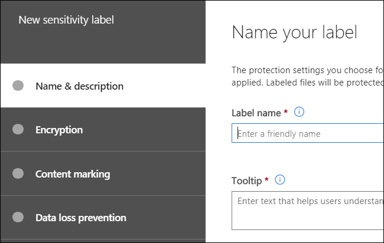
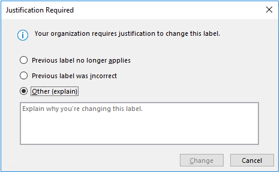
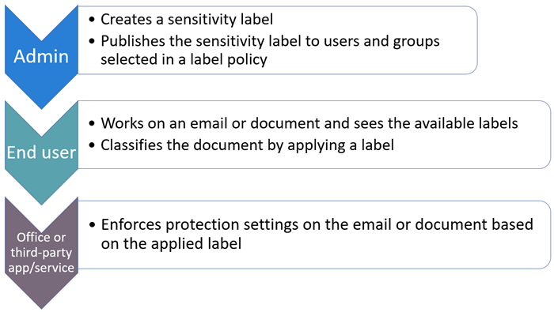
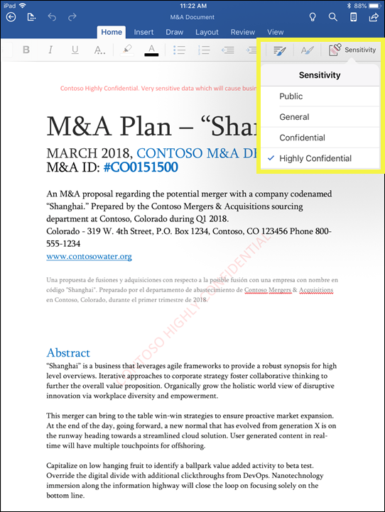
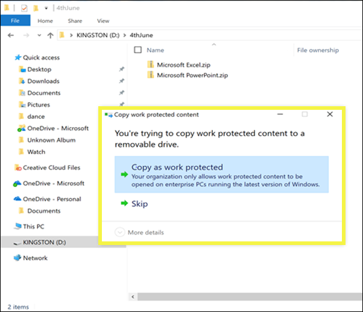

# Overview of sensitivity labels

To get their work done, people in your organization collaborate with others both inside and outside the organization. This means that content no longer stays behind a firewall — it can roam everywhere, across devices, apps, and services. And when it roams, you want it to do so in a secure, protected way that meets your organization’s business and compliance policies.

With sensitivity labels, you can classify and help protect your sensitive content, without hindering your people’s productivity and ability to collaborate.

Example showing sensitivity labels:

Sensitivity labels are supported for tenants in the global (public) cloud only. Currently, sensitivity labels aren't supported for tenants in other clouds such as [national clouds](https://docs.microsoft.com/azure/active-directory/develop/authentication-national-cloud).

To apply sensitivity labels, users must be signed in to Office with their work or school account.

You can use sensitivity labels to:
  
- **Enforce protection settings such as encryption or watermarks on labeled content.** For example, your users can apply a Confidential label to a document or email, and that label can encrypt the content and apply a Confidential watermark.

- **Protect content in Office apps across different platforms and devices.** For a list of supported apps, see [Sensitivity labels in Office apps](sensitivity-labels-office-apps.md).

- **Prevent sensitive content from leaving your organization on devices running Windows**, by using endpoint protection in Microsoft Intune. After a sensitivity label has been applied to content that resides on a Windows device, endpoint protection can prevent that content from being copied to a third-party app, such as Twitter or Gmail, or being copied to removable storage, such as a USB drive.

- **Protect content in third-party apps and services**, by using Microsoft Cloud App Security. With Cloud App Security, you can detect, classify, label, and protect content in third-party apps and services, such as SalesForce, Box, or DropBox, even if the third-party app or service does not read or support sensitivity labels.

- **Extend sensitivity labels to third-party apps and services.** With the Microsoft Information Protection SDK, third-party apps on [these platforms](https://docs.microsoft.com/information-protection/develop/overview#microsoft-information-protection-sdk) can read sensitivity labels and apply protection settings.

- **Classify content without using any protection settings.** You can also simply assign a classification to content (like a sticker) that persists and roams with the content as it's used and shared. You can use this classification to generate usage reports and see activity data for your sensitive content. Based on this information, you can always choose to apply protection settings later.

In all these cases, sensitivity labels in Office 365 can help you take the right actions on the right content. With sensitivity labels, you can classify data across your organization and enforce protection settings based on that classification.
  
You create sensitivity labels in the Microsoft 365 compliance center, Microsoft 365 security center, or Office 365 Security & Compliance Center under **Classification** > **Sensitivity labels**. These sensitivity labels can be used by Azure Information Protection, Office apps, and Office 365 services.

For Azure Information Protection customers, you can use your Azure Information Protection labels in the other admin centers, and your labels will be synced with the Azure portal in case you choose to perform additional or advanced configuration. Azure Information Protection labels and Office 365 sensitivity labels are compatible with each other, which means for example, if you have content labeled by Azure Information Protection, you won’t need to reclassify or relabel your content.

## What a sensitivity label is

When you assign a sensitivity label to a document or email, it’s like a stamp that's applied to content that is:

- **Customizable.** You can create categories for different levels of sensitive content in your organization, such as Personal, Public, General, Confidential, and Highly Confidential.

- **Clear text.** Because the label is stored in clear text in the content's metadata, third-party apps and services can read it and then apply their own protective actions, if required.

- **Persistent.** After you apply a sensitivity label to content, the label persists in the metadata of that email or document. This means the label roams with the content, including the protection settings, and this data becomes the basis for applying and enforcing policies.

In Office apps, a sensitivity label appears like a tag to users on an email or document.

Each item of content can have a single sensitivity label applied to it. An item can have both a single sensitivity label and a single [retention label](labels.md) applied to it.

## What sensitivity labels can do

In addition to email and documents, sensitivity labels are available in multiple public preview releases. For more information about how sensitivity labels can be used for files, teams, groups, and sites, see these articles:

- [Enable sensitivity labels for Office files in SharePoint and OneDrive (public preview)](sensitivity-labels-sharepoint-onedrive-files.md)

- [Use sensitivity labels with Microsoft Teams, Office 365 groups, and SharePoint sites (public preview)](sensitivity-labels-teams-groups-sites.md)

After a sensitivity label is applied to an email or document, any configured protection settings for that label are enforced on the content. With a sensitivity label, you can:

- **Encrypt** email only or both email and documents. You can choose which users or group have permissions to perform which actions and for how long. For example, you can choose to allow users in a specific domain outside your organization to have permissions to review the content for only 7 days after the content is labeled. Alternatively, instead of assigning permissions yourself, you can allow your users to assign permissions to the content when they apply the label. For more information, see [Restrict access to content by using encryption in sensitivity labels](encryption-sensitivity-labels.md).

- **Mark the content** by adding custom watermarks, headers, or footers to email or documents that have the label applied. You only apply watermarks to documents, not email, and they're limited to 255 characters. Also, headers and footers are limited to 1024 characters (except in Excel, where they're limited to 255 characters or fewer, depending on whether the document contains other headers or footers and other factors.)

    

- **Prevent data loss** by turning on endpoint protection in Intune. If sensitive content gets downloaded, you can help prevent the loss of data from Windows devices. For example, you can’t copy labeled content into Dropbox, Gmail, or a USB drive. Before your sensitivity labels can use Windows Information Protection (WIP), you first need to create an app protection policy in the Azure portal. For more information, see [How Windows Information Protection protects files with a sensitivity label](https://docs.microsoft.com/windows/security/information-protection/windows-information-protection/how-wip-works-with-labels?branch=vsts17546553).

- **Apply the label automatically to content that contains sensitive information.** You can choose what types of sensitive information that you want labeled, and the label can either be applied automatically, or you can prompt users to apply the label that you recommend. If you recommend a label, the prompt displays whatever text you choose. For more information, see [Apply a sensitivity label to content automatically](apply-sensitivity-label-automatically.md).

    

All these options are available when you create a sensitivity label:

### Label priority (order matters)

When you create your sensitivity labels in your admin center, they appear in a list on the **Sensitivity** tab on the **Labels** page. In this list, the order of the labels is important because it reflects their priority. You want your most restrictive sensitivity label, such as Highly Confidential, to appear at the **bottom** of the list, and your least restrictive sensitivity label, such as Public, to appear at the **top**.

You can apply just one sensitivity label to a document or email. If you set an option that requires your users to provide a justification for changing a label to a lower classification, the order of this list identifies the lower classifications. However, this option does not apply to sublabels.

The ordering of sublabels is used with [automatic labeling](apply-sensitivity-label-automatically.md), though. When you configure labels to be applied automatically or as a recommendation, multiple matches can result for more than one label. To determine the label to apply or recommend, the label ordering is used: The last sensitive label is selected, and then if applicable, the last sublabel.

### Sublabels (grouping labels)

With sublabels, you can group one or more labels below a parent label that a user sees in an Office app. For example, under Confidential, your organization might use several different labels for specific types of that classification. In this example, the parent label Confidential is simply a text label with no protection settings, and because it has sublabels, it can’t be applied to content. Instead, users must choose Confidential to view the sublabels, and then they can choose a sublabel to apply to content.

Sublabels are simply a way to present labels to users in logical groups. Sublabels don’t inherit any settings from their parent label. When you publish a sublabel for a user, that user can then apply that sublabel to content but can't apply just the parent label.

Don't choose a parent label as the default label, or configure a parent label to be auto-applied or recommended, because the parent label won't be applied to content in Office apps that use the Azure Information Protection unified labeling client.

Example of how sublabels display for users:

### Editing or deleting a sensitivity label

If you delete a sensitivity label, the label is not removed from content, and any protection settings continue to be enforced on the content.

If you edit a sensitivity label, the version of the label that was applied to content is what’s enforced on that content.

## What label policies can do

After you create your sensitivity labels, you need to publish them, to make them available to people in your organization, who can then apply the labels to content. Unlike retention labels, which are published to locations, such as all Exchange mailboxes, sensitivity labels are published to users or groups. Sensitivity labels then appear in Office apps for those users and groups.

With a label policy, you can:

- **Choose which users and groups see the labels.** Labels can be published to any email-enabled security group, distribution group, Office 365 group, or dynamic distribution group.

- **Apply a default label** to all new documents and email created by the users and groups included in the label policy. This default label can set a base level of protection settings that you want applied to all your content.

- **Require a justification for changing a label.** If content is marked Confidential and a user wants to remove that label or replace it with a lower classification, such as a label named Public, you can require that the user provide a justification when performing this action. Currently, the justification reason isn't sent to [label analytics](label-analytics.md) for the admin to review. However, the [Azure Information Protection unified labeling client](https://docs.microsoft.com/azure/information-protection/rms-client/aip-clientv2) sends this information to [Azure Information Protection analytics](https://docs.microsoft.com/azure/information-protection/reports-aip).

    

- **Require users to apply a label to their email and documents.** If you want all of a user's content to be labeled, you can require that a label must be applied to all of their saved documents and sent emails. The label can be assigned manually by the user, automatically as a result of a condition, or be assigned by default (the default label option described above). Here's the prompt shown in Outlook when a user is required to assign a label.

    > [!NOTE]
    > Mandatory labeling requires an Azure Information Protection subscription. To use this feature, you must download and install either the [Azure Information Protection client](https://www.microsoft.com/download/details.aspx?id=53018) or the later [Azure Information Protection unified labeling client](https://docs.microsoft.com/azure/information-protection/rms-client/install-unifiedlabelingclient-app). Also, the client runs only on Windows, so this feature is not yet supported on Mac, iOS, and Android.

    

- **Provide help link to a custom help page.** If your users aren’t sure what your sensitivity labels mean or how they should be used, you can provide a Learn More URL that appears at the bottom of the **Sensitivity label** menu in the Office apps.

    

After you create a label policy and assign sensitivity labels to users and groups, those people will see those labels available in the Office apps in an hour or less.

There is no limit to the number of sensitivity labels that you can create and publish, with one exception: If the label applies encryption, there is a maximum of 500 labels. However, as a best practice to lower admin overheads and reduce complexity for your users, try to keep the number of labels to a minimum. Real-word deployments have proved effectiveness to be noticeably reduced when users have more than five main labels or more than five sublabels per main label.

### Label policy priority (order matters)

You make your sensitivity labels available to users by publishing them in a sensitivity label policy that appears in a list on the **Sensitivity policies** tab on the **Label policies** page. Just like sensitivity labels (see [Label priority (order matters)](#label-priority-order-matters)), the order of the sensitivity label policies is important because it reflects their priority. The label policy with lowest priority is shown at the **top**, and the label policy with the highest priority is shown at the **bottom**.

A label policy consists of:

- A set of labels.
- The scope of the label policy, meaning the users and groups included in the policy.
- The settings of the label policy described above (default label, justification, mandatory label, and help link).

You can include a user in multiple label policies, and the user will see all the sensitivity labels from those policies. However, a user will see the policy settings from only the label policy with the highest priority.

If a user or group in your organization is not seeing an option in the label policy that you intended, such as a default or mandatory label, check the order of the sensitivity label policies. To re-order the label policies, select a sensitivity label policy > choose the ellipsis on the right > **Move down** or **Move up**.

While priority matters for sensitivity label policies, it does **not** matter for retention label policies. As explained in [The principles of retention, or what takes precedence?](labels.md#the-principles-of-retention-or-what-takes-precedence), content can be subject to multiple retention policies.

## How to get started with sensitivity labels

Getting started with sensitivity labels is a quick process:

1. **Define the labels.** First, you want to establish your taxonomy for defining different sensitivity levels of content. Use common names or terms that make sense to your users. For example, you can start with labels such as Personal, Public, General, Confidential, and Highly Confidential. You can use sublabels to group similar labels by category. Also, when you create a label, a tool tip is required, which appears in the Office apps when a user hovers over a label option on the Ribbon.

2. **Define what each label can do.** Then, configure the protection settings you want associated with each label. For example, lower sensitivity content (such as a “General” label) might simply have a header or footer applied to it, while higher sensitivity content (such as a “Confidential” label) may have a watermark, encryption, and WIP applied to it, to help ensure that only privileged users can access it.

3. **Define who gets the labels.** After you define your organization’s labels, you publish them in a label policy that controls which users and groups see those labels. A single label is reusable – you define it once, and then you can include it in several label policies assigned to different users. But in order for a label to be assigned to content, you must first publish that label so that it’s available in Office apps and other services. When just starting out, you can pilot your sensitivity labels by assigning them to just a few people.

Here’s the basic flow of what the admin, user, and Office app do to make sensitivity labels work.

## Where sensitivity labels can appear

Sensitivity labels appear in the UI of Office apps, and can be selected from the **Sensitivity** button on the Home tab of the ribbon. To view the current availability for built-in labeling for specific apps and platforms, see [Support for sensitivity label capabilities in apps](sensitivity-labels-office-apps.md#support-for-sensitivity-label-capabilities-in-apps).

If you use the Azure Information Protection unified labeling client for your Windows computers, additional features are available for sensitivity labels. For more information, see [Compare the labeling clients for Windows computers](https://docs.microsoft.com/azure/information-protection/rms-client/use-client#compare-the-labeling-clients-for-windows-computers).

### Office apps on Windows

In Office apps on devices running Windows, sensitivity labels appear on the **Sensitivity** button, on the **Home** tab on the Ribbon. 

When you use built-in labeling, the label applied also appears in the Status bar at the bottom of the window:

### Office apps on the web

For information about using sensitivity labels with Office apps on the web, see [Apply sensitivity labels to your documents and email within Office - Web](https://support.office.com/article/2f96e7cd-d5a4-403b-8bd7-4cc636bae0f9).

### Office apps on Mac

In Office apps on Mac devices, sensitivity labels appear on the **Sensitivity** button, on the **Home** tab on the Ribbon. The label applied also appears in the Status bar at the bottom of the window:

### Office apps on iOS

In Office apps on iOS devices, sensitivity labels appear on the **Sensitivity** button, on the **Home** tab on the Ribbon. The label applied also appears in the Status bar at the bottom of the window:

### Office apps on Android

In Office apps on Android devices, sensitivity labels appear on the **Sensitivity** button, on the **Home** tab on the Ribbon. The label applied also appears in the Status bar at the bottom of the window:

### More information on sensitivity labels in Office apps

- [Apply sensitivity labels to your documents and email within Office](https://support.office.com/article/apply-sensitivity-labels-to-your-documents-and-email-within-office-2f96e7cd-d5a4-403b-8bd7-4cc636bae0f9)
- [Known issues when you apply sensitivity labels to your Office files](https://support.office.com/article/known-issues-when-you-apply-sensitivity-labels-to-your-office-files-b169d687-2bbd-4e21-a440-7da1b2743edc)
- [Sensitivity labels in Office apps](sensitivity-labels-office-apps.md)

## How sensitivity labels work with existing Azure Information Protection labels

Azure Information Protection users can classify and label content on Windows by using the Azure Information Protection unified labeling client. Existing Azure Information Protection labels work seamlessly with new sensitivity labels, also known as unified labels. This means you can:

- Keep your existing Azure Information Protection labels on documents and email.
- Keep your existing Azure Information Protection label configuration.

If you are using Azure Information Protection labels because your tenant isn't yet on the [unified labeling platform](https://docs.microsoft.com/azure/information-protection/faqs#how-can-i-determine-if-my-tenant-is-on-the-unified-labeling-platform), we recommend that you avoid creating new labels in other admin centers until you activate unified labeling. For more information about this process, see [How to migrate Azure Information Protection labels to unified sensitivity labels](https://docs.microsoft.com/azure/information-protection/configure-policy-migrate-labels).

## Sensitivity labels and the Azure Information Protection client

Office 365 ProPlus apps automatically turn off built-in labeling for sensitivity labels in Office Windows apps if the Azure Information Protection client is installed.
To change this default behavior so that you can use built-in labeling, see [About the Office built-in labeling client](sensitivity-labels-office-apps.md#about-the-office-built-in-labeling-client).

## Protect content on Windows devices by using endpoint protection in Microsoft Intune

When you create a sensitivity label, you have the option to tell Windows that files with this label need to be protected against data leakage when this content is stored on Windows devices. This option can help ensure that content with this label can be shared or copied only to sanctioned locations, even when it’s stored on an endpoint. In essence, turning on this option for a sensitivity label tells Windows that this is extra critical data that warrants additional usage constraints.

When you turn on this option, Windows can read, understand, and act on sensitivity labels in documents and automatically apply Windows Information Protection (WIP) on content, no matter how it reaches a managed Windows device. This helps protect labeled files from accidental leakage, with or without applying encryption.

For example, Windows can understand that a Word document residing on a user’s machine has a Confidential label applied to it, and WIP can apply an app protection policy to prevent the copying or sharing of the data to any non-work location from that device (such as a personal OneDrive, personal email accounts, social media, or USB drives).

If a user attempts to upload labeled content to a personal Gmail account, they see this message.

And if a user attempts to save labeled content to a USB drive, they see the following message:

### Important prerequisites for using WIP

Before your sensitivity labels can use WIP, you first need to do the prerequisites described here: [How Windows Information Protection protects files with a sensitivity label](https://docs.microsoft.com/windows/security/information-protection/windows-information-protection/how-wip-works-with-labels?branch=vsts17546553). This topic describes the following prerequisites:

- Make sure you're running Windows 10, version 1809 or later.
- [Set up Microsoft Defender Advanced Threat Protection (Microsoft Defender ATP)](https://docs.microsoft.com/windows/security/threat-protection/), which scans content for a label and applies the corresponding WIP protection. ATP performs some actions independently from WIP, such as reporting anomalies.
- Create a Windows Information Protection (WIP) policy that applies to endpoint devices. You can do this in either of these locations:

  - [Create a Windows Information Protection (WIP) policy with MDM using the Azure portal for Microsoft Intune](https://docs.microsoft.com/windows/security/information-protection/windows-information-protection/create-wip-policy-using-intune-azure)
  - [Create and deploy a Windows Information Protection (WIP) policy using System Center Configuration Manager](https://docs.microsoft.com/windows/security/information-protection/windows-information-protection/create-wip-policy-using-sccm)

## Protect content in third-party apps and services by using Microsoft Cloud App Security

Protect content in third-party apps and services by using Cloud App Security (CAS). With CAS, you can detect, classify, label, and protect content in third-party services and apps, such as SalesForce, Box, or Dropbox. For example, Dropbox might not understand a sensitivity label, but CAS can reach out and protect labeled content in that location.

For more information, see [Automatically apply Azure Information Protection classification labels](https://docs.microsoft.com/cloud-app-security/use-case-information-protection).

### Important prerequisites for using CAS

Before your sensitivity labels can use CAS, you first need to do the prerequisites described here: [Automatically apply Azure Information Protection classification labels](https://docs.microsoft.com/cloud-app-security/use-case-information-protection). This topic describes the following prerequisites:

- [Enable Cloud App Security and Azure Information Protection](https://docs.microsoft.com/cloud-app-security/azip-integration) for your tenant.
- [Connect the app](https://docs.microsoft.com/cloud-app-security/enable-instant-visibility-protection-and-governance-actions-for-your-apps) to Cloud App Security.

## Extend sensitivity labels to third-party apps and services by using the Microsoft Information Protection SDK

Because a sensitivity label is persisted as clear text in the metadata of a document, third-party apps and services can choose to support identifying and protecting content that contains such a label. Support in other apps and services is always expanding.

With the [Microsoft Information Protection SDK](https://docs.microsoft.com/information-protection/develop/), third-party apps and services can read and apply sensitivity labels and protection to documents. The SDK supports apps on [these platforms](https://docs.microsoft.com/information-protection/develop/overview#microsoft-information-protection-sdk).

Using the SDK, you can label and protect content in a way that works with other Microsoft Information Protection apps and services, such as Office apps, Office 365 services, the Azure Information Protection scanner, Microsoft Cloud App Security, and several other partner solutions. For example, learn more about [support for sensitivity labels in Adobe Acrobat](https://techcommunity.microsoft.com/t5/Azure-Information-Protection/Starting-October-use-Adobe-Acrobat-Reader-for-PDFs-protected-by/ba-p/262738).

To learn more about the Microsoft Information Protection SDK, see the [announcement on the Tech Community blog](https://techcommunity.microsoft.com/t5/Microsoft-Information-Protection/Microsoft-Information-Protection-SDK-Now-Generally-Available/ba-p/263144). You can also learn about [partner solutions that are integrated with Microsoft Information Protection](https://techcommunity.microsoft.com/t5/Azure-Information-Protection/Microsoft-Information-Protection-showcases-integrated-partner/ba-p/262657).

## Permissions required to create sensitivity labels

Members of your compliance team who will create sensitivity labels need permissions to the Microsoft 365 compliance center, Microsoft 365 security center, or Office 365 Security & Compliance Center. By default, your tenant admin has access to these admin centers and can give compliance officers and other people access, without giving them all of the permissions of a tenant admin. For this delegated limited admin access, go to the **Permissions** page of one of these admin centers, and then add members to the **Compliance Administrator** or **Security Administrator** role group.

For more information, see [Give users access to the Office 365 Security & Compliance Center](https://docs.microsoft.com/microsoft-365/security/office-365-security/grant-access-to-the-security-and-compliance-center).

These permissions are required only to create and apply labels and a label policy. Policy enforcement does not require access to the content.