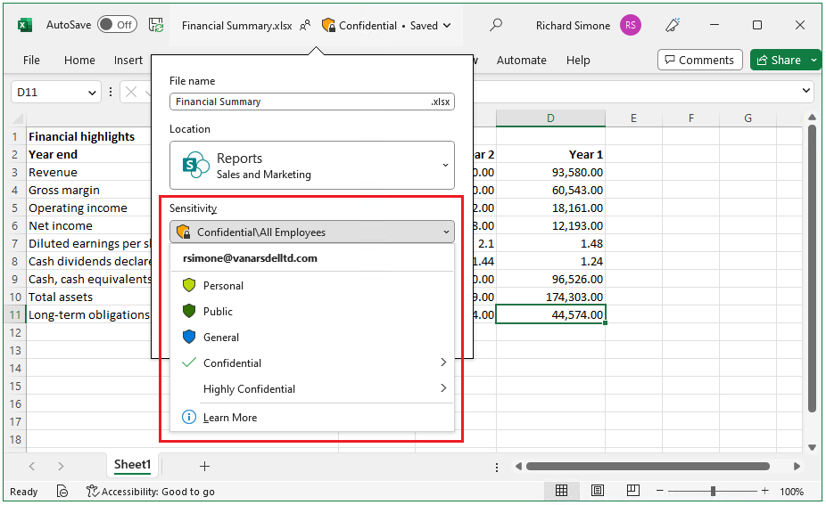
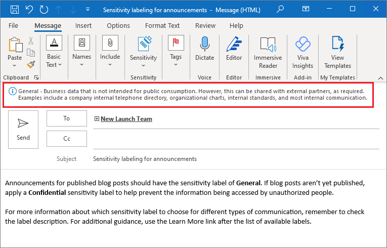
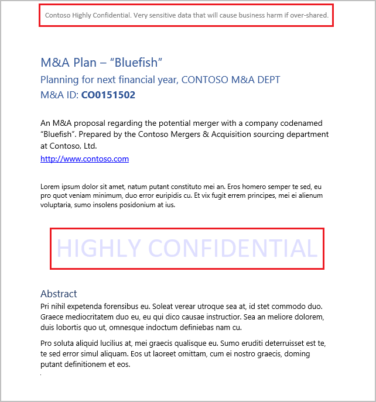
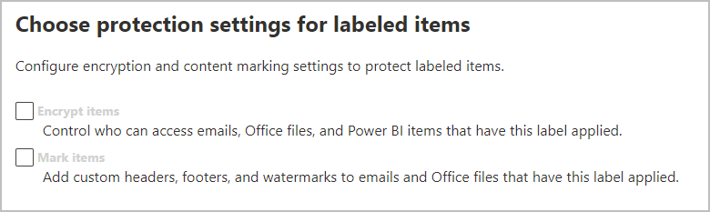
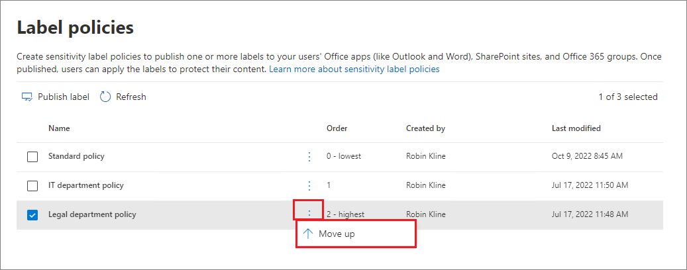

# Learn about sensitivity labels

>*[Microsoft 365 licensing guidance for security & compliance](/office365/servicedescriptions/microsoft-365-service-descriptions/microsoft-365-tenantlevel-services-licensing-guidance/microsoft-365-security-compliance-licensing-guidance).*

> [!NOTE]
> If you're looking for information about sensitivity labels that you see in your Office apps, see [Apply sensitivity labels to your files and email in Office](https://support.microsoft.com/topic/apply-sensitivity-labels-to-your-files-and-email-in-office-2f96e7cd-d5a4-403b-8bd7-4cc636bae0f9).
>
> The information on this page is for IT administrators who can create and configure those labels.

To get their work done, people in your organization collaborate with others both inside and outside the organization. This means that content no longer stays behind a firewall—it can roam everywhere, across devices, apps, and services. And when it roams, you want it to do so in a secure, protected way that meets your organization's business and compliance policies.

Sensitivity labels from the Microsoft Information Protection solution let you classify and protect your organization's data, while making sure that user productivity and their ability to collaborate isn't hindered.

Example showing available sensitivity labels in Excel, from the **Home** tab on the Ribbon. In this example, the applied label displays on the status bar:

To apply sensitivity labels, users must be signed in with their Microsoft 365 work or school account.

> [!NOTE]
> For US Government tenants, sensitivity labels are now supported for all platforms:
> - For GCC and GCC High environments: Release notes for [Office for Windows](/officeupdates/current-channel#version-2101-january-26) and [Office for Mac](/officeupdates/release-notes-office-for-mac#feature-updates-2)
> - For DoD environments: Release notes for [Office for Windows](/officeupdates/current-channel#version-2103-march-30)
>
> If you use the Azure Information Protection unified labeling client and scanner for these environments, see the [Azure Information Protection Premium Government Service Description](/enterprise-mobility-security/solutions/ems-aip-premium-govt-service-description).

You can use sensitivity labels to:
  
- **Provide protection settings that include encryption and content markings.** For example, apply a "Confidential" label to a document or email, and that label encrypts the content and applies a "Confidential" watermark. Content markings include headers and footers as well as watermarks, and encryption can also restrict what actions authorized people can take on the content.

- **Protect content in Office apps across different platforms and devices.** Supported by Word, Excel, PowerPoint, and Outlook on the Office desktop apps and Office on the web. Supported on Windows, macOS, iOS, and Android.

- **Protect content in third-party apps and services** by using Microsoft Cloud App Security. With Cloud App Security, you can detect, classify, label, and protect content in third-party apps and services, such as SalesForce, Box, or DropBox, even if the third-party app or service does not read or support sensitivity labels.

- **Protect containers** that include Teams, Microsoft 365 Groups, and SharePoint sites. For example, set privacy settings, external user access and external sharing, and access from unmanaged devices.

- **Extend sensitivity labels to Power BI**: When you turn on this capability, you can apply and view labels in Power BI, and protect data when it's saved outside the service.

- **Extend sensitivity labels to assets in Azure Purview**: When you turn on this capability, currently in preview, you can apply your sensitivity labels to assets such as SQL columns, files in Azure Blob Storage, and more. 

- **Extend sensitivity labels to third-party apps and services.** Using the Microsoft Information Protection SDK, third-party apps can read sensitivity labels and apply protection settings.

- **Classify content without using any protection settings.** You can also simply assign a label as a result of classifying the content. This provides users with a visual mapping of classification to your organization's label names, and can use the labels to generate usage reports and see activity data for your sensitive content. Based on this information, you can always choose to apply protection settings later.

In all these cases, sensitivity labels in Microsoft 365 can help you take the right actions on the right content. With sensitivity labels, you can classify data across your organization, and enforce protection settings based on that classification.

For more information about these and other scenarios that are supported by sensitivity labels, see [Common scenarios for sensitivity labels](get-started-with-sensitivity-labels.md#common-scenarios-for-sensitivity-labels). New features are being developed all the time that support sensitivity labels, so you might also find it useful to reference the [Microsoft 365 roadmap](https://aka.ms/MIPC/Roadmap).

## What a sensitivity label is

When you assign a sensitivity label to content, it's like a stamp that's applied and is:

- **Customizable.** Specific to your organization and business needs, you can create categories for different levels of sensitive content in your organization. For example, Personal, Public, General, Confidential, and Highly Confidential.

- **Clear text.** Because a label is stored in clear text in the metadata for files and emails, third-party apps and services can read it and then apply their own protective actions, if required.

- **Persistent.** Because the label is stored in metadata for files and emails, the label roams with the content, no matter where it's saved or stored. The unique label identification becomes the basis for applying and enforcing the policies that you configure.

When viewed by users, a sensitivity label appears like a tag on apps that they use and can be easily integrated into their existing workflows.

Each item that supports sensitivity labels can have a single sensitivity label applied to it. Documents and emails can have both a sensitivity label and a [retention label](retention.md#retention-labels) applied to them.

> [!div class="mx-imgBorder"]
> 

## What sensitivity labels can do

After a sensitivity label is applied to an email or document, any configured protection settings for that label are enforced on the content. You can configure a sensitivity label to:

- **Encrypt** emails and documents to prevent unauthorized people from accessing this data. You can additionally choose which users or group have permissions to perform which actions and for how long. For example, you can choose to allow all users in your organization to modify a document while a specific group in another organization can only view it. Alternatively, instead of administrator-defined permissions, you can allow your users to assign permissions to the content when they apply the label. 
    
    For more information about the **Encryption** settings when you create or edit a sensitivity label, see [Restrict access to content by using encryption in sensitivity labels](encryption-sensitivity-labels.md).

- **Mark the content** when you use Office apps, by adding watermarks, headers, or footers to email or documents that have the label applied. Watermarks can be applied to documents but not email. Example header and watermark:
    
    
    
    Need to check when content markings are applied? See [When Office apps apply content marking and encryption](sensitivity-labels-office-apps.md#when-office-apps-apply-content-marking-and-encryption).
    
    Some, but not all apps support dynamic markings by using variables. For example, insert the label name or document name into the header, footer, or watermark. For more information, see [Dynamic markings with variables](sensitivity-labels-office-apps.md#dynamic-markings-with-variables).
    
    String lengths: Watermarks are limited to 255 characters. Headers and footers are limited to 1024 characters, except in Excel. Excel has a total limit of 255 characters for headers and footers but this limit includes characters that aren't visible, such as formatting codes. If that limit is reached, the string you enter is not displayed in Excel.

- **Protect content in containers such as sites and groups** when you enable the capability to [use sensitivity labels with Microsoft Teams, Microsoft 365 groups, and SharePoint sites](sensitivity-labels-teams-groups-sites.md).
    
    You can't configure protection settings for groups and sites until you enable this capability. This label configuration doesn't result in documents or emails being automatically labeled but instead, the label settings protect content by controlling access to the container where content can be stored. These settings include privacy settings, external user access and external sharing, and access from unmanaged devices.

- **Apply the label automatically to files and emails, or recommend a label.** Choose how to identify sensitive information that you want labeled, and the label can be applied automatically, or you can prompt users to apply the label that you recommend. If you recommend a label, the prompt displays whatever text you choose. For example:
    
    
    
    For more information about the **Auto-labeling for files and emails** settings when you create or edit a sensitivity label, see [Apply a sensitivity label to content automatically](apply-sensitivity-label-automatically.md) for Office apps, and [Automatically label your data in Azure Purview](/azure/purview/create-sensitivity-label).

### Label scopes

When you create a sensitivity label, you're asked to configure the label's scope which determines two things:
- Which label settings you can configure for that label
- Where the label will be visible to users

This scope configuration lets you have sensitivity labels that are just for documents and emails and can't be selected for containers. And similarly, sensitivity labels that are just for containers and can't be selected for documents and emails. New, and currently in preview, you can also select the scope for Azure Purview assets:

By default, the **Files & emails** scope is always selected. The other scopes are selected by default when the features are enabled for your tenant:

- **Groups & sites**: [Enable sensitivity labels for containers and synchronize labels](sensitivity-labels-teams-groups-sites.md#how-to-enable-sensitivity-labels-for-containers-and-synchronize-labels)

- **Azure Purview assets (preview)**: [Automatically label your content in Azure Purview](/azure/purview/create-sensitivity-label)

If you change the defaults so not all scopes are selected, you see the first page of the configuration settings for scopes you haven't selected, but you can't configure the settings. For example, if the scope for files and emails is not selected, you can't select the options on the next page:

For these pages that have unavailable options, select **Next** to continue. Or, select **Back** to change the label's scope.

### Label priority (order matters)

When you create your sensitivity labels in your admin center, they appear in a list on the **Sensitivity** tab on the **Labels** page. In this list, the order of the labels is important because it reflects their priority. You want your most restrictive sensitivity label, such as Highly Confidential, to appear at the **bottom** of the list, and your least restrictive sensitivity label, such as Public, to appear at the **top**.

You can apply just one sensitivity label to an item such as a document, email, or container. If you set an option that requires your users to provide a justification for changing a label to a lower classification, the order of this list identifies the lower classifications. However, this option does not apply to sublabels.

The ordering of sublabels is used with [automatic labeling](apply-sensitivity-label-automatically.md), though. When you configure labels to be applied automatically or as a recommendation, multiple matches can result for more than one label. To determine the label to apply or recommend, the label ordering is used: The last sensitive label is selected, and then if applicable, the last sublabel.

### Sublabels (grouping labels)

With sublabels, you can group one or more labels below a parent label that a user sees in an Office app. For example, under Confidential, your organization might use several different labels for specific types of that classification. In this example, the parent label Confidential is simply a text label with no protection settings, and because it has sublabels, it can't be applied to content. Instead, users must choose Confidential to view the sublabels, and then they can choose a sublabel to apply to content.

Sublabels are simply a way to present labels to users in logical groups. Sublabels don't inherit any settings from their parent label. When you publish a sublabel for a user, that user can then apply that sublabel to content but can't apply just the parent label.

Don't choose a parent label as the default label, or configure a parent label to be automatically applied (or recommended). If you do, the parent label won't be applied to content.

Example of how sublabels display for users:

### Editing or deleting a sensitivity label

If you delete a sensitivity label from your admin center, the label is not automatically removed from content, and any protection settings continue to be enforced on content that had that label applied.

If you edit a sensitivity label, the version of the label that was applied to content is what's enforced on that content.

## What label policies can do

After you create your sensitivity labels, you need to publish them to make them available to people and services in your organization. The sensitivity labels can then be applied to Office documents and emails, and other items that support sensitivity labels. 

Unlike retention labels, which are published to locations such as all Exchange mailboxes, sensitivity labels are published to users or groups. Apps that support sensitivity labels can then display them to those users and groups as applied labels, or as labels that they can apply.

When you configure a label policy, you can:

- **Choose which users and groups see the labels.** Labels can be published to any specific user or email-enabled security group, distribution group, or Microsoft 365 group (which can have [dynamic membership](/azure/active-directory/users-groups-roles/groups-create-rule)) in Azure AD.

- **Specify a default label** for new documents, unlabeled emails, and new containers (when you've [enabled sensitivity labels for Microsoft Teams, Microsoft 365 groups, and SharePoint sites](sensitivity-labels-teams-groups-sites.md)). You can specify the same label for all three types of items, or different labels. When you specify a default label for documents, the Azure Information Protection unified labeling client also applies this label to existing documents that are unlabeled. Users can always change the default label if it's not the right label for their document or email.
    
    Consider using a default label to set a base level of protection settings that you want applied to all your content. However, without user training and other controls, this setting can also result in inaccurate labeling. It's usually not a good idea to select a label that applies encryption as a default label to documents. For example, many organizations need to send and share documents with external users who might not have apps that support the encryption or they might not use an account that can be authorized. For more information about this scenario, see [Sharing encrypted documents with external users](sensitivity-labels-office-apps.md#sharing-encrypted-documents-with-external-users).

- **Require a justification for changing a label.** If a user tries to remove a label or replace it with a label that has a lower-order number, you can require the user provides a justification to perform this action. For example, a user opens a document labeled Confidential (order number 3) and replaces that label with one named Public (order number 1). Administrators can read the justification reason along with the label change in [activity explorer](data-classification-activity-explorer.md).

    

- **Require users to apply a label** for documents and emails, just documents, and for containers. Also known as mandatory labeling, these options ensure a label must be applied before users can save documents and send emails, and create new groups or sites.
    
    For documents and emails, a label can be assigned manually by the user, automatically as a result of a condition that you configure, or be assigned by default (the default label option previously described). An example prompt shown in Outlook when a user is required to assign a label:

    
    
    For more information about mandatory labeling for documents and emails, see [Require users to apply a label to their email and documents](sensitivity-labels-office-apps.md#require-users-to-apply-a-label-to-their-email-and-documents).
    
    For containers, a label must be assigned at the time the group or site is created.
    
    Consider using this option to help increase your labeling coverage. However, without user training, these settings can result in inaccurate labeling. In addition, unless you also set a corresponding default label, mandatory labeling can frustrate your users with the frequent prompts.

- **Provide help link to a custom help page.** If your users aren't sure what your sensitivity labels mean or how they should be used, you can provide a Learn More URL that appears at the bottom of the **Sensitivity label** menu in the Office apps:

    

After you create a label policy that assigns new sensitivity labels to users and groups, users start to see those labels in their Office apps. Allow up to 24 hours for the latest changes to replicate throughout your organization.

There is no limit to the number of sensitivity labels that you can create and publish, with one exception: If the label applies encryption that specifies the users and permissions, there is a maximum of 500 labels supported with this configuration. However, as a best practice to lower admin overheads and reduce complexity for your users, try to keep the number of labels to a minimum. Real-world deployments have proved effectiveness to be noticeably reduced when users have more than five main labels or more than five sublabels per main label.

### Label policy priority (order matters)

You make your sensitivity labels available to users by publishing them in a sensitivity label policy that appears in a list on the **Sensitivity policies** tab on the **Label policies** page. Just like sensitivity labels (see [Label priority (order matters)](#label-priority-order-matters)), the order of the sensitivity label policies is important because it reflects their priority. The label policy with lowest priority is shown at the **top**, and the label policy with the highest priority is shown at the **bottom**.

A label policy consists of:

- A set of labels.
- The users and groups that will be assigned the policy with labels.
- The scope of the policy and policy settings for that scope (such as default label for files and emails).

You can include a user in multiple label policies, and the user will get all the sensitivity labels and settings from those policies. If there is a conflict in settings from multiple policies, the settings from the policy with the highest priority (lowest position) is applied. In other words, the highest priority wins for each setting.

If you're not seeing the label or label policy setting behavior that you expect for a user or group, check the order of the sensitivity label policies. You might need to move the policy down. To reorder the label policies, select a sensitivity label policy > choose the ellipsis on the right > **Move down** or **Move up**.

> [!NOTE]
> Remember: When there is a conflict of settings for a user who has multiple policies assigned, the setting from the policy with the highest priority (lowest position) is applied.

## Sensitivity labels and Azure Information Protection

When you use sensitivity labels in Microsoft 365 Apps on Windows computers, you have a choice of using labeling that's built into Office apps, or the Azure Information Protection client.

By default, built-in labeling is turned off in these apps when the Azure Information Protection client is installed. For more information, including how to change this default behavior, see [Office built-in labeling client and the Azure Information Protection client](sensitivity-labels-office-apps.md#office-built-in-labeling-client-and-the-azure-information-protection-client).

Even when you use built-in labeling in Office apps, you can also use the Azure Information Protection unified labeling client with sensitivity labels for the following:

- A scanner to discover sensitive information that's stored on-premises, and then optionally, label that content

- Right-click options in File Explorer for users to apply labels to all file types

- A viewer to display encrypted files for text, images, or PDF documents

- A PowerShell module to discover sensitive information in files on premises, and apply or remove labels and encryption from these files.

If you are new to Azure Information Protection, or if you are an existing Azure Information Protection customer who has recently migrated your labels, see [Choose your Windows labeling solution](/azure/information-protection/rms-client/use-client#choose-your-windows-labeling-solution) from the Azure Information Protection documentation.

### Azure Information Protection labels

> [!NOTE]
> Label management for Azure Information Protection labels in the Azure portal was deprecated **March 31, 2021**. Learn more from the official [deprecation notice](https://techcommunity.microsoft.com/t5/azure-information-protection/announcing-timelines-for-sunsetting-label-management-in-the/ba-p/1226179).

If your tenant isn't yet on the [unified labeling platform](/azure/information-protection/faqs#how-can-i-determine-if-my-tenant-is-on-the-unified-labeling-platform), you must first activate unified labeling before you can use sensitivity labels. For instructions, see [How to migrate Azure Information Protection labels to unified sensitivity labels](/azure/information-protection/configure-policy-migrate-labels). 

## Sensitivity labels and the Microsoft Information Protection SDK

Because a sensitivity label is stored in the metadata of a document, third-party apps and services can read from and write to this labeling metadata to supplement your labeling deployment. Additionally, software developers can use the [Microsoft Information Protection SDK](/information-protection/develop/overview#microsoft-information-protection-sdk) to fully support labeling and encryption capabilities across multiple platforms. To learn more, see the [General Availability announcement on the Tech Community blog](https://techcommunity.microsoft.com/t5/Microsoft-Information-Protection/Microsoft-Information-Protection-SDK-Now-Generally-Available/ba-p/263144). 

You can also learn about [partner solutions that are integrated with Microsoft Information Protection](https://techcommunity.microsoft.com/t5/Azure-Information-Protection/Microsoft-Information-Protection-showcases-integrated-partner/ba-p/262657).

## Deployment guidance

For deployment planning and guidance that includes licensing information, permissions, deployment strategy, a list of supported scenarios, and end-user documentation, see [Get started with sensitivity labels](get-started-with-sensitivity-labels.md).

To learn how to use sensitivity labels to comply with data privacy regulations, see [Deploy information protection for data privacy regulations with Microsoft 365](../solutions/information-protection-deploy.md)  (aka.ms/m365dataprivacy).