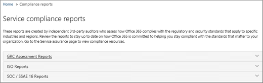

# Service assurance in the Security & Compliance Center

Use Service assurance in the Security & Compliance Center to access documents that describe a variety of topics, including: 
  
- Microsoft security practices for customer data that is stored in Office 365. 
    
- Independent third-party audit reports of Office 365. 
    
- Implementation and testing details for security, privacy, and compliance controls that Office 365 uses to protect your data. 
    
You can also find out how Office 365 can help customers comply with standards, laws, and regulations across industries, such as the:
  
-  International Organization for Standardization (ISO) 27001 and 27018 
    
- Health Insurance Portability and Accountability Act of 1996 (HIPAA)
    
- Federal Risk and Authorization Management Program (FedRAMP)
    
## Who can access Office 365 Service assurance, and how?

 **New customers, and customers evaluating Microsoft online services** can access Service assurance which is included with Office 365 Enterprise E3 and E5 plans (both trial and paid subscriptions). If you don't have one of these plans and want to try Service assurance, you can [sign-up for a trial of Office 365 Enterprise E5](https://go.microsoft.com/fwlink/p/?LinkID=698279).
  
 **O365 Subscription Members** can access the Service assurance section in the Office 365 Protection Center by default. Service assurance provides reports and documents that describe Microsoft's security practices for customer data that's stored in Office 365. It also provides independent third-party audit reports on Office 365.
 
## Choose your industry and regional settings

When you access Service assurance for the first time, the first step is to configure your industry and regional settings. You can change these settings at any time. Configuring these settings enables Service assurance to provide you with content that is most relevant to your organization. To configure your industry and region settings:
  
1. After you access Service assurance, select **Settings** and the Region and industry settings page displays as shown in the following screenshot. 
    
    
  
2. On the **Settings** page, select the down arrow next to **Region** and check the appropriate regions for your organization. 
    
3. Select the down arrow next to **Industry** and check the appropriate industries for your organization. 
    
4. Once you have selected regions and industries, select **Save**.
    
## Find, review, and download compliance and trust content

To review and download content, select an option from the navigation pane:
  
- **Compliance reports** to view independent audits and assessments of Office 365 and other Microsoft cloud services as shown in the following screen shot. 
    
    
  
- **Trust documents** to view information about how Microsoft operates Office 365 as shown in the following screen shot. 
    
    
  
- **Audited controls** to view information about how Office 365 controls meet security, compliance, and privacy requirements, as shown in the following screen shot. 
    
    
  
Select the report you want to download, and select **Save** to download it to your computer. For Audited controls, select the report you want and then select **Download**. The table below describes the reports you can find on each Service assurance page. 
  
> [!NOTE]
> Service assurance reports and documents are available to download for at least twelve months after publishing or until a new version of the document becomes available. 
  
|**Service assurance page**|**Content available**|**Description**|
|:-----|:-----|:-----|
|Compliance reports    | FedRamp     GRC Assessment     ISO     SOC/SSAE    |Use service compliance reports to review audit assessments performed by third-party independent auditors of Office 365 Service Delivery Operations.    |
|Trust documents    | FAQ and White Papers     Risk Management Reports    |Use white papers, FAQs, end-of-year reports and other Microsoft Confidential resources that are made available to you under non-disclosure agreement for your review / risk assessments.    |
|Audited controls    |Global standards and regulations that Office 365 has implemented.    | Help with risk-assessment when you're evaluating, onboarding, or using Office 365 services. Find out:     - How Office 365 controls meet security, compliance, and privacy requirements.   -  About testing of controls in Office 365, results of these tests, and when they were completed.    |
   
Depending on your specific set-up, options included in your view might have some differences.
    
## Get help with Service assurance

[Contact support for business products - Admin Help](../business-video/get-help-support.md).
  
## Frequently Asked Questions

 **Why am I getting an error saying that documents from Service assurance are corrupted?**
  
Most Service assurance documents are in PDF format. Choose **Save** to save these files to, and then open them up from, your local computer.