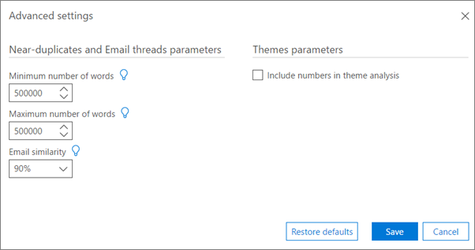

# Set Analyze advanced settings in Advanced eDiscovery

> [!NOTE]
> Advanced eDiscovery requires an Office 365 E3 with the Advanced Compliance add-on or an E5 subscription for your organization. If you don't have that plan and want to try Advanced eDiscovery, you can [sign up for a trial of Office 365 Enterprise E5](https://go.microsoft.com/fwlink/p/?LinkID=698279). 
  
Advanced eDiscovery provides default advanced parameters for Analyze module settings. The following procedure describes settings that can be specified.
  
1. In the **Prepare \> Analyze \> Setup** tab, click **Advanced settings** (at the bottom of the page). The following panel is displayed. 
    
    
  
2. In **Near-duplicates and Email threads parameters**, select values for the following as necessary:
    
  - **Minimum number of words**: Minimum number for words, below which a file is not submitted for Near-duplicate analysis. 
    
  - **Maximum number of words**: Maximum number for words, above which a file is not submitted for Near-duplicate analysis.
    
  - **Email similarity**: Minimal level of resemblance for two emails to be considered similar. Value is always equal to, or larger than document similarity. Default is 90%.
    
3. In **Themes parameters**, select the **Include numbers in theme analysis** check box to include numbers in the processing of Themes during Analyze. 
    
4. Click **Save**. 
    
## Related topics

[Advanced eDiscovery (classic)](office-365-advanced-ediscovery.md)
  
[Understanding document similarity](understand-document-similarity-in-advanced-ediscovery.md)
  
[Setting Analyze options](set-analyze-options-in-advanced-ediscovery.md)
  
[Setting ignore text](set-ignore-text-in-advanced-ediscovery.md)
  
[Viewing Analyze results](view-analyze-results-in-advanced-ediscovery.md)

