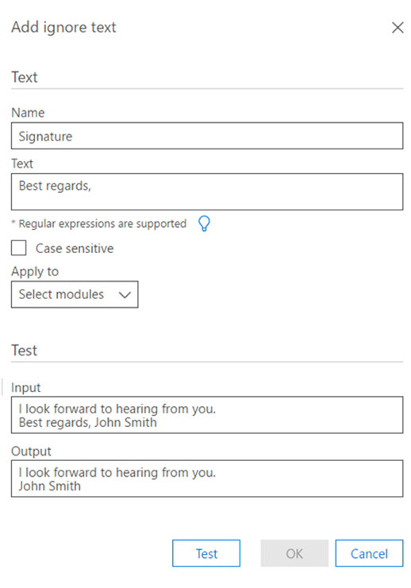
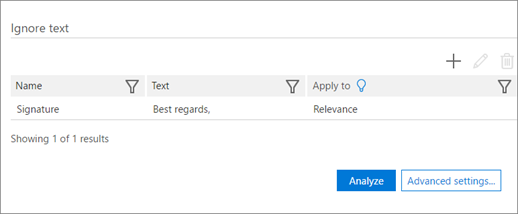

# Set Ignore Text option for Analyze in Advanced eDiscovery (classic)

> [!NOTE]
> Advanced eDiscovery requires an Office 365 E3 with the Advanced Compliance add-on or an E5 subscription for your organization. If you don't have that plan and want to try Advanced eDiscovery, you can [sign up for a trial of Office 365 Enterprise E5](https://go.microsoft.com/fwlink/p/?LinkID=698279). 
  
The Ignore Text feature can be applied to all or any of the following Advanced eDiscovery modules: Analyze (Near-duplicates, Email Threads, Themes) and Relevance. Ignored text will not appear in files displayed in Relevance, and the analysis/calculations will discard the ignored text.
  
If the Ignore Text feature was previously defined for modules that have already run, the Ignore Text setting will now be protected from being modified. However, the Ignore Text feature for the Relevance module can still be changed at any time.
  
## How Ignore Text filters are applied

Multiple Ignore Text filters are applied in the order that they were entered. To change the order in which they are applied, they must be deleted and re-entered in the desired order.
  
For example, if the text content is: "DAVE BOB ALICE CAROL EVE", the following are samples of Ignore Text entries and the results these entries produce:

|**Ignore Text entries**   |**Results**   |
|:-----|:-----|
|"ALICE", "BOB CAROL"    |"DAVE EVE"    |
|"ALICE", "BOB ALICE CAROL"    |"DAVE BOB CAROL EVE"    |
   
The second Ignore Text entry is not implemented because the string is not found as such AFTER the first Ignore Text has been applied.
  
## Use regular expressions when defining Ignore Text

Regular expressions are supported for use when defining Ignore Text. The following are examples of regular expression syntax and usage:
  
- To remove (ignore) text from Begin until the end of a line:
    
     `Begin(.*)$`
    
    where "Begin" is the initial occurrence of this string in the line.
    
    For example, for the following text:
    
    **"This is first sentence and first line**
    
    **This is second sentence and second line"**
    
    the Regular Expression first(.\*)$ will result in:
    
    **"This is**
    
    **This is second sentence and second line"**
    
- To remove disclaimers and legal statements automatically inserted at the end of email threads:
    
     `Begin(.|\s)*End`
    
    where "Begin" and "End" are unique strings at the beginning and end of a wrapped text paragraph. 
    
    For example, the following regular expression will remove disclaimers and legal statements that were in the email thread between the Begin and End strings:
    
    **This message contains confidential information (.|\s)\*If verification is required please request a hard-copy version**
    
- To remove a disclaimer (including special characters): 
    
    For example, for the following text (with the disclaimer represented here by x's): 
    
    **/\*\ This message contains confidential information. xxxx xxxx**
    
    **xxxx xxxx xxxx xxxx xxxx xxxx xxxx**
    
    **xxxx xxxx If verification is required, please request a hard-copy version. /\*\**
    
    the regular expression to remove the above disclaimer should be: 
    
    **\/\\*\\ This message contains confidential information\.(.|\s)\* If verification is required please request a hard-copy version\. \/\\*\\**
    
- Regular expression rules:
    
  - Any characters that are not part of the alphabet except for space(s), "_" and "-" must be preceded by "\".
    
  - The regular eExpression field can be unlimited length.
    
> [!TIP]
> For an explanation and detailed syntax of regular expressions, see: [Regular Expression Language - Quick Reference](https://msdn.microsoft.com/library/az24scfc%28v=vs.110%29.aspx). 
  
## Define Ignore Text rule

1. In the **Manage \> Analyze \> Analyze options** tab, in the **Ignore Text** section, click the **+** icon to add a rule. 
    
2. In the **Add Ignore Text** dialog, in the **Name** field, type a name for the Ignore Text rule. 
    
    
  
3. In the **Text** box, type the text to be ignored. The text field allows an unlimited number of characters. 
    
    > [!TIP]
    > As shown in the window above, click **light bulb** to see common syntax guidelines for the Ignore Text rule. 
  
4. Select the **Case sensitive** check box, if desired. 
    
5. In the **Apply to** list, select the Advanced eDiscovery modules in which to apply the definition. 
    
6. If you want a test run on sample text, type sample text in the **Input** text box and click **Test**. The results are displayed in the **Output** text box. 
    
7. Click **OK** to save the Ignore Text rule. The defined Ignore Text rule is displayed. 
    
    
  
## See also

[Advanced eDiscovery (classic)](office-365-advanced-ediscovery.md)
  
[Understanding document similarity](understand-document-similarity-in-advanced-ediscovery.md)
  
[Setting Analyze options](set-analyze-options-in-advanced-ediscovery.md)
  
[Setting Analyze advanced settings](set-analyze-advanced-settings-in-advanced-ediscovery.md)
  
[Viewing Analyze results](view-analyze-results-in-advanced-ediscovery.md)

