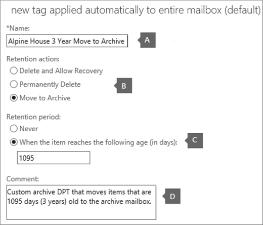
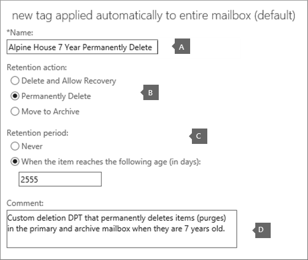
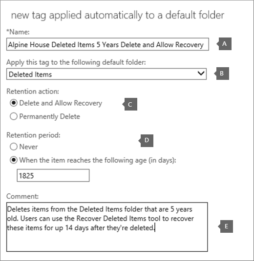

# Set up an archive and deletion policy for mailboxes in your organization

In Microsoft 365, admins can create an archiving and deletion policy that automatically moves items to a user's archive mailbox and automatically deletes items from the mailbox. The admin does this by creating a retention policy that's assigned to mailboxes, and moves items to a user's archive mailbox after a certain period of time and that also deletes items from the mailbox after they reach a certain age limit. The actual rules that determine what items are moved or deleted and when that happens are called retention tags. Retention tags are linked to a retention policy, that in turn is assigned to a user's mailbox. A retention tag applies retention settings to individual messages and folders in a user's mailbox. It defines how long a message remains in the mailbox and what action is taken when the message reaches the specified retention age. When a message reaches its retention age, it's either moved to the user's archive mailbox or it's deleted.
  
The steps in this article will set up an archiving and retention policy for a fictitious organization named Alpine House. Setting up this policy includes the following tasks:
  
- Enabling an archive mailbox for every user in the organization. This gives users additional mailbox storage, and is required so that a retention policy can move items to the archive mailbox. It also lets a user store archival information by moving items to their archive mailbox.

- Creating three custom retention tags that do the following:

  - Automatically moves items that are 3 years old to the user's archive mailbox. Moving items to the archive mailbox frees up space in a user's primary mailbox.

  - Automatically deletes items that are 5 years old from the Deleted Items folder. This also frees up space in the user's primary mailbox. User's will have the opportunity to recover these items if necessary. See the footnote in the [More information](#more-information) section for more details. 

  - Automatically (and permanently) deletes items that are 7 years old from both the primary and archive mailbox. Because of compliance regulations, some organization's are required to retain email for a certain period of time. After this time period expires, an organization might want to permanently remove these items user mailboxes.

- Creating a new retention policy and adding the new custom retention tags to it. Additionally, you'll also add built-in retention tags to the new retention policy. This includes personal tags that users can assign to items in their mailbox. You'll also add a retention tag that moves items from the Recoverable Items folder in the user's primary mailbox to the Recoverable Items folder in their archive mailbox. This helps free up space in a user's Recoverable Items folder when their mailbox is placed on hold.

You can follow some or all of the steps in this article to set up an archive and deletion policy for mailboxes in your own organization. We recommend that you test this process on a few mailboxes before implementing it on all mailboxes in your organization.
  
## Before you set up an archive and deletion policy

- You have to be a global administrator in your organization to perform the steps in this topic. 

- When you create a new user account and assign the user an Exchange Online license, a mailbox is automatically created for the user. When the mailbox is created, it's automatically assigned a default retention policy, named Default MRM Policy. In this article, you will create a new retention policy and then assign it to user mailboxes, replacing the Default MRM policy. A mailbox can have only one retention policy assigned to it at any one time.

- To learn more about retention tags and retention policies in Exchange Online, see [Retention tags and retention policies](/exchange/security-and-compliance/messaging-records-management/retention-tags-and-policies).

## Step 1: Enable archive mailboxes for users

The first step is to enable the archive mailbox for each user in your organization. A user's archive mailbox has to be enabled so that a retention tag with a "Move to Archive" retention action can move the item after the retention age expires.
  
> [!NOTE]
> You can enable archive mailboxes any time during this process, just as long as they're enabled at some point before you complete the process. If an archive mailbox isn't enabled, no action is taken on any items that have an archive or deletion policy assigned to it.
  
1. Go to [https://protection.office.com](https://protection.office.com).

2. Sign in using your global administrator account.
    
3. In the Security & Compliance Center, go to **Information governance** \> **Archive**.

    A list of the mailboxes in your organization is displayed and whether the corresponding archive mailbox is enabled or disabled.

4. Select all the mailboxes by clicking on the first one in the list, holding down the **Shift** key, and then clicking the last one in the list.

    > [!TIP]
    > This step assumes that no archive mailboxes are enabled. If you have any mailboxes with the archive enabled, hold down the **Ctrl** key and click each mailbox that has a disabled archive mailbox. Or you can click the **Archive mailbox** column header to sort the rows based on whether the archive mailbox is enabled or disabled to make it easier to select mailboxes.
  
5. In the details pane, under **Bulk Edit**, click **Enable**.

    A warning is displayed saying that items that are older than two years will be moved to the new archive mailbox. This is because the default retention policy that's assigned a new user mailbox when it's created has an archive default policy tag that has a retention age of 2 years. The custom archive default policy tag that you'll create in Step 2 has a retention age of 3 years. That means items that are 3 years or older will be moved to the archive mailbox.

6. Click **Yes** to close the warning message and start the process to enable the archive mailbox for each selected mailbox.

7. When the process is complete, click **Refresh**  to update the list on the **Archive** page.

    The archive mailbox is enabled for all user's in your organization.

    

## Step 2: Create new retention tags for the archive and deletion policies

In this step, you'll create the three custom retention tags that were previously described.
  
- Alpine House 3 Year Move to Archive (custom archive policy)

- Alpine House 7 Year Permanently Delete (custom deletion policy)

- Alpine House Deleted Items 5 Years Delete and Allow Recovery (custom tag for the Deleted Items folder)

To create new retention tags, you'll use the Exchange admin center (EAC) in your Exchange Online organization. Be sure to use the classic version of the EAC.
  
1. Go to [https://admin.protection.outlook.com/ecp/](https://admin.protection.outlook.com/ecp/) and sign in using your credentials.
  
2. In the EAC, go to **Compliance management** > **Retention tags**

    A list of the retention tags for your organization is displayed.

### Create a custom archive default policy tag
  
First, you'll create a custom archive default policy tag (DPT) that will move items to the archive mailbox after 3 years.
  
1. On the **Retention tags** page, click **New tag**, and then select **applied automatically to entire mailbox (default)**.

2. On the **New tag applied automatically to entire mailbox (default)** page, complete the following fields: 

    
  
   1. **Name** Type a name for the new retention tag. 

   2. **Retention action** Select **Move to Archive** to move items to the archive mailbox when the retention period expires.

   3. **Retention period** Select **When the item reaches the following age (in days)**, and then enter the duration of the retention period. For this scenario, items will be moved to the archive mailbox after 1095 days (3 years).

   4. **Comment** (Optional) Type a comment that explains the purpose of the custom retention tag.

3. Click **Save** to create the custom archive DPT.

    The new archive DPT is displayed in the list of retention tags.

### Create a custom deletion default policy tag
  
Next, you'll create another custom DPT but this one will be a deletion policy that permanently deletes items after 7 years.
  
1. On the **Retention tags** page, click **New tag**, and then select **applied automatically to entire mailbox (default)**.

2. On the **New tag applied automatically to entire mailbox (default)** page, complete the following fields: 

    
  
   1. **Name** Type a name for the new retention tag. 

   2. **Retention action** Select **Permanently Delete** to purge items from the mailbox when the retention period expires.

   3. **Retention period** Select **When the item reaches the following age (in days)**, and then enter the duration of the retention period. For this scenario, items will be purged after 2555 days (7 years).

   4. **Comment** (Optional) Type a comment that explains the purpose of the custom retention tag. 

3. Click **Save** to create the custom deletion DPT. 

    The new deletion DPT is displayed in the list of retention tags.

### Create a custom retention policy tag for the Deleted Items folder
  
The last retention tag that you'll create is a custom retention policy tag (RPT) for the Deleted Items folder. This tag will delete items in the Deleted Items folder after 5 years, and provides a recovery period when users can use the Recover Deleted Items tool to recover an item.
  
1. On the **Retention tags** page, click **New tag** , and then select **applied automatically to a default folder**.

2. On the **New tag applied automatically to a default folder** page, complete the following fields:

    
  
   1. **Name** Type a name for the new retention tag. 

   2. **Apply this tag to the following default folder** In the drop-down list, select **Deleted Items**.

   3. **Retention action** Select **Delete and Allow Recovery** to delete items when the retention period expires, but allow users to recover a deleted item within the deleted item retention period (which by default is 14 days).

   4. **Retention period** Select **When the item reaches the following age (in days)**, and then enter the duration of the retention period. For this scenario, items will be deleted after 1825 days (5 years).

   5. **Comment** (Optional) Type a comment that explains the purpose of the custom retention tag. 

3. Click **Save** to create the custom RPT for the Deleted Items folder.

    The new RPT is displayed in the list of retention tags.

## Step 3: Create a new retention policy

After you create the custom retention tags, the next step is to create a new retention policy and add the retention tags. You'll add the three custom retention tags that you created in Step 2, and the built-in tags that were mentioned in the first section. In Step 4, you'll assign this new retention policy to user mailboxes.
  
1. In the EAC, go to **Compliance management** > **Retention policies**.

2. On the **Retention policies** page, click **New** .

3. In the **Name** box, type a name for the new retention policy; for example, **Alpine House Archive and Deletion Policy**.

4. Under **Retention tags**, click **Add** .

    A list of the retention tags in your organization is displayed. Note the custom tags that you created in Step 2 are displayed.

5. Add the 9 retention tags that are highlighted in the following screenshot (these tags are described in more detail in the [More information](#more-information) section). To add a retention tag, select it and then click **Add**.

    
  
    > [!TIP]
    > You can select multiple retention tags by holding down the **Ctrl** key and then clicking each tag. 
  
6. After you've added the retention tags, click **OK**.

7. On the **New retention policy** page, click **Save** to create the new policy.

    The new retention policy is displayed in the list. Select it to display the retention tags linked to it in the details pane.

    
  
## Step 4: Assign the new retention policy to user mailboxes

When a new mailbox is created, a retention policy named Default MRM policy is assigned to it by default. In this step, you'll replace this retention policy (because a mailbox can have only one retention policy assigned to it) by assigning the new retention policy that you created in Step 3 to the user mailboxes in your organization. This step assumes that you'll assign the new policy to all mailboxes in your organization.
  
1. In the EAC, go to **Recipients** > **Mailboxes**.

    A list of all user mailboxes in your organization is displayed.

2. Select all the mailboxes by clicking on the first one in the list, holding down the **Shift** key, and then clicking the last one in the list. 

3. In the details pane on the right side of the EAC, under **Bulk Edit**, click **More options**.

4. Under **Retention Policy**, click **Update**.

5. On the **Bulk assign retention policy** page, in the **Select the retention policy** drop-down list, select the retention policy that you created in Step 3; for example, **Alpine House Archive and Retention Policy**.

6. Click **Save** to save the new retention policy assignment.

7. To verify that the new retention policy was assigned to mailboxes, you can do the following:

   1. Select a mailbox on the **Mailboxes** page, and then click **Edit** .

   2. On the mailbox properties page for the selected user, click **Mailbox features**.

   The name of the new policy assigned to the mailbox is displayed in the **Retention policy** drop-down list.

## (Optional) Step 5: Run the Managed Folder Assistant to apply the new settings

After you apply the new retention policy to mailboxes in Step 4, it can take up to 7 days in Exchange Online for the new retention settings to be applied to the mailboxes. This is because a process called the *Managed Folder Assistant* processes mailboxes at least once every 7 days. Instead of waiting for the Managed Folder Assistant to run, you can force this to happen by running the **Start-ManagedFolderAssistant** cmdlet in Exchange Online PowerShell.

 **What happens when you run the Managed Folder Assistant?** It applies the settings in the retention policy by inspecting items in the mailbox and determining whether they're subject to retention. It then stamps items subject to retention with the appropriate retention tag, and then takes the specified retention action on items past their retention age.
  
Here are the steps to connect to Exchange Online PowerShell, and then run the Managed Folder Assistant on every mailbox in your organization.

1. [Connect to Exchange Online PowerShell](/powershell/exchange/connect-to-exchange-online-powershell).
  
2. Run the following two commands to start the Managed Folder Assistant for all user mailboxes in your organization.

    ```powershell
    $Mailboxes = Get-Mailbox -ResultSize Unlimited -Filter {RecipientTypeDetails -eq "UserMailbox"}
    ```

    ```powershell
    $Mailboxes.Identity | Start-ManagedFolderAssistant
    ```

That's it! You've set up an archive and deletion policy for the Alpine House organization.

> [!NOTE]
> As previously stated, the Managed Folder Assistant processes mailboxes at least once every 7 days. So it's possible that a mailbox can be processed by the Managed Folder Assistant more frequently. Also, admins can't predict the next time a mailbox is processed by the Managed Folder Assistant, which is one reason why you may want to run it manually. However, if you want to temporarily prevent the Managed Folder Assistant from applying the new retention settings to a mailbox, you can run the `Set-Mailbox -ElcProcessingDisabled $true` command to temporarily disable the the Managed Folder Assistant from processing a mailbox. To re-enable the Managed Folder Assistant for a mailbox, run the `Set-Mailbox -ElcProcessingDisabled $false` command. Finally, if a mailbox user has a disabled account, we will not process the move items to archive action for that mailbox.
  
## (Optional) Step 6: Make the new retention policy the default for your organization

In Step 4, you have to assign the new retention policy to existing mailboxes. But you can configure Exchange Online so that the new retention policy is assigned to new mailboxes that are created in the future. You do this by using Exchange Online PowerShell to update your organization's default mailbox plan. A *mailbox plan* is a template that automatically configures properties on new mailboxes.  In this optional step, you can replace the current retention policy that's assigned to the mailbox plan (by default, the Default MRM Policy) with the retention policy that you created in Step 3. After you update the mailbox plan, the new retention policy will be assigned to new mailboxes.

1. [Connect to Exchange Online PowerShell](/powershell/exchange/connect-to-exchange-online-powershell).

2. Run the following command to display information about the mailbox plans in your organization.

    ```powershell
    Get-MailboxPlan | Format-Table DisplayName,RetentionPolicy,IsDefault
    ```

    Note the mailbox plan that's set as the default.

3. Run the following command to assign the new retention policy that you created in Step 3 (for example, **Alpine House Archive and Retention Policy**) to the default mailbox plan. This example assumes the name of the default mailbox plan is **ExchangeOnlineEnterprise**.

    ```powershell
    Set-MailboxPlan "ExchangeOnlineEnterprise" -RetentionPolicy "Alpine House Archive and Retention Policy"
    ```

4. You can rerun the command in step 2 to verify that the retention policy assigned to the default mailbox plan was changed.

## More information

- How is retention age calculated? The retention age of mailbox items is calculated from the date of delivery or the date of creation for items such as draft messages that aren't sent but are created by the user. When the Managed Folder Assistant processes items in a mailbox, it stamps a start date and an expiration date for all items that have retention tags with the Delete and Allow Recovery or Permanently Delete retention action. Items that have an archive tag are stamped with a move date. 

- The following table provides more information about each retention tag that is added to the custom retention policy that was created by following the steps in this topic.

    | Retention tag | What this tag does | Built-in or custom? | Type |
    |:-----|:-----|:-----|:-----|
    |Alpine House 3 Year Move to Archive  <br/> |Moves items that are 1095 days (3 years) old to the archive mailbox.  <br/> |Custom (See [Step 2: Create new retention tags for the archive and deletion policies](#step-2-create-new-retention-tags-for-the-archive-and-deletion-policies))  <br/> |Default Policy Tag (archive); this tag is automatically applied to the entire mailbox.  <br/> |
    |Alpine House 7 Year Permanently Delete  <br/> |Permanently deletes items in the primary mailbox or the archive mailbox when they are 7 years old.  <br/> |Custom (See [Step 2: Create new retention tags for the archive and deletion policies](#step-2-create-new-retention-tags-for-the-archive-and-deletion-policies))  <br/> |Default Policy Tag (deletion); this tag is automatically applied to the entire mailbox.  <br/> |
    |Alpine House Deleted Items 5 Years Delete and Allow Recovery  <br/> |Deletes items from the Deleted Items folder that are 5 years old. Users can recover these items for up 14 days after they're deleted.<sup>\*</sup> <br/> |Custom (See [Step 2: Create new retention tags for the archive and deletion policies](#step-2-create-new-retention-tags-for-the-archive-and-deletion-policies))  <br/> |Retention Policy Tag (Deleted Items); this tag is automatically applied to items in the Deleted items folder.  <br/> |
    |Recoverable Items 14 days Move to Archive  <br/> |Moves items that have been in the Recoverable Items folder for 14 days to the Recoverable Items folder in the archive mailbox.  <br/> |Built-in  <br/> |Retention Policy Tag (Recoverable Items); this tag is automatically applied to items in the Recoverable Items folder.  <br/> |
    |Junk Email  <br/> |Permanently deletes items that have been in the Junk Email folder for 30 days. Users can recover these items for up 14 days after they're deleted.<sup>\*</sup> <br/> |Built-in  <br/> |Retention Policy Tag (Junk Email); this tag is automatically applied to items in Junk Email folder.  <br/> |
    |1 Month Delete  <br/> |Permanently deletes items that are 30 days old. Users can recover these items for up 14 days after they're deleted.<sup>\*</sup> <br/> |Built-in  <br/> |Personal; this tag can be applied by users.  <br/> |
    |1 Year Delete  <br/> |Permanently deletes items that are 365 days old. Users can recover these items for up 14 days after they're deleted.<sup>\*</sup> <br/> |Built-in  <br/> |Personal; this tag can be applied by users.  <br/> |
    |Never Delete  <br/> |This tag prevents items from being deleted by a retention policy.  <br/> |Built-in  <br/> |Personal; this tag can be applied by users.  <br/> |
    |Personal 1 year move to archive  <br/> |Moves items to the archive mailbox after 1 year.  <br/> |Built-in  <br/> |Personal; this tag can be applied by users.  <br/> |

    > <sup>\*</sup> Users can use the Recover Deleted Items tool in Outlook and Outlook on the web (formerly known as Outlook Web App) to recover a deleted item within the deleted item retention period, which by default is 14 days in Exchange Online. An administrator can use Windows PowerShell to increase the deleted item retention period to a maximum of 30 days. For more information, see: [Recover deleted items in Outlook for Windows](https://support.office.com/article/49e81f3c-c8f4-4426-a0b9-c0fd751d48ce) and [Change the deleted item retention period for a mailbox in Exchange Online](https://www.microsoft.com/?ref=go)
  
- Using the **Recoverable Items 14 days Move to Archive** retention tag helps free up storage space in the Recoverable Items folder in the user's primary mailbox. This is useful when a user's mailbox is placed on hold, which means nothing is ever permanently deleted the user's mailbox. Without moving items to the archive mailbox, it's possible the storage quota for the Recoverable Items folder in the primary mailbox will be reached. For more information about this and how to avoid it, see [Increase the Recoverable Items quota for mailboxes on hold](./increase-the-recoverable-quota-for-mailboxes-on-hold.md).