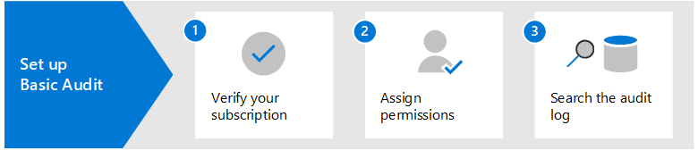
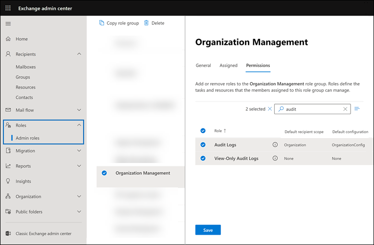
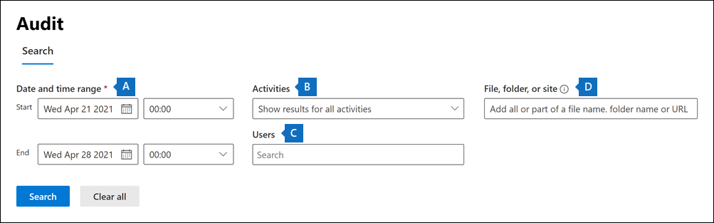

# Set up Basic auditing in Microsoft 365

Basic auditing in Microsoft 365 lets you search for audit records for activities performed in the different Microsoft 365 services by users and admins. Because Basic auditing is enabled by default for most Microsoft 365 and Office 365 organizations, there's only a few things you need to do before you and others in your organization can search the audit log.

This article discusses the following steps necessary to set up Basic auditing.

These steps include ensuring the proper organizational subscriptions and user licensing required to generate and preserve audit records and assigning permissions to team members of your security operations, IT, compliance, and legal teams so that can search the audit log.

For more information, see [Basic auditing in Microsoft 365](auditing-solutions-overview.md#basic-auditing).

## Step 1: Verify organization subscription and user licensing

Licensing for Basic auditing requires the appropriate organization subscription that provides access to audit log search tool and per-user licensing that's required to log and retain audit records.

When an audited activity is performed by a user or admin, an audit record is generated and stored in the audit log for your organization. In Basic auditing, audit records are retained and searchable in the audit log for 90 days.

For a list of subscription and licensing requirements for Basic auditing, see [Auditing solutions in Microsoft 365](auditing-solutions-overview.md#licensing-requirements).

## Step 2: Assign permissions to search the audit log

Admins and members of investigation teams must be assigned the View-Only Audit Logs or Audit Logs role in Exchange Online to search the audit log. By default, these roles are assigned to the Compliance Management and Organization Management role groups on the **Permissions** page in the Exchange admin center. Global administrators in Office 365 and Microsoft 365 are automatically added as members of the Organization Management role group in Exchange Online. To give a user the ability to search the audit log with the minimum level of privileges, you can create a custom role group in Exchange Online, add the View-Only Audit Logs or Audit Logs role, and then add the user as a member of the new role group. For more information, see [Manage role groups in Exchange Online](/Exchange/permissions-exo/role-groups).

The following screenshot shows the two audit-related roles assigned to the Organization Management role group in the Exchange admin center.

## Step 3: Search the audit log

Now you're ready to search the audit log in the Microsoft 365 compliance center.

1. Go to <https://compliance.microsoft.com> and sign in using an account that has been assigned the appropriate audit permissions.

2. In the left navigation pane of the Microsoft 365 compliance center, click **Show all** and then click **Audit**.

3. On the **Audit** page, configure the search using the following conditions on the **Search** tab. 

   

   1. **Date and time range**. Select a date and time range to display the events that occurred within that period. The date and time are presented in local time. The last seven days are selected by default.
  
   2. **Activities**. Select the activities to search for. Use the search box to search for activities to add to the list. For a partial list of audited activities, see [Audited activities](search-the-audit-log-in-security-and-compliance.md#audited-activities). Leave this box blank to return entries for all audited activities.
  
   3. **Users**.  Click in this box and start typing the name of users to display search results for. The audit log entries for the selected activities performed by the users you select in this box are displayed in the list of results. Leave this box blank to return entries for all users (and service accounts) in your organization.
  
   4. **File, folder, or site**. Type some or all of a file or folder name to search for activity related to the file of folder that contains the specified keyword. You can also specify a URL of a file or folder. If you use a URL of a file or folder, be sure the type the full URL path or if you type a portion of the URL, don't include any special characters or spaces. Leave this box blank to return entries for all files and folders in your organization.

4. Click **Search** to run the search.

A new page is display that shows the audit log search is running. When the search is completed, audit records are displayed on the page. Click a record to display a flyout page with detailed properties.

For more detailed instructions, see [Search the audit log in the compliance center](search-the-audit-log-in-security-and-compliance.md).
