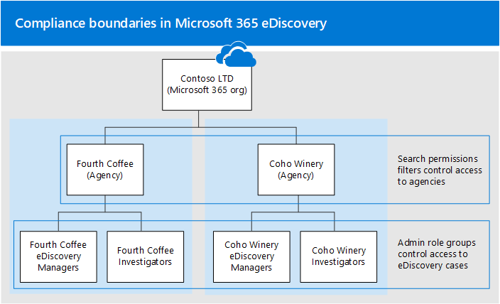

# Set up compliance boundaries for eDiscovery investigations

The guidance in this article can be applied when using either Core eDiscovery or Advanced eDiscovery to manage investigations.

Compliance boundaries create logical boundaries within an organization that control the user content locations (such as mailboxes, OneDrive accounts, and SharePoint sites) that eDiscovery managers can search. Also, compliance boundaries control who can access eDiscovery cases used to manage the legal, human resources, or other investigations within your organization. The need for compliance boundaries is often necessary for multi-national corporations that have to respect geographical boarders and regulations and for governments, which are often divided into different agencies. In Microsoft 365, compliance boundaries help you meet these requirements when performing content searches and managing investigations with eDiscovery cases.
  
We use the example in the following illustration to explain how compliance boundaries work.
  

  
In this example, Contoso LTD is an organization that consists of two subsidiaries, Fourth Coffee and Coho Winery. The business requires that eDiscovery mangers and investigators can only search the Exchange mailboxes, OneDrive accounts, and SharePoint sites in their agency. Also, eDiscovery managers and investigators can only see eDiscovery cases in their agency, and they can only access the cases that they're a member of. Additionally in this scenario, investigators cannot place content locations on hold or export content from a case. Here's how compliance boundaries meet these requirements.
  
- The search permissions filtering functionality in Content search controls the content locations that eDiscovery managers and investigators can search. This means eDiscovery managers and investigators in the Fourth Coffee agency can only search content locations in the Fourth Coffee subsidiary. The same restriction applies to the Coho Winery subsidiary.

- Role groups provide the following functions for compliance boundaries:

  - Control who can see the eDiscovery cases in the Security & Compliance Center. This means that eDiscovery managers and investigators can only see the eDiscovery cases in their agency.

  - Control who can assign members to an eDiscovery case. This means eDiscovery managers and investigators can only assign members to cases that they themselves are a member of.

  - Control the eDiscovery-related tasks that members can perform by adding or removing roles that assign specific permissions.

Here's the process for setting up compliance boundaries:
  
[Step 1: Identify a user attribute to define your agencies](#step-1-identify-a-user-attribute-to-define-your-agencies)

[Step 2: File a request with Microsoft Support to synchronize the user attribute to OneDrive accounts](#step-2-file-a-request-with-microsoft-support-to-synchronize-the-user-attribute-to-onedrive-accounts)

[Step 3: Create a role group for each agency](#step-3-create-a-role-group-for-each-agency)

[Step 4: Create a search permissions filter to enforce the compliance boundary](#step-4-create-a-search-permissions-filter-to-enforce-the-compliance-boundary)

[Step 5: Create an eDiscovery case for an intra-agency investigations](#step-5-create-an-ediscovery-case-for-intra-agency-investigations)

## Before you set up compliance boundaries

You have to meet the following prerequisites before the Azure Active Directory (Azure AD) attribute that you identity (in Step 1) can be successfully synched to a user's OneDrive account (in Step 2):

- Users must be assigned an Exchange Online license and a SharePoint Online license.

- User mailboxes must be at least 10 MB in size. If a user's mailbox is less than 10 MB, the attribute used to define your agencies won't be synched to the user's OneDrive account.

- Compliance boundaries and the attributes used to create search permissions filters require that Azure Active Directory (Azure AD) attributes are synchronized to user mailboxes. To verify that the attributes that you want to use have been synchronized, run the [Get-User](/powershell/module/exchange/get-user) cmdlet in Exchange Online PowerShell. The output of this cmdlet displays the Azure AD attributes synchronized to Exchange Online.

## Step 1: Identify a user attribute to define your agencies

The first step is to choose an Azure AD attribute to use that will define your agencies. This attribute is used to create the search permissions filter that limits an eDiscovery manager to search only the content locations of users who are assigned a specific value for this attribute. For example, let's say Contoso decides to use the **Department** attribute. The value for this attribute for users in the Fourth Coffee subsidiary would be  `FourthCoffee`  and the value for users in Coho Winery subsidiary would be `CohoWinery`. In Step 4, you use this  `attribute:value`  pair (for example, *Department:FourthCoffee*) to limit the user content locations that eDiscovery managers can search. 
  
Here's a list of Azure AD user attributes that you can use for compliance boundaries:
  
- Company

- CustomAttribute1 - CustomAttribute15

- Department

- Office

- C (Two-letter country code) <sup>*</sup>

  > [!NOTE]
  > <sup>*</sup> This attribute maps to the CountryOrRegion property that is returned by running the **Get-User** cmdlet in Exchange Online PowerShell. The cmdlet returns the localized country name, which is translated from the two-letter country code. For more information, see the CountryOrRegion parameter description in the [Set-User](/powershell/module/exchange/set-user) cmdlet reference article.

Although more user attributes are available, particularly for Exchange mailboxes, the attributes listed above are the only ones currently supported by OneDrive.
  
## Step 2: File a request with Microsoft Support to synchronize the user attribute to OneDrive accounts

> [!IMPORTANT]
> This step is no longer required as mailbox filters will apply to OneDrive for Business from the end of June 2021 and so raising the below support request will result in it being declined as it is no longer required.

The next step is to file a request with Microsoft Support to synchronize the Azure AD attribute that you chose in Step 1 to all OneDrive accounts in your organization. After this synchronization occurs, the attribute (and its value) that you chose in Step 1 will be mapped to a hidden managed property named `ComplianceAttribute`. You use this attribute to create the search permissions filter for OneDrive in Step 4.
  
Include the following information when you submit the request to Microsoft support:
  
- The default domain name of your organization

- The name of the Azure AD attribute (from Step 1)

- The following title or description of the purpose of the support request: "Enable OneDrive for Business Synchronization with Azure AD for Compliance Security Filters". This helps route the request to the eDiscovery engineering team who implements the request.

After the engineering change is made and the attribute is synchronized to OneDrive, Microsoft Support will send you the build number that the change was made in and an estimated deployment date. The deployment process usually takes 4–6 weeks after you submit the support request.
  
> [!IMPORTANT]
> You can complete Step 3 through Step 5 before this attribute change is deployed. But running content searches won't return documents from OneDrive accounts that are specified in a search permissions filter until after the attribute synch is deployed.
  
## Step 3: Create a role group for each agency

The next step is to create the role groups in the Security & Compliance Center that will align with your agencies. We recommend that you create a role group by copying the built-in eDiscovery Managers group, adding the appropriate members, and removing roles that may not be applicable to your needs. For more information about eDiscovery-related roles, see [Assign eDiscovery permissions](assign-ediscovery-permissions.md).
  
To create the role groups, go to the **Permissions** page in the Security & Compliance Center and create a role group for each team in each agency that will use compliance boundaries and eDiscovery cases to manage investigations.
  
Using the Contoso compliance boundaries scenario, four role groups need to be created and the appropriate members added to each one.
  
- Fourth Coffee eDiscovery Managers

- Fourth Coffee Investigators

- Coho Winery eDiscovery Managers

- Coho Winery Investigators
  
To meet the requirements of the Contoso compliance boundaries scenario, you would also remove the **Hold** and **Export** roles from the investigators role groups to prevent investigators from placing holds on content locations and exporting content from a case.

## Step 4: Create a search permissions filter to enforce the compliance boundary

After you've created role groups for each agency, the next step is to create the search permissions filters that associate each role group to its specific agency and defines the compliance boundary itself. You need to create one search permissions filter for each agency. For more information about creating security permissions filters, see [Configure permissions filtering for Content Search](permissions-filtering-for-content-search.md).
  
Here's the syntax that's used to create a search permissions filter used for compliance boundaries.

```powershell
New-ComplianceSecurityFilter -FilterName <name of filter> -Users <role groups> -Filters "Mailbox_<ComplianceAttribute>  -eq '<AttributeVale> '", "Site_<ComplianceAttribute>  -eq '<AttributeValue>' -or Site_Path -like '<SharePointURL>*'" -Action <Action >
```

Here's a description of each parameter in the command:
  
- `FilterName`: Specifies the name of the filter. Use a name that describes or identifies the agency that the filter is used in.

- `Users`: Specifies the users or groups who get this filter applied to the search actions they perform. For compliance boundaries, this parameter specifies the role groups (that you created in Step 3) in the agency that you're creating the filter for. Note this is a multi-value parameter so you can include one or more role groups, separated by commas.

- `Filters`: Specifies the search criteria for the filter. For the compliance boundaries, you define the following filters. Each one applies to a content location. 

    - `Mailbox`: Specifies the mailboxes that the role groups defined in the  `Users` parameter can search. For compliance boundaries,  *ComplianceAttribute*  is the same attribute that you identified in Step 1 and  *AttributeValue*  specifies the agency. This filter allows members of the role group to search only the mailboxes in a specific agency; for example, `"Mailbox_Department -eq 'FourthCoffee'"`. 

    - `Site`: Specifies the OneDrive accounts that the role groups defined in the `Users` parameter can search. For the OneDrive filter, use the actual string  `ComplianceAttribute`. This maps to the same attribute that you identified in Step 1 and that's synchronized to OneDrive accounts as a result of the support request that you submitted in Step 2; *AttributeValue*  specifies the agency. This filter allows members of the role group to search only the OneDrive accounts in a specific agency; for example,  `"Site_ComplianceAttribute -eq 'FourthCoffee'"`.

    - `Site_Path`: Specifies the SharePoint sites that the role groups defined in the  `Users` parameter can search. The  *SharePointURL*  specifies the sites in the agency that members of the role group can search. For example,  `"Site_Path -like 'https://contoso.sharepoint.com/sites/FourthCoffee*'"`. Notice the `Site` and `Site_Path` filters are connected by an **-or** operator.

     > [!NOTE]
     > The syntax for the `Filters` parameter includes a *filters list*. A filters list is a filter that includes a mailbox filter and a site filter separated by a comma. In the previous example, notice that a comma separates **Mailbox_ComplianceAttribute** and **Site_ComplianceAttribute**: `-Filters "Mailbox_<ComplianceAttribute>  -eq '<AttributeVale> '", "Site_ComplianceAttribute  -eq '<AttributeValue>' -or Site_Path -like '<SharePointURL>*'"`. When this filter is processed during the running of a content search, two search permissions filters are created from the filters list: one mailbox filter and one site filter. An alternative to using a filters list would be to create two separate search permissions filters for each agency: one search permissions filter for the mailbox attribute and one filter for the site attributes. In either case, the results will be the same. Using a filters list or creating separate search permissions filters is a matter of preference.

- `Action`: Specifies the type of search action the filter is applied to. For example,  `-Action Search` would only apply the filter when members of the role group defined in the `Users` parameter run a search. In this case, the filter wouldn't be applied when exporting search results. For compliance boundaries, use  `-Action All` so the filter applies to all search actions. 

    For a list of the search actions, see the "New-ComplianceSecurityFilter" section in [Configure permissions filtering for Content Search](permissions-filtering-for-content-search.md#new-compliancesecurityfilter).

Here are examples of the two search permissions filters that would be created to support the Contoso compliance boundaries scenario. Both of these examples include a comma-separated filters list, in which the mailbox and site filters are included in the same search permissions filter and are separated by a comma.
  
### Fourth Coffee

```powershell
New-ComplianceSecurityFilter -FilterName "Fourth Coffee Security Filter" -Users "Fourth Coffee eDiscovery Managers", "Fourth Coffee Investigators" -Filters "Mailbox_Department -eq 'FourthCoffee'", "Site_ComplianceAttribute -eq 'FourthCoffee' -or Site_Path -like 'https://contoso.sharepoint.com/sites/FourthCoffee*'" -Action ALL
```

### Coho Winery

```powershell
New-ComplianceSecurityFilter -FilterName "Coho Winery Security Filter" -Users "Coho Winery eDiscovery Managers", "Coho Winery Investigators" -Filters "Mailbox_Department -eq 'CohoWinery'", "Site_ComplianceAttribute -eq 'CohoWinery' -or Site_Path -like 'https://contoso.sharepoint.com/sites/CohoWinery*'" -Action ALL
```

## Step 5: Create an eDiscovery case for intra-agency investigations

The final step is to create a Core eDiscovery case or Advanced eDiscovery case in the Microsoft 365 compliance center and then add the role group that you created in Step 3 as a member of the case. This results in two important characteristics of using compliance boundaries:
  
- Only members of the role group added to the case will be able to see and access the case in the Security & Compliance Center. For example, if the Fourth Coffee Investigators role group is the only member of a case, then members of the Fourth Coffee eDiscovery Managers role group (or members of any other role group) won't be able to see or access the case.

- When a member of the role group assigned to a case runs a search associated with the case, they will only be able to search the content locations within their agency (which is defined by the search permissions filter that you created in Step 4.)

To create a case and assign members:

1. Go to the **Core eDiscovery** or **Advanced eDiscovery** page in the Microsoft 365 compliance center and create a case.

2. In the list of cases, click the name of the case you created.

3. Add role groups as members to the case. For instructions, see the one of the following articles:

   - [Add members to a Core eDiscovery case](get-started-core-ediscovery.md#step-4-optional-add-members-to-a-core-ediscovery-case)

   - [Add members to an Advanced eDiscovery case](add-or-remove-members-from-a-case-in-advanced-ediscovery.md)

> [!NOTE]
> When adding a role group to a case, you can only add the role groups that you are a member of.

## Searching and exporting content in Multi-Geo environments

Search permissions filters also let you control where content is routed for export and which datacenter can be searched when searching content locations in a [SharePoint Multi-Geo environment](../enterprise/multi-geo-capabilities-in-onedrive-and-sharepoint-online-in-microsoft-365.md).
  
- **Export search results:** You can export the search results from Exchange mailboxes, SharePoint sites, and OneDrive accounts from a specific datacenter. This means that you can specify the datacenter location that search results will be exported from.

    Use the **Region** parameter for **New-ComplianceSecurityFilter** or **Set-ComplianceSecurityFilter** cmdlets to create or change which datacenter the export will be routed through.
  
    |**Parameter value**|**Datacenter location**|
    |:-----|:-----|
    |NAM  <br/> |North American (datacenters are in the US)  <br/> |
    |EUR  <br/> |Europe  <br/> |
    |APC  <br/> |Asia Pacific  <br/> |
    |CAN <br/> |Canada|
    |||

- **Route content searches:** You can route the content searches of SharePoint sites and OneDrive accounts to a satellite datacenter. This means you can specify the datacenter location where searches will be run.

    Use one of the following values for the **Region** parameter to control the datacenter location that searches will run in when searching SharePoint sites and OneDrive accounts. 
  
    |**Parameter value**|**Datacenter routing locations for SharePoint**|
    |:-----|:-----|
    |NAM  <br/> |US  <br/> |
    |EUR  <br/> |Europe  <br/> |
    |APC  <br/> |Asia Pacific  <br/> |
    |CAN  <br/> |US  <br/> |
    |AUS  <br/> |Asia Pacific  <br/> |
    |KOR  <br/> |The organization's default datacenter  <br/> |
    |GBR  <br/> |Europe  <br/> |
    |JPN  <br/> |Asia Pacific  <br/> |
    |IND  <br/> |Asia Pacific  <br/> |
    |LAM  <br/> |US  <br/> |
    |NOR  <br/> |Europe |
    |BRA  <br/> |North American datacenters |
    |||

   If you don't specify the **Region** parameter for a search permissions filter, the organization's primary SharePoint region will be searched. Search results are exported to the closest datacenter.

   To simplify the concept, the **Region** parameter controls the datacenter that is used to search for content in SharePoint and OneDrive. This doesn't apply to searching for content in Exchange because Exchange content searches aren't bound by the geographic location of datacenters. Also, the same **Region** parameter value may also dictate the datacenter that exports are routed through. This is often necessary to control the movement of data across geographic boarders.

> [!NOTE]
> If you're using Advanced eDiscovery, the **Region** parameter doesn't control the region that data is exported from. Data is exported from the organization's primary datacenter. Also, searching for content in SharePoint and OneDrive isn't bound by the geographic location of datacenters. All datacenters are searched. For more information about Advanced eDiscovery, see [Overview of the Advanced eDiscovery solution in Microsoft 365](overview-ediscovery-20.md).

Here are examples of using the **Region** parameter when creating search permission filters for compliance boundaries. This assumes that the Fourth Coffee subsidiary is located in North America and that Coho Winery is in Europe. 
  
```powershell
New-ComplianceSecurityFilter -FilterName "Fourth Coffee Security Filter" -Users "Fourth Coffee eDiscovery Managers", "Fourth Coffee Investigators" -Filters "Mailbox_Department -eq 'FourthCoffee'", "Site_Department -eq 'FourthCoffee' -or Site_Path -like 'https://contoso.sharepoint.com/sites/FourthCoffee*'" -Action ALL -Region NAM
```

```powershell
New-ComplianceSecurityFilter -FilterName "Coho Winery Security Filter" -Users "Coho Winery eDiscovery Managers", "Coho Winery Investigators" -Filters "Mailbox_Department -eq 'CohoWinery'", "Site_Department -eq 'CohoWinery' -or Site_Path -like 'https://contoso.sharepoint.com/sites/CohoWinery*'" -Action ALL -Region EUR
```

Keep the following things in mind when searching and exporting content in multi-geo environments.
  
- The **Region** parameter doesn't control searches of Exchange mailboxes. All datacenters will be searched when you search mailboxes. To limit the scope of which Exchange mailboxes are searched, use the **Filters** parameter when creating or changing a search permissions filter. 

- If it's necessary for an eDiscovery Manager to search across multiple SharePoint regions, you need to create a different user account for that eDiscovery manager to use in the search permissions filter to specify the region where the SharePoint sites or OneDrive accounts are located. For more information about setting this up, see the "Searching for content in a SharePoint Multi-Geo environment" section in [Content Search](content-search-reference.md#searching-for-content-in-a-sharepoint-multi-geo-environment).

- When searching for content in SharePoint and OneDrive, the **Region** parameter directs searches to either the primary or satellite location where the eDiscovery manager will conduct eDiscovery investigations. If an eDiscovery manager searches SharePoint and OneDrive sites outside of the region that's specified in the search permissions filter, no search results are returned.

- When exporting search results, content from all content locations (including Exchange, Skype for Business, SharePoint, OneDrive, and other services that you can search by using the Content Search tool) are uploaded to the Azure Storage location in the datacenter that's specified by the **Region** parameter. This helps organizations stay within compliance by not allowing content to be exported across controlled borders. If no region is specified in the search permissions filter, content is uploaded to the organization's primary datacenter.

- You can edit an existing search permissions filter to add or change the region by running the following command:

    ```powershell
    Set-ComplianceSecurityFilter -FilterName <Filter name>  -Region <Region>
    ```

## Using compliance boundaries for SharePoint hub sites

[SharePoint hub sites](/sharepoint/dev/features/hub-site/hub-site-overview) often align with the same geographical or agency boundaries that eDiscovery compliance boundaries follow. That means you can use the site ID property of the hub site to create a compliance boundary. To do this, use the [Get-SPOHubSite](/powershell/module/sharepoint-online/get-spohubsite#examples) cmdlet in SharePoint Online PowerShell to obtain the SiteId for the hub site and then use this value for the department ID property to create a search permissions filter.

Use the following syntax to create a search permissions filter for a SharePoint hub site:

```powershell
New-ComplianceSecurityFilter -FilterName <Filter Name> -Users <User or Group> -Filters "Site_Departmentid -eq '{SiteId of hub site}'" -Action ALL
```

Here's an example of creating a search permissions filter for a hub site for the Coho Winery agency:

```powershell
New-ComplianceSecurityFilter -FilterName "Coho Winery Hub Site Security Filter" -Users "Coho Winery eDiscovery Managers", "Coho Winery Investigators" -Filters "Site_Departmentid -eq '44252d09-62c4-4913-9eb0-a2a8b8d7f863'" -Action ALL
```

## Compliance boundary limitations

Keep the following limitations in mind when managing eDiscovery cases and investigations that use of compliance boundaries.
  
- When creating and running a search, you can select content locations that are outside of your agency. However, because of the search permissions filter, content from those locations isn't included in the search results.

- Compliance boundaries don't apply to holds in eDiscovery cases. That means an eDiscovery manager in one agency can place a user in a different agency on hold. However, the compliance boundary will be enforced if the eDiscovery manager searches the content locations of the user who was placed on hold. That means the eDiscovery manager won't be able search the user's content locations, even though they were able to place the user on hold.

    Also, hold statistics will only apply to content locations in the agency.

- If you're assigned a search permissions filter (either a mailbox or a site filter) and you try to export unindexed items for a search that includes all SharePoint sites in your organization, you'll receive the following error message: `Unable to execute the task. Reason: The scope options UnindexedItemsOnly or BothIndexedandUnindexedItems are not allowed when the executing user has a compliance security filter applied`. If you're assigned a search permissions filter and you want to export unindexed items from SharePoint, you'll have to rerun the search and include specific SharePoint sites to search. Otherwise, you'll only be able to export indexed items from a search that includes all SharePoint sites. For more information about the options when you export search results, see [Export Content search results](export-search-results.md#step-1-prepare-search-results-for-export).

- Search permissions filters aren't applied to Exchange public folders.

## More information

- If a mailbox is de-licensed or soft-deleted, Azure AD attributes are no longer synchronized to the mailbox. If a hold was placed on the mailbox when it was deleted, the content preserved in the mailbox is still subject to a compliance boundary or search permissions filter based on the last time the Azure AD attributes were synchronized before the mailbox was deleted. 

    Additionally, the synchronization between the user's mailbox and OneDrive account will cease if the mailbox is de-licensed or soft-deleted. The last stamped value of the compliance attribute for the OneDrive account will remain in effect.

- The compliance attribute is synchronized from a user's Exchange mailbox to their OneDrive account every seven days. As previously stated, this synchronization only occurs when the user is assigned both an Exchange Online and SharePoint Online license and the user's mailbox is at least 10 MB.

- If compliance boundaries and search permissions filters are implemented for both a user's mailbox and OneDrive account, then we recommend that you don't delete a user's mailbox and not their OneDrive account. In other words, if you delete a user's mailbox, you should also remove the user's OneDrive account.

- There are situations (such as a returning employee) where a user might have two or more OneDrive accounts. In these cases, only the primary OneDrive account associated with the user in Azure AD will be synchronized.

- Compliance boundaries and search permissions filters depend on attributes being stamped on content in Exchange, OneDrive, and SharePoint and the subsequent indexing of this stamped content. 

- We don't recommend using exclusion filters (such as using `-not()` in a search permissions filter) for a content-based compliance boundary. Using an exclusion filter can have unexpected results if content with recently updated attributes hasn't been indexed. 

## Frequently asked questions

**Who can create and manage search permissions filters (using New-ComplianceSecurityFilter and Set-ComplianceSecurityFilter cmdlets)?**
  
To create, view, and modify search permissions filters, you have to be a member of the Organization Management role group in the Security & Compliance Center.
  
**If an eDiscovery manager is assigned to more than one role group that spans multiple agencies, how do they search for content in one agency or the other?**
  
The eDiscovery manager can add parameters to their search query that restrict the search to a specific agency. For example, if an organization has specified the **CustomAttribute10** property to differentiate agencies, they can append the following to their search query to search mailboxes and OneDrive accounts in a specific agency:  `CustomAttribute10:<value> AND Site_ComplianceAttribute:<value>`.
  
**What happens if the value of the attribute that's used as the compliance attribute in a search permissions filter is changed?**
  
It takes up to three days for a search permissions filter to enforce the compliance boundary if the value of the attribute that's used in the filter is changed. For example, in the Contoso scenario let's say that a user in the Fourth Coffee agency is transferred to the Coho Winery agency. As a result, the value of the **Department** attribute on the user object is changed from *FourthCoffee* to *CohoWinery*. In this situation, Fourth Coffee eDiscovery and investors will get search results for that user for up three days after the attribute is changed. Similarly, it takes up to three days before Coho Winery eDiscovery managers and investigators get search results for the user.
  
**Can an eDiscovery manager see content from two separate compliance boundaries?**
  
Yes, this can be done when searching Exchange mailboxes by adding the eDiscovery manager to role groups that have visibility to both agencies. However when searching SharePoint sites and OneDrive accounts, an eDiscovery manager can search for content in different compliance boundaries only if the agencies are in the same region or geo location. **Note:** This limitation for sites doesn't apply in Advanced eDiscovery because searching for content in SharePoint and OneDrive isn't bound by geographic location.
  
**Do search permissions filters work for eDiscovery case holds, Microsoft 365 retention policies, or DLP?**
  
No, not at this time.
  
**If I specify a region to control where content is exported, but I don't have a SharePoint organization in that region, can I still search SharePoint?**
  
If the region specified in the search permissions filter doesn't exist in your organization, the default region will be searched.
  
**What is the maximum number of search permissions filters that can be created in an organization?**
  
There is no limit to the number of search permissions filters that can be created in an organization. However, search performance will be impacted when there are more than 100 search permissions filters. To keep the number of search permissions filters in your organization as small as possible, create filters that combine rules for Exchange, SharePoint, and OneDrive into a single search permissions filter whenever possible.
