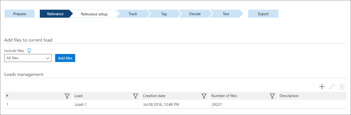

# Set up loads to add imported files in Advanced eDiscovery (classic)

> [!NOTE]
> Advanced eDiscovery requires an Office 365 E3 with the Advanced Compliance add-on or an E5 subscription for your organization. If you don't have that plan and want to try Advanced eDiscovery, you can [sign up for a trial of Office 365 Enterprise E5](https://go.microsoft.com/fwlink/p/?LinkID=698279). 
  
In Advanced eDiscovery, a load is a new batch of files added to a case. By default, one load is defined and all imported files are added to it. Before performing Relevance training, imported files must be added to the load. 
  
Consider the following scenarios:
  
- New files are known to be similar to the previous files loaded to the case database, or the previous load of files was a random set from the file collection. In this instance, add the imported files to the current file load.
    
- New files are different from previous ones (for example, from a different source), or you have no prior knowledge that they're similar or different to the previous loads. In this scenario, add the imported files to a new file load. Advanced eDiscovery recognizes this as a Rolling loads scenario, invokes a Catch-up process, locks Relevance training and Batch calculations until Catch-up is completed, and the new load is integrated and trained. 
    
## Adding imported files to the current load

All imported files must be added to a load to be processed in Advanced eDiscovery. Imported files are added to the last defined load. If you import additional files later, they also must be added to the load.
  
1. In the **Relevance \> Relevance setup** tab, select **Loads**.
    
    
  
2. **Include files**: Select an option for files to include. By default, adding files to the current load is based on the "All files" population.
    
    > [!TIP]
    > Load all available culled files into Relevance. If you plan to load only a subset of the available files, please first consult with Support, as loading subsets can adversely affect Relevance training. 
  
3. In **Loads management**, select a load.
    
4. Click **Add files**. The files are added to the load and a confirmation message is displayed. 
    
5. Click **OK**.
    
The files can now be processed in Advanced eDiscovery Relevance for training the files.
  
## Editing a load name within a case

If changing the load name, it is recommended to use a name that is significant to the case.
  
1. In the **Relevance \> Relevance setup** tab, select **Loads**.
    
2. From the **Loads management** list, select a load and click the **Edit** icon. The Edit load window is displayed. 
    
3. Enter the changes, and then click **OK**.
    
## Adding imported files to a new load

After starting Relevance training or performing Batch calculation, you may want to import and process an additional set of files. 
  
During Catch-up, you can create, tag, and analyze the Catch-up set. Advanced eDiscovery compares its assessment of Relevant and Non-Relevant files in the new load to those in previous loads. Based on the results, you are prompted to make Catch-up decisions, if necessary, and Advanced eDiscovery provides recommendations based on the accrued Relevance information. 
  
Rolling Loads and Catch-up functionality varies as follows: 
  
- When you import a new file load after Batch calculation, Advanced eDiscovery determines to what extent the files fall into one of the following categories:
    
  - Similar (homogeneous): A new, custom round of Relevance training is not required and the knowledge accrued from the previous load can be applied "as is" to the new load. 
    
  - Distinct (heterogeneous): A new, custom round of Relevance training is required, and the knowledge accrued from the previous load cannot be applied. 
    
    These terms refer to the level of similarity of files between loads and not within the loads. 
    
- When importing a new file load during Relevance training (before Batch calculation), Catch-up enables you to continue Relevance training on the united file set. Advanced eDiscovery does not estimate whether the new load is similar to or distinct from the previous load. It simply collects information about the new load and enables Relevance training to continue on the new and previous sets of files. 
    
- When there are multiple issues in Relevance training as well as issues after Batch calculation, the Catch-up process is performed once for all issues, and the results are calculated and displayed for each issue.
    
> [!NOTE]
> The size of the Catch-up sample may vary. It depends on the size of the new load relative to the previous loads, and on the number of samples completed before adding the new load. The Catch-up sample is typically a set of 200 to 2,000 files from the new load. 
  
> [!TIP]
> Catch-up stops any other tasks and requires individual file tagging and review. Therefore, you can reduce overhead when you add new files in large batches. 
  
## Adding a new file load using Catch-up and Rolling loads

1. In the **Relevance \> Relevance setup** tab, select **Loads**.
    
2. Under **Loads management**, click the **+** icon to add a load. A confirmation message is displayed. 
    
3. Click **Yes** to continue. The **Add new load** dialog is displayed. 
    
    > [!NOTE]
    > You can only add a new load if actions were performed to the previous load. 
  
4. In the **Add new load** dialog, type information in **Load name** and **Description** and then click **OK**. Advanced eDiscovery adds a new load.
    
5. To import the new load file, click **Add files**. All new files are added to this load. After Advanced eDiscovery imports the files, it recognizes the Rolling loads scenario and indicates Catch-up as the next step.
    
6. Click **Catch-up** at the bottom of the dialog to run the scenario. 
    
    A single Catch-up set, typically containing 200 to 2,000 files from the new load, is created for all issues to allow concurrent file tagging.
    
    Details are provided about whether loads are similar or distinct, whether Advanced eDiscovery merged or split the loads automatically, and information regarding processing in the next step.
    
    You can then tag files and run a calculate operation. The tagging enables Relevance to determine if loads are similar or distinct and enables you to continue working on the new set of files.
    
7. After the Catch-up set is reviewed, view **Relevance \> Track** for the Catch-up results. 
    
1. If the new file load was added during Relevance training (meaning, the issue has not yet gone through Batch calculation), **Continue training** is the next step, regardless of the Catch-up results. 
    
    The new and previous loads are processed as one load and Relevance training continues on the united set. You are now finished with this procedure and can continue Relevance training. 
    
2. If the new load was added after Batch calculation, proceed to the following steps.
    
8. For new loads added after Batch calculation, Advanced eDiscovery determines if the new load is similar to or distinct from previous loads, as follows:
    
1. If loads were found to be similar: No additional Relevance training is necessary. The dashboard shows the recommended next step is to run ** Batch calculation ** again to calculate Relevance scores for the new load. Loads were found to be similar, so the previous classifier analysis can be run on the new files. 
    
2. If loads were found to be distinct: More Relevance training is necessary and the next step is Catch-up decision. Select a Catch-up decision as follows:
    
    If you select **Merge loads**, Advanced eDiscovery merges previous and new loads for the training set. Although the first load went through Batch calculation, more training is needed. Continue training new and previous loads together. Batch calculation will then run again and the previous Batch calculation scores should be ignored. Choose this selection when Relevance scores for existing loads can be recalculated, for example, when review of existing file loads has not started.
    
    If you select **Split loads**, continue Relevance training only on the new load. In this instance, previous Batch calculation scores will remain as is. Choose this option when existing Relevance scores for existing loads cannot be recalculated, for example, if review of existing loads has already started. Relevance scores are managed separately from this point onward and cannot be merged.
    
3. Click **Continue training**.
    
## See also

[Advanced eDiscovery (classic)](office-365-advanced-ediscovery.md)
  
[Defining issues and assigning users](define-issues-and-assign-users.md)
  
[Defining highlighted keywords and advanced options](define-highlighted-keywords-and-advanced-options.md)

