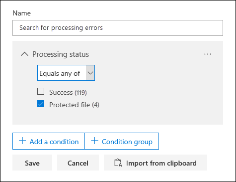
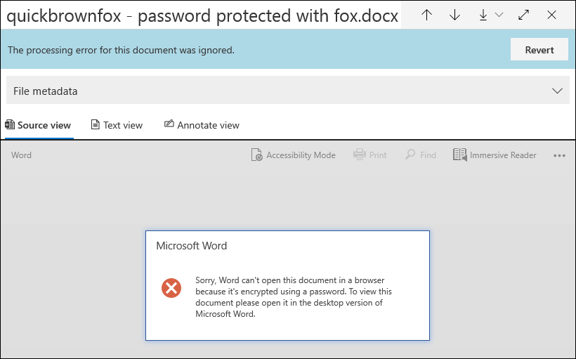
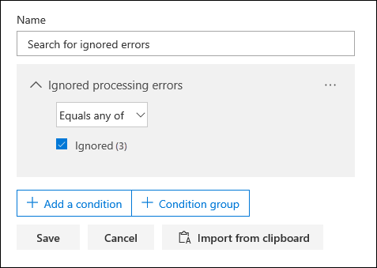
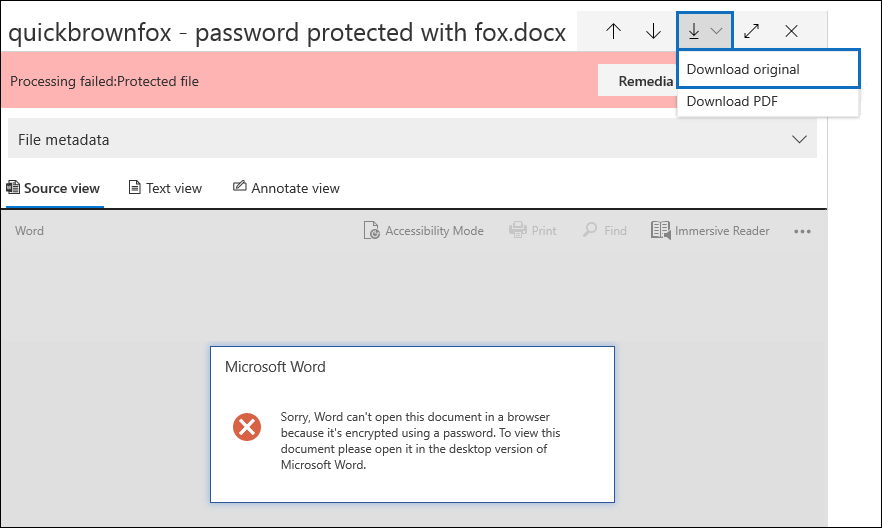
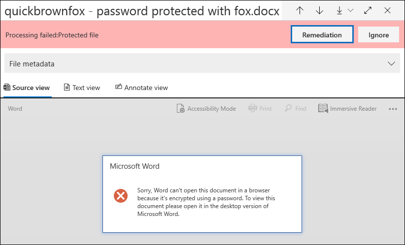
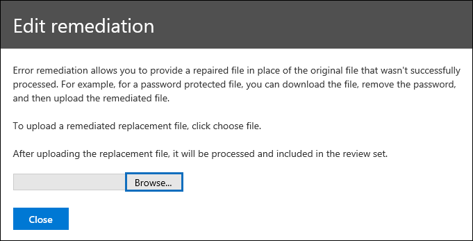
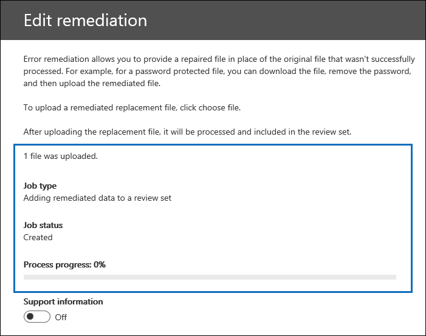

# Single item error remediation in Advanced eDiscovery

Error remediation gives Advanced eDiscovery users the ability to rectify data issues that prevent Advanced eDiscovery from properly processing the content. For example, files that are password protected can't be processed because those files are locked or encrypted. Previously, you could only remediate errors in bulk by using [this workflow](error-remediation-when-processing-data-in-advanced-ediscovery.md). But sometimes, it doesn't make sense to remediate errors in multiple files when you’re unsure if any of those files are responsive to the case you’re investigating. It also might not make sense to remediate errors before you’ve had a chance to review the file metadata (such as file location or who had access) to help you make up-front decisions about responsiveness. A new feature called *single item error remediation* gives eDiscovery managers the ability to view the metadata of files with a processing error and if necessary remediate the error directly in the review set. The article discusses how to identify, ignore, and remediate files with processing errors in a review set.

## Identify documents with errors

Documents with processing errors in a review set are now identified (with a banner). You can remediate or ignore the error. The following screenshot shows the processing error banner for a Word document in a review set that is password-protected. Also notice that you can view the file metadata of documents with processing errors.

You can also search for documents that have processing errors by using the **Processing status** condition when [querying the documents in a review set](review-set-search.md).

### Ignore errors

You can ignore a processing error by clicking **Ignore** in the processing error banner. When you ignore an error, the document is removed from the [bulk error remediation workflow](error-remediation-when-processing-data-in-advanced-ediscovery.md). After an error is ignored, the document banner changes color and indicates that the processing error was ignored. At any time, you can revert the decision to ignore the error by clicking **Revert**.

You can also search for all documents that had a processing error that was ignored by using the *Ignored processing errors* condition when querying documents in a review set.

## Remediate a document with errors

Sometimes you may be required to remediate a processing error in documents (by removing a password, decrypting an encrypted file, or recovering a corrupted document) and then add the remediated document to the review set. This allows you to review and export the error document together with the other documents in the review set. 

To remediate a single document, follow these steps:

1. Click **Download** > **Download original** to download a copy of the file to a local computer.

   

2. Remediate the error in the file offline. For encrypted files, that would require decryption software, to remove password protection, either provide the password and save the file or use a password cracker. After you remediate the file, go to the next step.

3. In the review set, select the file with the processing error that you remediated, and then  click **Remediation**.

   

4. Click **Browse**, go to the location of the remediated file on your local computer, and then select the file.

   

    After selecting the remediated file, it is automatically uploaded to the review set. You can track the processing status of the file.

    

   After processing is completed, you can view the remediated document.

    

For more information about what happens when a document is remediated, see [What happens when files are remediated](error-remediation.md#what-happens-when-files-are-remediated).

## Search for remediated documents

You can search for all documents in a review set that were remediated by using the **Keywords** condition and specifying the following property:value pair: **IsFromErrorRemediation:true**. This property is also available in the export load file when you export documents from a review set.
