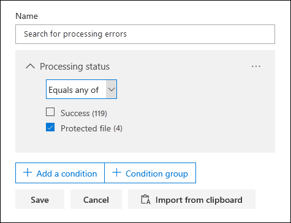

# Single item error remediation

Error remediation gives Advanced eDiscovery users the ability to rectify data issues that prevent Advanced eDiscovery from properly processing the content. For example, files that are password protected can't be processed because those files are locked or encrypted. Previously, you could only remediate errors in bulk by using the [this workflow](https://docs.microsoft.com/en-us/office365/securitycompliance/compliance20/error-remediation). But sometimes, it doesn't make sense to remediate errors in multiple files when you’re unsure if any of those files are responsive to the case you’re investigating. It also might not make sense to remediate errors before you’ve had a chance to review the file metadata (such as file location or who had access) to help you make up-front decisions about responsiveness. Now, a new feature called *single item error remediation* gives eDiscovery managers the ability to view the metadata of files with a processing errors and remediate errors, if necessary to the file in the review set. The article discusses how to identify, ignore, and remediate files with processing errors in a review set.

## Identify documents with errors

Documents with processing errors in a review set are now identified (with a banner). You can remediate or ignore the error. Because the file is identified, you can also view the file metadata.

You can also search for all documents in a review set that have processing errors by using the *Processing status* condition when searching the documents in a review set.

### Ignoring errors

To ignore an error, which will remove the item from Bulk error remediation workflow, click **Ignore** in the error banner. After the error is ignored, the document banner will still indicate that there was a processing error and that it was ignored. You have the option to revert the decision if the document was incorrectly ignored by clicking **Revert** in the banner.

You can also search for all documents that had a processing error that was ignored by using the *Ignored processing errors* condition when searching the documents in a review set.

## Remediate a document with errors

Sometimes you may be required to remediate a processing error in documents (by removing a password, removing encryption, or recovering a corrupted document) and then adding the remediated document to the review set so it can be reviewed and exported with all other documents in the review set. To do this, follow these steps:

>  

1. Click **Download** to download a copy of the file to a local computer.

   

2.  Remediate the error in the file offline. For encrypted files, that would require decryption software, to remove password protection, either provide the password and save the file or use a password cracker. After the file is remediated, go to the next step.

3. In the review set, click **Remediation** in the banner of the file that you downloaded and remediated in the previous steps.

   

4.  Click **Browse**, and go to the location of the remediated file on your local computer.

   

5.  After selecting the remediated file, it will be automatically uploaded to the review set. You can track the processing status of the file.

  

6.  After processing is completed, you can view the remediated document.

You can search for all documents in a review set that were remediated by using the Keywords condition and specifying the following property:value pair: **IsFromErrorRemediation:true**. This property is also available in the export load file when you export documents from a review set.

For more information about what happens when a document is remediated and how a remediated file is displayed in a review set, see [What happens when files are remediated](https://docs.microsoft.com/office365/securitycompliance/compliance20/error-remediation#what-happens-when-files-are-remediated).
