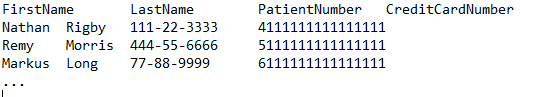
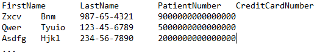

# Create EDM SIT sample file for the new experience

Creating and making an exact data match (EDM) based sensitive information type (SIT) available is a multi-phase process. They can be used in Microsoft Purview data loss prevention policies, eDiscovery and certain content governance tasks.

[!INCLUDE [purview-preview](../includes/purview-preview.md)]

## Applies to

- New experience

If you want to create an EDM SIT using the classic experience see, [Create EDM SIT classic experience](sit-create-edm-sit-classic-ux-workflow.md).

## Before you begin

- Make sure you've complete the steps in [Export source data for exact data match based sensitive information type](sit-get-started-exact-data-match-export-data.md).

## Formatting the sample file

The system will extract the column names from the sample file to create the schema, and will recommend base SITs to map the sample field data to. It must be formatted identically to your source sensitive information table file and should contain synthetic values that are representative of your actual data. The file can be saved in .csv (comma-separated values), .tsv (tab-separated values), or pipe-separated (|) format, but should be the same as your actual source sensitive information table file. The .tsv format is recommended in cases where your data values may include commas, such as street addresses.

- Use about 10-20 rows of data to ensure that the system has enough samples to work with.
- Field values that contain commas must be enclosed in quotes *"*.
- The first row must be the header row and contain column names.
- The file must contain at least one row of data.
- Each row of data must contain the correct number of fields, corresponding to the headers.
- The sample file can contain up to 32 columns.
- The sample file can't exceed 2.5 MB in size.
- Column (field) names must start with a letter, be at least three characters long, and consist of only alphanumeric characters (A-Z, a-z, 0-9) and can’t include spaces, underscores or other special characters. 

For example, if your actual data looks like this and uses tab delimited (.tsv) format

Then your sample file must have the same column headers, but use synthetic values for the rows, like this

|FirstName |LastName  |PatientNumber  |CreditCardNumber  |
|---------|---------|---------|---------|
|Eric     |Solomon         |987-65-4321        |9000000000000000         |
|Lisa  |Taylor         |123-45-6789         |500000000000000         |
|Andre    |Lawson        |234-56-7890         | 200000000000000        |

### How to use the sample file templates

If you're in any of these industry verticals:

- [U.S. Healthcare data](https://go.microsoft.com/fwlink/?linkid=2224450)
- [U.S. Financial data](https://go.microsoft.com/fwlink/?linkid=2224770)
- [U.S. Insurance data](https://go.microsoft.com/fwlink/?linkid=2224769)

You can start with these sample file templates to speed up the sample file creation process. These files contain the most commonly used column headers across the respective industries as a well as synthetic values in the fields.

1. Download the sample file template for your industry.
1. Compare the column headers in the template to your actual source data and pick the ones you want to use as primary fields in your customized sample file.
1. Compare the formatting of your actual source data with the formatting of the synthetic values. Change the formatting of the synthetic values to match the formatting of your source data values.
1. Save your customized sample file to use when you [create EDM SIT schema and rule package](sit-create-edm-sit-unified-ux-schema-rule-package.md).

<!--
-->

> [!TIP]
> In the new experience, you choose between uploading the sample file or entering the sample file values manually. Either way, we recommend creating the sample file.

## Next step

- **For new experience**: [Create EDM SIT schema and rule package](sit-create-edm-sit-unified-ux-schema-rule-package.md)
