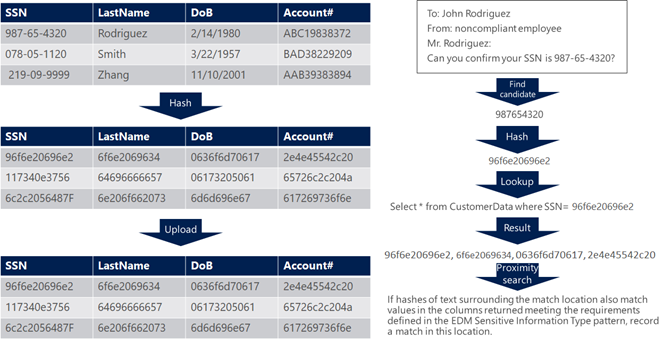

# Learn about exact data match based sensitive information types

[Sensitive information types](sensitive-information-type-learn-about.md) are used to help identify sensitive items so that you can prevent them from being inadvertently or inappropriately shared, to help in locating relevant data in eDiscovery, and to apply governance actions to certain types of information. You define a custom sensitive information type (SIT) based on:

- patterns
- keyword evidence such as *employee*, *badge*, or *ID*
- character proximity to evidence in a particular pattern
- confidence levels

But what if you wanted a custom sensitive information type (SIT) that uses exact data values, instead of one that found matches based on generic patterns? With Exact Data Match (EDM) based classification, you can create a custom sensitive information type that is designed to:

- be dynamic and easily refreshed
- be more scalable
- result in fewer false-positives
- work with structured sensitive data
- handle sensitive information more securely, not sharing it with anyone, including Microsoft
- be used with several Microsoft cloud services

EDM-based classification enables you to create custom sensitive information types that refer to exact values in a database of sensitive information. The database can be refreshed daily, and contain up to 100 million rows of data. So as employees, patients, or clients come and go, and records change, your custom sensitive information types remain current and applicable. And, you can use EDM-based classification with policies, such as [data loss prevention policies](dlp-learn-about-dlp.md) or [Microsoft Cloud App Security file policies](/cloud-app-security/data-protection-policies).

> [!NOTE]
> Microsoft 365 Information Protection supports double byte character set languages for:
>
> - Chinese (simplified)
> - Chinese (traditional)
> - Korean
> - Japanese
>
> This support is available for sensitive information types. See, [Information protection support for double byte character sets release notes (preview)](mip-dbcs-relnotes.md) for more information.

## What's different in an EDM SIT

When you work with EDM SITs, it's helpful to understand a few concepts that are unique to them.  

### Schema

The schema is an xml file that defines:

- The name of the schema, later referred to as the *DataStore*. 
- The field names that your sensitive information source table contains. There is a 1:1 mapping of schema field name to sensitive information source table column name.
- Which fields are searchable.
- Any search modifying parameters, called *configurable match*, like ignoring delimiters and case in searched values.

### Sensitive information source table

The sensitive source table that contains the sensitive information values that the EDM SIT will look for. It is made up of columns and roes. The column headers are the field names, the rows are an instance of data and each cell contains the values for that instance for that field.

Here's a simple example of a sensitive information source table.

|First Name  |Last Name  |Date of Birth  |
|---------|---------|---------|
|Isaiah   |Langer  | 05-05-1960 |
|Ana   |Bowman         |11-24-1971 |
|Oscar   |Ward         |02-12-1998 |

### Rule package

Every SIT has a rule package. You use the rule package in an EDM SIT to define:

- Matches, which specify the field that will be the primary element to be used in exact lookup. It can be a regular expression with or without a checksum validation, a keyword list, a keyword dictionary, or a function.
- Classification, which specifies the sensitive type match that triggers EDM lookup.
- Supporting element which are elements that, when found provide supporting evidence that help increase the confidence of the match. For example, keyword “SSN” in proximity of an SSN number. It can be a regular expression with or without a checksum validation, keyword list, keyword dictionary.
- Confidence levels (high, medium, low) reflect how much supporting evidence was detected along with the primary element. The more supporting evidence an item contains, the higher the confidence that a matched item contains the sensitive info you're looking for. See, [Fundamental parts of a sensitive information type](sensitive-information-type-learn-about.md#fundamental-parts-of-a-sensitive-information-type) for more on confidence levels.
Proximity – Number of characters between primary and supporting element

### You supply your own schema and data

[Microsoft 365 comes with more than 200 SITS](sensitive-information-type-entity-definitions.md) with predefined schemas, regex patterns, keywords and confidence levels. With EDM SITs, you are responsible for defining the schema as well as primary and secondary fields that identify sensitive items. Because the schema and primary and secondary data values are highly sensitive, you'll be encrypting them via a [hash](/dotnet/standard/security/ensuring-data-integrity-with-hash-codes) function that includes a randomly generated or self-supplied [salt](https://en.wikipedia.org/wiki/Salt_(cryptography)#:~:text=The%20salt%20value%20is%20generated%20at%20random%20and,the%20salt%20value%20and%20hashed%20value%20are%20stored.) value. Those hashed values are then uploaded to the service, so your sensitive data is never in the open.

### Primary and secondary/support elements

When you create an EDM SIT, you define a *primary element* field in the rule package. Primary fields are the elements for which all your content will be searched, and that need to follow a defined pattern in order to be identified. When the primary element is found in scanned items, EDM will then look for the *secondary* or supporting elements, which don't need to follow a pattern, and their proximity to the primary element. EDM requires that the primary element be first discoverable through an existing SIT. See, [Sensitive information type entity definitions](sensitive-information-type-entity-definitions.md) for a complete list of the available SITs. You'll have to find one of those that detects the class you want your EDM SIT to detect. For example, if your EDM SIT schema has U.S. social security number as the primary element, when you create your EDM schema, you'd associated it with the [U.S. social security number (SSN)](sensitive-information-type-entity-definitions.md#us-social-security-number-ssn) SIT.

## How matching works
 <!--TODD BEGIN HERE-->
<!-- condense these paragraphs down to one para or a single diagram -->

EDM finds matches by comparing content it finds against a table of sensitive data that you define. The match testing is done using a combination of traditional rules and patterns to ensure that the matched data is an actual instance of data you want to find and protect.

At its core, EDM works by comparing strings in your documents and emails against values in a table of sensitive data you provide to find out if the values in your content are present in the table. But the comparison is not done directly, since a direct comparison would require that you upload to the cloud a table with all the sensitive data you want to detect, which might be undesirable or impractical. The comparison is instead done by comparing one-way hashes. A cryptographic hash is a string of text that is uniquely derived from a given input text, and from which the original text cannot be derived (i.e. it is a one-way, non-reversible function ). Hashes are constructed so that if the hashes of two strings match each other, it is extremely improbable that the two strings are different. 
With EDM you generate a table of hashes of all the values of the sensitive data you want to detect, and upload only the hash table to the cloud service so relevant values in your content can be hashed and compared against the values in your table, since if there’s a match between the hash obtained from your document and a hash taken from the sensitive data table it would indicate that the original text in the document matches the original sensitive data that was used to generate the value in the hash table. 
Since cryptographic operations are computationally expensive and sensitive data tables often contain millions of rows, in order to make the process efficient  when you define an EDM-based sensitive information type you first select a standard sensitive information type that will detect potential candidates to be an EDM match (for example, one or more numerical or text patterns). You can optionally define additional rules in the EDM type according to your business needs such as matching values in multiple columns or requiring additional evidence.  
Once a match to the standard sensitive information type is found in a document or email in your organization, the value that produced the match is hashed, and compared against all the hashed values in the sensitive information table you uploaded. If a row is found that matches that value, the hashes in the other columns for that row in your table are used to find strings in the text surrounding the original match that meet the rules defined for additional evidence in your EDM sensitive information type.   
For example, let’s say your sensitive information table includes a row for a person named John Rodriguez  , born on 2/14/1980, and with a social security number of 432-45-6788, and an Account ID   of ABC19838372. When you upload your sensitive data to the cloud, you do it after processing the table so it only contains non-reversible hashes of the data. When later an email is sent that includes the text shown below  , an EDM-based sensitive information type looking for matches in the sensitive data table and requiring additional evidence for date of birth or for last name identifies any matches to the pattern corresponding to the SSN. When a match is found in the form of the 432-45-6788   value, this value is stripped of delimiters (the dashes), hashed and compared against the hashes in the SSN column of the table you uploaded, and when a match to this hash is found in the row corresponding to John Rodriguez, the hashes for this patient’s last name, Account number and date of birth will be compared to the hashes of text around the offending SSN, and when matches are found to the values in those columns this will be flagged as an instance of a match to the EDM sensitive information type.  
 

 
Figure: How EDM matches sensitive information in content
The database of   sensitive information type you can upload for each EDM-based sensitive information type can contain up to 100 million rows of data and can be refreshed daily. So as employees, patients, or clients come and go, and records change, your custom sensitive information types remain current and applicable. You can use EDM-based classification with policies, such as data loss prevention policies, sensitivity labeling or Microsoft Cloud App Security file policies.

Since this data is, by definition, extremely sensitive, you want to ensure it is securely managed, and you may even have concerns about providing it to Microsoft in readable form. The way EDM works enables you to configure your tenant to detect the sensitive data without having to provide it with a copy of the sensitive data, by using a technique called hashing. Hashing consists of transforming data in a non-reversible form from which the original data can't be interpreted, but that allows making comparisons to identify if two strings are identical. I.e. if two strings are identical, their respective hashes will be identical, while if two strings are different, it is extremely unlikely that their hashes will be identical. 
When your sensitive data is hashed, it is thus transformed into a format that can't be converted back into the original readable form, so when you provide Microsoft with a hashed copy of your sensitive data, Microsoft can't see your original sensitive data, but the service can still use the hashes you provided to identify strings in documents that are identical to the original data by hashing each string and comparing it to the hashed copy you provided. 

[!TIP] A common practice is to combine the use of EDM Sensitive information types and the regular sensitive information types on which they are based in DLP rules, with different thresholds. For example, you could use an EDM sensitive information type that looks for social security numbers and other data, with strict requirements and low tolerance (e.g. one or more matches will cause a DLP alert), while using the regular sensitive information type on which you based your EDM type (e.g. the U.S. Social Security Number built-in sensitive information type) for higher counts (e.g. more than 100 matches), in case sensitive information not recorded in your databases or that’s being used in a way that doesn’t align with your EDM definition for additional evidence is being exfiltrated in large volumes.  

<!--TODD END HERE-->

## See also

   