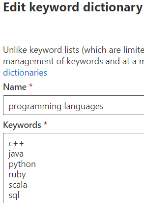

# Modify a keyword dictionary

You might need to modify keywords in one of your keyword dictionaries, or modify one of the built-in dictionaries. You can do this through PowerShell or through the Compliance center.

## Modify a keyword dictionary in Compliance center

Keyword dictionaries can be used as `Primary elements` or `Supporting elements` in sensitive information type (SIT) patterns. You can edit a keyword dictionary while creating a SIT or in an existing SIT. For example to edit an existing keyword dictionary:

1. Open the pattern that has the keyword dictionary you want to update.
2. Find the keyword dictionary you want to update and choose edit. 
3.  Make your edits, using one keyword per line.



4. Choose `Done`.

## Modify a keyword dictionary using PowerShell 

For example, we'll modify some terms in PowerShell, save the terms locally where you can modify them in an editor, and then update the previous terms in place. 

First, retrieve the dictionary object:
  
```powershell
$dict = Get-DlpKeywordDictionary -Name "Diseases"
```

Printing  `$dict` will show the various variables. The keywords themselves are stored in an object on the backend, but  `$dict.KeywordDictionary` contains a string representation of them, which you'll use to modify the dictionary. 

Before you modify the dictionary, you need to turn the string of terms back into an array using the  `.split(',')` method. Then you'll clean up the unwanted spaces between the keywords with the  `.trim()` method, leaving just the keywords to work with. 
  
```powershell
$terms = $dict.KeywordDictionary.split(',').trim()
```

Now you'll remove some terms from the dictionary. Because the example dictionary has only a few keywords, you could as easily skip to exporting the dictionary and editing it in Notepad, but dictionaries generally contain a large amount of text, so you'll first learn this way to edit them easily in PowerShell.
  
In the last step, you saved the keywords to an array. There are several ways to [remove items from an array](/previous-versions/windows/it-pro/windows-powershell-1.0/ee692802(v=technet.10)), but as a straightforward approach, you'll create an array of the terms you want to remove from the dictionary, and then copy only the dictionary terms to it that aren't in the list of terms to remove.
  
Run the command  `$terms` to show the current list of terms. The output of the command looks like this: 
  
`aarskog's syndrome`
`abandonment`
`abasia`
`abderhalden-kaufmann-lignac`
`abdominalgia`
`abduction contracture`
`abetalipoproteinemia`
`abiotrophy`
`ablatio`
`ablation`
`ablepharia`
`abocclusion`
`abolition`
`aborter`
`abortion`
`abortus`
`aboulomania`
`abrami's disease`

Run this command to specify the terms that you want to remove:
  
```powershell
$termsToRemove = @('abandonment', 'ablatio')
```

Run this command to actually remove the terms from the list:
  
```powershell
$updatedTerms = $terms | Where-Object{ $_ -notin $termsToRemove }
```

Run the command  `$updatedTerms` to show the updated list of terms. The output of the command looks like this (the specified terms have been removed): 
  
`aarskog's syndrome`
`abasia`
`abderhalden-kaufmann-lignac`
`abdominalgia`
`abduction contracture`
`abetalipo proteinemia`
`abiotrophy`
`ablation`
`ablepharia`
`abocclusion`
`abolition`
`aborter`
`abortion`
`abortus`
`aboulomania`
`abrami's disease`
```

Now save the dictionary locally and add a few more terms. You could add the terms right here in PowerShell, but you'll still need to export the file locally to ensure it's saved with Unicode encoding and contains the BOM.
  
Save the dictionary locally by running the following:
  
```powershell
Set-Content $updatedTerms -Path "C:\myPath\terms.txt"
```

Now open the file, add your other terms, and save with Unicode encoding (UTF-16). Now you'll upload the updated terms and update the dictionary in place.
  
```powershell
PS> Set-DlpKeywordDictionary -Identity "Diseases" -FileData (Get-Content -Path "C:myPath\terms.txt" -Encoding Byte -ReadCount 0)
```

Now the dictionary has been updated in place. The  `Identity` field takes the name of the dictionary. If you wanted to also change the name of your dictionary using the  `set-` cmdlet, you would just need to add the  `-Name` parameter to what's above with your new dictionary name. 

See Also
- [Create a keyword dictionary](create-a-keyword-dictionary.md)
- [Create a custom sensitive information type](create-a-custom-sensitive-information-type.md)
