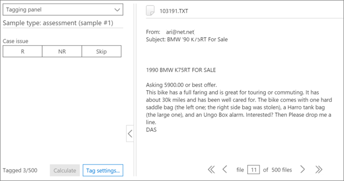
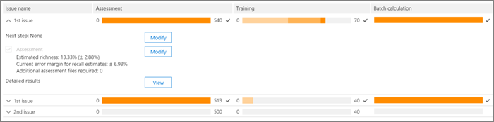
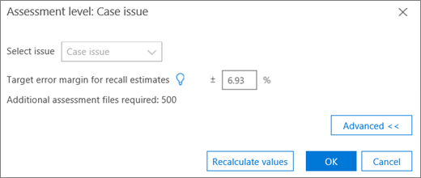
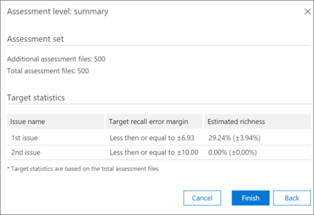

# Tagging and Assessment in the Relevance module in Advanced eDiscovery
  
This section describes the procedure for Assessment in the Relevance module in Advanced eDiscovery.
  
## Performing Assessment training and analysis

1. In the **Relevance \> Track** tab, click **Assessment** to start case assessment.

    For example purposes in this procedure, a sample assessment set of 500 files is created and the **Tag** tab is displayed, which contains the Tagging panel, displayed file content and other tagging options. 

    
  
2. Review each file in the sample, determine the file's relevance for each case issue, and tag the file using the Relevance (R), Not relevant (NR) and Skip buttons in the **Tagging panel** pane. 

    > [!NOTE]
    >  Assessment requires 500 tagged files. If files are "skipped", you will receive more files to tag. 
  
3. After tagging all files in the sample, click **Calculate**.

    The Assessment current error margin and richness are calculated and displayed in the **Relevance Track** tab, with expanded details per issue, as shown below. More details about this dialog are described in the [Reviewing assessment results](#reviewing-assessment-results) section.

    
  
    > [!TIP]
    > By default, we recommend that you proceed to the default Next step when the Assessment progress indicator for the issue has completed, indicating that the assessment sample was reviewed and sufficient relevant files were tagged. > Otherwise, if you want to view the **Track** tab results and control the margin of error and the next step, click **Modify** adjacent to **Next Step**, select **Continue assessment**, and then click **OK**.
  
4. Click **Modify** to the right of the **Assessment** check box to view and specify assessment parameters per issue. An **Assessment level** dialog for each issue is displayed, as shown in the following example: 

    
  
    The following parameters for the issue are calculated and displayed in the **Assessment level** dialog: 

    **Target error margin for recall estimates**: Based on this value, the estimated number of additional files necessary to review is calculated. The margin used for recall is greater than 75% and with a 95% confidence level.

    **Additional assessment files required**: Indicates how many more files are necessary if the current error margin's requirements have not been met. 

5. To adjust the current error margin and see the effect of different error margins (per issue):

6. In the **Select issue** list, select an issue. 

7. In **Target error margin for recall estimates**, enter a new value.

8. Click **Update values** to see the impact of the adjustments. 

9. Click **Advanced** in the **Assessment level** dialog to see the following additional parameters and details: 

    
  
    - **Estimated richness**: Estimated richness according to the current assessment results

    - **For assumed recall**: By default, the target error margin applies to recall above 75%. Click **Edit** if you want to change this parameter and control the margin of error on a different range of recall values. 

    - **Confidence level**: By default, the recommended error margin for confidence is 95%. Click **Edit** if you want to change this parameter.

    - **Expected richness error margin**: Given the updated values, this is the expected margin of error of the richness, after all additional assessment files are reviewed.

    - **Additional assessment files required**: Given the updated values, the number of additional assessment files that need to be reviewed to reach the target.

    - **Total assessment files required**: Given the updated values, total assessment files required for review.

    - **Expected number of relevant files in assessment**: Given the updated values, the expected number of relevant files in the entire assessment after all additional assessment files are reviewed.

10. Click **Recalculate values**, if parameters are changed. When you're done, if there is one issue, click **OK** to save the changes (or **Next** when there are multiple issues to review or modify and then **Finish**). 

    When there are multiple issues, after all issues have been reviewed or adjusted, an **Assessment level: summary** dialog is displayed, as shown in the following example. 

    
  
    On successful completion of assessment, proceed to the next stage in Relevance training.

## Reviewing assessment results

After an Assessment sample is tagged, the assessment results are calculated and displayed in the Relevance Track tab.
  
The following results are displayed in the expanded Track display:
  
- Assessment current error margin for recall estimates

- Estimated richness

- Additional assessment files required (for review)

The Assessment current error margin is the error margin recommended by Advanced eDiscovery. The number displayed for the "Additional assessment files required" corresponds to that recommendation.
  
The Assessment progress indicator shows the level of completion of the assessment, given the current error margin. When assessment is underway, the user will tag another assessment sample.
  
When the assessment progress indicator shows assessment as complete, that means the assessment sample review was completed and sufficient relevant files were tagged. 
  
The expanded Track display shows the recommended next step, the assessment statistics, and access to detailed results.
  
When richness is very low, the number of additional assessment files needed to reach a minimal number of relevant files to produce useful statistics is very high. Advanced eDiscovery will then recommend moving on to training. The assessment progress indicator will be shaded, and no statistics will be available.
  
In the absence of statistically based stabilization, there will be results with a lower level of accuracy and confidence level. However, these results can be used to find relevant files when you do not need to know the percentage of relevant files found. Similarly, this status can be used to train issues with low richness, where Relevance scores can accelerate access to files relevant to a specific issue.
  
> [!TIP]
> In the **Relevance \> Track** tab, expanded issue display, the following viewing options are available: 
> 
> The recommended next step, such as **Next step: Tagging** can be bypassed (per issue) by clicking the **Modify** button to its right, and then selecting an different step in the **Next step**. When the assessment progress indicator has not completed, assessment will be the next recommended option, to tag more assessment files and increase statistics accuracy. 
> 
> You can change the error margin and assess its impact, by clicking **Modify**, and in the **Assessment level dialog**, changing the **Target error margin for recall estimates**, and clicking **Update values**. Also, in this dialog, you can view advanced options, by clicking **Advanced**. 
> 
> You can view additional assessment level statistics and their impact by clicking **View**. In the displayed Detail results dialog, statistics are available per issue, when there are at least 500 tagged assessment files and at least 18 files are tagged as Relevant for the issue. 
