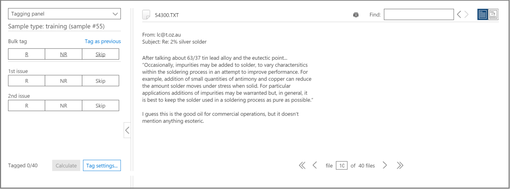
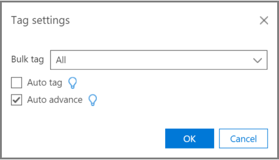
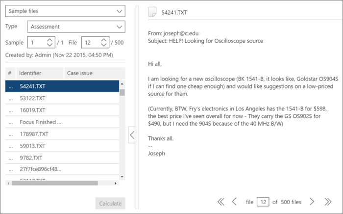

# Tagging and Relevance training in Advanced eDiscovery (classic)

> [!NOTE]
> Advanced eDiscovery requires an Office 365 E3 with the Advanced Compliance add-on or an E5 subscription for your organization. If you don't have that plan and want to try Advanced eDiscovery, you can [sign up for a trial of Office 365 Enterprise E5](https://go.microsoft.com/fwlink/p/?LinkID=698279). 
  
This topic describes the procedure for working with the Advanced eDiscovery Relevance training module. 
  
After Assessment is completed in Advanced eDiscovery, and you enter the Relevance training stage, a training sample of 40 files is brought into the Tag tab for tagging. 
  
## Performing Relevance training

1. In the **Relevance \> Tag** tab, the Tagging pane is displayed by default in the left pane and the sample files are displayed, one at a time for tagging. 
    
    
  
    In the **Tag** tab, the file's display name is shown. This could be the path, email subject, title, or user-defined name. The ID, file path or text path can be copied by right-clicking on the file's path. 
    
    The **Tag** tab tagging statistics show the file sample number (at the top of the left pane), the number of the currently displayed file out of the total files in the sample (bottom of right pane), and the current total number of tagged files in the sample (bottom of the left pane), which changes as you tag files. This applies for any Relevance tagging done, whether in Assessment, Training, Catch-up, or Test. 
    
    Icons indicating the existence of comments, tags, and family files are displayed in the file view in a bar above the file.
    
2. Determine the file's relevance for the case issue and tag the file using either the Tagging option icon buttons or keyboard shortcuts, as shown in the following table:

|**Tagging option**|**Description**|**Keyboard shortcut**|**For multiple issues - bulk tag keyboard shortcut**|
|-----|-----|-----|-----|
|R    |Relevant    |Z    |Shift + Z    |
|NR    |Not relevant    |X    |Shift + X    |
|Skip    |Skip    |C    |Shift + A    |
   
  - When multiple issues exist for a file, after tagging one issue, the selection moves to the next issue (if any). 
    
  - Keywords that were defined by the Administrator or Case manager when highlighting keywords (Relevance setup \> Highlighted keywords), will be displayed (in specified colors) to help identify relevant files while tagging. If a keyword has a double underline, it can be clicked to display a tool-tip with the keyword's description. 
    
    Optionally, in the **Tag** tab, click **Tag settings** to set the following options: 
    
    
  
  - **Bulk tag**: Use this option to assign multiple issues for a file by selecting **All** to set the tag for the selected file for all issues (overrides already tagged issues) or by selecting **The rest** to apply the tag to the remaining untagged issues. The selected option remains in effect for all of this user's cases until changed by that user (setting is per user for all the user's cases). 
    
  - **Auto tag**: Select this check box to set other issues for a file as Not relevant after a single Relevant tagging.
    
  - **Auto advance**: Select this check box to move the displayed file selection to the next file when tagging the last or only untagged issue. 
    
    Skipped files will not be considered for Relevance training and Relevance scoring purposes.
    
3. Free-text comments, associated with a file, can be viewed and edited via the **Comment** option in the left pane drop-down list. (optional) 
    
4. Guidelines for tagging can be viewed by selecting the **Tagging guidelines** option in the left pane drop-down list. 
    
5. After you finish tagging all files in the list and are ready to calculate the results, click **Calculate**. The **Track** tab is displayed. 
    
## Working with the sample files list

The sample files list allows you to view a list of the files in a training sample and perform various action on one or more files. In the **Relevance** \> **Tag** tab, the **Sample files** left pane displays a list of sample files for processing with Assessment, Training, Catch-up, and Inconsistencies processes. 
  
1. In the **Relevance \> Tag** tab, select the Sample files in the left pane drop-down list. The sample files are listed in the left pane. 
    
    
  
2. Select a specific sample or file number by entering or selecting its number in the **Sample** or **File** boxes. 
    
  -   - A file sequence number is listed in the left column of the displayed file list on the **Tag** tab. By clicking the header, the original displayed order of the files returns to its original order. 
    
  - Clicking on a file row displays its content in the right pane.
    
  - Navigate between files in the current sample by using the lower menu bar options. In addition, navigational keyboard shortcuts are available:
    
    To navigate to the first file in the sample: Shift + Ctrl + \<
    
    To navigate to the previous file in the sample: Shift + \<
    
    To navigate to the next file in the sample: Shift + \>
    
    To navigate to the last file in the sample: Shift + Ctrl + \>
    
## See also

[Advanced eDiscovery (classic)](office-365-advanced-ediscovery.md)
  
[Understanding Assessment in Relevance](assessment-in-relevance-in-advanced-ediscovery.md)
  
[Tagging and Assessment](tagging-and-assessment-in-advanced-ediscovery.md)
  
[Tracking Relevance analysis](track-relevance-analysis-in-advanced-ediscovery.md)
  
[Deciding based on the results](decision-based-on-the-results-in-advanced-ediscovery.md)
  
[Testing Relevance analysis](test-relevance-analysis-in-advanced-ediscovery.md)

