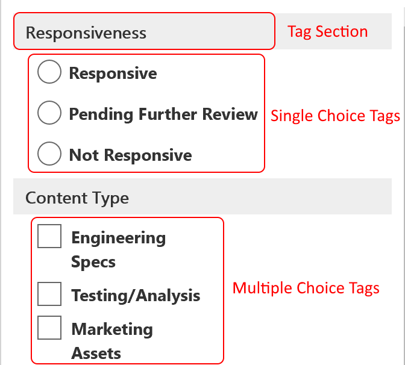
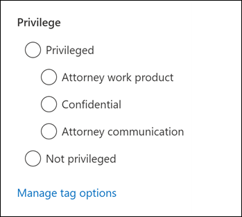
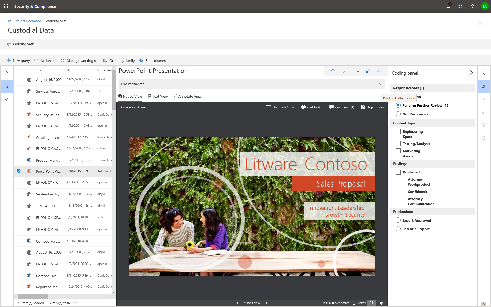

# Tag documents in a review set in Advanced eDiscovery

Organizing content in a review set is important to complete various workflows in the eDiscovery process. This includes:

- Culling unnecessary content

- Identifying relevant content
 
- Identifying content that must be reviewed by an expert or an attorney

When experts, attorneys, or other users review content in a review set, their opinions related to the content can be captured by using tags. For example, if the intent is to cull unnecessary content, a user can tag documents with a tag such as "non-responsive". After content has been reviewed and tagged, a review set search can be created to exclude any content tagged as "non-responsive", which eliminates this content from the next steps in the eDiscovery workflow. The tag panel can be customized for every case so that the tags can support the intended review workflow.

## Tag types

Advanced eDiscovery provides two types of tags:

- **Single choice tags** - Restricts users to select a single tag within a group. This can be useful to ensure users don't select conflicting tags such as "responsive" and "non-responsive". These will appear as radio buttons.

- **Multiple choice tags** - Allow users to select multiple tags within a group. These will appear as checkboxes.

## Tag structure

In addition to the tag types, the structure of how tags are organized in the tag panel can be used to make tagging documents more intuitive. Tags are grouped by sections. Review set search supports the ability to search by tag and by tag section. This means you can create a review set search to retrieve documents tagged with any tag in a section.

Tags can be further organized by nesting them within a section. For example, if the intent is to identify and tag privileged content, nesting can be used to make it clear that a user can tag a document as "Privileged" and select the type of privilege by checking the appropriate nested tag.

## Applying tags

There are several ways to apply a tag to content.

### Tagging a single document

When viewing a document in a review set, you can display the tags that a review can use by clicking **Tagging panel**.

This will enable you to apply tags to the document displayed in the viewer.

### Bulk tagging

Bulk tagging can be done by selecting multiple files in the results grid and then using the tags in the **Tagging panel** similar to tagging single documents. Bulk un-tagging can be done by selecting tags twice; the first click will apply the tag, and the second selection will ensure that tag is cleared for all selected files.

> [!NOTE]
> When bulk tagging, the tagging panel will display a count of files that are tagged for each tag in the panel.

### Tagging in other review panels

When reviewing documents, you can use the other review panels to review other characteristics of documents in the results grid. This includes reviewing other related documents, email threads, near duplicates, and hash duplicates. For example, when you're reviewing related documents (by using the **Document family** review panel), you can significantly reduce review time by bulk tagging related documents. For example, if an email message has several attachments and you want to ensure that the entire family is tagged consistently.

For example, here's how to display the **Tagging panel** when using the **Document family** review panel:

1. With the review panel open for a selected document (for example, displaying the list of related content in the **Document family** review panel, click **Tag documents** under the document family review panel.

   The tagging panel is displayed as a pop-up window.

2. Choose one or more tags to apply the selected document. 

3. To tag all documents, select all documents in the **Document family** panel, click **Tag documents**, and then choose the tags to apply to the entire family of documents.

