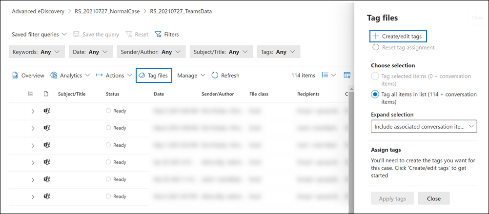
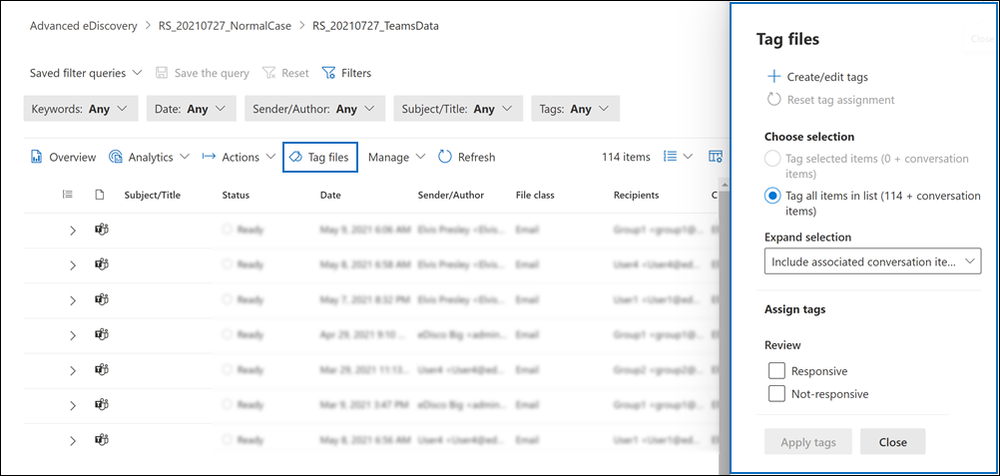

# Tag documents in a review set in eDiscovery (Premium)

Organizing content in a review set is important to complete various workflows in the eDiscovery process. This includes:

- Culling unnecessary content

- Identifying relevant content

- Identifying content that must be reviewed by an expert or attorney

When experts, attorneys, or other users review content in a review set, their opinions related to the content can be captured by using tags. For example, if the intent is to cull unnecessary content, a user can tag documents with a tag such as "non-responsive". After content has been reviewed and tagged, a review set search can be created to exclude any content tagged as "non-responsive". This process eliminates the non-responsive content from the next steps in the eDiscovery workflow. The tagging panel in a review set can be customized for every case so that the tags support the intended review workflow for the case.

> [!NOTE]
> The scope of tags is an eDiscovery (Premium) case. That means a case can only have one set of tags that reviewers can use to tag review set documents. You can't set up a different set of tags for use in different review sets in the same case.

## Tag types

eDiscovery (Premium) provides two types of tags:

- **Single choice tags**: Restricts reviewers to selecting a single tag within a group. These types of tags can be useful to ensure that reviewers don't select conflicting tags such as "responsive" and "non-responsive". Single choice tags appear as radio buttons.

- **Multiple choice tags**: Allow reviews to select multiple tags within a group. These types of tags appear as checkboxes.

## Tag structure

In addition to the tag types, the structure of how tags are organized in the tag panel can be used to make tagging documents more intuitive. Tags are grouped by sections. Review set search supports the ability to search by tag and by tag section. This means you can create a review set search to retrieve documents tagged with any tag in a section.

You can further organize tags by nesting them within a section. For example, if the intent is to identify and tag privileged content, nesting can be used to make it clear that a reviewer can tag a document as "Privileged" and select the type of privilege by checking the appropriate nested tag.

## Creating and applying tags

Tagging items in review sets is a two-step process. The first step is to create the tags that are then applied to review set items. After you create tags, you and other reviewers can apply them to items in a review set. As previously explained, an eDiscovery (Premium) case can only have one set of tags that reviewers can use to tag review set items.

### Create tags

Before applying tags to items in a review set, you need to create a tag structure.

1. Open a review set, go to the command bar, and select **Tag files**.

2. On the **Tag files** flyout page, click **Create/edit tags**.

   

3. On the **Tags** page, select **Add section**.

4. Type a tag group title and an optional description, and then click**Save**.

5. Select the triple dot dropdown menu next to the tag group title and click **Add check box** or **Add option button**.

6. Type a name and description for the checkbox or option button.

7. Repeat this process to create new tag sections, tag options, and checkboxes. For example, the following screenshot shows a tag group named **Review**, which consists of **Responsive** and **Not-responsive** checkboxes.

   

### Apply tags

With the tag structure in place, reviewers can apply tags to items in a review set by configuring tagging settings.

1. In the review set command bar, select **Tag files** to display the **Tag files** flyout page (also called the *tagging panel*).

   

2. On the **Tag files** flyout page, you can set the following options to configure how to tag items displayed in the review set. The filters or filter queries currently applied to the review set determine which items are displayed and therefore the items that you can apply tags to. For more information, see [Query and filter content in a review set](review-set-search.md).

   - **Choose selection**. Choose one the following options to determine the scope of items to apply tags to.

      - **Tag selected items**: This option applies tags to the items that you select. You can select items before or after launching the tagging panel. This option displays (in real time) the number of selected items that will be tagged.

      - **Tag all items in list**: This option applies tags to all items displayed in the review set. This option displays the total number of items that will be tagged.

   - **Expand selection**: Use the following options to tag additional items that are related to tagged items in the review set.

      - **Include associated family items**: This option applies the same tag to the associated family items of items that are tagged.  *Family items* are items that share the same **FamilyId** metadata property value. For example, a document that's attached to an email message shares the same **FamilyId** as the email message. So if this option is selected for this example, the email message and the document are tagged, even though the document might not be included in the list of review set items.

      - **Include associated conversation items**: This option applies the same tag to all items that are in the same Teams or Yammer conversation as the items that are tagged. *Conversation items* are items that share the same **ConversationId** metadata property value. All messages, posts, and corresponding transcript file of a conversation share the same **ConversationId**. If this option is selected, then all items in the same conversation (and transcript file) are tagged, even though some of those conversation items might not be included in the list of review set items. For more information about conversation items, see the "Grouping" section in [eDiscovery (Premium) workflow for content in Microsoft Teams](teams-workflow-in-advanced-ediscovery.md#grouping).

      - **None**: This option doesn't apply tags to family items or conversation items. It only applies tags to the items that are selected or to all items in the review set list.

   > [!NOTE]
   > Including associated family or conversation items will not change the count of items shown in the **Tag selected items** or **Tag all items in list** options. In other words, the number of associated items that will be tagged is not displayed.

   - **Assign tags**: This section displays the tags (organized by tag groups) that you can apply to documents. You can only apply one single-choice tag (identified by a radio button) per tag group. However, you can apply multiple multi-choice tags (which are identified by a checkbox).

3. Click **Apply tags** to apply the tags based on your settings.

   The **Applying tags** status message is displayed for each tag group on the tagging panel to indicate a tagging job has been started. Tags for each tag group in the **Assign tags** section are greyed out until the job is completed.

> [!TIP]
> If you're in the process of configuring the settings on the tagging panel, but want to start over, click **Reset tag assignment** to clear the current setting. This control doesn't apply to items that are already tagged, and it doesn't change or remove tags from previously tagged items.  

#### Monitor tagging jobs

When you tag a large number of items (or select the **Tag all items in list**) option, a **Tagging documents** job is created. You view the status of this job on the **Jobs** tab in the case. This helps you track large tagging jobs that may take a long time to complete. In some cases, a tagging job might be complete, but the **Applying tags** status message in the tagging panel is still displayed. To update the status of tagging jobs, click **Refresh** in the review set command bar.

## Removing tags

You can remove tags from items in a review set. However, you can't remove a single-choice tag that's been applied to a review set item. You can only change a single-choice tag to another single-choice tag within the same tag group.

To remove a tag:

1. Select the items the you want to remove the tag from.

2. Click **Tag files** to display the tagging panel.

3. Under **Assign tags**, unselect the tag, and then click **Apply tags**.

You can also use the previous procedure to change the tag applied to selected items. After unselecting the current tag, you can select a different one.
