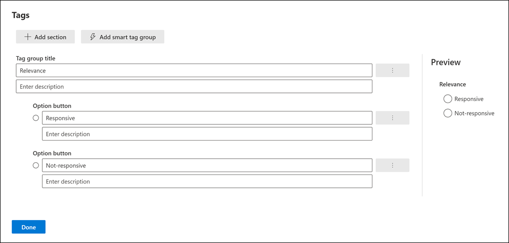
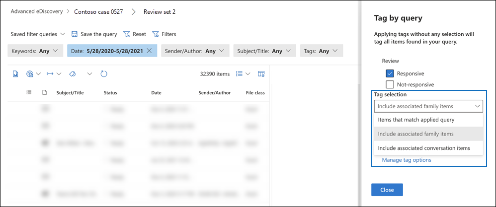

# Tag documents in a review set in Advanced eDiscovery

Organizing content in a review set is important to complete various workflows in the eDiscovery process. This includes:

- Culling unnecessary content

- Identifying relevant content

- Identifying content that must be reviewed by an expert or attorney

When experts, attorneys, or other users review content in a review set, their opinions related to the content can be captured by using tags. For example, if the intent is to cull unnecessary content, a user can tag documents with a tag such as "non-responsive". After content has been reviewed and tagged, a review set search can be created to exclude any content tagged as "non-responsive". This process eliminates the non-responsive content from the next steps in the eDiscovery workflow. The tagging panel in a review set can be customized for every case so that the tags support the intended review workflow for the case.

> [!NOTE]
> The scope of tags is an Advanced eDiscovery case. That means a case can only have one set of tags that reviewers can use to tag review set documents. You can't set up a different set of tags for use in different review sets in the same case.

## Tag types

Advanced eDiscovery provides two types of tags:

- **Single choice tags**: Restricts reviewers to selecting a single tag within a group. These types of tags can be useful to ensure that reviewers don't select conflicting tags such as "responsive" and "non-responsive". Single choice tags appear as radio buttons.

- **Multiple choice tags**: Allow reviews to select multiple tags within a group. These types of tags appear as checkboxes.

## Tag structure

In addition to the tag types, the structure of how tags are organized in the tag panel can be used to make tagging documents more intuitive. Tags are grouped by sections. Review set search supports the ability to search by tag and by tag section. This means you can create a review set search to retrieve documents tagged with any tag in a section.

You can further organize tags by nesting them within a section. For example, if the intent is to identify and tag privileged content, nesting can be used to make it clear that a reviewer can tag a document as "Privileged" and select the type of privilege by checking the appropriate nested tag.

## Create tags

Before applying tags to documents in the review set, you need to create a tag structure.

1. Open a review set and navigate to the command bar and select **Tag by query**.

2. In the tagging panel, select **Manage tag options**

3. Select **Add tag section**.

4. Type a tag group title and an optional description, and then click**Save**.

5. Select the triple dot dropdown menu next to the tag group title and click **Add check box** or **Add option button**.

6. Type a name and description for the checkbox or option button.

7. Repeat this process to create new tag sections, tag options, and checkboxes.

   

## Applying tags

With the tag structure in place, reviewers can apply tags to documents in a review set. There are two different ways to apply tags:

- Tag files

- Tag by query

### Tag files

Whether you select a single item or several items in a review set, you can apply tags to their selection by clicking **Tag files** in the command bar. In the tagging panel, you can select a tag and it is automatically applied to the selected documents.

> [!NOTE]
> Tags will be applied only to selected items in the list of items.

### Tag by query

Tagging by query lets you apply tags to all items displayed by a filter query that's currently applied in the review set.

1. Unselect all items in the review set and go to the command bar and select **Tag by query**.

2. In the tagging panel, select the tag that you want to apply.

3. Under the **Tag selection** dropdown, there are three options that dictate which items to apply the tag to.

   - **Items that match applied query**: Applies tags to specific items that match the filter query conditions.

   - **Include associated family items**: Applies tags to specific items that match the filter query conditions and their associated family items. *Family items* are items that share the same FamilyId metadata value.  

   - **Include associated conversation items**: Applies tags to items that match the filter query conditions and their associated conversation items. *Conversation items* are items that share the same ConversationId metadata values.

   

4. Click **Start tagging job** to trigger the tagging job.

## Tag filter

Use the tag filter in review set to quickly find or exclude items from the query results based on how an item is tagged. 

1. Select **Filters** to expand the filter panel.

2. Select and expand **Item properties**.

3. Scroll down to find the filter named **Tag**, select the checkbox, and then click **Done**.

4. To include or exclude items with a specific tag from a query, do one of the following:

   - **Include items**: Select the tag value and select **Equal any of** in the dropdown menu.

      Or

   - **Exclude items**: Select the tag value and select **Equals none of** in dropdown menu.

     

> [!NOTE]
> Be sure to refresh the page to ensure that the tag filter displays the latest changes to the tag structure.
