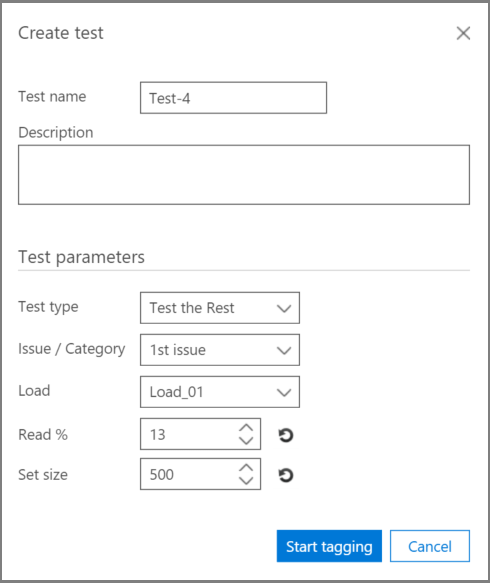
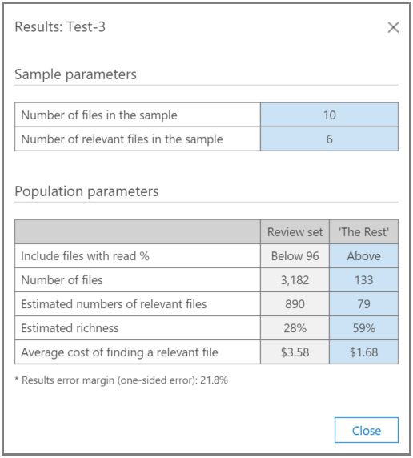

# Test Relevance analysis in Advanced eDiscovery
  
The Test tab in Advanced eDiscovery enables you to test, compare, and validate the overall quality of processing. These tests are performed after Batch calculation. By tagging the files in the collection, an expert makes the final judgment about whether each tagged file is relevant to the case.
  
In single and multiple-issue scenarios, tests are typically performed per issue. Results can be viewed after each test, and test results can be reworked with specified sample test files.
  
## Testing the rest

The "Test the Rest" test is used to validate culling decisions, for example, to review only files above a specific Relevance cutoff score based on the final Advanced eDiscovery results. The expert reviews a sample of files under a selected cutoff score to evaluate the number of relevant files within that set.
  
This test provides statistics and a comparison between the Review set and the Test the Rest population. The results of the review set are those calculated by Relevance during Training. The results include calculations based on settings and input parameters, such as:
  
- Test sample statistics of the number of files in a sample and identified relevant files.

- Tabular comparison of the Population parameters of the Review set and the Rest, for example, the number of files, estimated number of relevant files, estimated richness, and the average cost of finding another relevant file. Cost parameter settings can be set by the administrator.

To run the "Test the Rest" test:

1. Open the **Relevance \> Test** tab.

2. In the **Test** tab, click **New test**. The **Create test** dialog is displayed, as shown in the following example.

    
  
3. In **Test name**, and **Description**, type the name and description.

4. In the **Test type** list, select **Test the Rest**

5. In the **Issue / Category** list, select the issue name.

6. In the **Load** list, select the load. 

7. In **Read %**, accept the default value or select a value for the cutoff Relevance score. 

8. In **Set size**, or accept the default value. The restore icons will restore the default values.

9. Click **Start tagging**. A test sample is generated.

10. Review and tag each of the files in the **Relevance \> Tag** tab and when done, click **Calculate**.

11. In the Test tab, you can click **View results** to see the test results. An example is shown in the following screenshot.

    
  
In the previous screenshot, the **Sample parameters** section of the table contains details about the number of files in the sample tagged by the expert, and the number of relevant files found in that sample.
  
The **Population parameters** section of the table contains the test results, including the Review set population of files with a score below the selected cutoff and "The Rest" population of files with a score above the selected cutoff. For each population, the following results are displayed:
  
- Includes files with read % - Stated cutoff

- The total number of files

- The estimated number of relevant files

- The estimated richness

- The average review cost of finding another relevant file

## Testing the slice

The "Test the Slice" test performs testing similar to the "Test the Rest" test, but to a segment of the file set as specified by Relevance Read %.

To run the "Test the Slice" test:
  
1. Open the **Relevance \> Test** tab.

2. In the **Test** tab, click **New test**. The **Create test** dialog is displayed.

3. In **Test name** and **Description**, type the information.

4. In the **Test type** list, select **Test the Slice**.

5. In the **Issue** list, select the issue name.

6. In the **Load** list, select the load.

7. In **Read % between**, accept the default low and high range values or select values for the cutoff Relevance scores.

8. In **Set size**, select a value or accept the default value.

    The restore icons will restore the default value.

9. Click **Start tagging**. A test sample is generated.

10. Review and tag each of the files in the **Relevance \> Tag** tab and when done, click **Calculate**.

11. In the Test tab, you can click **View results** to see the test results.
