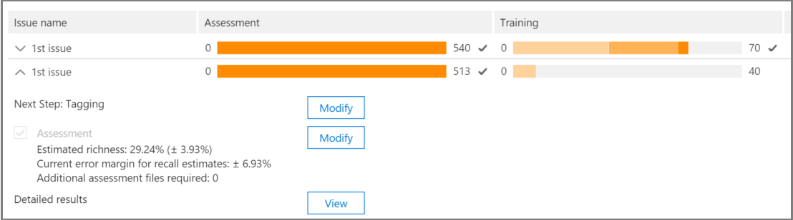
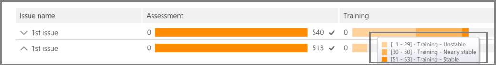
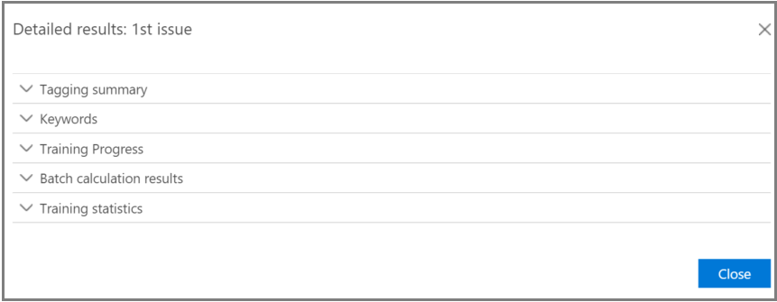
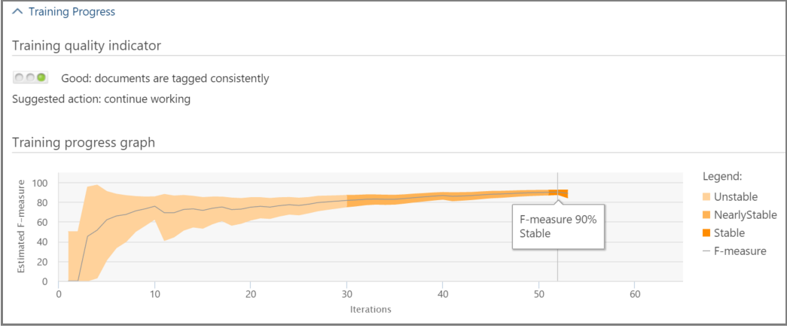

# Track Relevance analysis in Advanced eDiscovery (classic)

> [!NOTE]
> Advanced eDiscovery requires an Office 365 E3 with the Advanced Compliance add-on or an E5 subscription for your organization. If you don't have that plan and want to try Advanced eDiscovery, you can [sign up for a trial of Office 365 Enterprise E5](https://go.microsoft.com/fwlink/p/?LinkID=698279). 
  
In Advanced eDiscovery, the Relevance Track tab displays the calculated validity of the Relevance training performed in the Tag tab and indicates the next step to take in the iterative training process in Relevance. 
  
## Tracking Relevance training status

1. View the following details in Relevance Track for the case issues, as shown in the following example of an **Issue name** dialog below. 
    
  - **Assessment**: This progress indicator shows to what degree the Relevance training performed to this point has achieved the assessment target in terms of margin of error. The richness of the Relevance training results is also displayed. 
    
  - **Training**: This color-coded progress indicator and tool-tip display indicates the Relevance training results stability and a numeric scale showing the number of Relevance training samples tagged for each issue. The expert monitors the progress of the iterative Relevance training process. 
    
  - **Batch calculation**: This progress indicator provides information about the completion of Batch calculation.
    
  - **Next step**: Displays the recommendation for the next step to be performed. 
    
    In the example, a successfully completed Assessment for an issue is shown, indicated by the completed color progress indicator and the checkmark. Tagging is underway, but the case is still considered unstable (stability status also shown in a tool-tip). The next step recommendation is "Training". 
    
    
  
    The expanded view displays additional information and options. The displayed current error margin is the error margin of the recall in the current state of assessment, given the existing (already tagged) assessment files.
    
    > [!NOTE]
    >  The Assessment stage can be bypassed by clearing the **Assessment** check box per issue and then for "all issues". However, as a result, there will be no statistics for this issue. > Clearing the **Assessment** check box can only be done before assessment is performed. Where multiple issues exist in a case, assessment is bypassed only if the check box is cleared for each issue 
  
    When assessment is not completed with the first sample set of files, assessment might be the next step for tagging more files. 
    
    In **Relevance** \> **Track**, the training progress indicator and tool-tip indicate the estimated number of additional samples needed to reach stability. This estimate provides a guideline for the additional training needed.
    
    
  
2. When you're done tagging and if you need to continue training, click **Training**. Another sample set of files is generated from the loaded file set for additional training. You are then returned to the Tag tab to tag and train more files.
    
### Reaching stable training levels

After the assessment files have attained a stable level of training, Advanced eDiscovery is ready for Batch calculation.
  
> [!NOTE]
> Usually, after three stable training samples, the next step is "Batch calculation". There may be exceptions, for example, when there were changes to the tagging of files from earlier samples or when seed files were added. 
  
### Performing Batch calculation

Batch calculation is executed as the next step after training is successfully completed (when a stable training status is shown by the progress bar, a checkmark and stable status in the tool-tip.) Batch calculation applies the knowledge acquired during the Relevance training to the entire file population, to assess the files' relevance and to assign Relevance scores.
  
When there is more than one issue, Batch calculation is done per issue. During Batch calculation, progress is monitored while processing all of the files. 
  
Here, the recommended next step is "None", which indicates that no additional iterative Relevance training is required at this point. The next phase is the **Relevance \> Decide** tab. 
  
If you want to import new files after Batch calculation, the administrator can add the imported files to a new load.
  
> [!NOTE]
> If you click **Cancel** during Batch calculation, the process saves what was already executed. If you run Batch calculation again, the process will continue from the last executed point. 
  
### Assessing tagging consistency

If there are inconsistencies in file tagging, it can affect the analysis. The Advanced eDiscovery tagging consistency process can be used when results are not optimal or consistency is in doubt. A list of possible inconsistently tagged files is returned, and they can be reviewed and re-tagged, as necessary.
  
> [!NOTE]
> After seven or more training rounds following assessment, tagging consistency can be viewed in **Relevance** \> **Track** \> **Issue** \> **Detailed results** \> **Training progress**. This review is done for one issue at a time. 
  
1. In **Relevance \> Track**, expand an issue's row.
    
2. To the right of **Next step**, click **Modify**.
    
3. Select **Tag inconsistencies** as the **Next step** option, after seven training samples and click **OK**.
    
4. Select **Tag inconsistencies**. The **Tag** tab opens displaying a list of the inconsistencies to re-tag as necessary. 
    
5. Click **Calculate** to submit the changes. The next step after tagging inconsistencies is "Training". 
    
## Viewing and using Relevance results

In the **Relevance \> Track** tab, expand an issue's row, and next to **Detailed results**, click **View**. The Detailed results panes are displayed, as shown and described below.
  

  
### Tagging summary

 In the example shown below, the **Tagging summary** displays totals for each of Assessment, Training, and Catch-up file tagging processes. 
  

  
### Keywords

A keyword is a unique string, word, phrase, or sequence of words in a file identified by Advanced eDiscovery as a significant indicator of whether a file is relevant. The "Include" columns list keyword and weights in files tagged as Relevant, and the "Exclude" columns lists keywords and weights in files tagged as Not relevant.
  
Advanced eDiscovery assigns negative or positive keyword weight values. The higher the weight, the higher the likelihood that a file in which the keyword appears is assigned a higher Relevance score during Batch calculation. 
  
The Advanced eDiscovery list of keywords can be used to supplement a list built by an expert or as an indirect sanity check at any point in the file review process.
  
### Training progress

The **Training Progress** pane includes a training progress graph and quality indicator display, as shown in the example below. 
  

  
 **Training quality indicator**: Displays the rating of the tagging consistency as follows:
  
- **Good**: Files are tagged consistently. (Green light displayed)
    
- **Medium**: Some files may be tagged inconsistently. (Yellow light displayed)
    
- **Warning**: Many files may be tagged inconsistently. (Red light displayed)
    
 **Training progress graph**: Shows the degree of Relevance training stability after a number of Relevance training cycles in comparison to the F-measure value. As we move from the left to the right across the graph, the confidence interval narrows and is used, along with the F-measure, by Advanced eDiscovery Relevance to determine stability when the Relevance training results are optimized.
  
> [!NOTE]
> Relevance uses F2, an F-measure metric where Recall receives twice as much weight as Precision. For cases with high richness (over 25%), Relevance uses F1 (1:1 ratio). The F-measure ratio can be configured in **Relevance setup** \> **Advanced settings**. 
  
### Batch calculation results

The **Batch calculation results** pane includes the number of files that were scored for Relevance, as follows: 
  
- **Success**
    
- **Empty**: Contains no text, for example, only spaces/tabs
    
- **Failed**: Due to excessive size or could not be read
    
- **Ignored**: Due to excessive size
    
- **Nebulous**: Contains meaningless text or no features relevant to the issue
    
> [!NOTE]
> Empty, Failed, Ignored, or Nebulous will receive a Relevance score of -1. 
  
### Training statistics

The **Training statistics** pane displays statistics and graphs based on results from Advanced eDiscovery Relevance training. 
  

  
This view shows the following:
  
- **Review-recall ratio**: Comparison of results according to Relevance scores in a hypothetically linear review. Recall is estimated given the review set size set.
    
- **Parameters**: Cumulative calculated statistics pertaining to the review set in relation to the file population for the entire case.
    
- **Review**: Percentage of files to review based on this cutoff.
    
- **Recall**: Percentage of Relevant files in the review set. 
    
- **Distribution by relevance score**: Files in the dark gray display to the left are below the cutoff score. A tool-tip displays the Relevance score and the related percentage of files in the review file set in relation to the total files.
