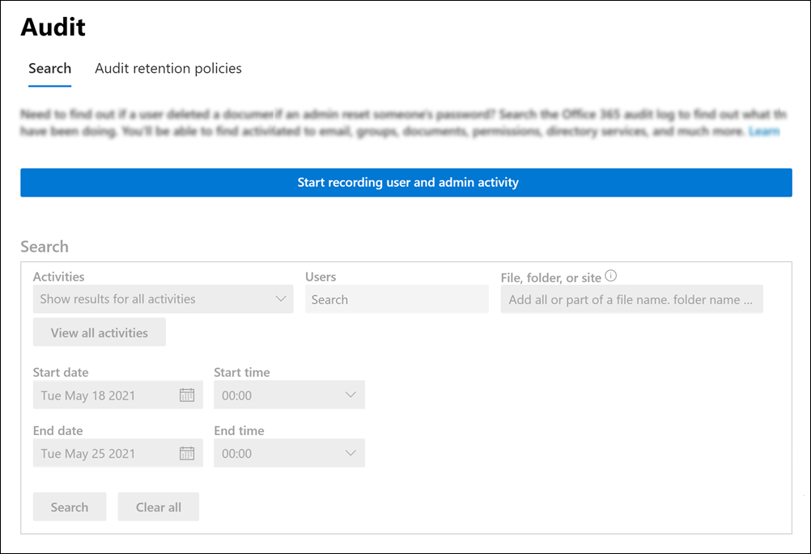
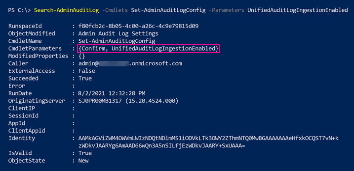
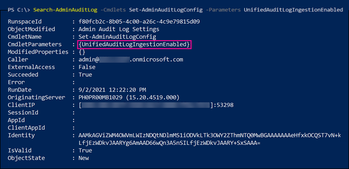

# Turn auditing on or off

Audit logging will be turned on by default for Microsoft 365 and Office 365 enterprise organizations. However, when setting up a new Microsoft 365 or Office 365 organization, you should verify the auditing status for your organization. For instructions, see the [Verify the auditing status for your organization](#verify-the-auditing-status-for-your-organization) section in this article. 

When auditing in the Microsoft Purview compliance portal is turned on, user and admin activity from your organization is recorded in the audit log and retained for 90 days, and up to one year depending on the license assigned to users. However, your organization may have reasons for not wanting to record and retain audit log data. In those cases, a global admin may decide to turn off auditing in Microsoft 365.

> [!IMPORTANT]
> If you turn off auditing in Microsoft 365, you can't use the Office 365 Management Activity API or Microsoft Sentinel to access auditing data for your organization. Turning off auditing by following the steps in this article means that no results will be returned when you search the audit log using the compliance portal or when you run the **Search-UnifiedAuditLog** cmdlet in Exchange Online PowerShell. This also means that audit logs won't be available through the Office 365 Management Activity API or Microsoft Sentinel.
  
[!INCLUDE [purview-preview](../includes/purview-preview.md)]

## Before you turn auditing on or off

- You have to be assigned the Audit Logs role in Exchange Online to turn auditing on or off in your Microsoft 365 organization. By default, this role is assigned to the Compliance Management and Organization Management role groups on the **Permissions** page in the Exchange admin center. Global admins in Microsoft 365 are members of the Organization Management role group in Exchange Online.

    > [!NOTE]
    > Users have to be assigned permissions in Exchange Online to turn auditing on or off. If you assign users the Audit Logs role on the **Permissions** page in the compliance portal, they won't be able to turn auditing on or off. This is because the underlying cmdlet is an Exchange Online PowerShell cmdlet.

- For step-by-step instructions on searching the audit log, see [Search the audit log](search-the-audit-log-in-security-and-compliance.md). For more information about the Microsoft 365 Management Activity API, see [Get started with Microsoft 365 Management APIs](/office/office-365-management-api/get-started-with-office-365-management-apis).

## Verify the auditing status for your organization

To verify that auditing is turned on for your organization, you can run the following command in [Exchange Online PowerShell](/powershell/exchange/connect-to-exchange-online-powershell):

```powershell
Get-AdminAuditLogConfig | FL UnifiedAuditLogIngestionEnabled
```

A value of `True` for the  _UnifiedAuditLogIngestionEnabled_ property indicates that auditing is turned on. A value of `False` indicates that auditing is not turned on.

> [!NOTE]
> Be sure to run the previous command in Exchange Online PowerShell. You can't use Security & Compliance PowerShell to run this command.

## Turn on auditing

If auditing is not turned on for your organization, you can turn it on in the compliance portal or by using Exchange Online PowerShell. It may take several hours after you turn on auditing before you can return results when you search the audit log.
  
### Use the compliance center to turn on auditing

1. Go to <https://compliance.microsoft.com> and sign in.

2. In the left navigation pane of the compliance portal, click **Audit**.

   If auditing is not turned on for your organization, a banner is displayed prompting you start recording user and admin activity.

   

3. Click the **Start recording user and admin activity** banner.

   It may take up to 60 minutes for the change to take effect.

### Use PowerShell to turn on auditing

1. [Connect to Exchange Online PowerShell](/powershell/exchange/connect-to-exchange-online-powershell).

2. Run the following PowerShell command to turn on auditing.

    ```powershell
    Set-AdminAuditLogConfig -UnifiedAuditLogIngestionEnabled $true
    ```

    A message is displayed saying that it may take up to 60 minutes for the change to take effect.
  
## Turn off auditing

You have to use Exchange Online PowerShell to turn off auditing.
  
1. [Connect to Exchange Online PowerShell](/powershell/exchange/connect-to-exchange-online-powershell).

2. Run the following PowerShell command to turn off auditing.

    ```powershell
    Set-AdminAuditLogConfig -UnifiedAuditLogIngestionEnabled $false
    ```

3. After a while, verify that auditing is turned off (disabled). There are two ways to do this:

    - In Exchange Online PowerShell, run the following command:

      ```powershell
      Get-AdminAuditLogConfig | FL UnifiedAuditLogIngestionEnabled
      ```

      The value of  `False` for the  _UnifiedAuditLogIngestionEnabled_ property indicates that auditing is turned off.

    - Go to the **Audit** page in the compliance portal.

      If auditing is not turned on for your organization, a banner is displayed prompting you start recording user and admin activity.

## Audit records when auditing status is changed

Changes to the auditing status in your organization are themselves audited. This means that audit records are logged when auditing is turned on or turned off. You can search the Exchange admin audit log for these audit records.

To search the Exchange admin audit log for audit records that are generated when turning auditing on or off, run the following command in [Exchange Online PowerShell](/powershell/exchange/connect-to-exchange-online-powershell):

```powershell
Search-AdminAuditLog -Cmdlets Set-AdminAuditLogConfig -Parameters UnifiedAuditLogIngestionEnabled
```

Audit records for these events contain information about when the auditing status was changed, the admin who changed it, and the IP address of the computer that was used to make the change. The following screenshots show audit records that correspond to changing the auditing status in your organization.

### Audit record for turning on auditing



The value of `Confirm` in the *CmdletParameters* property indicates that unified audit logging was turned on in the compliance center or by running the **Set-AdminAuditLogConfig -UnifiedAuditLogIngestionEnabled $true** cmdlet.

### Audit record for turning off auditing



The value of `Confirm` is not included in the *CmdletParameters* property. This indicates that unified audit logging was turned off by running the **Set-AdminAuditLogConfig -UnifiedAuditLogIngestionEnabled $false** command.

For more information about searching the Exchange admin audit log, see [Search-AdminAuditLog](/powershell/module/exchange/search-adminauditlog).
