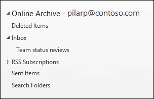

# Overview of unlimited archiving

In Office 365, archive mailboxes provide users with additional mailbox storage space. After a user's archive mailbox is enabled, up to 100 GB of additional storage is available. In the past, when the 100-GB storage quota was reached, organizations had to contact Microsoft to request additional storage space for an archive mailbox. That's no longer the case.

The unlimited archiving feature in Microsoft 365 (called *auto-expanding archiving*) provides additional storage in archive mailboxes. When the storage quota in the archive mailbox is reached, Microsoft 365 automatically increases the size of the archive, which means that users won't run out of mailbox storage space and administrators won't have to request additional storage for archive mailboxes.

For step-by-step instructions for turning on auto-expanding archiving, see [Enable unlimited archiving](enable-unlimited-archiving.md).

> [!NOTE]
> Auto-expanding archiving also supports shared mailboxes. To enable the archive for a shared mailbox, an Exchange Online Plan 2 license or an Exchange Online Plan 1 license with an Exchange Online Archiving license is required.

## How auto-expanding archiving works

As previously explained, additional mailbox storage space is created when a user's archive mailbox is enabled. When auto-expanding archiving is enabled, Microsoft 365 periodically checks the size of the archive mailbox. When an archive mailbox gets close to its storage limit, Microsoft 365 automatically creates additional storage space for the archive. If the user runs out of this additional storage space, Microsoft 365 adds more storage space to the user's archive. This process happens automatically, which means administrators don't have to request additional archive storage or manage auto-expanding archiving.

Here's a quick overview of the process.

1. Archiving is enabled for a user mailbox or a shared mailbox. An archive mailbox with 100 GB of storage space is created, and the warning quota for the archive mailbox is set to 90 GB.

2. An administrator enables auto-expanding archiving for the mailbox. When the archive mailbox (including the Recoverable Items folder) reaches 90 GB, it's converted to an auto-expanding archive, and Microsoft 365 adds storage space to the archive. It can take up to 30 days for the additional storage space to be provisioned.

   > [!NOTE]
   > If a mailbox is placed on hold or assigned to a retention policy, the storage quota for the archive mailbox is increased to 110 GB when auto-expanding archiving is enabled. Similarly, the archive warning quota is increased to 100 GB.

3. Microsoft 365 automatically adds more storage space when necessary.

> [!IMPORTANT]
> Auto-expanding archive is only supported for mailboxes used for individual users (or shared mailboxes) with a growth rate that doesn't exceed 1 GB per day. A user's archive mailbox is intended for just that user. Using journaling, transport rules, or auto-forwarding rules to copy messages to an archive mailbox is not permitted. Microsoft reserves the right to deny unlimited archiving in instances where a user's archive mailbox is used to store archive data for other users or in other cases of the inappropriate use.

## What gets moved to the additional archive storage space?

To make efficient use of auto-expanding archive storage, folders may get moved. Microsoft 365 determines which folders get moved when additional storage is added to the archive. Sometimes when a folder is moved, one or more subfolders are automatically created and items from the original folder are distributed to these folders to facilitate the moving process. When viewing the archive portion of the folder list in Outlook, these subfolders are displayed under the original folder.  The naming convention that Microsoft 365 uses to name these subfolders is **\<folder name\>_yyyy (Created on mmm dd, yyyy h_mm)**, where:

- **yyyy** is the year the messages in the folder were received.

- **mmm dd, yyyy h_m** is the date and time that the subfolder was created by Office 365, in UTC format, based on the user's time zone and regional settings in Outlook.

The following screenshots show a folder list before and after messages are moved to an auto-expanded archive.

 **Before additional storage is added**

 **After additional storage is added**

> [!NOTE]
> As previously described, Microsoft 365 moves items to subfolders (and names them using the naming convention described above) to help distribute content to an auxiliary archive. But moving items to subfolders may not always be the case. Sometimes an entire folder may be moved to an auxiliary archive. In this case, the folder will retain its original name.  It won't be apparent in the folder list in Outlook that the folder was moved to an auxiliary archive.

## Outlook requirements for accessing items in an auto-expanded archive

To access messages that are stored in an auto-expanded archive, users have to use one of the following Outlook clients:

- Outlook 2016 or Outlook 2019 for Windows

- Outlook on the web

- Outlook 2016 or Outlook 2019 for Mac

Here are some things to consider when using Outlook or Outlook on the web to access messages stored in an auto-expanded archive.

- You can access any folder in your archive mailbox, including ones that were moved to the auto-expanded storage area.

- Search for auto-expanded archiving is available in Outlook for the web (OWA). Similar to Online Archive, you can search for items that were moved to an additional storage area. When archive is selected as the search scope in OWA, all archives (including auto-expanded archives) and their corresponding subfolders will be searched.

- Auto-expanded archive search is available in Outlook Desktop in Current Channel (Preview). Within this preview, the Current Mailbox scope is available, thus allowing you to search the auto-expanded archive. For more information about this and other Microsoft Search support features, see [How Outlook for Windows connected to Exchange Online utilizes Microsoft Search](https://techcommunity.microsoft.com/t5/outlook-global-customer-service/how-outlook-for-windows-connected-to-exchange-online-utilizes/ba-p/1715045). 

- Item counts in Outlook and Read/Unread counts (in Outlook and Outlook on the web) in an auto-expanded archive might not be accurate.

- You can delete items in a subfolder that points to an auto-expanded storage area, but the folder itself can't be deleted.

- You can't use the Recover Deleted Items feature to recover an item that was deleted from an auto-expanded storage area.

## Auto-expanding archiving and other compliance features

This section explains the functionality between auto-expanding archiving and other compliance and data governance features.

- **eDiscovery:** When you use an eDiscovery tool, such as Content Search or In-Place eDiscovery, the additional storage areas in an auto-expanded archive are also searched.

- **Retention:** When you put a mailbox on hold by using tools such as Litigation Hold in Exchange Online or eDiscovery case holds and retention policies in the security and compliance center, content located in an auto-expanded archive is also placed on hold.

- **Messaging records management (MRM):** If you use MRM deletion policies in Exchange Online to permanently delete expired mailbox items, expired items located in the auto-expanded archive will also be deleted.

- **Import service:** You can use the Office 365 Import service to import PST files to a user's auto-expanded archive. You can import up to 100 GB of data from PST files to the user's archive mailbox.

## More information

For more technical details about auto-expanding archiving, see [Microsoft 365: Auto-Expanding Archives FAQ](https://techcommunity.microsoft.com/t5/exchange-team-blog/office-365-auto-expanding-archives-faq/ba-p/607784).
