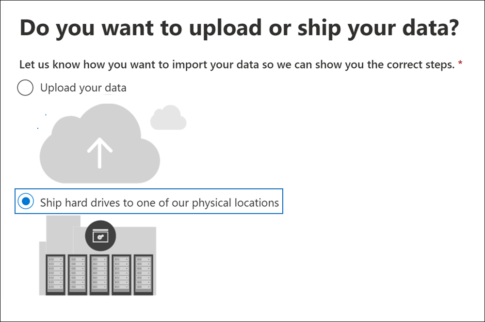
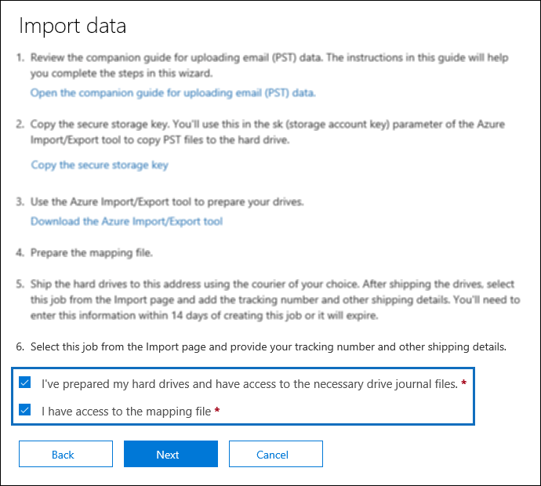
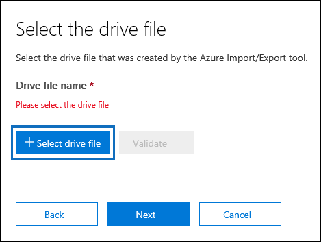
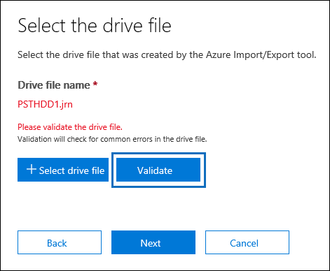
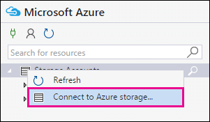
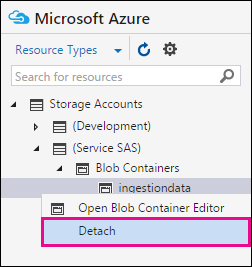

# Use drive shipping to import your organization's PST files

**This article is for administrators. Are you trying to import PST files to your own mailbox? See [Import email, contacts, and calendar from an Outlook .pst file](https://go.microsoft.com/fwlink/p/?LinkID=785075)**
   
Use the Office 365 Import service and drive shipping to bulk-import PST files to user mailboxes. Drive shipping means that you copy the PST files to a hard disk drive and then physically ship the drive to Microsoft. When Microsoft receives your hard drive, data center personnel copies the data from the hard drive to a storage area in the Microsoft cloud. Then you have the opportunity to trim the PST data that's imported to the target mailboxes by setting filters that control what data gets imported. After you start the import job, the Import service imports the PST data from the storage area to user mailboxes. Using drive shipping to import PST files to user mailboxes is one way to migrate your organization's email to Office 365.
  
Here are the steps required to use drive shipping to import PST files to Microsoft 365 mailboxes:
  
[Step 1: Download the secure storage key and PST Import tool](#step-1-download-the-secure-storage-key-and-pst-import-tool)

[Step 2: Copy the PST files to the hard drive](#step-2-copy-the-pst-files-to-the-hard-drive)

[Step 3: Create the PST Import mapping file](#step-3-create-the-pst-import-mapping-file)

[Step 4: Create a PST Import job in Office 365](#step-4-create-a-pst-import-job-in-office-365)

[Step 5: Ship the hard drive to Microsoft](#step-5-ship-the-hard-drive-to-microsoft)

[Step 6: Filter data and start the PST Import job](#step-6-filter-data-and-start-the-pst-import-job)
  
> [!IMPORTANT]
> You have to perform Step 1 once to down load the secure storage key and the import tool. After you perform these steps, follow Step 2 through Step 6 each time you want to ship a hard drive to Microsoft. 
  
For frequently asked questions about using drive shipping to import PST files to Office 365, see [FAQs for using drive shipping to import PST files](./faqimporting-pst-files-to-office-365.yml#using-drive-shipping-to-import-pst-files). 
  
## Before you import PST files

- You have to be assigned the Mailbox Import Export role in Exchange Online to import PST files to Microsoft 365 mailboxes. By default, this role isn't assigned to any role group in Exchange Online. You can add the Mailbox Import Export role to the Organization Management role group. Or you can create a role group, assign the Mailbox Import Export role, and then add yourself as a member. For more information, see the "Add a role to a role group" or the "Create a role group" sections in [Manage role groups](/Exchange/permissions-exo/role-groups).
    
    Additionally, to create import jobs in the Security & Compliance Center, one of the following must be true:
    
  - You have to be assigned the Mail Recipients role in Exchange Online. By default, this role is assigned to the Organization Management and Recipient Management roles groups.
    
    Or
    
  - You have to be a global administrator in your organization.
    
    > [!TIP]
    > Consider creating a new role group in Exchange Online that's specifically intended for importing PST files to Office 365. For the minimum level of privileges required to import PST files, assign the Mailbox Import Export and Mail Recipients roles to the new role group, and then add members. 
  
- You need to store the PST files that you want to copy to a hard drive on a file server or shared folder in your organization. In Step 2, you run the Azure Import Export tool (WAImportExport.exe) that copies the PST files that are stored on this file server or shared folder to the hard drive.

- Large PST files may impact the performance of the PST import process. So we recommend that each PST file you copy to the hard drive in Step 2 should be no larger than 20 GB.
    
- Only 2.5-inch solid-state drives (SSDs) or 2.5-inch or 3.5-inch SATA II/III internal hard drives are supported for use with the Office 365 Import service. You can use hard drives up to 10 TB. For import jobs, only the first data volume on the hard drive will be processed. The data volume must be formatted with NTFS. When copying data to a hard drive, you can attach it directly using a 2.5-inch SSD or 2.5-inch or 3.5-inch SATA II/III connector or you can attach it externally using an external 2.5-inch SSD or 2.5-inch or 3.5-inch SATA II/III USB adaptor.
    
    > [!IMPORTANT]
    > External hard drives that come with an built-in USB adaptor aren't supported by the Office 365 Import service. Additionally, the disk inside the casing of an external hard drive can't be used. Please don't ship external hard drives. 
  
- The hard drive that you copy the PST files to must be encrypted with BitLocker. The WAImportExport.exe tool that you run in Step 2 will help you set up BitLocker. It also generates a BitLocker encryption key that Microsoft data center personnel use to access the drive to upload the PST files to the Azure Storage area in the Microsoft cloud.
    
- Drive shipping is available through a Microsoft Enterprise Agreement (EA). Drive shipping isn't available through a Microsoft Products and Services Agreement (MPSA).
    
- The cost to import PST files to Microsoft 365 mailboxes using drive shipping is $2 USD per GB of data. For example, if you ship a hard drive that contains 1,000 GB (1 TB) of PST files, the cost is $2,000 USD. You can work with a partner to pay the import fee. For information about finding a partner, see [Find your Microsoft partner or reseller](../admin/manage/find-your-partner-or-reseller.md).
    
- You or your organization must have an account with FedEx or DHL.
    
  - Organizations in the United States, Brazil, and Europe must have FedEx accounts.
    
  - Organizations in East Asia, Southeast Asia, Japan, Republic of Korea, and Australia must have DHL accounts.
    
    Microsoft uses (and charges) this account to return the hard drive back to you.
    
- The hard drive that you ship to Microsoft may cross international borders. In this case, you're responsible for ensuring that the hard drive and the data it contains are imported and/or exported in accordance with the applicable laws. Before shipping a hard drive, check with your advisors to verify that your drive and data can legally be shipped to the identified Microsoft data center. This helps to ensure that it reaches Microsoft in a timely manner.
    
- This procedure involves copying and saving a secure storage key and a BitLocker encryption key. Be sure to take precautions to protect these keys like you would protect passwords or other security-related information. For example, you might save them to a password-protected Microsoft Word document or save them to an encrypted USB drive. See the [More information](#more-information) section for an example of these keys. 
    
- After PST files are imported to a Microsoft 365 mailbox, the retention hold setting for the mailbox is turned on for an indefinite duration. This means that the retention policy assigned to the mailbox won't be processed until you turn off the retention hold or set a date to turn off the hold. Why do we do this? If messages imported to a mailbox are old, they might be permanently deleted (purged) because their retention period has expired based on the retention settings configured for the mailbox. Placing the mailbox on retention hold gives the mailbox owner time to manage these newly imported messages or give you time to change the retention settings for the mailbox. See the [More information](#more-information) section for suggestions about managing the retention hold. 
    
- By default, the maximum message size that can be received by a Microsoft 365 mailbox is 35 MB. That's because the default value for the  *MaxReceiveSize*  property for a mailbox is set to 35 MB. However, the limit for the maximum message receive size in Microsoft 365 is 150 MB. So if you import a PST file that contains an item larger than 35 MB, the Office 365 Import service we will automatically change the value of the  *MaxReceiveSize*  property on the target mailbox to 150 MB. This allows messages up to 150 MB to be imported to user mailboxes. 
    
    > [!TIP]
    > To identify the message receive size for a mailbox, you can run this command in Exchange Online PowerShell:  `Get-Mailbox <user mailbox> | FL MaxReceiveSize`. 
  
- You can import PST files to an inactive mailbox in Office 365. You do this by specifying the GUID of the inactive mailbox in the  `Mailbox` parameter in the PST Import mapping file. See [Step 3: Create the PST Import mapping file](#step-3-create-the-pst-import-mapping-file) for more information. 
    
- In an Exchange hybrid deployment, you can import PST files to a cloud-based archive mailbox for a user whose primary mailbox is on-premises. You do this by doing the following in the PST Import mapping file:
    
  - Specify the email address for the user's on-premises mailbox in the  `Mailbox` parameter. 
    
  - Specify the **TRUE** value in the  `IsArchive` parameter. 
    
    See [Step 3: Create the PST Import mapping file](#step-3-create-the-pst-import-mapping-file) for more information. 

## Step 1: Download the secure storage key and PST Import tool

The first step is to download the secure storage key and the tool and that you use in Step 2 to copy PST files to the hard drive.
  
> [!IMPORTANT]
> You have to use Azure Import/Export tool version 1 (WAimportExportV1) to successfully import PST files by using the drive shipping method. Version 2 of the Azure Import/Export tool isn't supported and using it will result in incorrectly preparing the hard drive for the import job. Be sure to download the Azure Import/Export tool from the Security & Compliance Center by following the procedures in this step. 
  
1. Go to [https://protection.office.com/](https://protection.office.com/) and sign in using the credentials for an administrator account in your organization. 
    
2. In the left pane of the Security & Compliance Center, click **Information governance** \> **Import** \> **Import PST files**.
    
    > [!NOTE]
    > As previously stated, you have to be assigned the appropriate permissions to access the **Import** page in the Security & Compliance Center. 
  
3. On the **Import PST files** page, click  **New import job**.
    
4. In the import job wizard, type a name for the PST import job, and then click **Next**. Use lowercase letters, numbers, hyphens, and underscores. You can't use uppercase letters or include spaces in the name.
    
5. On the **Choose import job type** page, click **Ship hard drives to one of our physical locations** and then click **Next**.
    
    
  
6. On the **Import data** page, do the following two things: 
    
    
  
    a. In step 2, click **Copy the secure storage key**. After the storage key is displayed, click **Copy to clipboard** and then paste it and save it to a file so you can access it later.
    
    b. In step 3, **Download the Azure Import/Export tool** to download and install the Azure Import/Export (version 1) tool.
    
    - In the pop-up window, click **Save** \> **Save as** to save the WaImportExportV1.zip file to a folder on your local computer. 
    
    - Extract the WaImportExportV1.zip file.
    
7. Click **Cancel** to close the wizard. 
    
    You come back to the **Import** page in the Security & Compliance Center when you create the import job in Step 4. 

## Step 2: Copy the PST files to the hard drive

The next step is to use the WAImportExport.exe tool to copy PST files to the hard drive. This tool encrypts the hard drive with BitLocker, copies the PSTs to the hard drive, and creates a journal file that stores information about the copy process. To complete this step, the PST files have to be located in a file share or file server in your organization. This is known as the source directory in the following procedure. 

 As previously stated, each PST file that you copy to the hard drive should be no larger than 20 GB. PST files larger than 20 GB may impact the performance of the PST import process that you start in Step 6.
  
> [!IMPORTANT]
> After you run the WAImportExport.exe tool the first time for a hard drive, you have to use a different syntax each time after that. This syntax is explained in step 4 of this procedure to copy PST files to the hard drive. 
  
1. Open a Command Prompt on your local computer.
    
    > [!TIP]
    > If you run the command prompt as an administrator (by selecting "Run as administrator" when you open it) error messages will be displayed in the command prompt window. This can help you troubleshoot problems running the WAImportExport.exe tool. 
  
2. Go to the directory where you installed the WAImportExport.exe tool in Step 1.
    
3. Run the following command the first time that you use the WAImportExport.exe to copy PST files to a hard drive.

    ```powershell
    WAImportExport.exe PrepImport /j:<Name of journal file> /t:<Drive letter> /id:<Name of session> /srcdir:<Location of PST files> /dstdir:<PST file path> /sk:<Storage account key> /blobtype:BlockBlob /encrypt /logdir:<Log file location>
    ```

    The following table describes the parameters and their required values.
    
    |**Parameter**|**Description**|**Example**|
    |:-----|:-----|:-----|
    | `/j:` <br/> |Specifies the name of the journal file. This file is saved to the same folder where the WAImportExport.exe tool is located. Each hard drive you ship to Microsoft must have one journal file. Every time you run the WAImportTool.exe to copy PST files to a hard drive, information will be appended to the journal file for that drive.  <br/> Microsoft data center personnel use the information in the journal file to associate the hard drive with the import job that you create in Step 4, and to upload the PST files to the Azure Storage area in the Microsoft cloud.  <br/> | `/j:PSTHDD1.jrn` <br/> |
    | `/t:` <br/> |Specifies the drive letter of the hard drive when it's connected to your local computer.  <br/> | `/t:h` <br/> |
    | `/id:` <br/> |Specifies the name of the copy session. A session is defined as each time you run the WAImportExport.exe tool to copy files to the hard drive. The PST files are copied to a folder named with the session name specified by this parameter.  <br/> | `/id:driveship1` <br/> |
    | `/srcdir:` <br/> |Specifies the source directory in your organization that contains the PST files that will be copied during the session. Be sure to surround the value of this parameter with double-quotation marks (" ").  <br/> | `/srcdir:"\\FILESERVER01\PSTs"` <br/> |
    | `/dstdir:` <br/> |Specifies the destination directory in the Azure Storage area in the Microsoft cloud where the PSTs will be uploaded. You must use the value  `ingestiondata/`. Be sure to surround the value of this parameter with double-quotation marks (" ").  <br/> Optionally, you can also add an extra file path to the value of this parameter. For example, you can use the file path of the source directory on the hard drive (converted to a URL format), which is specified in the  `/srcdir:` parameter. For example,  `\\FILESERVER01\PSTs` is changed to  `FILESERVER01/PSTs`. In this case, you still must include  `ingestiondata` in the file path. So in this example, the value for the  `/dstdir:` parameter would be  `"ingestiondata/FILESERVER01/PSTs"`.  <br/> One reason to add the additional file path is if you have PSTs files with the same filename.  <br/> > [!NOTE]> If you include the optional pathname, the namespace for a PST file after it's uploaded to the Azure Storage area includes the pathname and the name of the PST file; for example,  `FILESERVER01/PSTs/annb.pst`. If you don't include a pathname, the namespace is only the PST filename; for example  `annb.pst`.           | `/dstdir:"ingestiondata/"` <br/> Or  <br/>  `/dstdir:"ingestiondata/FILESERVER01/PSTs"` <br/> |
    | `/sk:` <br/> |Specifies the storage account key that you obtained in Step 1. Be sure to surround the value of this parameter with double-quotation marks (" ").  <br/> | `"yaNIIs9Uy5g25Yoak+LlSHfqVBGOeNwjqtBEBGqRMoidq6/e5k/VPkjOXdDIXJHxHvNoNoFH5NcVUJXHwu9ZxQ=="` <br/> |
    | `/blobtype:` <br/> |Specifies the type of blobs in the Azure Storage area to import the PST files to. For importing PST files, use the value **BlockBlob**. This parameter is required.   <br/> | `/blobtype:BlockBlob` <br/> |
    | `/encrypt` <br/> |This switch turns on BitLocker for the hard drive. This parameter is required the first time you run the WAImportExport.exe tool.  <br/> The BitLocker encryption key is copied to the journal file and the log file that is created if you use the  `/logfile:` parameter. As previously explained, the journal file is saved to the same folder where the WAImportExport.exe tool is located.  <br/> | `/encrypt` <br/> |
    | `/logdir:` <br/> |This optional parameter specifies a folder to save log files to. If not specified, the log files are saved to the same folder where the WAImportExport.exe tool is located. Be sure to surround the value of this parameter with double-quotation marks (" ").  <br/> | `/logdir:"c:\users\admin\desktop\PstImportLogs"` <br/> |
   
    Here's an example of the syntax for the WAImportExport.exe tool using actual values for each parameter:
    
    ```powershell
    WAImportExport.exe PrepImport /j:PSTHDD1.jrn /t:f /id:driveship1 /srcdir:"\\FILESERVER01\PSTs" /dstdir:"ingestiondata/" /sk:"yaNIIs9Uy5g25Yoak+LlSHfqVBGOeNwjqtBEBGqRMoidq6/e5k/VPkjOXdDIXJHxHvNoNoFH5NcVUJXHwu9ZxQ==" blobtype:BlockBlob /encrypt /logdir:"c:\users\admin\desktop\PstImportLogs"
    ```

    After you run the command, status messages are displayed that show the progress of copying the PST files to the hard drive. A final status message shows the total number of files that were successfully copied.
    
4. Run this command each subsequent time you run the WAImportExport.ext tool to copy PST files to the same hard drive.

    ```powershell
    WAImportExport.exe PrepImport /j:<Name of journal file> /id:<Name of new session> /srcdir:<Location of PST files> /dstdir:<PST file path> /blobtype:BlockBlob 
    ```

    Here's an example of the syntax for running subsequent sessions to copy PST files to the same hard drive.

    ```powershell
    WAImportExport.exe PrepImport /j:PSTHDD1.jrn /id:driveship2 /srcdir:"\\FILESERVER01\PSTs\SecondBatch" /dstdir:"ingestiondata/" /blobtype:BlockBlob
    ```

## Step 3: Create the PST Import mapping file

After Microsoft data center personnel upload the PST files from the hard drive to the Azure Storage area, the Import service will use the information in the PST Import mapping file, which is a comma-separated value (CSV) file, that specifies which user mailboxes the PST files are imported to. You will submit this CSV file in the next step when you create a PST Import job.
  
1. [Download a copy of the PST Import mapping file](https://go.microsoft.com/fwlink/p/?LinkId=544717).
    
2. Open or save the CSV file to your local computer. The following example shows a completed PST Import mapping file (opened in NotePad). It's much easier to use Microsoft Excel to edit the CSV file.

    ```text
    Workload,FilePath,Name,Mailbox,IsArchive,TargetRootFolder,ContentCodePage,SPFileContainer,SPManifestContainer,SPSiteUrl
    Exchange,FILESERVER01/PSTs,annb.pst,annb@contoso.onmicrosoft.com,FALSE,/,,,,
    Exchange,FILESERVER01/PSTs,annb_archive.pst,annb@contoso.onmicrosoft.com,TRUE,/ImportedPst,,,,
    Exchange,FILESERVER01/PSTs,donh.pst,donh@contoso.onmicrosoft.com,FALSE,/,,,,
    Exchange,FILESERVER01/PSTs,donh_archive.pst,donh@contoso.onmicrosoft.com,TRUE,/ImportedPst,,,,
    Exchange,FILESERVER01/PSTs,pilarp.pst,pilarp@contoso.onmicrosoft.com,FALSE,/,,,,
    Exchange,FILESERVER01/PSTs,pilarp_archive.pst,pilarp@contoso.onmicrosoft.com,TRUE,/ImportedPst,,,,
    Exchange,,tonyk.pst,tonyk@contoso.onmicrosoft.com,FALSE,/,,,,
    Exchange,,tonyk_archive.pst,tonyk@contoso.onmicrosoft.com,TRUE,,,,,
    Exchange,,zrinkam.pst,zrinkam@contoso.onmicrosoft.com,FALSE,/,,,,
    Exchange,,zrinkam_archive.pst,zrinkam@contoso.onmicrosoft.com,TRUE,,,,,
    ```

    The first row, or header row, of the CSV file lists the parameters that will be used by the PST Import service to import the PST files to user mailboxes. Each parameter name is separated by a comma. Each row under the header row represents the parameter values for importing a PST file to a specific mailbox. You need a row for each PST file that was copied to the hard drive. Be sure to replace the placeholder data in the mapping file with your actual data.

    > [!NOTE]
    > Don't change anything in the header row, including the SharePoint parameters; they will be ignored during the PST Import process. 
  
3. Use the information in the following table to populate the CSV file with the required information.
    
    |**Parameter**|**Description**|**Example**|
    |:-----|:-----|:-----|
    | `Workload` <br/> |Specifies the service that data will be imported to. To import PST files to user mailboxes, use  `Exchange`.  <br/> | `Exchange` <br/> |
    | `FilePath` <br/> | Specifies the folder location in the Azure Storage area that PST files will be copied to when the hard drive is shipped to Microsoft.  <br/>  What you add in this column in the CSV file depends on what you specified in for the  `/dstdir:` parameter in the previous step. If you have subfolders on the source location, then the value in the `FilePath` parameter must contain the relative path for the subfolder; for example, /folder1/user1/.  <br/>  If you used  `/dstdir:"ingestiondata/"`, then leave this parameter blank in the CSV file.  <br/>  If you included an optional pathname for the value of the  `/dstdir:` parameter (for example,  `/dstdir:"ingestiondata/FILESERVER01/PSTs"`, then use that pathname (not including "ingestiondata") for this parameter in the CSV file. The value for this parameter is case-sensitive.  <br/>  Either way,  *don't*  include "ingestiondata" in the value for the  `FilePath` parameter. Leave this parameter blank or specify only the optional pathname.  <br/> > [!IMPORTANT]>  The case for the file path name must be the same case that you specified in the  `/dstdir:` parameter in the previous step. For example, if you used  `"ingestiondata/FILESERVER01/PSTs"` for the subfolder name in the previous step, but then used  `fileserver01/psts` in the  `FilePath` parameter in CSV file, the import for the PST file will fail. Be sure to use the same case in both instances.           |(leave blank)  <br/> Or  <br/>  `FILESERVER01/PSTs` <br/> |
    | `Name` <br/> |Specifies the name of the PST file that will be imported to the user mailbox. The value for this parameter is case-sensitive.  <br/> > [!IMPORTANT]> The case for the PST file name in the CSV file must be the same as the PST file that was uploaded to the Azure Storage location in Step 2. For example, if you use  `annb.pst` in the  `Name` parameter in the CSV file, but the name of the actual PST file is  `AnnB.pst`, the import for that PST file will fail. Be sure that the name of the PST in the CSV file uses the same case as the actual PST file.           | `annb.pst` <br/> |
    | `Mailbox` <br/> |Specifies the email address of the mailbox that the PST file will be imported to. You can't specify a public folder because the PST Import Service doesn't support importing PST files to public folders.  <br/> To import a PST file to an inactive mailbox, you have to specify the mailbox GUID for this parameter. To obtain this GUID, run the following PowerShell command in Exchange Online:  `Get-Mailbox <identity of inactive mailbox> -InactiveMailboxOnly | FL Guid` <br/> > [!NOTE]> Sometimes, you may have multiple mailboxes with the same email address, where one mailbox is an active mailbox and the other mailbox is in a soft-deleted (or inactive) state. In these situations, you have to specify the mailbox GUID to uniquely identify the mailbox to import the PST file to. To obtain this GUID for active mailboxes, run the following PowerShell command:  `Get-Mailbox <identity of active mailbox> | FL Guid`. To obtain the GUID for soft-deleted (or inactive) mailboxes, run this command:  `Get-Mailbox <identity of soft-deleted or inactive mailbox> -SoftDeletedMailbox | FL Guid`.           | `annb@contoso.onmicrosoft.com` <br/> Or  <br/>  `2d7a87fe-d6a2-40cc-8aff-1ebea80d4ae7` <br/> |
    | `IsArchive` <br/> | Specifies whether to import the PST file to the user's archive mailbox. There are two options:  <br/> **FALSE** Imports the PST file to the user's primary mailbox.  <br/> **TRUE** Imports the PST file to the user's archive mailbox. This assumes that the [user's archive mailbox is enabled](enable-archive-mailboxes.md). If you set this parameter to  `TRUE` and the user's archive mailbox isn't enabled, the import for that user will fail. If an import fails for one user (because their archive isn't enabled and this property is set to  `TRUE`), the other users in the import job won't be affected.  <br/>  If you leave this parameter blank, the PST file is imported to the user's primary mailbox.  <br/> **Note:** To import a PST file to a cloud-based archive mailbox for a user whose primary mailbox is on-premises, just specify  `TRUE` for this parameter and specify the email address for the user's on-premises mailbox for the  `Mailbox` parameter.  <br/> | `FALSE` <br/> Or  <br/>  `TRUE` <br/> |
    | `TargetRootFolder` <br/> | Specifies the mailbox folder that the PST file is imported to.  <br/>  If you leave this parameter blank, the PST will be imported to a new folder named **Imported** located at the root level of the mailbox (the same level as the Inbox folder and the other default mailbox folders).  <br/>  If you specify  `/`, items in the PST file will be imported directly in to the user's Inbox folder.  <br/>  If you specify  `/<foldername>`, items in the PST file will be imported to a folder named  *\<foldername\>*. For example, if you use  `/ImportedPst`, items would be imported to a folder named **ImportedPst**. This folder will be located in the user's mailbox at the same level as the Inbox folder.  <br/> |(leave blank)  <br/> Or  <br/>  `/` <br/> Or  <br/>  `/ImportedPst` <br/> |
    | `ContentCodePage` <br/> |This optional parameter specifies a numeric value for the code page to use for importing PST files in the ANSI file format. This parameter is used for importing PST files from Chinese, Japanese, and Korean (CJK) organizations because these languages typically use a double byte character set (DBCS) for character encoding. If this parameter isn't used to import PST files for languages that use DBCS for mailbox folder names, the folder names are often garbled after they're imported.  <br/> For a list of supported values to use for this parameter, see [Code Page Identifiers](/windows/win32/intl/code-page-identifiers).  <br/> > [!NOTE]> As previously stated, this is an optional parameter and you don't have to include it in the CSV file. Or you can include it and leave the value blank for one or more rows.           |(leave blank)  <br/> Or  <br/>  `932` (which is the code page identifier for ANSI/OEM Japanese)  <br/> |
    | `SPFileContainer` <br/> |For PST Import, leave this parameter blank.  <br/> |Not applicable  <br/> |
    | `SPManifestContainer` <br/> |For PST Import, leave this parameter blank.  <br/> |Not applicable  <br/> |
    | `SPSiteUrl` <br/> |For PST Import, leave this parameter blank.  <br/> |Not applicable  <br/> |

## Step 4: Create a PST Import job in Office 365

The next step is to create the PST Import job in the Import service in Office 365. As previously explained, you submit the PST Import mapping file that you created in Step 3. After you create the job, the Import service will use the information in the mapping file to import the PST files to the specified user mailbox after the PST files are copied from the hard drive to the Azure Storage area and you create and start the import job.
  
1. Go to [https://protection.office.com](https://protection.office.com) and sign in using the credentials for an administrator account in your organization. 
    
2. In the left pane of the Security & Compliance Center, click **Information governance** \> **Import** \> **Import PST files**.
    
3. On the **Import PST files** page, click  **New import job**.
    
    > [!NOTE]
    > As previously stated, you have to be assigned the appropriate permissions to access the **Import** page in the Security & Compliance Center. 
  
4. Type a name for the PST import job, and then click **Next**. Use lowercase letters, numbers, hyphens, and underscores. You can't use uppercase letters or include spaces in the name.
    
5. On the **Choose import job type** page, click **Ship hard drives to one of our physical locations** and then click **Next**.
    
    
  
6. In step 6, click the **I've prepared my hard drives and have access to the necessary drive journal files** and **I have access to the mapping file** check boxes, and then click **Next**.
    
    
  
7. On the **Select the drive file** page, click **Select drive file**, and then go to the same folder where the WAImportExport.exe tool is located. The journal file that was created in Step 2 was copied to this folder.
    
    
  
8. Select the journal file; for example, `PSTHDD1.jrn`.
    
    > [!TIP]
    > When you ran the WAImportExport.exe tool in Step 2, the name of the journal file was specified by the  `/j:` parameter. 
  
9. After the name of the drive file appears under **Drive file name**, click **Validate** to check your drive file for errors. 
    
    
  
    The drive file has to be successfully validated to create a PST Import job. Note that the file name is changed to green after it's successfully validated. If the validation fails, click the **View log** link. A validation error report is opened, with an error message with information about why the file failed. 
    
    > [!NOTE]
    > You must add and validate a journal file for each hard drive you ship to Microsoft. 
  
10. After adding and validating a journal file for each hard drive that you ship to Microsoft, click **Next**.
    
11. Click  **Select mapping file** to submit the PST Import mapping file that you created in Step 3. 
    
    
  
12. After the name of the CSV file appears under **Mapping file name**, click **Validate** to check your CSV file for errors. 
    
    
  
    The CSV file has to be successfully validated to create a PST Import job. Note that the file name is changed to green after it's successfully validated. If the validation fails, click the **View log** link. A validation error report is opened, with an error message for each row in the file that failed. 
    
13. After the PST mapping file is successfully validated, click **Next**.
    
14. On the **Provide contact information** page, type your contact information in the applicable boxes. 
    
    The address for the Microsoft location that you ship your hard drives to is displayed. This address is auto-generated based on your Microsoft datacenter location. Copy this address to a file or take a screenshot.
    
15. Read the terms and conditions document, click the checkbox, and then click **Save** to submit the import job. 
    
    When the import job is successfully created, a status page is displayed that explains the next steps of the drive shipping process.
    
16. On the **Import PST files** page, click  **Refresh** to displayed the new drive shipping import job in the list of import jobs. The status is set to **Waiting for tracking number**. You can also click the import job to display the status flyout page, which contains more detailed information about the import job.
 
## Step 5: Ship the hard drive to Microsoft

The next step is to ship the hard drive to Microsoft, and then provide the tracking number for the shipment and return shipment information for the drive shipping job. After the drive is received by Microsoft, it will take between 7 and 10 business days for data center personnel to upload your PST files to the Azure Storage area for your organization.
  
> [!NOTE]
> If you don't provide the tracking number and return shipment information within 14 days of creating the import job, the import job will be expired. If this happens, you'll have to create a new drive shipping import job (see [Step 4: Create a PST Import job in Office 365](#step-4-create-a-pst-import-job-in-office-365)) and re-submit the drive file and the PST import mapping file. 
  
### Ship the hard drive

Keep the following things in mind when you ship hard drives to Microsoft:
  
- Don't ship the SATA-to-USB adapter; you only have to ship the hard drive.
    
- Package the hard drive properly; for example, use an anti-static bag or bubble wrap.
    
- Use a delivery carrier of your choice to ship the hard drive to Microsoft.
    
- Ship the hard drive to the address for the Microsoft location that was displayed when you created the import job in Step 4. Be sure to include "Office 365 Import Service" in the ship-to address.
    
- After you ship the hard drive, be sure to write down the name of the delivery carrier and the tracking number. You'll provide these in the next step.
    
### Enter the tracking number and other shipping information

After you've shipped the hard drive to Microsoft, complete the following procedure on the Import service page.
  
1. Go to [https://protection.office.com](https://protection.office.com) and sign in using the credentials for an administrator account in your organization. 
    
2. In the left pane, click **Information governance > Import > Import PST files**.
    
3. On the **Import PST files** page, click the job for the drive shipment that you want to enter the tracking number for. 
    
4. On the status flyout page, click **Enter tracking number**.
    
5. Provide the following shipping information:
    
1. **Delivery carrier** Type the name of the delivery carrier that you used to ship the hard drive to Microsoft. 
    
2. **Tracking number** Type the tracking number for the hard drive shipment. 
    
3. **Return carrier account number** Type your organization's account number for the carrier that listed under **Return carrier**. Microsoft uses (and charges) this account to ship your hard drive back to you. Organizations in the USA and Europe, must have an account with FedEx. Organizations in Asia and the rest of the world, must have an account with DHL.
    
6. Click **Save** to save this information for the import job. 
    
    On the **Import PST files** page, click  **Refresh** to update the information for your drive shipping import job. Notice that status is now set to **Drives in transit**.

## Step 6: Filter data and start the PST Import job

After your hard drive is received by Microsoft, the status for the import job on the **Import PST files** page will change to **Drives received**. Data center personnel use the information in the journal file to upload your PST files to the Azure Storage area for your organization. At this point, the status changes to **Import in-progress**. As previously stated, it will take between 7 and 10 business days after receiving your hard drive to upload the PST files.
  
After PST files are uploaded to Azure, the status is changed to **Analysis in progress**. This indicates that Microsoft 365 is analyzing the data in the PST files (in a safe and secure manner) to identify the age of the items and the different message types included in the PST files. When the analysis is completed and the data is ready to import, the status for the import job is changed to **Analysis completed**. At this point, you have the option to import all the data contained in the PST files or you can trim the data that's imported by setting filters that control what data gets imported.
  
1. Go to [https://protection.office.com](https://protection.office.com) and sign in using the credentials for an administrator account in your organization. 
    
2. In the left pane, click **Information governance** \> **Import** \> **Import PST files**.
    
3. On the **Import PST files** page, click **Ready to import to Office 365** for the import job that you created in Step 4. 
    
    
  
    A fly out page is displayed with information about the PST files and other information about the import job.
    
4. Click **Import to Office 365**.
    
5. The **Filter your data** page is displayed. It contains the data insights resulting from the analysis performed on the PST files by Office 365, including information about the age of the data. At this point, you have the option to filter the data that will be imported or import all the data as is. 
    
    
  
6. Do one of the following:
    
    a. To trim the data that you import, click **Yes, I want to filter it before importing**.
    
    For detailed step-by-step instructions about filtering the data in the PST files and then starting the import job, see [Filter data when importing PST files to Office 365](filter-data-when-importing-pst-files.md).
    
    Or
    
    b. To import all data in the PST files, click **No, I want to import everything,** and click **Next**.
    
7. If you chose to import all the data, click **Import data** to start the import job. 
    
    The status of the import job is displayed on the **Import PST files** page. Click  **Refresh** to update the status information that's displayed in the **Status** column. Click the import job to display the status flyout page, which displays status information about each PST file being imported. When the import is complete and PST files have been imported to user mailboxes, the status will be changed to **Completed**.

## View a list of the PST files uploaded to Microsoft 365

You can install and use the Microsoft Azure Storage Explorer (which is a free, open-source tool) to view the list of the PST files that we're uploaded (by Microsoft data center personnel) to the Azure Storage area for your organization. You can do this to verify that PST files from the hard drives that you sent to Microsoft were successfully uploaded to the Azure Storage area.
  
The Microsoft Azure Storage Explorer is in Preview.
  
 **Important:** You can't use the Azure Storage Explorer to upload or modify PST files. The only supported method for importing PST files to Microsoft 365 is to use AzCopy. Also, you can't delete PST files that you've uploaded to the Azure blob. If you try to delete a PST file, you receive an error about not having the required permissions. All PST files are automatically deleted from your Azure Storage area. If there are no import jobs in progress, then all PST files in the ** ingestiondata ** container are deleted 30 days after the most recent import job was created. 
  
To install the Azure Storage Explorer and connect to your Azure Storage area:
  
1. Perform the following steps to get the Shared Access Signature (SAS) URL for your organization. This URL is a combination of the network URL for the Azure Storage location in the Microsoft cloud for your organization and an SAS key. This key provides you with the necessary permissions to access your organization's Azure Storage location.
    
1. Go to [https://protection.office.com/](https://protection.office.com/) and sign in using the credentials for an administrator account in your organization. 
    
2. In the left pane of the Security & Compliance Center, click **Information governance > Import > Import PST files**.
    
3. On the **Import PST files** page, click  **New import job**.
    
4. In the import job wizard, type a name for the PST import job, and then click **Next**. Use lowercase letters, numbers, hyphens, and underscores. You can't use uppercase letters or include spaces in the name.
    
5. On the **Choose import job type** page, click **Upload your data**, and then click **Next**.
    
6. In step 2, click **Show network upload SAS URL**.
    
7. After the URL is displayed, copy it and save it to a file. Be sure to copy the entire URL.
    
    > [!IMPORTANT]
    > Be sure to take precautions to protect the SAS URL. This can be used by anyone to access the Azure storage area for your organization. 
  
8. Click **Cancel** to close the import job wizard. 
    
2. Download and install the [Microsoft Azure Storage Explorer tool](https://go.microsoft.com/fwlink/p/?LinkId=544842).
    
3. Start the Microsoft Azure Storage Explorer, right-click **Storage Accounts** in the left pane, and then click **Connect to Azure Storage**.
    
    
  
4. Click **Use a shared access signature (SAS) URI or connection string** and click **Next**.
    
5. Click **Use a SAS URI**, paste the SAS URL that you obtained in step 1 in to in the box under **URI**, and then click **Next**.
    
6. On the **Connection summary** page, you can review the connection information, and then click **Connect**.
    
    The **ingestiondata** container is opened. It contains the PST files from your hard drive. The **ingestiondata** container is located under **Storage Accounts** \> **(SAS-Attached Services)** \> **Blob Containers**.
    
    
  
7. When you're finished using the Microsoft Azure Storage Explorer, right-click **ingestiondata**, and then click **Detach** to disconnect from your Azure Storage area. Otherwise, you'll receive an error the next time you try to attach. 
    
    

## Troubleshooting tips

- **What happens if the import job fails because of errors in the PST Import CSV mapping file?** If an import job fails because of errors in the mapping file, you don't have to reship the hard drive to Microsoft to create an import job. That's because the PST files from the hard drive that you submitted for the drive shipping import job have already been uploaded to the Azure Storage area for your organization. In this case, you only have to fix the errors in the PST Import CSV mapping file, and then create a new "network upload" import job and submit the revised CSV mapping file. To create and start a new network upload import job, see [Step 5: Create a PST Import job in Microsoft 365](use-network-upload-to-import-pst-files.md#step-5-create-a-pst-import-job) and [Step 6: Filter data and start the PST Import job](use-network-upload-to-import-pst-files.md#step-6-filter-data-and-start-the-pst-import-job) in the topic "Use network upload to import PST files to Office 365." 
    
    > [!NOTE]
    > To help you troubleshoot the PST Import CSV mapping file, use the [Azure Storage Explorer](#view-a-list-of-the-pst-files-uploaded-to-microsoft-365) tool to view the folder structure in the **ingestiondata** container for the PST files from your hard drive that were uploaded to the Azure storage area. Mapping file errors are typically caused by an incorrect value in the FilePath parameter. This parameter specifies the location of a PST file in the Azure storage area. See the description of the FilePath parameter in table in [Step 3](#step-3-create-the-pst-import-mapping-file). As previously explained, the location of PST files in the Azure storage area was specified by the  `/dstdir:` parameter when you ran the WAImportExport.exe tool in [Step 2](#step-2-copy-the-pst-files-to-the-hard-drive). 
  
## More information

- Drive shipping is an effective way to import large amounts of archival messaging data to Microsoft 365 to take advantage of the compliance features that are available to your organization. After archival data is imported to user mailboxes, you can:
    
  - Enable [archive mailboxes](enable-archive-mailboxes.md) and [auto-expanding archiving](enable-unlimited-archiving.md) to give users more mailbox storage space for the data. 
    
  - Place mailboxes on [Litigation Hold](./create-a-litigation-hold.md) to retain the data. 
    
  - Use Microsoft [eDiscovery tools](search-for-content.md) to search the data. 
    
  - Apply [Microsoft 365 retention policies](retention.md) to control how long the data is retained, and what action to take after the retention period expires. 
    
  - Search the [audit log](search-the-audit-log-in-security-and-compliance.md) for events related to this data. 
    
  - Import data to [inactive mailboxes](create-and-manage-inactive-mailboxes.md) to archive data for compliance purposes. 
    
  - Protect your organization against [data loss](dlp-learn-about-dlp.md) of sensitive information. 
    
- Here's an example of the secure storage account key and a BitLocker encryption key. This example also contains the syntax for the WAImportExport.exe command that you run to copy PST files to a hard drive. Be sure to take precautions to protect these just like you would protect passwords or other security-related information.
    

    ```text
    Secure storage account key: 

    yaNIIs9Uy5g25Yoak+LlSHfqVBGOeNwjqtBEBGqRMoidq6/e5k/VPkjOXdDIXJHxHvNoNoFH5NcVUJXHwu9ZxQ==

    BitLocker encryption key:

    397386-221353-718905-535249-156728-127017-683716-083391

  COMMAND SYNTAX

  First time:

  WAImportExport.exe PrepImport /j:<Name of journal file> /t:<Drive letter> /id:<Name of session> /srcdir:<Location of PST files> /dstdir:<PST file path> /sk:<Storage account key> /blobtype:BlockBlob /encrypt /logdir:<Log file location>

  Subsequent times:

  WAImportExport.exe PrepImport /j:<Name of journal file> /id:<Name of new session> /srcdir:<Location of PST files> /dstdir:<PST file path> /blobtype:BlockBlob 

  EXAMPLES

  First time:

  WAImportExport.exe PrepImport /j:PSTHDD1.jrn /t:f /id:driveship1 /srcdir:"\\FILESERVER1\PSTs" /dstdir:"ingestiondata/" /sk:"yaNIIs9Uy5g25Yoak+LlSHfqVBGOeNwjqtBEBGqRMoidq6/e5k/VPkjOXdDIXJHxHvNoNoFH5NcVUJXHwu9ZxQ==" /blobtype:BlockBlob /encrypt /logdir:"c:\users\admin\desktop\PstImportLogs"

  Subsequent times:

  WAImportExport.exe PrepImport /j:PSTHDD1.jrn /id:driveship2 /srcdir:"\\FILESERVER1\PSTs\SecondBatch" /dstdir:"ingestiondata/" /blobtype:BlockBlob
    ```

- As previously explained, the Office 365 Import service turns on the retention hold setting (for an indefinite duration) after PST files are imported to a mailbox. This means the  *RentionHoldEnabled*  property is set to  `True` so that the retention policy assigned to the mailbox won't be processed. This gives the mailbox owner time to manage the newly imported messages by preventing a deletion or archive policy from deleting or archiving older messages. Here are some steps you can take to manage this retention hold: 
    
  - After a certain period of time, you can turn off the retention hold by running the  `Set-Mailbox -RetentionHoldEnabled $false` command. For instructions, see [Place a mailbox on retention hold](/exchange/security-and-compliance/messaging-records-management/mailbox-retention-hold).
    
  - You can configure the retention hold so that it's turned off on some date in the future. You do this by running the  `Set-Mailbox -EndDateForRetentionHold <date>` command. For example, assuming that today's date is June 1, 2016 and you want the retention hold turned off in 30 days, you would run the following command:  `Set-Mailbox -EndDateForRetentionHold 7/1/2016`. In this scenario, you would leave the  *RentionHoldEnabled*  property set to  *True*. For more information, see [Set-Mailbox](/powershell/module/exchange/set-mailbox).
    
  - You can change the settings for the retention policy that's assigned to the mailbox so that older items that were imported won't be immediately deleted or moved to the user's archive mailbox. For example, you could lengthen the retention age for a deletion or archive policy that's assigned to the mailbox. In this scenario, you would turn off the retention hold on the mailbox after you changed the settings of the retention policy. For more information, see [Set up an archive and deletion policy for mailboxes in your organization](set-up-an-archive-and-deletion-policy-for-mailboxes.md).
    

