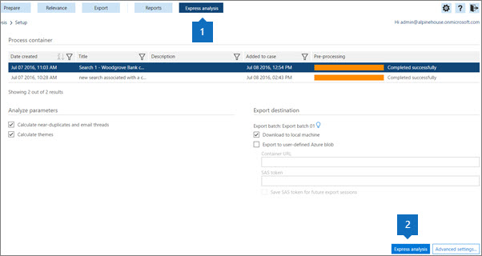

# Use Express Analysis in Advanced eDiscovery (classic) 

> [!NOTE]
> Advanced eDiscovery requires an Office 365 E3 with the Advanced Compliance add-on or an E5 subscription for your organization. If you don't have that plan and want to try Advanced eDiscovery, you can [sign up for a trial of Office 365 Enterprise E5](https://go.microsoft.com/fwlink/p/?LinkID=698279). 
  
You can use **Express analysis** to quickly analyze a case and export the results. 
  
You can use express analysis to calculate near-duplicates and email threads and calculate themes. You can also set certain parameters for themes, document similarity and the export files in the [Advanced settings for Express analysis](use-express-analysis-in-advanced-ediscovery.md#BK_AdvancedSettings).
  
## Run Express analysis

1. In the **Express analysis** (1) tab, select a container to enable the ** Express analysis ** (2), and **Advanced settings** buttons. 
    
    
  
2. Under **Analyze parameters**:
    
  - Check **Calculate near-duplicates and email threads** if you want to run the analysis. It is selected by default. 
    
  - Check **Calculate Themes** to process all files and assign themes to them. It is selected by default. 
    
3. Under **Export destination**:
    
  - Check **Download to local machine** to download to your local computer. 
    
  - If you check **Export to user-defined Azure blob** then you can also specify a container URL and SAS token. 
    
    > [!NOTE]
    > Once an export package is stored to the user defined Azure blob, the data is no longer managed by Advanced eDiscovery. it is managed by the Azure blob. This means if you delete the case, the exported files will still remain on the Azure blob. 
  
  - **Save SAS token for future export session**: If checked, the SAS token will be encrypted in the Advanced eDiscovery's internal database for future use.
    
    > [!NOTE]
    > Currently the SAS token expires after a month. If you try to download after more than a month you have to undo last session, then export again. 
  
4. To start the express analysis with default settings, choose **Express analysis**, and the **Task status** page will display 
    
    On the **Task status** page you can expand the **Process**, **Analyze** and **Export** tabs to display details about the express run. 
    
    
  
5. Choose the **Express analysis summary** page to list detailed information about the run. 
    
    On the bottom of the **Express analysis summary** page, choose **Download last session** to download the analysis files tp your local computer. You will first have to download eDiscovery Export tool and paste the Export key to the eDiscovery Export tool. 
    
## Advanced settings for Express analysis

You can optionally set **Advanced settings** to change the default Express analysis parameters. 
  
1. In the **Analyze** section: 
    
  - In the **Near duplicates and email threads**, enter the **Document similarity** value, or accept the default of 65%. 
    
  - In the **Max number of themes** enter or select a value for the number of themes to create. The default is 200. 
    
    > [!NOTE]
    > Increasing the number of themes affects performance, as well as the ability of a theme to generalize. The higher the number of themes, the more granular they are. For example, if a set of 50 themes include a theme such as "Basketball, Spurs, Clippers, Lakers"; 300 themes may include separate themes: "Spurs", "Clippers", "Lakers". If you had no awareness of the theme "Basketball" and use this feature for ECA, seeing the theme "Basketball" could be useful. But, if the processing had too many themes, you may never see the word "Basketball" and may not know that Spurs and Clippers are good Basketball themes to review, rather than items that go on boots and used for hair. 
  
  - In the **Suggested themes** choose **Modify** to suggest theme words to control Themes processing. Advanced eDiscovery will focus on these suggested words and try to create one or more relevant themes, based on the "Max number of themes" settings. 
    
    For example, if the suggested word is "computer", and you specified "2" as the "Max number of Themes", Advanced eDiscovery will try to generate two themes that relate to the word "computer". The two themes might be "computer software" and "computer hardware", for example.
    
    
  
  - **Mode** From the drop-down list, select a **Themes** option: 
    
  - **Create and apply model**: Calculates themes by models from a segment of the files and then distributes files among them.
    
  - **Create model**: Calculates a themes model from a segment of the files. The Apply process of dividing files is done separately at another time.
    
  - **Apply model**: This option is only shown if a model was created previously and not yet applied. This will divide the files based on the themes.
    
2. In the **Export** section: 
    
1. In the **Select export batch**:
    
  - From the **Export batch** list, select the batch name or export results to Export batch 01, (the default batch). 
    
  - To export results for new files that you added to an existing case, continue with your current batch. To create a session in the batch, select the same batch number and click **Create export session** You can use this option to export the same parameters as the previous batch, in an incremental manner. 
    
  - To export to a new batch, click **Add**  and enter a new name in **Batch name** (or accept the default) and a description in **Batch description**. Click **OK**.
    
  - To edit a batch name or description, select the name in **Export batch**, click **Edit** , and then modify the fields.
    
    > [!NOTE]
    > After you've run sessions for an export batch, they cannot be deleted. In addition, only some parameters can be edited once the first session is run. 
  
  - To create a duplicate export batch, choose **Duplicate export batch**  and enter a name and a description for the duplicate batch in the panel. 
    
  - To delete an export batch, choose **Delete** .
    
  - To view the history of a batch, choose **Batch history** .
    
2. Under Define p **opulation:** Select **Include only files above Relevance cut-off score** and/or **Refine export batch** if you want to fine-tune the settings for your export batch. If you select **Include only files above Relevance cut-off score**, then the **Issue** is enabled, and if the file's relevance score is higher than the cut-off score for the selected issue, then the file is exported. The file will be exported unless it's excluded by the ' **For review** filter. If you select **Refine export batch**, then the **De-dupe** and **Filter by 'For review' field** radio buttons are enabled. If you choose **De-dupe**, then duplicates files will be filtered-out according to the policy defined: [Case level (default): from every set of duplicate files in the entire case, all but one file will be de-duped. Custodian level: from every set of duplicate files of the same custodian, all but one file will be de-duped. A record of all duplicate files is available in export output. If you choose **Filter by 'For review'** field, select **Modify under Metadata** to enter your **'For review'**field settings. Select **Include input files**to include source files in the package content. You can clear this option to speed up the export process. Note that the Native files will be exported in any case.
    
3. Under **Define metadata**, select from the following options in the **Export template** list (once per session). 
    
  - **Standard**: Basic set of data items, metadata, and properties. Use this option when import data was already processed in Advanced eDiscovery and export data is uploaded to a system that already contains the files. By default, export template columns are created and filled.
    
  - **All**: Full set of standard metadata including all processing data, as well as Analyze and Relevance scores. This template is required when Advanced eDiscovery performs the processing and file data is uploaded to an external system for the first time.
    
  - **Issues**: Select **All Issues** or select a particular issue you have created. 
    
Choose **OK**to save the advanced settings, **Restore defaults** to use default values, or **Cancel** to cancel setting the advanced settings. 
  
## See also

[Advanced eDiscovery (classic)](office-365-advanced-ediscovery.md)

