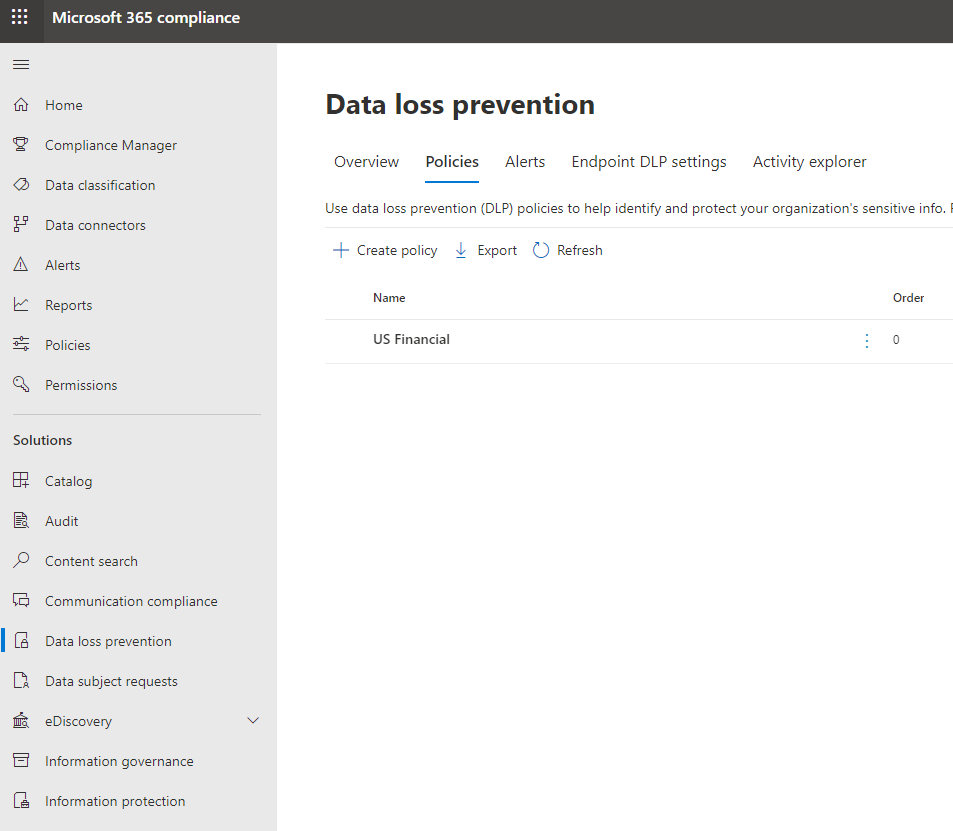
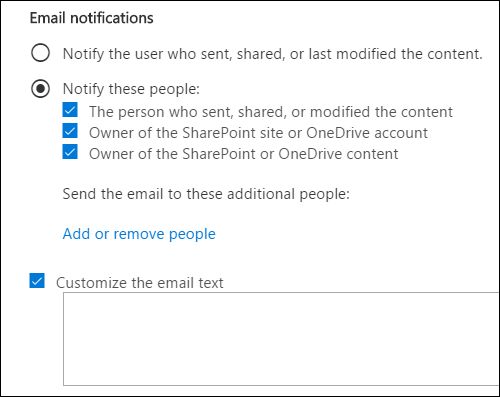
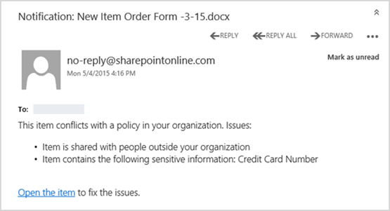
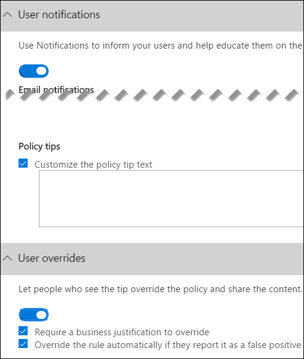
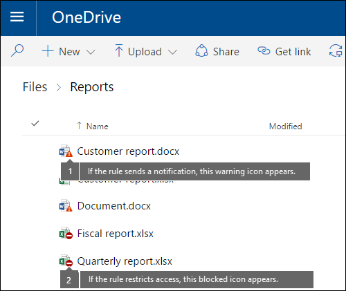

# Send email notifications and show policy tips for DLP policies

You can use a data loss prevention (DLP) policy to identify, monitor, and protect sensitive information across Office 365. You want people in your organization who work with this sensitive information to stay compliant with your DLP policies, but you don't want to block them unnecessarily from getting their work done. This is where email notifications and policy tips can help.
  

  
A policy tip is a notification or warning that appears when someone is working with content that conflicts with a DLP policy—for example, content like an Excel workbook on a OneDrive for Business site that contains personally identifiable information (PII) and is shared with an external user.
  
You can use email notifications and policy tips to increase awareness and help educate people about your organization's policies. You can also give people the option to override the policy, so that they're not blocked if they have a valid business need or if the policy is detecting a false positive.
  
In the Security &amp; Compliance Center, when you create a DLP policy, you can configure the user notifications to:
  
- Send an email notification to the people you choose that describes the issue.
    
- Display a policy tip for content that conflicts with the DLP policy:
    
  - For email in Outlook on the web and Outlook 2013 and later, the policy tip appears at the top of a message above the recipients while the message is being composed.
    
  - For documents in a OneDrive for Business account or SharePoint Online site, the policy tip is indicated by a warning icon that appears on the item. To view more information, you can select an item and then choose **Information**  in the upper-right corner of the page to open the details pane. 
    
  - For Excel, PowerPoint, and Word documents that are stored on a OneDrive for Business site or SharePoint Online site that's included in the DLP policy, the policy tip appears on the Message Bar and the Backstage view ( **File** menu \> **Info**).
    
## Add user notifications to a DLP policy

When you create a DLP policy, you can enable **User notifications**. When user notifications are enabled, Microsoft 365 sends out both email notifications and policy tips. You can customize who notification emails are sent to, the email text and the policy tip text.
  
1. Go to [https://protection.office.com](https://protection.office.com).
    
2. Sign in using your work or school account. You're now in the Security &amp; Compliance Center.
    
3. In the Security &amp; Compliance Center \> left navigation \> **Data loss prevention** \> **Policy** \> **+ Create a policy**.
    
    
  
4. Choose the DLP policy template that protects the types of sensitive information that you need \> **Next**.
    
    To start with an empty template, choose **Custom** \> **Custom policy** \> **Next**.
    
5. Name the policy \> **Next**.
    
6. To choose the locations that you want the DLP policy to protect, do one of the following:
    
   - Choose **All locations in Office 365** \> **Next**.
    
   - Choose **Let me choose specific locations** \> **Next**.
    
   To include or exclude an entire location such as all Exchange email or all OneDrive accounts, switch the **Status** of that location on or off. 
    
   To include only specific SharePoint sites or OneDrive accounts, switch the **Status** to on, and then click the links under **Include** to choose specific sites or accounts. 
    
7. Choose **Use advanced settings** \> **Next**.
    
8. Choose **+ New rule**.
    
9. In the rule editor, under **User notifications**, switch the status on.
    
    

> [!NOTE]
> DLP policies apply to all documents that match the policy, whether those documents are new or existing. However, an email notification is only generated when new content matches an existing DLP policy. Existing content is protected, but will not generate a user notification via email.
  
## Options for configuring email notifications

For each rule in a DLP policy, you can:
  
- Send the notification to the people you choose. These people can include the owner of the content, the person who last modified the content, the owner of the site where the content is stored, or a specific user.
    
- Customize the text that's included in the notification by using HTML or tokens. See the section below for more information.
    
> [!NOTE]
>  Email notifications can be sent only to individual recipients—not groups or distribution lists. Only new content will trigger an email notification. Editing existing content will trigger policy tips, but not an email notification. 
  

  
### Default email notification

Notifications have a Subject line that begins with the action taken, such as "Notification", "Message Blocked" for email, or "Access Blocked" for documents. If the notification is about a document, the notification message body includes a link that takes you to the site where the document's stored and opens the policy tip for the document, where you can resolve any issues (see the section below about policy tips). If the notification is about a message, the notification includes as an attachment the message that matches a DLP policy.
  

  
By default, notifications display text similar to the following for an item on a site. The notification text is configured separately for each rule, so the text that's displayed differs depending on which rule is matched.

|**If the DLP policy rule does this…**|**Then the default notification for SharePoint or OneDrive for Business documents says this…**|**Then the default notification for Outlook messages says this…**|
|:-----|:-----|:-----|
|Sends a notification but doesn't allow override    |This item conflicts with a policy in your organization.    |Your email message conflicts with a policy in your organization.    |
|Blocks access, sends a notification, and allows override    |This item conflicts with a policy in your organization. If you don't resolve this conflict, access to this file might be blocked.    |Your email message conflicts with a policy in your organization. The message wasn't delivered to all recipients.    |
|Blocks access and sends a notification    |This item conflicts with a policy in your organization. Access to this item is blocked for everyone except its owner, last modifier, and the primary site collection administrator.    |Your email message conflicts with a policy in your organization. The message wasn't delivered to all recipients.    |
   
### Custom email notification

You can create a custom email notification instead of sending the default email notification to your end users or admins. The custom email notification supports HTML and has a 5,000-character limit. You can use HTML to include images, formatting, and other branding in the notification.
  
You can also use the following tokens to help customize the email notification. These tokens are variables that are replaced by specific information in the notification that's sent.

|**Token**|**Description**|
|:-----|:-----|
|%%AppliedActions%%    |The actions applied to the content.    |
|%%ContentURL%%    |The URL of the document on the SharePoint Online site or OneDrive for Business site.    |
|%%MatchedConditions%%    |The conditions that were matched by the content. Use this token to inform people of possible issues with the content.    |
   

  
## Options for configuring policy tips

For each rule in a DLP policy, you can configure policy tips to:
  
- Simply notify the person that the content conflicts with a DLP policy, so that they can take action to resolve the conflict. You can use the default text (see the tables below) or enter custom text about your organization's specific policies.
    
- Allow the person to override the DLP policy. Optionally, you can:
    
  - Require the person to enter a business justification for overriding the policy. This information is logged and you can view it in the DLP reports in the **Reports** section of the Security &amp; Compliance Center. 
    
  - Allow the person to report a false positive and override the DLP policy. This information is also logged for reporting, so that you can use false positives to fine tune your rules.
    

  
For example, you may have a DLP policy applied to OneDrive for Business sites that detects personally identifiable information (PII), and this policy has three rules:
  
1. First rule: If fewer than five instances of this sensitive information are detected in a document, and the document is shared with people inside the organization, the **Send a notification** action displays a policy tip. For policy tips, no override options are necessary because this rule is simply notifying people and not blocking access. 
    
2. Second rule: If greater than five instances of this sensitive information are detected in a document, and the document is shared with people inside the organization, the **Block access to content** action restricts the permissions for the file, and the **Send a notification** action allows people to override the actions in this rule by providing a business justification. Your organization's business sometimes requires internal people to share PII data, and you don't want your DLP policy to block this work. 
    
3. Third rule: If greater than five instances of this sensitive information are detected in a document, and the document is shared with people outside the organization, the **Block access to content** action restricts the permissions for the file, and the **Send a notification** action does not allow people to override the actions in this rule because the information is shared externally. Under no circumstances should people in your organization be allowed to share PII data outside the organization. 
    
Here are some fine points to understand about using a policy tip to override a rule:
  
- The option to override is per rule, and it overrides all of the actions in the rule (except sending a notification, which can't be overridden).
    
- It's possible for content to match several rules in a DLP policy, but only the policy tip from the most restrictive, highest-priority rule will be shown. For example, a policy tip from a rule that blocks access to content will be shown over a policy tip from a rule that simply sends a notification. This prevents people from seeing a cascade of policy tips.
    
- If the policy tips in the most restrictive rule allow people to override the rule, then overriding this rule also overrides any other rules that the content matched.
    
## Policy tips on OneDrive for Business sites and SharePoint Online sites

When a document on a OneDrive for Business site or SharePoint Online site matches a rule in a DLP policy, and that rule uses policy tips, the policy tips display special icons on the document:
  
1. If the rule sends a notification about the file, the warning icon appears.
    
2. If the rule blocks access to the document, the blocked icon appears.
    
   
  
To take action on a document, you can select an item \> choose **Information**  in the upper-right corner of the page to open the details pane \> **View policy tip**.
  
The policy tip lists the issues with the content, and if the policy tips are configured with these options, you can choose **Resolve**, and then **Override** the policy tip or **Report** a false positive. 
  

  

  
DLP policies are synced to sites and contented is evaluated against them periodically and asynchronously, so there may be a short delay between the time you create the DLP policy and the time you begin to see policy tips. There may be a similar delay from when you resolve or override a policy tip to when the icon on the document on the site goes away.
  
### Default text for policy tips on sites

By default, policy tips display text similar to the following for an item on a site. The notification text is configured separately for each rule, so the text that's displayed differs depending on which rule is matched.

|**If the DLP policy rule does this…**|**Then the default policy tip says this…**|
|:-----|:-----|
|Sends a notification but doesn't allow override    |This item conflicts with a policy in your organization.    |
|Blocks access, sends a notification, and allows override    |This item conflicts with a policy in your organization. If you don't resolve this conflict, access to this file might be blocked.    |
|Blocks access and sends a notification    |This item conflicts with a policy in your organization. Access to this item is blocked for everyone except its owner, last modifier, and the primary site collection administrator.    |
   
### Custom text for policy tips on sites

You can customize the text for policy tips separately from the email notification. Unlike custom text for email notifications (see above section), custom text for policy tips does not accept HTML or tokens. Instead, custom text for policy tips is plain text only with a 256-character limit.
  
## Support Matrix for DLP policy tips across Microsoft apps

|**App and platform**|**DLP policy tip support**|**Sensitive information types supported**|**Conditions and exceptions supported**|**Comments**|
|--------------------|--------------------------|-----------------------------------------|------------------------------------|------------|
|Outlook Web Access   |Yes   |All   |Subset    |See  [DLP predicates supported for DLP policy tips in Outlook Web Access](#dlp-predicates-supported-for-dlp-policy-tips-in-outlook-web-access)    |
|Outlook Desktop (Outlook 2013 and beyond)   |Yes   |Subset   |Subset    |See [Outlook 2013 and later supports showing policy tips for only some sensitive information types](#outlook-2013-and-later-supports-showing-policy-tips-for-only-some-sensitive-information-types) and [Outlook 2013 and later supports showing policy tips for only some conditions and exceptions](#outlook-2013-and-later-supports-showing-policy-tips-for-only-some-conditions-and-exceptions) for details on support for sensitive information types and DLP conditions and actions supported for showing DLP policy tips on Outlook Desktop.   |
|Outlook Mobile (iOS, Android)/Outlook Mac   |No   |None   |None   |DLP policy tips are not supported on Outlook mobile   |
|Sharepoint Online/One Drive for Business Web client   |Yes   |All   |All SPO/ODB conditions and exceptions in DLP   |   |
|Sharepoint Desktop/ One Drive for Business Desktop client   |No   |None   |None   |DLP policy tips are not supported on Sharepoint or OneDrive desktop client apps   |
|Word, Excel, Powerpoint Web Client   |Yes   |All   |All SPO/ODB conditions and exceptions in DLP   |DLP policy tip is supported if the document is hosted on SPO or ODB web app and the DLP policy is already stamped.   |
|Word, Excel, Powerpoint Desktop Client   |Yes   |Subset   |Subset   |Policy tips for WXP client apps will work for documents stored on Sharepoint Online or One Drive for Business Sites for all DLP policies which have exactly the below or a subset of conditions or actions in the DLP policy :  Content contains sensitive information types, Access Scope (Content is shared internally/externally), Notify User (policy tips/user notifications), Block everyone, Incident reports   If any other condition or action is present, the DLP policy tip for that policy will not appear in the desktop apps of Word, Excel or PowerPoint.   |
|Word, Excel, Powerpoint Mobile Client   |No   |None   |None   |DLP policy tips are not supported in mobile apps for Office.   |
|Teams Web/ Teams Desktop/ Teams Mobile/ Teams Mac   |Yes   |All   |All Teams conditions and exceptions in DLP policy   |Policy tips will show when a message is flagged as : “This message has been flagged. What can I do?”    When clicking the link, the user can review the sensitive info types detected and override or report an issue if allowed by the admin    Note that no policy tips are shown for files. When the recipient tries to access the document, they might get access denied if not allowed.   |
|Desktop Endpoint Devices   |Yes   |Subset    |All Endpoint DLP conditions and exceptions and actions in DLP policy   |See Data Loss Prevention on Endpoint supports policy tips for only some sensitive information types for more details   |
|Mac devices   |No   |None   |None   |Data loss prevention policies are not enforceable on Mac devices today   |
|3rd party cloud apps   |No   |None   |None   |Data Loss Prevention   |
|On-prem   |No   |None   |None   |   |

## Data Loss Prevention on Endpoint supports policy tips for only some sensitive information types

The list of out-of-the-box sensitive information types that will be detected in documents residing on endpoint devices are the following :

|**Sensitive information types**|**Sensitive information types**|**Sensitive information types**|
|:-----|:-----|:-----|
|Credit Card Number   |Brazil National ID Card (RG)   |Greek Tax identification Number   |
|EU Debit Card Number   |Brazil Legal Entity Number (CNPJ)   |Hungary Personal Identification Number   |
|U.S. Social Security Number (SSN)   |Denmark Personal Identification Number   |Hungary Tax identification Number   |
|U.S. Individual Taxpayer Identification Number (ITIN)   |Belgium National Number   |Italy Fiscal Code   |
|Canada Social Insurance Number   |Germany Identity Card Number   |Lithuania Personal Code   |
|U.K. National Insurance Number (NINO)   |Ireland Personal Public Service (PPS) Number   |Malta Identity Card Number   |
|U.K. Driver's License Number   |Netherlands Citizen's Service (BSN) Number   |Slovenia Unique Master Citizen Number   |
|German Driver's License Number   |Norway Identity Number   |Sweden Tax Identification Number   |
|German Passport Number   |Portugal Citizen Card Number   |Latvia Personal Code   |
|U.K. National Health Service Number   |Croatia Personal Identification (OIB) Number   |Spain DNI   |
|France Social Security Number (INSEE)   |Croatia Identity Card Number   |Malta Tax ID Number   |
|France Driver's License Number   |Czech Personal Identity Number   |Spain Tax Identification Number   |
|Canada Driver's License Number   |Greece National ID Card   |U.K. Unique Taxpayer Reference Number   |
|U.S. Driver's License Number   |South Africa Identification Number   |France Tax Identification Number (numéro SPI.)   |
|Japan Driver's License Number   |International Classification of Diseases (ICD-10-CM)   |Germany Tax Identification Number   |
|Japan Resident Registration Number   |International Classification of Diseases (ICD-9-CM)   |Portugal Tax Identification Number   |
|Japan Social Insurance Number (SIN)   |Azure Publish Setting Password   |Romania Personal Numerical Code (CNP)   |
|Japan Passport Number   |Azure Storage Account Key (Generic)   |Slovakia Personal Number   |
|Japan Bank Account Number   |SQL Server Connection String   |Austria Driver's License Number   |
|France Passport Number   |Azure DocumentDB Auth Key   |Belgium Driver's License Number   |
|U.S. / U.K. Passport Number   |Azure IAAS Database Connection String and Azure SQL Connection String   |Bulgaria Driver's License Number   |
|SWIFT Code   |Azure IoT Connection String   |Croatia Driver's License Number   |
|U.S. Bank Account Number   |Azure Redis Cache Connection String   |Cyprus Driver's License Number   |
|ABA Routing Number   |Azure SAS   |Czech Driver's License Number   |
|Drug Enforcement Agency (DEA) Number   |Azure Service Bus Connection String   |Denmark Driver's License Number   |
|Australia Medical Account Number   |Azure Storage Account Key   |Estonia Driver's License Number   |
|Australia Tax File Number   |EU Passport Number   |Greece Driver's License Number   |
|Israel National ID   |EU National Identification Number   |Hungary Driver's License Number   |
|New Zealand Ministry of Health Number   |EU Social Security Number (SSN) or Equivalent ID   |Ireland Driver's License Number   |
|Spain Social Security Number (SSN)   |EU Driver's License Number   |Latvia Driver's License Number   |
|Sweden National ID   |EU Tax Identification Number (TIN)   |Lithuania Driver's License Number   |
|Australia Bank Account Number   |CSCAN-AZURE0060 Azure Storage Account Shared Access Signature   |Luxemburg Driver's License Number   |
|Australia Passport Number   |CSCAN-GENERAL0140 General Symmetric Key   |Malta Driver's License Number   |
|Canada Bank Account Number   |Australian Company Number   |Netherlands Driver's License Number   |
|Canada Passport Number   |Austria Value Added Tax (VAT) Number   |Poland Driver's License Number   |
|Canada Personal Health Identification Number (PHIN)   |Ukraine Passport Number (Domestic)   |Romania Driver's License Number   |
|Canada Health Service Number   |Ukraine Passport Number (International)   |Slovakia Driver's License Number   |
|France National ID Card (CNI)   |Finland European Health Insurance Number   |Slovenia Driver's License Number   |
|IP Address   |France Health Insurance Number   |Sweden Driver's License Number   |
|International Banking Account Number (IBAN)   |Russian Passport Number (Domestic)   |Finland Driver's License Number   |
|Israel Bank Account Number   |Russian Passport Number (International)   |Portugal Driver's License Number   |
|Italy Driver's License Number   |New Zealand bank account number   |Spain Driver's License Number   |
|Saudi Arabia National ID   |New Zealand Inland Revenue number   |Hungarian Social Security Number (TAJ)   |
|Sweden Passport Number   |Australian Business Number   |Belgium Passport Number   |
|U.K. Electoral Roll Number   |Polish REGON Number   |Cyprus Passport Number   |
|Thai Population Identification Code   |Swiss Social Security Number AHV   |Denmark Passport Number   |
|Turkish National Identification number   |Germany Value Added Tax Number   |Latvia Passport Number   |
|Japanese Residence Card Number   |Japanese My Number Personal   |Lithuania Passport Number   |
|Finland National ID   |Japanese My Number Corporate   |Luxemburg Passport Number   |
|Taiwan National ID   |Netherlands Value Added Tax Number   |Netherlands Passport Number   |
|Poland National ID (PESEL)   |Italy Value Added Tax Number   |Spain Passport Number   |
|Poland Identity Card   |Hungarian Value Added Tax Number   |Austria Social Security Number   |
|Poland Passport   |France Value Added Tax Number   |Greece Social Security Number (AMKA)   |
|Finland Passport Number   |Belgium Value Added Tax Number   |Austria Passport Number   |
|Malaysia Identity Card Number   |New Zealand Driver License Number   |Bulgaria Passport Number   |
|South Korea Resident Registration Number   |New Zealand Social Welfare Number   |Croatia Passport Number   |
|Singapore National Registration Identity Card (NRIC) Number   |Austria Tax Identification Number   |Czech Republic Passport Number   |
|Taiwan Passport Number   |Luxemburg National Identification Number (Non-natural persons)   |Estonia Passport Number   |
|Taiwan Resident Certificate (ARC/TARC)   |Netherlands Tax Identification Number   |Portugal Passport Number   |
|Argentina National Identity (DNI) Number   |Slovenia Tax Identification Number   |Slovakia Passport Number   |
|Chile Identity Card Number   |Croatia National ID Card Number   |Slovenia Passport Number   |
|China Resident Identity Card (PRC) Number   |Luxemburg National Identification Number (Natural persons)   |Greece Passport Number   |
|Hong Kong Identity Card (HKID) Number   |Poland Tax Identification Number   |Hungary Passport Number   |
|India Unique Identification (Aadhaar) Number   |Austria Identity Card   |Ireland Passport Number   |
|India Permanent Account Number (PAN)   |Bulgaria Uniform Civil Number   |Italy Passport Number   |
|Indonesia Identity Card (KTP) Number   |Cyprus Identity Card   |Malta Passport Number   |
|Philippines Unified Multi-Purpose ID Number   |Cyprus Tax Identification Number   |Romania Passport Number   |
|Brazil CPF Number   |Estonia Personal Identification Code   |   |

Please note that custom sensitive information types will also be detected in addition to the above out-of-the-box sensitive information types

## Policy tips in Outlook on the web and Outlook 2013 and later

When you compose a new email in Outlook on the web and Outlook 2013 and later, you'll see a policy tip if you add content that matches a rule in a DLP policy, and that rule uses policy tips. The policy tip appears at the top of the message, above the recipients, while the message is being composed.
  

  
Policy tips work whether the sensitive information appears in the message body, subject line, or even a message attachment as shown here.
  

  
If the policy tips are configured to allow override, you can choose **Show Details** \> **Override** \> enter a business justification or report a false positive \> **Override**.
  

  

  
Note that when you add sensitive information to an email, there may be latency between when the sensitive information is added and when the policy tip appears.

### DLP predicates supported for DLP policy tips in Outlook Web Access

DLP policy tips in Outlook Web Access is supported for all the conditions, exceptions and actions that are applicable on Exchange workload in a DLP policy except the following conditions and corresponding exceptions:

-	Sender Domain Is
-	Recipient is a member of
-	Header contains words or phrases
-	Header matches patterns
-	Document size equals or is greater than
-	Message type is
-	Message importance is
-	Content character set contains words
-	Subject or body contains words or phrases
-	Subject or body matches patterns
-	Content character set contains words
-	Content is received from
-	Has sender overridden the policy tip 
-	Message size equals or is greater than
-	Sender AD attribute contains words or phrases
-	Sender AD attribute matches patterns
-	Document content contains words or phrases
-	Document content matches patterns

### Outlook 2013 and later supports showing policy tips for only some conditions and exceptions

Currently, Outlook 2013 and later supports showing policy tips for policies which do not contain any condition or exception apart from the below mentioned conditions and corresponding exceptions :

- Content contains sensitive information types (sensitivity labels is not supported)
- Content is shared

Note that all the conditions work for emails authored in Outlook client app, where they will match content and enforce protective actions on content. However, showing policy tips to users is not yet supported for any conditions that are used apart from the ones mentioned above.

### Outlook 2013 and later supports showing policy tips for only some sensitive information types

The list of out-of-the-box sensitive information types that will be detected for showing DLP policy tips in Outlook on Desktop (2013 and later) are the following :

|**Sensitive information types**|**Sensitive information types**|**Sensitive information types**|
|:-----|:-----|:-----|
|Credit Card Number   |Canada Bank Account Number   |Philippines Unified Multi-Purpose ID Number   |
|EU Debit Card Number   |Canada Passport Number   |Brazil CPF Number   |
|U.S. Social Security Number (SSN)   |Canada Personal Health Identification Number (PHIN)   |Brazil National ID Card (RG)   |
|U.S. Individual Taxpayer Identification Number (ITIN)   |Canada Health Service Number   |Brazil Legal Entity Number (CNPJ)   |
|Canada Social Insurance Number   |France National ID Card (CNI)   |Denmark Personal Identification Number   |
|U.K. National Insurance Number (NINO)   |IP Address   |Belgium National Number   |
|U.K. Driver's License Number   |International Banking Account Number (IBAN)   |Germany Identity Card Number   |
|German Driver's License Number   |Israel Bank Account Number   |Ireland Personal Public Service (PPS) Number   |
|German Passport Number   |Italy Driver's License Number   |Netherlands Citizen's Service (BSN) Number   |
|U.K. National Health Service Number   |Saudi Arabia National ID   |Norway Identity Number   |
|France Social Security Number (INSEE)   |Sweden Passport Number   |Portugal Citizen Card Number   |
|France Driver's License Number   |U.K. Electoral Roll Number   |Croatia Personal Identification (OIB) Number   |
|Canada Driver's License Number   |Thai Population Identification Code   |Croatia Identity Card Number   |
|U.S. Driver's License Number   |Turkish National Identification number   |Czech Personal Identity Number   |
|Japan Driver's License Number   |Japanese Residence Card Number   |Greece National ID Card   |
|Japan Resident Registration Number   |Finland National ID   |South Africa Identification Number   |
|Japan Social Insurance Number (SIN)   |Taiwan National ID   |International Classification of Diseases (ICD-10-CM)   |
|Japan Passport Number   |Poland National ID (PESEL)   |International Classification of Diseases (ICD-9-CM)   |
|Japan Bank Account Number   |Poland Identity Card   |Azure Publish Setting Password   |
|France Passport Number   |Poland Passport   |Azure Storage Account Key (Generic)   |
|U.S. / U.K. Passport Number   |Finland Passport Number   |SQL Server Connection String   |
|SWIFT Code   |Malaysia Identity Card Number   |Azure DocumentDB Auth Key   |
|U.S. Bank Account Number   |South Korea Resident Registration Number   |Azure IAAS Database Connection String and Azure SQL Connection String   |
|ABA Routing Number   |Singapore National Registration Identity Card (NRIC) Number   |Azure IoT Connection String   |
|Drug Enforcement Agency (DEA) Number   |Taiwan Passport Number   |Azure Redis Cache Connection String   |
|Australia Medical Account Number   |Taiwan Resident Certificate (ARC/TARC)   |Azure SAS   |
|Australia Tax File Number   |Argentina National Identity (DNI) Number   |Azure Service Bus Connection String   |
|Israel National ID   |Chile Identity Card Number   |Azure Storage Account Key   |
|New Zealand Ministry of Health Number   |China Resident Identity Card (PRC) Number   |EU Passport Number   |
|Spain Social Security Number (SSN)   |Hong Kong Identity Card (HKID) Number   |EU National Identification Number   |
|Sweden National ID   |India Unique Identification (Aadhaar) Number   |EU Social Security Number (SSN) or Equivalent ID   |
|Australia Bank Account Number   |India Permanent Account Number (PAN)   |EU Driver's License Number   |
|Australia Passport Number   |Indonesia Identity Card (KTP) Number   |EU Tax Identification Number (TIN)   |

Please note that custom sensitive information types are also supported for DLP policy tips in addition to the above out-of-the-box sensitive information types

### Policy tips in the Exchange admin center vs. the Security &amp; Compliance Center

Policy tips can work either with DLP policies and mail flow rules created in the Exchange admin center, or with DLP policies created in the Security &amp; Compliance Center, but not both. This is because these policies are stored in different locations, but policy tips can draw only from a single location.
  
If you've configured policy tips in the Exchange admin center, any policy tips that you configure in the Security &amp; Compliance Center won't appear to users in Outlook on the web and Outlook 2013 and later until you turn off the tips in the Exchange admin center. This ensures that your current Exchange mail flow rules (also known as transport rules) will continue to work until you choose to switch over to the Security &amp; Compliance Center.
  
Note that while policy tips can draw only from a single location, email notifications are always sent, even if you're using DLP policies in both the Security &amp; Compliance Center and the Exchange admin center.
  
### Default text for policy tips in email

By default, policy tips display text similar to the following for email.

|**If the DLP policy rule does this…**|**Then the default policy tip says this…**|
|:-----|:-----|
|Sends a notification but doesn't allow override    |Your email conflicts with a policy in your organization.    |
|Blocks access, sends a notification, and allows override    |Your email conflicts with a policy in your organization.    |
|Blocks access and sends a notification    |Your email conflicts with a policy in your organization.    |
   
## Policy tips in Excel, PowerPoint, and Word

When people work with sensitive content in the desktop versions of Excel, PowerPoint, and Word, policy tips can notify them in real time that the content conflicts with a DLP policy. This requires that:
  
- The Office document is stored on a OneDrive for Business site or SharePoint Online site.
    
- The site is included in a DLP policy that's configured to use policy tips.
    
Office desktop programs automatically sync DLP policies directly from Office 365, and then scan your documents to ensure that they don't conflict with your DLP policies and display policy tips in real time.

> [!NOTE]
> Office desktop apps scan documents themselves to determine if DLP policy tips should be shown; they do not show policy tips that SharePoint Online sites or OneDrive for Business sites have already determined should be shown on a file. As a result, you may not always see a DLP policy tip in the desktop apps that you see in the SharePoint Online sites or OneDrive for Business sites. In contrast, the Office applications on the web only show DLP policy tips that SharePoint Online sites or OneDrive for Business sites have already determined should be shown.
  
Depending on how you configure the policy tips in the DLP policy, people can choose to simply ignore the policy tip, override the policy with or without a business justification, or report a false positive.
  
Policy tips appear on the Message Bar.
  

  
And policy tips also appear in the Backstage view (on the **File** tab). 
  

  
If policy tips in the DLP policy are configured with these options, you can choose **Resolve** to **Override** a policy tip or **Report** a false positive. 
  

  
In each of these Office desktop programs, people can choose to turn off policy tips. If turned off, policy tips that are simple notifications will not appear on the Message Bar or Backstage view (on the **File** tab). However, policy tips about blocking and overriding will still appear, and they will still receive the email notification. In addition, turning off policy tips does not exempt the document from any DLP policies that have been applied to it. 
  
### Default text for policy tips in Excel 2016, PowerPoint 2016, and Word 2016

By default, policy tips display text similar to the following on the Message Bar and Backstage view of an open document. The notification text is configured separately for each rule, so the text that's displayed differs depending on which rule is matched.

|**If the DLP policy rule does this…**|**Then the default policy tip says this…**|
|:-----|:-----|
|Sends a notification but doesn't allow override    |This file conflicts with a policy in your organization. Go to the **File** menu for more information.    |
|Blocks access, sends a notification, and allows override    |This file conflicts with a policy in your organization. If you don't resolve this conflict, access to this file might be blocked. Go to the **File** menu for more information.    |
|Blocks access and sends a notification    |This file conflicts with a policy in your organization. If you don't resolve this conflict, access to this file might be blocked. Go to the **File** menu for more information.    |
   
### Custom text for policy tips in Excel, PowerPoint, and Word

You can customize the text for policy tips separately from the email notification. Unlike custom text for email notifications (see above section), custom text for policy tips does not accept HTML or tokens. Instead, custom text for policy tips is plain text only with a 256-character limit.
  
## More information

- [Overview of data loss prevention policies](data-loss-prevention-policies.md)
    
- [Create a DLP policy from a template](create-a-dlp-policy-from-a-template.md)
- [DLP policy conditions, exceptions, and actions (preview)](./dlp-microsoft-teams.md?view=o365-worldwide)
    
- [Create a DLP policy to protect documents with FCI or other properties](protect-documents-that-have-fci-or-other-properties.md)
    
- [What the DLP policy templates include](what-the-dlp-policy-templates-include.md)
    
- [Sensitive information type entity definitions](sensitive-information-type-entity-definitions.md)
