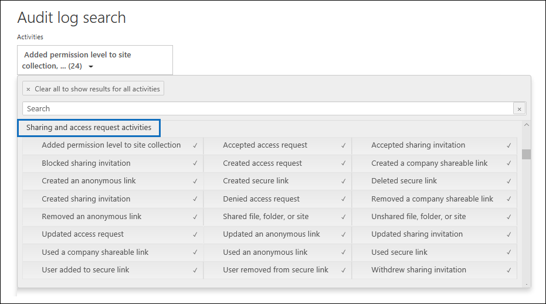

# Use sharing auditing in the audit log

Sharing is a key activity in SharePoint Online and OneDrive for Business, and it's widely used in organizations. Administrators can use sharing auditing in the audit log to determine how sharing is used in their organization. 
  
## The SharePoint Sharing schema

Sharing events (not including events related to sharing policy and sharing links) are different from file- and folder-related events in one primary way: one user is performing an action that has an effect on another user. For example, when a resource User A gives User B access to a file. In this example, User A is the  *acting user*  and User B is the  *target user*. In the SharePoint File schema, the acting user's action only affects the file itself. When User A opens a file, the only information needed in the **FileAccessed** event is the acting user. To address this difference, there is a separate schema, called the  *SharePoint Sharing schema*, that captures more information about sharing events. This ensures that administrators have visibility into who shared a resource and the user the resource was shared with. 
  
The Sharing schema provides two additional fields in an audit record related to sharing events: 
  
- **TargetUserOrGroupType:** Identifies whether the target user or group is a Member, Guest, SharePointGroup, SecurityGroup, or Partner.

- **TargetUserOrGroupName:** Stores the UPN or name of the target user or group that a resource was shared with (User B in the previous example). 

These two fields, in addition to other properties from the audit log schema such as User, Operation, and Date can tell the full story about  *which*  user shared  *what*  resource with  *whom*  and  *when*. 
  
There's another schema property that's important to the sharing story. When you export audit log search results, the **AuditData** column in the exported CSV file stores information about sharing events. For example, when a user shares a site with another user, this is accomplished by adding the target user to a SharePoint group. The **AuditData** column captures this information to provide context for administrators. See [Step 2](#step-2-use-the-powerquery-editor-to-format-the-exported-audit-log) for instructions on how to parse the information in the **AuditData** column.

## SharePoint sharing events

Sharing is defined by when a user (the *acting* user) wants to share a resource with another user (the *target* user). Audit records related to sharing a resource with an external user (a user who is outside of your organization and doesn't have a guest account in your organization's Azure Active Directory) are identified by the following events, which are logged in the audit log:

- **SharingInvitationCreated:** A user in your organization tried to share a resource (likely a site) with an external user. This results in an external sharing invitation sent to the target user. No access to the resource is granted at this point.

- **SharingInvitationAccepted:** The external user has accepted the sharing invitation sent by the acting user and now has access to the resource.

- **AnonymousLinkCreated:** An anonymous link (also called an "Anyone" link) is created for a resource. Because an anonymous link can be created and then copied, it's reasonable to assume that any document that has an anonymous link has been shared with a target user.

- **AnonymousLinkUsed:** As the name implies, this event is logged when an anonymous link is used to access a resource. 

- **SecureLinkCreated:** A user has created a "specific people link" to share a resource with a specific person. This target user may be someone who is external to your organization. The person that the resource is shared with is identified in the audit record for the **AddedToSecureLink** event. The time stamps for these two events are nearly identical.

- **AddedToSecureLink:** A user was added to a specific people link. Use the **TargetUserOrGroupName** field in this event to identify the user added to the corresponding specific people link. This target user may be someone who is external to your organization.

## Sharing auditing work flow
  
When a user (the acting user) wants to share a resource with another user (the target user), SharePoint (or OneDrive for Business) first checks if the email address of the target user is already associated with a user account in the organization's directory. If the target user is in the directory (and has a corresponding guest user account), SharePoint does the following things:
  
-  Immediately assigns the target user permissions to access the resource by adding the target user to the appropriate SharePoint group, and logs an **AddedToGroup** event. 
    
- Sends a sharing notification to the email address of the target user.
    
- Logs a **SharingSet** event. This event has a friendly name of "Shared file, folder, or site" under **Sharing and access request activities** in the activities picker of the audit log search tool. See the screenshot in [Step 1](#step-1-search-for-sharing-events-and-export-the-results-to-a-csv-file). 
    
If a user account for the target user isn't in the directory, SharePoint does the following: 
    
   - Logs one of the following events, based on how the resource is shared:
   
      - **AnonymousLinkCreated**
   
      - **SecureLinkCreated**
   
      - **AddedToSecureLink** 

      - **SharingInvitationCreated** (this event is logged only when the shared resource is a site)
    
   - When the target user accepts the sharing invitation that's sent to them (by clicking the link in the invitation), SharePoint logs a **SharingInvitationAccepted** event and assigns the target user permissions to access the resource. If the target user is sent an anonymous link, the **AnonymousLinkUsed** event is logged after the target user uses the link to access the resource. For secure links, a **FileAccessed** event is logged when an external user uses the link to access the resource.

Additional information about the target user is also logged, such as the identity of the user the invitation is to and the user who accepts the invitation. In some case, these users (or email addresses) can be different. 

## How to identify resources shared with external users

A common requirement for administrators is creating a list of all resources that have been shared with users outside of the organization. By using sharing auditing in Office 365, administrators can generate this list. Here's how.
  
### Step 1: Search for sharing events and export the results to a CSV file

The first step is to search the audit log for sharing events. For more information (including the required permissions) about searching the audit log, see [Search the audit log](search-the-audit-log-in-security-and-compliance.md).
  
1. Go to <https://compliance.microsoft.com>.

2. Sign in using your work or school account.

3. In the left pane of the Microsoft Purview compliance portal, click **Audit**.

    The **Audit** page is displayed.

4. Under **Activities**, click **Sharing and access request activities** to search for sharing-related events. 

    
  
5. Select a date and time range to find the sharing events that occurred within that period. 

6. Click **Search** to run the search. 

7. When the search is finished running and the results are displayed, click **Export results** \> **Download all results**.

    After you select the export option, a message at the bottom of the window prompts you to open or save the CSV file.

8. Click **Save** \> **Save as** and save the CSV file to a folder on your local computer. 

### Step 2: Use the PowerQuery Editor to format the exported audit log

The next step is to use the JSON transform feature in the Power Query Editor in Excel to split each property in the **AuditData** column (which consists of a multi-property JSON object) into its own column. This lets you filter columns to view records related to sharing

For step-by-step instructions, see "Step 2: Format the exported audit log using the Power Query Editor" in [Export, configure, and view audit log records](export-view-audit-log-records.md#step-2-format-the-exported-audit-log-using-the-power-query-editor).

### Step 3: Filter the CSV file for resources shared with external users

The next step is to filter the CSV for the different sharing-related events that were previously described in the [SharePoint sharing events](#sharepoint-sharing-events) section. Alternatively, you can filter the **TargetUserOrGroupType** column to display all records where the value of this property is **Guest**. 

After you've followed the instructions in the previous step to prepare the CSV file by using the PowerQuery editor, do the following:
    
1. Open the Excel file that you created in Step 2. 

2. On the **Home** tab, click **Sort & Filter**, and then click **Filter**.
    
3. In the **Sort & Filter** dropdown list on the **Operations** column, clear all selections, then select one or more the following sharing-related events and then click **Ok**.
 
   - **SharingInvitationCreated**
   
   - **AnonymousLinkCreated**
   
   - **SecureLinkCreated**
   
   - **AddedToSecureLink** 
    
    Excel displays the rows for the events you selected.
    
4. Go to the column named **TargetUserOrGroupType** and select it. 
    
5. In the **Sort & Filter** dropdown list, clear all selections, then select **TargetUserOrGroupType:Guest**, and click **Ok**.
    
    Now Excel displays the rows for sharing events AND where the target user is outside of your organization, because external users are identified by the value **TargetUserOrGroupType:Guest**. 
  
> [!TIP]
> For the audit records that are displayed, the **ObjectId** column identifies the resource that was shared with the target user; for example  `ObjectId:https:\/\/contoso-my.sharepoint.com\/personal\/sarad_contoso_com\/Documents\/Southwater Proposal.docx`.
