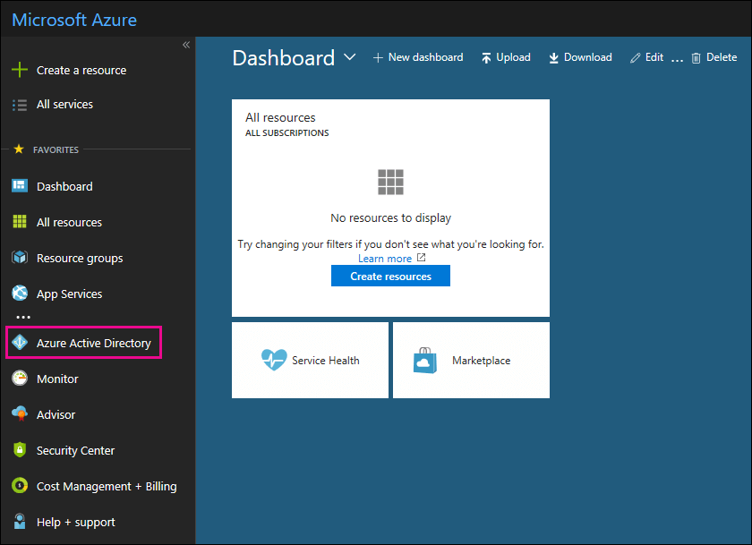

# Use your free Azure Active Directory subscription

If your organization has a paid subscription to Microsoft 365, Microsoft Dynamics CRM Online, Enterprise Mobility Suite, or other Microsoft services, you have a free subscription to Microsoft Azure Active Directory. You and other admins can use Azure AD to create and manage user and group accounts. To use Azure AD, just go to the Azure portal and sign in to your account.

## Open a private browsing session

Use a private browsing session (not a regular session) to access the Azure portal (in step 1 below). This prevents the credentials that you're currently logged on with from being passed to Azure. To open a private browsing session:

- In Microsoft Edge (legacy version), Internet Explorer, or Mozilla FireFox, press `CTRL+SHIFT+P`.

- In Microsoft Edge (newest version) or Google Chrome, press `CTRL+SHIFT+N`.

## Access Azure Active Directory

1. Go to [portal.azure.com](https://portal.azure.com) and sign in with your work or student account.

2. In the left navigation pane in the Azure portal, click **Azure Active Directory**.

    

    The **Azure Active Directory** admin center is displayed.

## More information

- A free Azure Active Directory subscription does not include the Sign-ins activity report. To record sign-in activity (which can be useful in a data breach), you need an Azure Active Directory Premium subscription. For more information, see [How long does Azure AD store the data?](/azure/active-directory/reports-monitoring/reference-reports-data-retention#how-long-does-azure-ad-store-the-data).

- You can also access the **Azure Active Directory** admin center from the Microsoft 365 admin center. In the left navigation pane of the Microsoft 365 admin center, click **Admin centers** \> **Azure Active Directory**.

- For information about managing users and groups and performing other directory management tasks, see [Manage your Azure AD directory](/azure/active-directory/active-directory-administer).