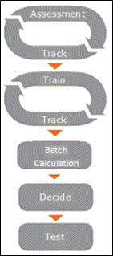

# Use the Relevance module to analyze data in Advanced eDiscovery

In Advanced eDiscovery, the Relevance module includes the Relevance training and review of files related to a case. In order to use the Relevance workflow, go to Manage review set within a review set and click on Show Relevance. There are a couple of steps you need to complete before you can start the workflow:

- Process: each load set added to the review set will show up as a "container" here. You need to process these documents before you can add them to Relevance module; this is also where you can mark them as seed or pre-tagged for a specific issue.

- Add to Relevance: Under Relevance \> Loads, you can add documents that have been processed to Relevance to make them available for training.

The Relevance workflow is shown and described as follows:
  

  
- **Cycles of assessment and tracking**:
    
  - **Assessment**: Enables early assessment based on a random sample of files and uses this assessment to apply decisions to determine the performance of the predictive coding process. 
    
  - **Track**: Calculate and display interim results of the assessment while monitoring statistical validity of the process. 
    
- **Cycles of training and tracking**
    
  - **Tag**: Advanced eDiscovery learns Relevance criteria specific to each issue based on the expert's iterative review and tagging of individual files.
    
  - **Track**: Calculate and display interim results of the Relevance training while monitoring statistical validity of the process. 
    
- **Batch calculation**: The accumulated and learned Relevance criteria is applied to the entire file collection, and a Relevance score is generated for each file.
    
- **Decide**: The results of the analysis applied to the entire case is displayed after Batch calculation, and data used to make document review decisions is displayed.
    
- **Test**: Results can be tested to verify the validity and effectiveness of the Advanced eDiscovery processing.

- **Search**: Once the Relevance workflow is complete, you can use the output such as read percentile of a document for your issue when you run a query within your review set.
    
## Guidelines for Relevance training and review

Following is an overview of guidelines for Relevance training and review:
  
- **Errors and inconsistencies**: If tagging errors are made during training, return to previous file samples to correct them. If there are too many errors to correct or there is a new perspective of the case or issue, the Relevance criteria should be redefined by the Administrator, and the Relevance training restarted.
    
- **Tagging and training**: 
    
  - Files should be tagged based on content only. Do not consider metadata, such as custodian, date, or file path. 
    
  - Do not consider date range indications in the text when tagging files.
    
  - Do not consider embedded graphical images when tagging files.
     
  - Ignore text applied to Relevance will be removed in the displayed file content in the text view in Relevance. If the values for Ignore text were defined after Relevance training already started, the new ignored text will be applied to sample files created from the point in which it was defined. The Ignore Text feature should be used cautiously, as its use may reduce the performance of file analysis
    
  - Use the **Skip tagging** option only when necessary. Advanced eDiscovery does not train based on skipped files. In assessment, if it's hard to tell whether a file is relevant, it is better to tag as Relevant (R) or Not relevant (NR) whenever possible rather than selecting **Skip**. When Advanced eDiscovery evaluates training, it can then be seen how well these types of files were processed.
    
  - Even files with a very small amount of extracted text should be tagged in training as R/NR, rather than as "Skip", when possible. 
    
  - Tagging can impact the classifier as long as the file is readable and can be tagged as R/NR.
    
  - The file sequence number on the displayed Sample files list on the **Tag** tab allows the user to return to the original displayed order of the files. 
    
  - You can go back to any sample and change the tagging of the assessment and training set files. The changes will be applied when creating the next sample.
    
  - Scanned Excel files in PDF format should be treated the same as native Excel files when tagging files.
    
  - When in doubt regarding the Relevance tagging of a file, consult an expert. Incorrect tagging during the Relevance training can lead to lost time later in the process and may also have a negative impact on the quality of the overall results.
    
  - Keywords that were defined in Keyword lists will be displayed in colors to help the user identify relevant files while tagging.
    
- **Batch calculation**: Files that were tagged as R/NR by the expert will receive a score of either 0 or 100. This applies to tagging made before Batch calculation. If the expert switched the issue to Idle after Batch Calculation and continued tagging this issue, the newly tagged scores will not be 100/0 but rather the original score.
    
- **Issues and sampling mode**: Issues are usually turned Off when work on them is completed (Relevance training is stabilized and Batch calculation was performed), when the issues are canceled, or when another user is working on the issues.
    
## Steps in Relevance training

In the **Relevance \> Track** tab, Advanced eDiscovery provides recommendations on how to proceed in the processing, with the following next steps. The implications are described below when each of the following steps is recommended in the Relevance training process. 
  
- Tagging / Continue tagging: File review and Relevance tagging performed by an expert for each file and issue within a sample.
    
  - Implication: An existing sample needs to be tagged.
    
- Assessment / Continue assessment: Enables early validation of case issue relevance and a preliminary view of the relevance of the file population imported for the current case.
    
  - Implication: More assessment is required or recommended.
    
- Training / Continue training: Process during which Advanced eDiscovery learns from the expert who is tagging the file samples and acquires the ability to identify Relevance criteria pertinent to each issue within the context of each case.
    
  - Implication: The issue needs more training; the next sample should be created and tagged. 
    
- Batch calculation: Relevance process in which Advanced eDiscovery takes the knowledge acquired during the training stage and applies it to the entire file population. All files in the pertinent file group are assessed for relevance and assigned a Relevance score.
    
  - Implication: The issue has stabilized, and Batch calculation can be performed.
    
- Catch-up: Relevance indicates when an expert reviews and tags a sample of files selected from an additional file load during a Rolling Loads scenario.
    
  - Implication: A new load has been added, and Catch-up is required to continue working.
    
- Tag inconsistencies: Process identifies, via an Advanced eDiscovery algorithm, inconsistencies in the file tagging process that may negatively impact the analysis.
    
  - Implication: The next sample will include files that have been tagged in previous samples, and their tagging must be redone.
    
- Update classifier: Allows the user to apply tagging or seeding changes.
    
  - Implication: Tagging and seeding changes can be applied without needing to manually run another Relevance sample.
    
- On hold: The Relevance training process is completed.
    
  - Implication: No Relevance training is required at this point.
    
Although Advanced eDiscovery guides you through the process, with recommended Next steps at different stages, it also allows you to navigate between tabs and pages, and to make choices to address situations that may be pertinent to your individual case, issue, or document review process. 
  
It is possible to accept or override Advanced eDiscovery Next step processing choices. If you want to perform a step other than the recommended Next step, click the **Next step** listed in the expanded issue display in the dialog, click the **Modify** button next to the Next step, and select another Next step option. 
  
> [!NOTE]
> Some options may remain disabled after unlocking as they are not supported for use at that point in the process. 
  
## More information

[Understanding Assessment in Relevance](assessment-in-relevance-in-advanced-ediscovery.md)
  
[Tagging and Assessment](tagging-and-assessment-in-advanced-ediscovery.md)
  
[Tagging and Relevance training](tagging-and-relevance-training-in-advanced-ediscovery.md)
  
[Tracking Relevance analysis](track-relevance-analysis-in-advanced-ediscovery.md)
  
[Deciding based on the results](decision-based-on-the-results-in-advanced-ediscovery.md)
  
[Testing Relevance analysis](test-relevance-analysis-in-advanced-ediscovery.md)

[Query the data in a review set](review-set-search.md)
