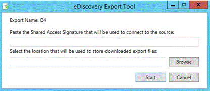

# View batch history and export past results in Advanced eDiscovery (classic)

> [!NOTE]
> Advanced eDiscovery requires an Office 365 E3 with the Advanced Compliance add-on or an E5 subscription for your organization. If you don't have that plan and want to try Advanced eDiscovery, you can [sign up for a trial of Office 365 Enterprise E5](https://go.microsoft.com/fwlink/p/?LinkID=698279). 
  
The following section describes additional options for batch viewing and export of data in Advanced eDiscovery. 
  
## Viewing Export batch history and exporting previous batches

The Export history dialog provides detailed information of selected export batch sessions and also provides the ability to undo the last session.
  
1. In **Export \> Setup**, select the batch name from the **Export batch** drop-down list. 
    
2. To the right of the export batch name, select the **Batch history** icon: 
    
    
  
    The Batch history dialog is displayed.
    
    
  
3. If it is necessary to roll back a previous session, click **Undo last session**. Rollback can be performed multiple times, which cancels the last session.
    
4. If you want to download data at any time from a previously executed export batch session, click the **Download** icon  next to the desired export batch to be exported. 
    
5. When the **Shared access signature** dialog is displayed, click **Copy to clipboard** to copy the export session data to the local machine, and then click **Close**. The Security &amp; Compliance Center **eDiscovery Export Tool** dialog is displayed. 
    
    
  
6. In the **eDiscovery Export Tool** dialog: 
    
1. In **Paste the Shared Access Signature that will be used to connect to the source**, paste the **Shared access signature** value, which was previously copied to the clipboard. 
    
2. Click **Browse** to select the target location for storing the downloaded export files on a local machine. 
    
3. Click **Start**. The export files are downloaded to the local machine. 
    
## Related topics

[Advanced eDiscovery (classic)](office-365-advanced-ediscovery.md)
  
[Exporting results ](export-results-in-advanced-ediscovery.md)

[Export report fields](export-report-fields-in-advanced-ediscovery.md)

